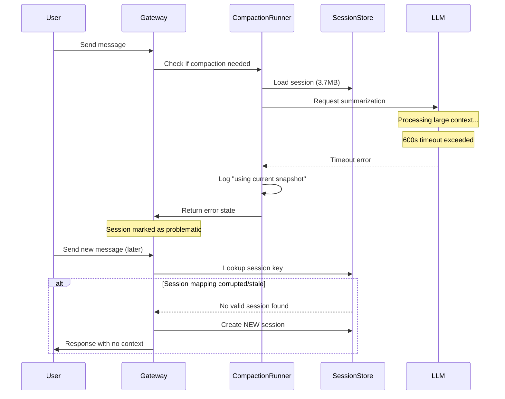
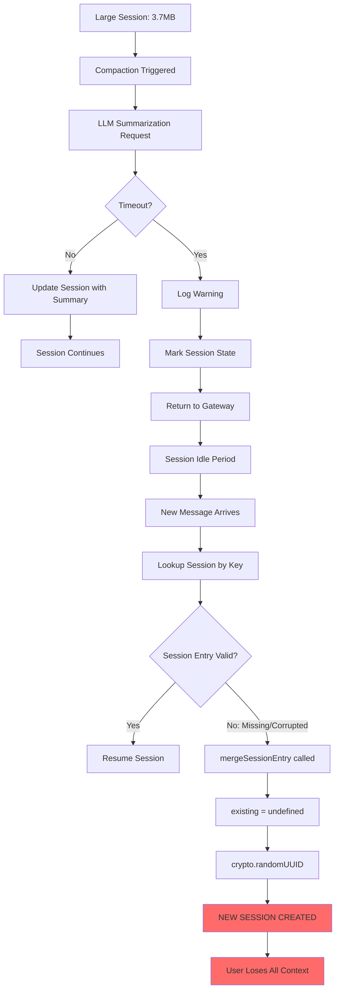

# Issue #18194: Compaction Timeout Causes Session Loss

**Issue**: [#18194 - Session lost after compaction timeout — new session created with zero history](https://github.com/openclaw/openclaw/issues/18194)

**Severity**: 🔴🔴🔴 Critical — Complete context loss for users

**Status**: No PR submitted

---

## Problem Summary

When a session grows large enough that compaction exceeds the 600-second timeout, subsequent messages create a **completely new session** with zero conversation history, instead of resuming the existing one.

---

## Reproduction Steps

1. Have a long-running session with many tool calls (e.g., 476 entries, 3.7MB)
2. Let the session undergo 1-2 compaction cycles
3. Trigger another compaction that exceeds 600s timeout
4. Send a new message after the session has been idle
5. **Expected**: Session resumes with compacted context
6. **Actual**: Brand new session ID created, agent has zero memory of prior work

**Observed timeline**:
```
Old session: 364ec54a-... (last message: 2026-02-16 09:59)
Compaction timeout: 2026-02-16 09:02
New session: f64ce7f9-... (first message: 2026-02-16 15:30)
```

---

## Root Cause Analysis

### Compaction Flow



### Code Path Analysis

**Compaction timeout** (`src/agents/pi-embedded-runner/compaction-safety-timeout.ts`):

```typescript
export const EMBEDDED_COMPACTION_TIMEOUT_MS = 300_000;  // 5 minutes

export async function compactWithSafetyTimeout<T>(
  compact: () => Promise<T>,
  timeoutMs: number = EMBEDDED_COMPACTION_TIMEOUT_MS,
): Promise<T> {
  return await withTimeout(() => compact(), timeoutMs, "Compaction");
}
```

Note: The issue reports 600s timeout, suggesting the effective timeout may be doubled (compaction + LLM call).

**Snapshot selection on timeout** (`src/agents/pi-embedded-runner/run/compaction-timeout.ts`):

```typescript
export function selectCompactionTimeoutSnapshot(
  params: SnapshotSelectionParams,
): SnapshotSelection {
  if (!params.timedOutDuringCompaction) {
    return {
      messagesSnapshot: params.currentSnapshot,
      sessionIdUsed: params.currentSessionId,
      source: "current",
    };
  }

  // If we have a pre-compaction snapshot, use it
  if (params.preCompactionSnapshot) {
    return {
      messagesSnapshot: params.preCompactionSnapshot,
      sessionIdUsed: params.preCompactionSessionId,
      source: "pre-compaction",
    };
  }

  // Fallback: use current (possibly corrupted) snapshot
  return {
    messagesSnapshot: params.currentSnapshot,
    sessionIdUsed: params.currentSessionId,
    source: "current",
  };
}
```

**Session entry merge** (`src/config/sessions/types.ts`):

```typescript
export function mergeSessionEntry(
  existing: SessionEntry | undefined,
  patch: Partial<SessionEntry>,
): SessionEntry {
  // If no existing entry OR no sessionId in patch → generate new UUID
  const sessionId = patch.sessionId ?? existing?.sessionId ?? crypto.randomUUID();
  // ...
}
```

### The Session Loss Mechanism



### Why Session Entry Becomes Invalid

Several scenarios can cause the session entry to be lost after compaction timeout:

1. **Session store write race**: Timeout interrupts the write, leaving partial/no entry
2. **Safeguard mode cleanup**: `compaction-safeguard.ts` may reset session state on failure
3. **Cache invalidation**: Session store cache (45s TTL) expires, re-read finds corrupted state
4. **File lock timeout**: Concurrent operations fail, session store not updated properly

---

## Impact

| Metric | Value |
|--------|-------|
| Affected users | Those with large, long-running sessions |
| Data loss | Complete — all conversation history |
| Recovery | None — old session orphaned but not deleted |
| User experience | Agent "forgets" everything, users must re-explain context |

---

## Fix Proposals

### Option A: Preserve Session ID on Compaction Failure

**Location**: `src/agents/pi-embedded-runner/run/compaction-timeout.ts` + session store updates

**Approach**: When compaction times out, ensure the session ID is preserved in the session store, even if compaction state is marked as failed.

```typescript
// In compaction error handler
async function handleCompactionTimeout(params: {
  sessionKey: string;
  sessionId: string;
  storePath: string;
  preCompactionSnapshot: AgentMessage[] | null;
}): Promise<void> {
  // Ensure session entry is preserved with existing sessionId
  await updateSessionStore(params.storePath, params.sessionKey, {
    sessionId: params.sessionId,  // ← Explicitly preserve
    compactionFailedAt: Date.now(),
    compactionFailureReason: "timeout",
    // Keep last known good state
    lastValidSnapshot: params.preCompactionSnapshot?.length ?? 0,
  });
  
  log.warn("Compaction timed out but session ID preserved", {
    sessionKey: params.sessionKey,
    sessionId: params.sessionId,
  });
}
```

**Pros**:
- Prevents session loss — user keeps their session ID
- Can retry compaction on next message
- Minimal behavior change

**Cons**:
- Session may be in degraded state (large, slow)
- Doesn't fix the underlying timeout issue
- May accumulate failed compaction attempts

---

### Option B: Carry Forward Summary on Timeout

**Location**: `src/agents/pi-embedded-runner/compact.ts`

**Approach**: If compaction times out, fall back to a lightweight "emergency summary" that preserves key context.

```typescript
async function compactWithFallback(params: CompactParams): Promise<CompactResult> {
  try {
    return await compactWithSafetyTimeout(() => fullCompaction(params));
  } catch (err) {
    if (isTimeoutError(err)) {
      log.warn("Compaction timeout, generating emergency summary");
      
      // Generate minimal summary without full LLM call
      const emergencySummary = generateEmergencySummary(params.messages, {
        maxTokens: 2000,
        strategy: "last-n-turns",  // Keep last 20 turns verbatim
        includeToolResults: false, // Skip large tool outputs
      });
      
      return {
        summary: emergencySummary,
        isEmergency: true,
        originalSessionId: params.sessionId,
      };
    }
    throw err;
  }
}

function generateEmergencySummary(messages: AgentMessage[], opts: SummaryOpts): string {
  const recentTurns = messages.slice(-opts.maxTurns);
  return [
    "⚠️ [Session context was truncated due to size limits]",
    "",
    "Recent conversation:",
    ...recentTurns.map(m => `${m.role}: ${truncate(m.content, 500)}`),
  ].join("\n");
}
```

**Pros**:
- Preserves recent context even on timeout
- User sees continuation, not blank slate
- Graceful degradation

**Cons**:
- Emergency summary may miss important earlier context
- More complex implementation
- May confuse users with "[truncated]" message

---

### Option C: Incremental/Streaming Compaction

**Location**: `src/agents/pi-embedded-runner/compact.ts`

**Approach**: Instead of one large compaction call, break it into incremental chunks that are less likely to timeout.

```typescript
async function incrementalCompaction(params: CompactParams): Promise<CompactResult> {
  const messages = params.messages;
  const chunkSize = 50;  // Process 50 messages at a time
  let summary = "";
  
  for (let i = 0; i < messages.length; i += chunkSize) {
    const chunk = messages.slice(i, i + chunkSize);
    const isLast = i + chunkSize >= messages.length;
    
    // Each chunk gets its own timeout (shorter)
    const chunkSummary = await compactWithSafetyTimeout(
      () => summarizeChunk(chunk, summary, isLast),
      60_000,  // 1 minute per chunk
    );
    
    summary = chunkSummary;
    
    // Save progress after each chunk
    await saveCompactionProgress(params.sessionId, {
      processedMessages: i + chunkSize,
      currentSummary: summary,
    });
  }
  
  return { summary, isIncremental: true };
}
```

**Pros**:
- Much less likely to timeout
- Progress is saved incrementally
- Can resume from last checkpoint on failure

**Cons**:
- Higher total API cost (multiple LLM calls)
- More complex orchestration
- Summary quality may be lower (fragmented context)

---

## Comparison Matrix

| Criteria | Option A (Preserve ID) | Option B (Emergency Summary) | Option C (Incremental) |
|----------|------------------------|------------------------------|------------------------|
| Implementation complexity | 🟢 Low | 🟡 Medium | 🔴 High |
| Preserves session ID | ✅ Yes | ✅ Yes | ✅ Yes |
| Preserves context | ❌ No | 🟡 Partial | ✅ Yes |
| Prevents timeout | ❌ No | ❌ No | ✅ Yes |
| Risk of regression | 🟢 Low | 🟡 Medium | 🟡 Medium |
| User experience | 🟡 Acceptable | 🟢 Good | 🟢 Good |
| API cost | ✅ No change | ✅ No change | 🟡 Higher |

---

## Recommendation

**Implement Option A first, then Option B.**

**Rationale**:
1. Option A is the minimum viable fix — users keep their session even if degraded
2. Option B provides graceful degradation for when compaction fails
3. Together they ensure: session ID preserved + some context available
4. Option C is ideal but requires significant refactoring

**Suggested Implementation Order**:
1. PR #1: Option A — Preserve session ID on compaction timeout
2. PR #2: Option B — Add emergency summary fallback
3. Future: Option C — Incremental compaction for very large sessions

**Interim Mitigation**:
- Increase compaction timeout: `EMBEDDED_COMPACTION_TIMEOUT_MS = 600_000` (10 min)
- More aggressive early compaction triggers to prevent sessions growing too large
- User documentation: recommend `/reset` for sessions that become unresponsive

---

## Related Issues

- #22506 — Session GC causes gateway crash
- #20910 — Model timeout death spiral
- #15404 — Compaction deletes active transcripts
- #13700 — Session snapshots (save/load checkpoints)

---

## References

- `src/agents/pi-embedded-runner/compact.ts` — Main compaction logic
- `src/agents/pi-embedded-runner/run/compaction-timeout.ts` — Timeout handling
- `src/agents/pi-embedded-runner/compaction-safety-timeout.ts` — Timeout wrapper
- `src/config/sessions/types.ts` — Session entry structure
- `src/config/sessions/store.ts` — Session store operations
