# Session Management

Session is the core concept of OpenClaw, responsible for managing conversation state, context, token usage, and cache optimization between users and agents.

## Table of Contents

0. [Landscape: End-to-End Message Flow](#landscape-end-to-end-message-flow)
1. [Overview](#overview)
2. [Session Architecture](#session-architecture)
3. [Core Modules](#core-modules)
4. [Session Key System](#session-key-system)
5. [User Identification](#user-identification)
6. [Security and Access Control](#security-and-access-control)
7. [Multi-Agent Configuration](#multi-agent-configuration)
8. [Message Flow and Collaboration](#message-flow-and-collaboration)
9. [Token Management](#token-management)
10. [Cache Management](#cache-management)
11. [Session Lifecycle](#session-lifecycle)

---

## Landscape: End-to-End Message Flow

This sequence diagram shows the complete journey of a user message through OpenClaw, from arrival to response delivery. All module names and function names are based on actual source code.

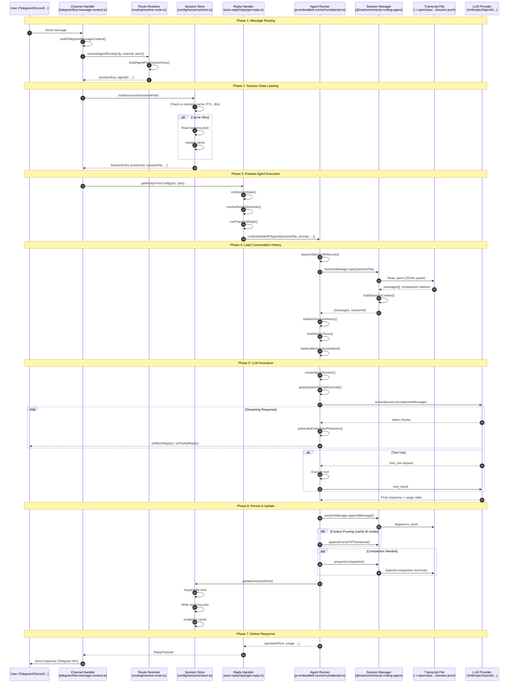
```mermaid
sequenceDiagram
    autonumber
    participant User as User (Telegram/Discord/...)
    participant Channel as Channel Handler<br/>(telegram/bot-message-context.ts)
    participant Router as Route Resolver<br/>(routing/resolve-route.ts)
    participant Store as Session Store<br/>(config/sessions/store.ts)
    participant Reply as Reply Handler<br/>(auto-reply/reply/get-reply.ts)
    participant Runner as Agent Runner<br/>(pi-embedded-runner/run/attempt.ts)
    participant SM as Session Manager<br/>(@mariozechner/pi-coding-agent)
    participant Transcript as Transcript File<br/>(~/.openclaw/.../session.jsonl)
    participant LLM as LLM Provider<br/>(Anthropic/OpenAI/...)

    Note over User,LLM: Phase 1: Message Routing

    User->>Channel: Send message
    Channel->>Channel: buildTelegramMessageContext()
    Channel->>Router: resolveAgentRoute({cfg, channel, peer})
    Router->>Router: buildAgentPeerSessionKey()
    Router-->>Channel: {sessionKey, agentId, ...}

    Note over User,LLM: Phase 2: Session State Loading

    Channel->>Store: loadSessionStore(storePath)
    Store->>Store: Check in-memory cache (TTL: 45s)
    alt Cache Miss
        Store->>Store: Read sessions.json
        Store->>Store: Update cache
    end
    Store-->>Channel: SessionEntry {sessionId, sessionFile, ...}

    Note over User,LLM: Phase 3: Prepare Agent Execution

    Channel->>Reply: getReplyFromConfig(ctx, opts)
    Reply->>Reply: initSessionState()
    Reply->>Reply: resolveReplyDirectives()
    Reply->>Reply: runPreparedReply()
    Reply->>Runner: runEmbeddedPiAgent({sessionFile, prompt, ...})

    Note over User,LLM: Phase 4: Load Conversation History

    Runner->>Runner: acquireSessionWriteLock()
    Runner->>SM: SessionManager.open(sessionFile)
    SM->>Transcript: Read .jsonl (JSONL parse)
    Transcript-->>SM: messages[], compaction markers
    SM->>SM: buildSessionContext()
    SM-->>Runner: {messages, sessionId}

    Runner->>Runner: sanitizeSessionHistory()
    Runner->>Runner: limitHistoryTurns()
    Runner->>Runner: replaceMessages(sanitized)

    Note over User,LLM: Phase 5: LLM Invocation

    Runner->>Runner: createAgentSession()
    Runner->>Runner: applySystemPromptOverride()
    Runner->>LLM: activeSession.prompt(userMessage)
    
    loop Streaming Response
        LLM-->>Runner: token chunks
        Runner->>Runner: subscribeEmbeddedPiSession()
        Runner-->>User: onBlockReply() / onPartialReply()
    end

    alt Tool Use
        LLM-->>Runner: tool_use request
        Runner->>Runner: Execute tool
        Runner->>LLM: tool_result
    end

    LLM-->>Runner: Final response + usage stats

    Note over User,LLM: Phase 6: Persist & Update

    Runner->>SM: sessionManager.appendMessage()
    SM->>Transcript: Append to .jsonl
    
    opt Context Pruning (cache-ttl mode)
        Runner->>SM: appendCacheTtlTimestamp()
    end

    opt Compaction Needed
        Runner->>SM: prepareCompaction()
        SM->>Transcript: Append compaction summary
    end

    Runner->>Store: updateSessionStore()
    Store->>Store: Acquire file lock
    Store->>Store: Write sessions.json
    Store->>Store: Invalidate cache

    Note over User,LLM: Phase 7: Deliver Response

    Runner-->>Reply: {assistantText, usage, ...}
    Reply-->>Channel: ReplyPayload
    Channel->>User: Send response (Telegram API)
```

### Phase 3 Deep Dive: Prepare Agent Execution

This phase involves three key functions that transform user input into an agent-ready request:

#### 1. `resolveReplyDirectives()` — Parse Inline Commands

**Location:** `auto-reply/reply/get-reply-directives.ts`

Scans the user message for **inline directives** (slash commands) and extracts settings:

```
User message: "帮我写个脚本 /think high /model sonnet"
                              │           │
                              ▼           ▼
                    thinkLevel="high"  model="sonnet"
```

**Supported directives:**

| Directive | Effect | Example |
|-----------|--------|---------|
| `/think <level>` | Set thinking depth | `/think high`, `/think off` |
| `/model <name>` | Switch model | `/model sonnet`, `/model gpt-4o` |
| `/verbose` | Show tool outputs | `/verbose on` |
| `/elevated` | Enable elevated mode | `/elevated on` |
| `/reasoning` | Enable reasoning display | `/reasoning stream` |

**Output:** `InlineDirectives` object + cleaned message body (directives stripped)

#### 2. `runPreparedReply()` — Prepare Execution Context

**Location:** `auto-reply/reply/get-reply-run.ts`

Assembles all the pieces needed for agent execution:

```
┌─────────────────────────────────────────────────────────┐
│                  runPreparedReply()                     │
├─────────────────────────────────────────────────────────┤
│                                                         │
│  Inputs:                                                │
│  • User message (cleaned)                              │
│  • Parsed directives (think level, model, etc.)        │
│  • Session state (from initSessionState)               │
│  • Config (agents, workspace, tools)                   │
│                                                         │
│  Processing:                                            │
│  ├─ Resolve session file path                          │
│  ├─ Build system prompt (workspace files + context)    │
│  ├─ Prepare tool definitions                           │
│  ├─ Handle group chat intro (if needed)                │
│  ├─ Check idle timeout → trigger reset if needed       │
│  ├─ Inject system events (pending notifications)       │
│  └─ Ensure skill snapshot                              │
│                                                         │
│  Output: Ready to call runEmbeddedPiAgent()            │
│                                                         │
└─────────────────────────────────────────────────────────┘
```

**Key tasks:**
- `resolveSessionFilePath()` — Locate the transcript `.jsonl` file
- `buildInboundMetaSystemPrompt()` — Add message metadata to system prompt
- `buildGroupIntro()` — Inject group chat context for first message
- `prependSystemEvents()` — Add pending system notifications to prompt
- `ensureSkillSnapshot()` — Cache skill definitions for the session

#### 3. `runEmbeddedPiAgent()` — Execute Agent

**Location:** `agents/pi-embedded-runner/run.ts`

The main entry point for agent execution:

```
runEmbeddedPiAgent({
  sessionFile: "~/.openclaw/agents/main/sessions/abc-123.jsonl",
  prompt: "帮我写个脚本",           // cleaned user message
  thinkLevel: "high",               // from directives
  provider: "anthropic",            // resolved model
  modelId: "claude-sonnet-4-5",
  workspaceDir: "/Users/user/clawd",
  timeoutMs: 300000,
  ...
})
```

**Internally calls `runEmbeddedAttempt()`** which:

1. **Acquire session lock** — Prevent concurrent writes
2. **Load transcript** — `SessionManager.open(sessionFile)`
3. **Sanitize history** — `sanitizeSessionHistory()`, `limitHistoryTurns()`
4. **Create agent session** — Initialize LLM connection
5. **Apply system prompt** — Inject workspace files, skills, context
6. **Execute prompt** — `activeSession.prompt(userMessage)`
7. **Handle streaming** — Process tokens, tool calls, responses
8. **Persist results** — Append to transcript, update session store

```
┌─────────────────────────────────────────────────────────┐
│              runEmbeddedPiAgent() Flow                  │
├─────────────────────────────────────────────────────────┤
│                                                         │
│  ┌─────────────┐                                        │
│  │ Session Lock │◄── acquireSessionWriteLock()         │
│  └──────┬──────┘                                        │
│         │                                               │
│         ▼                                               │
│  ┌─────────────┐                                        │
│  │ Load History│◄── SessionManager.open()              │
│  └──────┬──────┘    sanitizeSessionHistory()           │
│         │                                               │
│         ▼                                               │
│  ┌─────────────┐                                        │
│  │ Create Agent│◄── createAgentSession()               │
│  └──────┬──────┘    applySystemPromptOverride()        │
│         │                                               │
│         ▼                                               │
│  ┌─────────────┐    ┌─────────────────────┐            │
│  │ Execute     │───►│ LLM API (streaming) │            │
│  │ Prompt      │◄───│ tokens, tool_use    │            │
│  └──────┬──────┘    └─────────────────────┘            │
│         │                                               │
│         ▼                                               │
│  ┌─────────────┐                                        │
│  │ Persist     │◄── appendMessage()                    │
│  │ Results     │    updateSessionStore()               │
│  └─────────────┘                                        │
│                                                         │
└─────────────────────────────────────────────────────────┘
```

### Key Modules Reference

| Phase | Module | Key Functions |
|-------|--------|---------------|
| **Routing** | `telegram/bot-message-context.ts` | `buildTelegramMessageContext()` |
| | `routing/resolve-route.ts` | `resolveAgentRoute()`, `buildAgentPeerSessionKey()` |
| **Session State** | `config/sessions/store.ts` | `loadSessionStore()`, `updateSessionStore()` |
| **Reply Logic** | `auto-reply/reply/get-reply.ts` | `getReplyFromConfig()`, `initSessionState()` |
| | `auto-reply/reply/get-reply-run.ts` | `runPreparedReply()` |
| **Agent Execution** | `agents/pi-embedded-runner/run.ts` | `runEmbeddedPiAgent()` |
| | `agents/pi-embedded-runner/run/attempt.ts` | `runEmbeddedAttempt()` |
| **Transcript** | `@mariozechner/pi-coding-agent` | `SessionManager.open()`, `appendMessage()` |
| **LLM Call** | `@mariozechner/pi-ai` | `streamSimple()`, `activeSession.prompt()` |

### Key Concept: Peer

In the routing phase, `peer` represents "who you're chatting with":

```typescript
type RoutePeer = {
  kind: "direct" | "group" | "channel";  // conversation type
  id: string;                             // identifier
};
```

| Scenario | peer.kind | peer.id | Example |
|----------|-----------|---------|---------|
| Telegram DM | `"direct"` | user ID | `"6813060849"` |
| Telegram Group | `"group"` | chat ID | `"-100123456"` |
| Telegram Channel | `"channel"` | channel ID | `"-100789"` |
| Discord Channel | `"channel"` | channel ID | `"123456789"` |
| Discord DM | `"direct"` | user ID | `"987654321"` |

The peer information flows through the routing pipeline:

```
Telegram Message
     │
     ▼ buildTelegramMessageContext()
peer = { kind: "group", id: "-100123456" }
     │
     ▼ resolveAgentRoute({cfg, channel, peer})
     │
     ▼ buildAgentPeerSessionKey({peerKind, peerId, ...})
     │
     ▼ sessionKey = "agent:main:telegram:group:-100123456"
```

### Data Flow Summary

```
User Message
     │
     ▼
┌─────────────────┐    ┌─────────────────┐
│  sessions.json  │◄───│  Route/State    │
│  (metadata)     │    │  Loading        │
└─────────────────┘    └────────┬────────┘
                                │
                                ▼
                       ┌─────────────────┐
                       │  session.jsonl  │◄─── History Load
                       │  (transcript)   │
                       └────────┬────────┘
                                │
                                ▼
                       ┌─────────────────┐
                       │   LLM API       │
                       │   (streaming)   │
                       └────────┬────────┘
                                │
                                ▼
┌─────────────────┐    ┌─────────────────┐
│  session.jsonl  │◄───│  Persist        │──► User Response
│  (append)       │    │  & Reply        │
└─────────────────┘    └─────────────────┘
         │
         ▼
┌─────────────────┐
│  sessions.json  │◄─── Update metadata
│  (token stats)  │
└─────────────────┘
```

---

## Overview

A Session can be understood as a "conversation session" that contains:

```
┌─────────────────────────────────────────────────────────────┐
│                         Session                              │
├─────────────────────────────────────────────────────────────┤
│  • sessionId: UUID unique identifier                         │
│  • sessionKey: routing key (e.g., "agent:main:main")        │
│  • conversation history (transcript)                         │
│  • token usage statistics                                    │
│  • model/provider configuration                              │
│  • user preferences (thinking level, verbose mode...)       │
│  • delivery context (channel, to, accountId...)             │
└─────────────────────────────────────────────────────────────┘
```

### Key Concepts

#### SessionScope (Session Isolation Mode)

Determines **how sessions are isolated between different users**:

| Value | Description | Use Case |
|-------|-------------|----------|
| `per-sender` | Each user gets an independent session | **Default**. User A and User B have separate conversation histories |
| `global` | All users share the same session | Everyone sees the same conversation history (rare) |

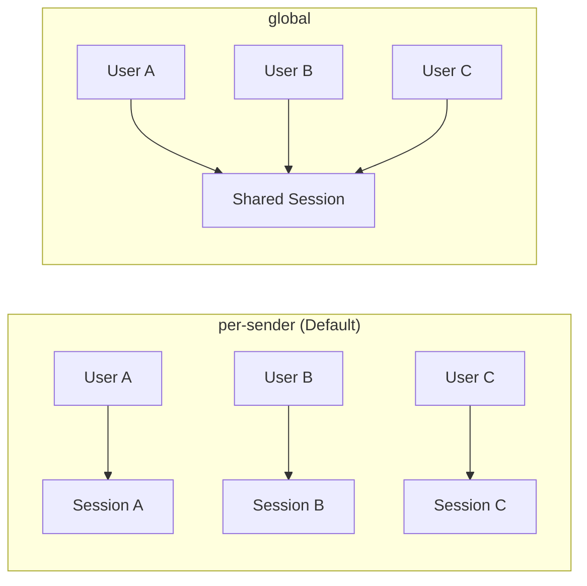
```mermaid
flowchart LR
    subgraph PerSender["per-sender (Default)"]
        UA[User A] --> SA[Session A]
        UB[User B] --> SB[Session B]
        UC[User C] --> SC[Session C]
    end
    
    subgraph Global["global"]
        UA2[User A] --> SG[Shared Session]
        UB2[User B] --> SG
        UC2[User C] --> SG
    end
```

#### SessionChatType (Chat Type)

Describes **the type of chat the message originates from**:

| Value | Description | Examples |
|-------|-------------|----------|
| `direct` | One-on-one private chat | Telegram DM, Discord DM |
| `group` | Group chat | Telegram Group, Discord Server |
| `channel` | Broadcast channel | Telegram Channel, Discord Announcement |

**Impact on behavior:**
- Session Key generation pattern
- Whether @mention is required to respond (group activation)
- Message delivery target

---

## Session Architecture

### Overall Architecture Diagram

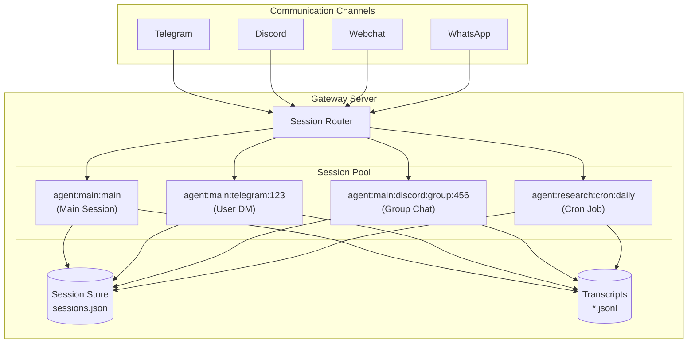
```mermaid
flowchart TB
    subgraph Channels["Communication Channels"]
        TG[Telegram]
        DC[Discord]
        WC[Webchat]
        WA[WhatsApp]
    end
    
    subgraph Gateway["Gateway Server"]
        Router[Session Router]
        
        subgraph Sessions["Session Pool"]
            S1["agent:main:main<br/>(Main Session)"]
            S2["agent:main:telegram:123<br/>(User DM)"]
            S3["agent:main:discord:group:456<br/>(Group Chat)"]
            S4["agent:research:cron:daily<br/>(Cron Job)"]
        end
        
        Store[(Session Store<br/>sessions.json)]
        Trans[(Transcripts<br/>*.jsonl)]
    end
    
    TG --> Router
    DC --> Router
    WC --> Router
    WA --> Router
    
    Router --> S1
    Router --> S2
    Router --> S3
    Router --> S4
    
    S1 & S2 & S3 & S4 --> Store
    S1 & S2 & S3 & S4 --> Trans
```

### Storage Structure

```
~/.openclaw/
├── sessions/
│   └── sessions.json              # Legacy/global session metadata
│
├── agents/
│   ├── main/                       # Default agent (always exists)
│   │   └── sessions/
│   │       ├── sessions.json       # Agent-specific session metadata
│   │       ├── abc-123.jsonl       # Transcript for session abc-123
│   │       └── def-456.jsonl       # Transcript for session def-456
│   │
│   ├── research/                   # Custom agent: "research"
│   │   └── sessions/
│   │       ├── sessions.json
│   │       └── *.jsonl
│   │
│   └── code/                       # Custom agent: "code"
│       └── sessions/
│           ├── sessions.json
│           └── *.jsonl
```

> **Note:** `{agent-id}` in the path refers to custom agents you configure in `openclaw.json`. The `main` agent always exists as the default.

---

## Core Modules

### 1. Session Store (`src/config/sessions/store.ts`)

Responsible for persistent storage of session metadata.

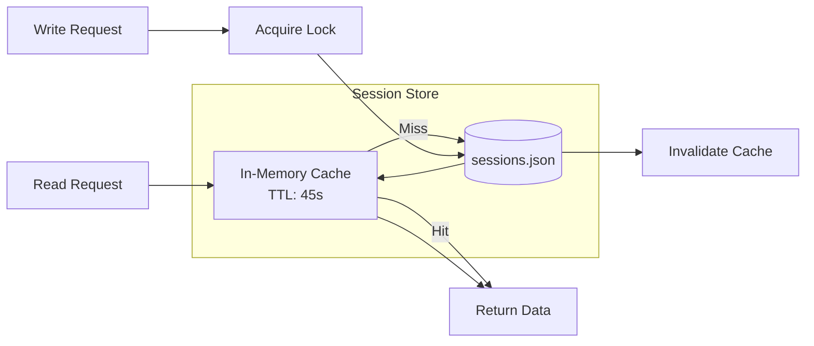
```mermaid
flowchart LR
    subgraph Store["Session Store"]
        Cache[In-Memory Cache<br/>TTL: 45s]
        File[(sessions.json)]
    end
    
    Read[Read Request] --> Cache
    Cache -->|Hit| Return[Return Data]
    Cache -->|Miss| File
    File --> Cache
    Cache --> Return
    
    Write[Write Request] --> Lock[Acquire Lock]
    Lock --> File
    File --> Invalidate[Invalidate Cache]
```

**Key Features:**
- **In-memory caching** with 45-second TTL for performance
- **File-based locking** to prevent concurrent write corruption
- **Atomic updates** via read-modify-write pattern

**Read Request Sources:**

| Module | Purpose |
|--------|---------|
| `telegram/bot-message-context.ts` | Check session state before processing messages |
| `discord/monitor/message-handler.process.ts` | Same as above |
| `slack/monitor/message-handler/prepare.ts` | Same as above |
| `signal/monitor/event-handler.ts` | Same as above |
| `heartbeat-runner.ts` | Check which sessions need heartbeat |
| `agents/tools/session-status-tool.ts` | `/status` command reads state |
| `agents/subagent-announce.ts` | Subagent checks session state |

**Write Request Sources:**

| Module | Purpose |
|--------|---------|
| `heartbeat-runner.ts` | Update `lastHeartbeatAt` timestamp |
| `agents/pi-embedded-runner/` | Save session state after agent run |
| `session-status-tool.ts` | `/status model=xxx` sets model override |
| `auth-profiles/session-override.ts` | Auth profile overrides |
| `config/sessions/transcript.ts` | Save conversation transcripts |

> **Summary:** Channel modules (Telegram/Discord/Slack/...) primarily read; Agent runtime and Heartbeat primarily write.

**Why File Locking is Necessary:**

Even though OpenClaw is single-process, Node.js's async nature creates concurrent write risks:

```javascript
// These can interleave!
async function agentA() {
  const store = await readFile('sessions.json');  // ① read
  store['sessionA'] = { ... };                     // ② modify
  await writeFile('sessions.json', store);         // ⑤ write (overwrites B!)
}

async function agentB() {
  const store = await readFile('sessions.json');  // ③ read (stale data)
  store['sessionB'] = { ... };                     // ④ modify
  await writeFile('sessions.json', store);         // ⑥ write
}
```

Concurrent scenarios:
- **Multi-channel concurrency** - Telegram and Discord receive messages simultaneously
- **Heartbeat + message processing** - Heartbeat task and normal messages trigger together
- **Multiple subagents** - Parallel subagents each updating session state
- **Long LLM calls** - Agent A calls LLM while Agent B completes and wants to write

Solution: `proper-lockfile` library serializes all writes.

**Why a single file causes conflicts (even for different sessions):**

```
sessions.json
┌──────────────────────────────────────────────────┐
│ {                                                 │
│   "agent:main:telegram:group:-100123": {          │  ← Telegram wants to update
│     "updatedAt": 1234567890,                      │
│     "inputTokens": 1000                           │
│   },                                              │
│   "agent:main:discord:channel:456": {             │  ← Discord wants to update
│     "updatedAt": 1234567891,                      │
│     "inputTokens": 2000                           │
│   }                                               │
│ }                                                 │
└──────────────────────────────────────────────────┘
```

Even though they modify **different keys**, the write operation replaces the **entire file**, so the later write overwrites the earlier one's changes.

**Alternative Architecture: Per-Session Files**

Splitting each session into its own file would eliminate cross-session write conflicts:

| Approach | Pros | Cons |
|----------|------|------|
| **Single file** (current) | Fast queries (list all sessions), simple | Requires file locking |
| **Per-session files** | No cross-session conflicts | Directory traversal for listing, more file handles |
| **SQLite/Database** | Row-level writes, ACID transactions | More complex setup |

> **Note:** This is a design trade-off. The current single-file approach with proper locking works correctly, but a per-session file architecture would be more naturally concurrent-safe.

```typescript
// Core data structure
type SessionEntry = {
  sessionId: string;          // UUID
  updatedAt: number;          // Last update timestamp
  sessionFile?: string;       // Transcript file path
  
  // Token statistics
  inputTokens?: number;
  outputTokens?: number;
  totalTokens?: number;
  totalTokensFresh?: boolean; // Whether token data is fresh
  contextTokens?: number;     // Model context window size
  
  // Model configuration
  modelProvider?: string;
  model?: string;
  providerOverride?: string;
  modelOverride?: string;
  
  // User preferences
  thinkingLevel?: string;     // off/low/medium/high
  verboseLevel?: string;
  sendPolicy?: "allow" | "deny";
  
  // Delivery context
  lastChannel?: string;
  lastTo?: string;
  lastAccountId?: string;
  deliveryContext?: DeliveryContext;
};
```

### 2. Session Types (`src/config/sessions/types.ts`)

Defines session types and utility functions.

```typescript
// Session scope - how to isolate users
type SessionScope = "per-sender" | "global";

// Chat type - where the message comes from
type SessionChatType = "direct" | "group" | "channel";

// Session origin information - metadata about message source
type SessionOrigin = {
  label?: string;
  provider?: string;      // telegram, discord, etc.
  surface?: string;       // chat, voice, etc.
  chatType?: SessionChatType;
  from?: string;          // sender identifier
  to?: string;            // recipient identifier
  accountId?: string;     // bot account used
};
```

### 3. Session Router (`src/routing/session-key.ts`)

Routes messages to the correct session by building and parsing session keys.

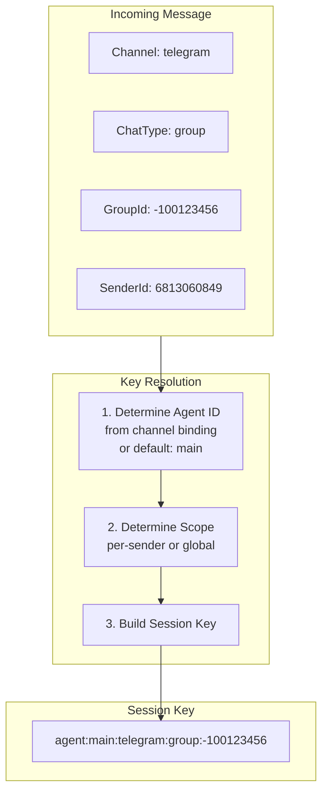
```mermaid
flowchart TB
    subgraph Input["Incoming Message"]
        Channel[Channel: telegram]
        ChatType[ChatType: group]
        GroupId[GroupId: -100123456]
        SenderId[SenderId: 6813060849]
    end
    
    subgraph Resolution["Key Resolution"]
        GetAgent[1. Determine Agent ID<br/>from channel binding<br/>or default: main]
        GetScope[2. Determine Scope<br/>per-sender or global]
        BuildKey[3. Build Session Key]
    end
    
    subgraph Output["Session Key"]
        Key["agent:main:telegram:group:-100123456"]
    end
    
    Input --> GetAgent
    GetAgent --> GetScope
    GetScope --> BuildKey
    BuildKey --> Key
```

**Key Functions:**

```typescript
// Build session key for an agent's main session
buildAgentMainSessionKey({ agentId: "main", mainKey: "main" })
// → "agent:main:main"

// Build session key for a peer (user/group) session
buildAgentPeerSessionKey({
  agentId: "main",
  channel: "telegram",
  peerId: "6813060849",
  peerKind: "direct"
})
// → "agent:main:telegram:6813060849"

// Extract agent ID from session key
resolveAgentIdFromSessionKey("agent:research:cron:daily")
// → "research"
```

### 4. Transcript Manager (`src/config/sessions/transcript.ts`)

Manages reading and writing of conversation history stored in JSONL format. The transcript file is the complete record of a session's conversation.

**Storage Location:**

```
~/.openclaw/agents/{agentId}/sessions/{sessionId}.jsonl
```

Example: `~/.openclaw/agents/main/sessions/104bf722-75e1-449a-8194-ddabc98a7908.jsonl`

The `sessionFile` field in `SessionEntry` points to this transcript file.

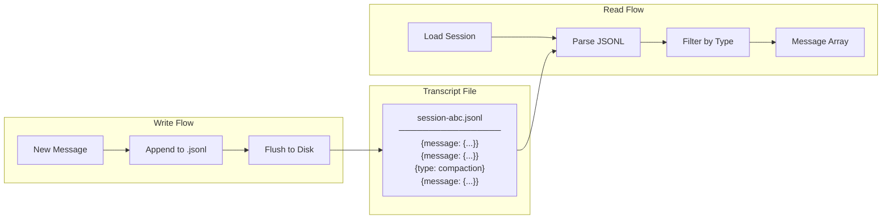
```mermaid
flowchart LR
    subgraph Write["Write Flow"]
        NewMsg[New Message] --> Append[Append to .jsonl]
        Append --> Flush[Flush to Disk]
    end
    
    subgraph Read["Read Flow"]
        Load[Load Session] --> Parse[Parse JSONL]
        Parse --> Filter[Filter by Type]
        Filter --> Messages[Message Array]
    end
    
    subgraph File["Transcript File"]
        JSONL["session-abc.jsonl<br/>─────────────────<br/>{message: {...}}<br/>{message: {...}}<br/>{type: compaction}<br/>{message: {...}}"]
    end
    
    Flush --> JSONL
    JSONL --> Parse
```

**Complete JSONL Structure:**

```jsonl
// Session header (first line)
{"type":"session","version":3,"id":"104bf722...","timestamp":"2026-01-31T14:58:20Z","cwd":"/Users/user/workspace"}

// Model/config changes
{"type":"model_change","provider":"anthropic","modelId":"claude-opus-4-5","timestamp":"..."}
{"type":"thinking_level_change","thinkingLevel":"low","timestamp":"..."}

// Custom events (cache tracking, etc.)
{"type":"custom","customType":"openclaw.cache-ttl","data":{...},"timestamp":"..."}
{"type":"custom","customType":"model-snapshot","data":{...},"timestamp":"..."}

// User message
{"type":"user_message","content":[{"type":"text","text":"Hello"}],"timestamp":...}

// Assistant response with tool use
{"type":"assistant_message","content":[...],"usage":{"input":100,"output":50},"timestamp":...}
{"type":"tool_use","name":"exec","input":{"command":"ls"},"timestamp":...}
{"type":"tool_result","output":"file1.txt\nfile2.txt","timestamp":...}

// Compaction marker (context was compressed)
{"type":"compaction","id":"abc123","summary":"## Goal\n...","firstKeptEntryId":"xyz","tokensBefore":180000,"timestamp":"..."}
```

**Write Sources (who writes to transcript):**

| Module | What it writes |
|--------|----------------|
| `agents/pi-embedded-runner/run/attempt.ts` | Messages, tool calls, responses |
| `agents/pi-embedded-runner/compact.ts` | Compaction summaries |
| `config/sessions/transcript.ts` | Outbound message mirrors |
| `gateway/server-methods/chat.ts` | Gateway API messages |

**Read Sources (who reads from transcript):**

| Module | Purpose |
|--------|---------|
| `pi-embedded-runner` | Load history as context for LLM |
| `compact.ts` | Read messages for compaction |
| `gateway/chat.ts` | `/history` API endpoint |
| `auto-reply/session.ts` | Subagent inherits parent context |

**Key Operations:**
- **Append-only writes** for durability (file is never truncated)
- **Streaming reads** for large transcripts
- **Compaction markers** to track context compression events

**Lifecycle:**

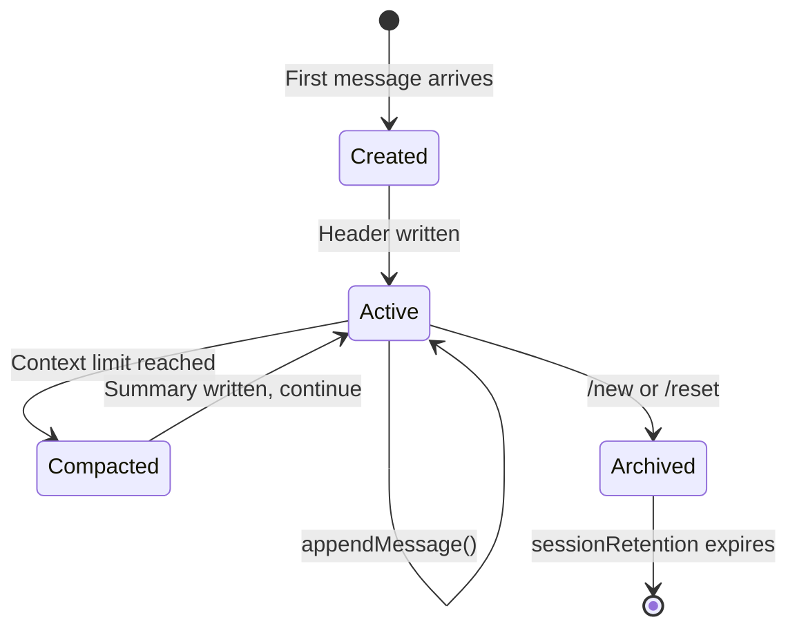
```mermaid
stateDiagram-v2
    [*] --> Created: First message arrives
    Created --> Active: Header written
    Active --> Active: appendMessage()
    Active --> Compacted: Context limit reached
    Compacted --> Active: Summary written, continue
    Active --> Archived: /new or /reset
    Archived --> [*]: sessionRetention expires
```

1. **Created**: First message triggers `ensureSessionHeader()` - writes session metadata
2. **Active**: Each message appended via `SessionManager.appendMessage()`
3. **Compacted**: When context exceeds limit, compaction writes summary and marks old messages
4. **Archived**: On reset, new sessionId created, old transcript kept for history
5. **Cleaned**: After `sessionRetention` period, old transcripts may be deleted

**Transcript and KV Cache:**

The transcript content is loaded and sent to the LLM as conversation history:

```
transcript.jsonl
      │
      ▼ SessionManager.buildSessionContext()
┌─────────────────┐
│ messages: [     │
│   {role: user}  │  ← old messages (prefix)
│   {role: asst}  │  ← old messages (prefix)
│   {role: user}  │  ← new message
│ ]               │
└────────┬────────┘
         │
         ▼ LLM API
   [system + messages]
```

**Why append-only transcript is cache-friendly:**

```
Request 1: [system] [msg1] [msg2] [msg3]
                    └──────────────┘
                       cacheable prefix

Request 2: [system] [msg1] [msg2] [msg3] [msg4]
                    └──────────────┘ ← cache hit!
                                     └──┘ only compute new part
```

Since transcript is **append-only**, the message prefix naturally remains stable across requests, which is exactly what LLM providers need for KV cache reuse.

**Cache-breaking scenarios:**

| Scenario | Impact |
|----------|--------|
| **Compaction** | History replaced with summary → entire prefix changes |
| **Context pruning** | Old messages trimmed → prefix changes |
| **Workspace files change** | System prompt content changes → prefix changes |
| **Tool result truncation** | Old tool results truncated on reload → prefix changes |

**Scenario 1: Compaction**

When conversation history approaches the model's context limit (~180k tokens for Claude), OpenClaw triggers compaction:

```
Before compaction:
[system] [msg1] [msg2] [msg3] ... [msg50] [msg51]
         └─────────────────────────────────────┘
                    180k tokens (full!)

After compaction:
[system] [summary: "User discussed X, Y, Z..."] [msg51]
         └──────────────────────────────────────────┘
                    ~20k tokens (fresh start)
```

**Trigger**: `contextTokens > model.contextWindow * threshold` (typically 90%)

The entire message prefix is replaced with a summary, invalidating all cached KV states.

**Scenario 2: Context Pruning**

With `contextPruning.mode: "aggressive"` or after cache TTL expires in `cache-ttl` mode:

```
Before pruning:
[system] [old_msg1] [old_msg2] [recent_msg1] [recent_msg2] [new_msg]
         └─────────────────────────────────────────────────────────┘

After pruning (keepLastAssistants: 3):
[system] [recent_msg1] [recent_msg2] [new_msg]
         └────────────────────────────────────┘
```

**Trigger**: 
- `contextPruning.mode: "aggressive"` — prune every turn
- `contextPruning.mode: "cache-ttl"` + TTL expired — prune after cache expires

Old messages are removed to reduce token cost, but this changes the prefix.

**Scenario 3: Workspace Files Change**

OpenClaw injects workspace files (AGENTS.md, MEMORY.md, etc.) into the system prompt:

```
Turn 1:
[system: "...MEMORY.md content: 'User likes Python'..."] [msg1] [msg2]

Turn 2 (after user edited MEMORY.md):
[system: "...MEMORY.md content: 'User likes Python and Rust'..."] [msg1] [msg2] [msg3]
         └──────────────────────────────────────────────────────┘
                              System prompt changed!
```

**Trigger**: User edits any workspace file between turns (AGENTS.md, MEMORY.md, SOUL.md, etc.)

Even though messages didn't change, the system prompt prefix is different.

**Scenario 4: Tool Result Truncation**

Long tool results are stored in full but may be truncated when reloaded for context:

```
Original tool result (stored in transcript):
{"type":"tool_result","output":"... 50,000 characters of code ..."}

Reloaded for next turn (truncated):
{"type":"tool_result","output":"[first 1500 chars]...[truncated]...[last 1500 chars]"}
```

**Trigger**: `contextPruning.softTrim` or `hardClear` settings

```json
{
  "contextPruning": {
    "softTrim": {
      "maxChars": 4000,
      "headChars": 1500,
      "tailChars": 1500
    },
    "hardClear": {
      "enabled": true,
      "placeholder": "[Old tool result cleared]"
    }
  }
}
```

The same transcript produces different message content on reload, breaking cache.

**Mitigation: `contextPruning.mode: "cache-ttl"`**

OpenClaw provides a `cache-ttl` mode that keeps the prefix stable within the cache TTL window:

```json
{
  "agents": {
    "defaults": {
      "contextPruning": {
        "mode": "cache-ttl",
        "ttl": "5m"
      }
    }
  }
}
```

This defers context pruning until the cache TTL expires, maximizing cache hit rate while still managing context length over time.

> **Summary:** The append-only transcript design is inherently cache-friendly, but compaction and pruning operations break cache continuity. The `cache-ttl` mode provides a balance between cost optimization (cache reuse) and context management.

### 5. Session Reset (`src/config/sessions/reset.ts`)

Handles session reset logic triggered by commands or idle timeout.

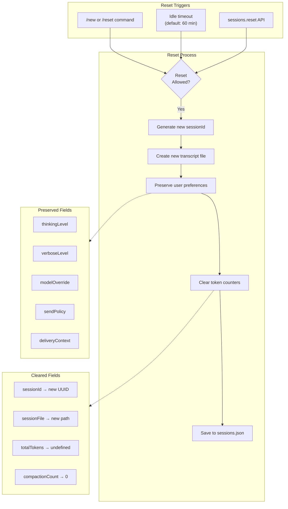
```mermaid
flowchart TB
    subgraph Triggers["Reset Triggers"]
        Cmd["/new or /reset command"]
        Idle["Idle timeout<br/>(default: 60 min)"]
        API["sessions.reset API"]
    end
    
    subgraph Process["Reset Process"]
        Check{Reset<br/>Allowed?}
        NewId[Generate new sessionId]
        NewFile[Create new transcript file]
        Preserve[Preserve user preferences]
        Clear[Clear token counters]
        Save[Save to sessions.json]
    end
    
    subgraph Preserved["Preserved Fields"]
        P1[thinkingLevel]
        P2[verboseLevel]
        P3[modelOverride]
        P4[sendPolicy]
        P5[deliveryContext]
    end
    
    subgraph Cleared["Cleared Fields"]
        C1[sessionId → new UUID]
        C2[sessionFile → new path]
        C3[totalTokens → undefined]
        C4[compactionCount → 0]
    end
    
    Cmd --> Check
    Idle --> Check
    API --> Check
    Check -->|Yes| NewId
    NewId --> NewFile
    NewFile --> Preserve
    Preserve --> Clear
    Clear --> Save
    
    Preserve -.-> Preserved
    Clear -.-> Cleared
```

**Reset Behavior:**

```typescript
// Fields preserved on reset (user preferences stay)
const PRESERVED_FIELDS = [
  'thinkingLevel',
  'verboseLevel', 
  'sendPolicy',
  'modelOverride',
  'providerOverride',
  'label',
  'displayName',
  'deliveryContext',
  'lastChannel',
  'lastTo',
  'lastAccountId'
];

// Fields cleared on reset (conversation state resets)
const CLEARED_FIELDS = [
  'sessionId',        // Generate new UUID
  'sessionFile',      // Point to new transcript
  'totalTokens',
  'inputTokens', 
  'outputTokens',
  'compactionCount',
  'skillsSnapshot'
];
```

---

## Session Key System

Session Key is the routing identifier for sessions, using a hierarchical structure.

### Key Format Breakdown

```
agent:main:main
  │    │    │
  │    │    └── Session Identifier
  │    │        • "main" = main session
  │    │        • "telegram:123456" = Telegram user
  │    │        • "cron:job-1" = Cron job
  │    │        • "discord:group:789" = Discord group
  │    │
  │    └── Agent ID
  │        • "main" = default agent
  │        • "research" = custom research agent
  │        • "code" = custom code agent
  │
  └── Prefix (literal)
      Indicates this is an agent-scoped session
```

### Common Session Key Patterns

**Group/Channel Sessions** (consistent format):

```
agent:{agentId}:{channel}:{peerKind}:{peerId}
```

| Type | Format | Example |
|------|--------|---------|
| Telegram Group | `agent:{agentId}:telegram:group:{chatId}` | `agent:main:telegram:group:-100123456` |
| Telegram Forum Topic | `agent:{agentId}:telegram:group:{chatId}:topic:{topicId}` | `agent:main:telegram:group:-100123456:topic:42` |
| Discord Channel | `agent:{agentId}:discord:channel:{channelId}` | `agent:main:discord:channel:123456789` |
| Discord Group DM | `agent:{agentId}:discord:group:{channelId}` | `agent:main:discord:group:789` |
| Cron Job | `agent:{agentId}:cron:{jobId}` | `agent:main:cron:daily-check` |
| Cron Run | `agent:{agentId}:cron:{jobId}:run:{uuid}` | `agent:main:cron:daily-check:run:abc-123` |
| Subagent | `agent:{agentId}:subagent:{label}:{uuid}` | `agent:main:subagent:researcher:def-456` |

**DM Sessions** (depends on `dmScope` configuration):

| dmScope | Format | Example |
|---------|--------|---------|
| `"main"` (default) | `agent:{agentId}:main` | `agent:main:main` |
| `"per-peer"` | `agent:{agentId}:direct:{peerId}` | `agent:main:direct:123` |
| `"per-channel-peer"` | `agent:{agentId}:{channel}:direct:{peerId}` | `agent:main:telegram:direct:123` |
| `"per-account-channel-peer"` | `agent:{agentId}:{channel}:{accountId}:direct:{peerId}` | `agent:main:telegram:default:direct:123` |

> **Important:** With default `dmScope: "main"`, all DMs across all channels route to the **same main session**. This allows seamless conversation continuity but means Telegram DMs and Discord DMs share context. If you need per-user isolation, configure `dmScope: "per-channel-peer"`.

### Key Resolution Flow

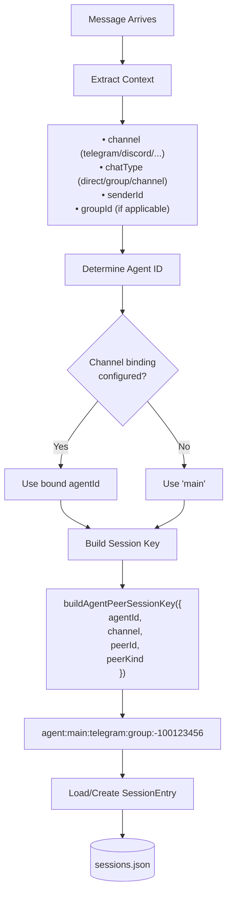
```mermaid
flowchart TB
    Start[Message Arrives] --> Extract[Extract Context]
    
    Extract --> Context["• channel (telegram/discord/...)<br/>• chatType (direct/group/channel)<br/>• senderId<br/>• groupId (if applicable)"]
    
    Context --> Agent[Determine Agent ID]
    Agent --> AgentLogic{"Channel binding<br/>configured?"}
    AgentLogic -->|Yes| BoundAgent[Use bound agentId]
    AgentLogic -->|No| DefaultAgent[Use 'main']
    
    BoundAgent --> Build[Build Session Key]
    DefaultAgent --> Build
    
    Build --> BuildLogic["buildAgentPeerSessionKey({<br/>  agentId,<br/>  channel,<br/>  peerId,<br/>  peerKind<br/>})"]
    
    BuildLogic --> Key["agent:main:telegram:group:-100123456"]
    
    Key --> Load[Load/Create SessionEntry]
    Load --> Store[(sessions.json)]
```

---

## User Identification

OpenClaw distinguishes between different users based on **unique identifiers provided by each communication channel**.

### User Identifiers by Channel

| Channel | User Identifier (peerId) | Example |
|---------|-------------------------|---------|
| Telegram | `msg.from.id` | `6813060849` |
| Discord | `msg.author.id` | `123456789012345678` |
| WhatsApp | Phone number (E.164) | `+8613800138000` |
| Signal | Phone number | `+8613800138000` |
| Slack | `user_id` | `U01ABC123` |
| iMessage | Phone/Email | `+8613800138000` |
| Webchat | Session cookie | `web-sess-abc123` |

### How User Isolation Works

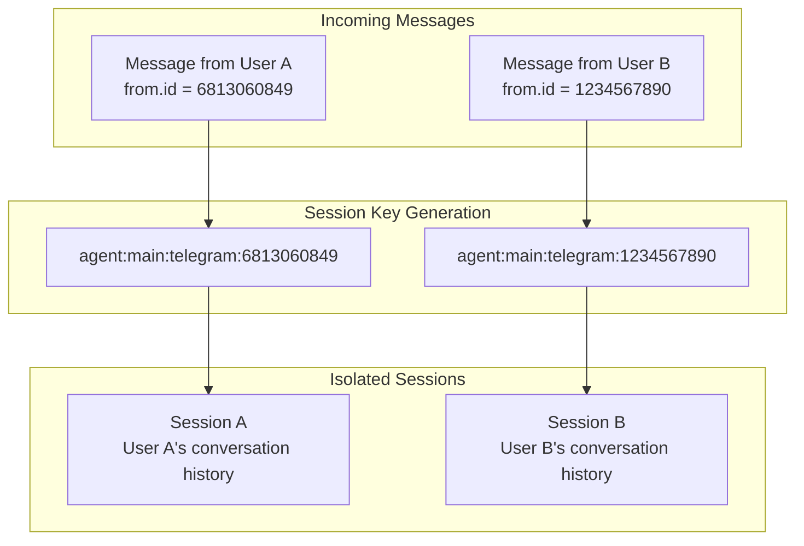
```mermaid
flowchart TB
    subgraph Incoming["Incoming Messages"]
        M1["Message from User A<br/>from.id = 6813060849"]
        M2["Message from User B<br/>from.id = 1234567890"]
    end
    
    subgraph KeyGen["Session Key Generation"]
        K1["agent:main:telegram:6813060849"]
        K2["agent:main:telegram:1234567890"]
    end
    
    subgraph Sessions["Isolated Sessions"]
        S1["Session A<br/>User A's conversation history"]
        S2["Session B<br/>User B's conversation history"]
    end
    
    M1 --> K1 --> S1
    M2 --> K2 --> S2
```

### Code Example

```typescript
// src/routing/session-key.ts (simplified)
function buildAgentPeerSessionKey(params: {
  agentId: string,
  channel: string,      // "telegram"
  peerId: string | null,
  peerKind: ChatType,   // "direct" | "group" | "channel"
  dmScope?: "main" | "per-peer" | "per-channel-peer" | "per-account-channel-peer",
}) {
  // For DMs, routing depends on dmScope
  if (peerKind === "direct") {
    const dmScope = params.dmScope ?? "main";
    if (dmScope === "main") {
      return `agent:${agentId}:main`;  // All DMs share main session
    }
    if (dmScope === "per-channel-peer") {
      return `agent:${agentId}:${channel}:direct:${peerId}`;
    }
    // ... other dmScope options
  }
  
  // For groups/channels, include peerKind in the key
  return `agent:${agentId}:${channel}:${peerKind}:${peerId}`;
}

// Examples:
// DM (default):  "agent:main:main"
// DM (per-channel-peer): "agent:main:telegram:direct:6813060849"
// Group: "agent:main:telegram:group:-100123456"
```

> **Key Point:** With default `dmScope: "main"`, all DMs route to the same main session. For groups/channels, the session key includes the peerKind and peerId, providing automatic isolation per group.

---

## Security and Access Control

Since your bot is publicly accessible (anyone can message it), OpenClaw provides multiple security layers to control who can interact with it.

### 1. Allowlist / Denylist (Recommended)

Restrict which users can interact with your bot:

```json
{
  "telegram": {
    "accounts": [{
      "token": "YOUR_BOT_TOKEN",
      "allowlist": ["6813060849"],    // Only these user IDs can interact
      "denylist": ["987654321"]       // Or block specific users
    }]
  }
}
```

### 2. DM Policy and Pairing

Configure how the bot handles DMs from unknown users:

**dmPolicy Options:**

| Value | Behavior |
|-------|----------|
| `"pairing"` | Unknown senders trigger pairing flow (secure, recommended) |
| `"allowlist"` | Unknown senders silently ignored |
| `"open"` | Anyone can DM (not recommended for public bots) |

```json
{
  "channels": {
    "telegram": {
      "dmPolicy": "pairing",
      "groupPolicy": "allowlist"
    }
  }
}
```

**Pairing Flow (when `dmPolicy: "pairing"`):**

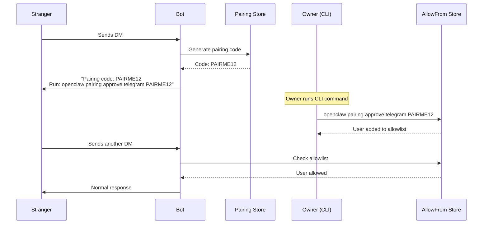
```mermaid
sequenceDiagram
    participant S as Stranger
    participant B as Bot
    participant P as Pairing Store
    participant O as Owner (CLI)
    participant A as AllowFrom Store
    
    S->>B: Sends DM
    B->>P: Generate pairing code
    P-->>B: Code: PAIRME12
    B->>S: "Pairing code: PAIRME12<br/>Run: openclaw pairing approve telegram PAIRME12"
    
    Note over O: Owner runs CLI command
    O->>A: openclaw pairing approve telegram PAIRME12
    A-->>O: User added to allowlist
    
    S->>B: Sends another DM
    B->>A: Check allowlist
    A-->>B: User allowed
    B->>S: Normal response
```

**Step-by-step:**

1. **Stranger sends DM** to your bot
2. **Bot returns pairing info:**
   ```
   👋 Hi! I don't recognize you yet.
   
   Your Telegram user id: 6813060849
   Pairing code: PAIRME12
   
   To connect, run on your machine:
   openclaw pairing approve telegram PAIRME12
   ```
3. **Owner approves** on local machine:
   ```bash
   openclaw pairing approve telegram PAIRME12
   ```
4. **User added to allowlist** - stored in `~/.openclaw/credentials/telegram-allowFrom.json`
5. **Future DMs work normally**

**Pairing CLI Commands:**

```bash
# List pending pairing requests
openclaw pairing list telegram

# Approve a pairing request
openclaw pairing approve telegram PAIRME12

# Related files
~/.openclaw/credentials/telegram-pairing.json    # Pending requests
~/.openclaw/credentials/telegram-allowFrom.json  # Approved users
```

### 3. Group Activation Modes

| Mode | Behavior |
|------|----------|
| `"always"` | Respond to all messages in the group |
| `"mention"` | Only respond when @mentioned |
| `"off"` | Ignore all group messages |

### 4. Send Policy

Control whether the agent can proactively send messages:

```json
{
  "agents": {
    "defaults": {
      "sendPolicy": "deny"    // Prevent agent from sending unsolicited messages
    }
  }
}
```

### 5. Tool Execution Security

Restrict which shell commands the agent can execute:

```json
{
  "agents": {
    "defaults": {
      "tools": {
        "exec": {
          "security": "allowlist",
          "allowlist": ["ls", "cat", "git", "npm"]
        }
      }
    }
  }
}
```

### 6. Sandbox Mode

Run tool executions in an isolated sandbox:

```json
{
  "agents": {
    "defaults": {
      "sandbox": {
        "enabled": true
      }
    }
  }
}
```

### Complete Security Configuration Example

```json
{
  "telegram": {
    "accounts": [{
      "token": "YOUR_BOT_TOKEN",
      "allowlist": ["6813060849"],     // ✅ Only you
      "dm": "allowlist",               // ✅ DMs restricted to allowlist
      "dmAllowlist": ["6813060849"],
      "groups": "off"                  // ✅ Disable group responses entirely
    }]
  },
  "agents": {
    "defaults": {
      "sendPolicy": "deny",            // ✅ No unsolicited messages
      "sandbox": { "enabled": true },  // ✅ Sandboxed execution
      "tools": {
        "exec": {
          "security": "allowlist",     // ✅ Restricted commands
          "allowlist": ["ls", "cat", "git"]
        }
      }
    }
  }
}
```

### Security Level Comparison

| Configuration | What strangers can do |
|--------------|----------------------|
| No config (default) | ⚠️ Can chat, but tools are limited |
| `allowlist: [yourId]` | ✅ Cannot interact at all |
| `dm: "off"` | ✅ DMs are ignored |
| `groups: "mention"` | Must @mention to trigger response |
| `sendPolicy: "deny"` | Agent cannot send first |
| `sandbox: true` | Tools run in isolation |

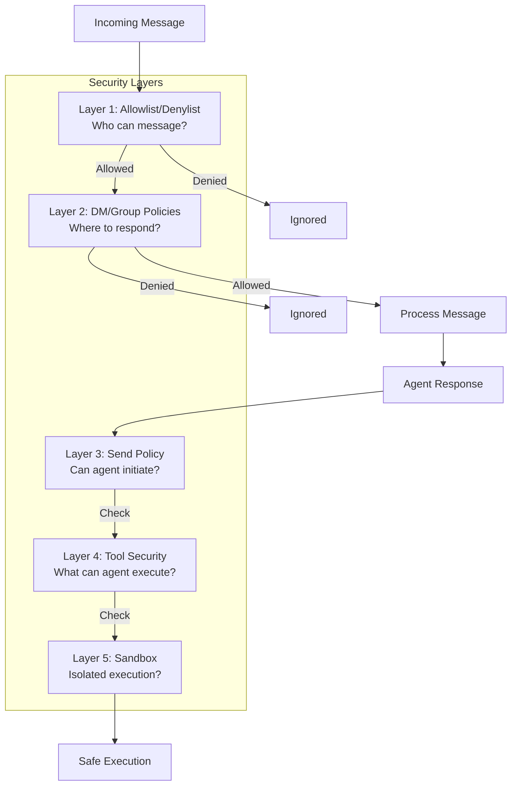
```mermaid
flowchart TB
    subgraph Security["Security Layers"]
        L1["Layer 1: Allowlist/Denylist<br/>Who can message?"]
        L2["Layer 2: DM/Group Policies<br/>Where to respond?"]
        L3["Layer 3: Send Policy<br/>Can agent initiate?"]
        L4["Layer 4: Tool Security<br/>What can agent execute?"]
        L5["Layer 5: Sandbox<br/>Isolated execution?"]
    end
    
    Msg[Incoming Message] --> L1
    L1 -->|Allowed| L2
    L1 -->|Denied| Block1[Ignored]
    L2 -->|Allowed| Process[Process Message]
    L2 -->|Denied| Block2[Ignored]
    Process --> Agent[Agent Response]
    Agent --> L3
    L3 -->|Check| L4
    L4 -->|Check| L5
    L5 --> Execute[Safe Execution]
```

> **Recommendation:** For personal use, always configure `allowlist` with only your user ID to ensure complete control over your bot. 🔐

---

## Multi-Agent Configuration

OpenClaw supports multiple agents, each with its own workspace, model configuration, and sessions.

### Configuring Multiple Agents

In `openclaw.json`:

```json
{
  "agents": {
    "agents": [
      {
        "id": "research",
        "name": "Research Agent",
        "workspace": "~/.openclaw/workspace-research",
        "model": "anthropic/claude-sonnet-4-5"
      },
      {
        "id": "code",
        "name": "Code Agent", 
        "workspace": "~/.openclaw/workspace-code",
        "model": "anthropic/claude-sonnet-4-5"
      }
    ]
  }
}
```

### Invoking Different Agents

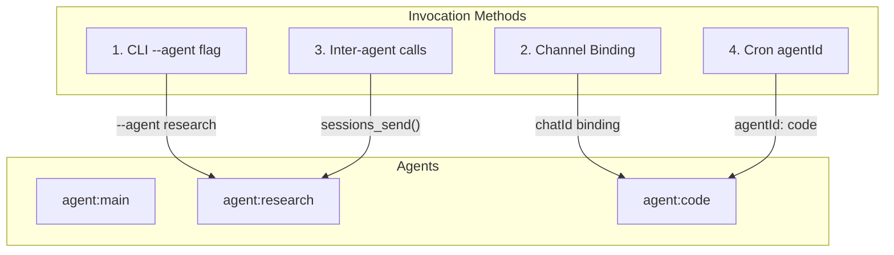
```mermaid
flowchart TB
    subgraph Methods["Invocation Methods"]
        CLI["1. CLI --agent flag"]
        Binding["2. Channel Binding"]
        Inter["3. Inter-agent calls"]
        Cron["4. Cron agentId"]
    end
    
    subgraph Agents["Agents"]
        Main[agent:main]
        Research[agent:research]
        Code[agent:code]
    end
    
    CLI -->|"--agent research"| Research
    Binding -->|"chatId binding"| Code
    Inter -->|"sessions_send()"| Research
    Cron -->|"agentId: code"| Code
```

#### Method 1: CLI `--agent` Flag

```bash
# Invoke research agent directly
openclaw agent --agent research --message "Research topic X"

# Invoke code agent
openclaw agent --agent code --message "Write a function"

# Or use session-id
openclaw agent --session-id agent:research:main --message "..."
```

#### Method 2: Channel Binding

Route specific chats to specific agents:

```json
{
  "telegram": {
    "accounts": [{
      "id": "my-bot",
      "token": "...",
      "bindings": [
        { "chatId": "-100111111", "agentId": "research" },
        { "chatId": "-100222222", "agentId": "code" }
      ]
    }]
  }
}
```

#### Method 3: Inter-Agent Communication

Agents can communicate with each other:

```typescript
// Send message to another agent's session
sessions_send({
  sessionKey: "agent:research:main",
  message: "Please research this topic"
});

// Spawn a sub-agent task
sessions_spawn({
  agentId: "research",
  task: "Research and summarize topic X"
});
```

#### Method 4: Cron Job Agent Assignment

```json
{
  "cron": {
    "jobs": [{
      "id": "daily-research",
      "agentId": "research",
      "schedule": { "kind": "cron", "expr": "0 9 * * *" },
      "sessionTarget": "isolated",
      "payload": {
        "kind": "agentTurn",
        "message": "Generate daily research report"
      }
    }]
  }
}
```

---

## Message Flow and Collaboration

### Single Request Flow

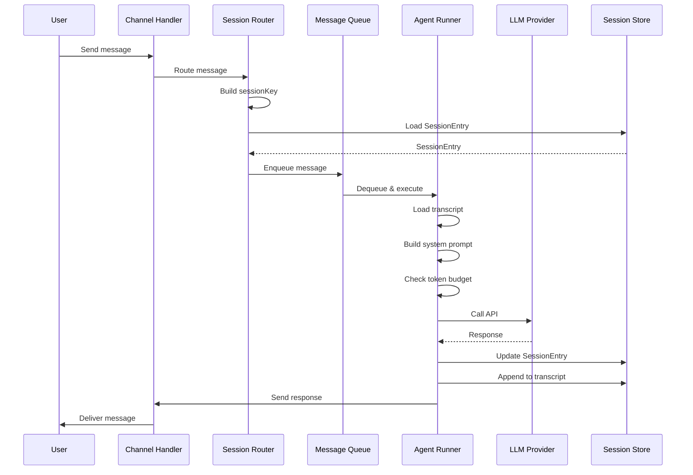
```mermaid
sequenceDiagram
    participant User
    participant Channel as Channel Handler
    participant Router as Session Router
    participant Queue as Message Queue
    participant Agent as Agent Runner
    participant LLM as LLM Provider
    participant Store as Session Store
    
    User->>Channel: Send message
    Channel->>Router: Route message
    Router->>Router: Build sessionKey
    Router->>Store: Load SessionEntry
    Store-->>Router: SessionEntry
    Router->>Queue: Enqueue message
    Queue->>Agent: Dequeue & execute
    Agent->>Agent: Load transcript
    Agent->>Agent: Build system prompt
    Agent->>Agent: Check token budget
    Agent->>LLM: Call API
    LLM-->>Agent: Response
    Agent->>Store: Update SessionEntry
    Agent->>Store: Append to transcript
    Agent->>Channel: Send response
    Channel->>User: Deliver message
```

### Multi-Session Collaboration Scenarios

#### Scenario 1: Subagent Invocation

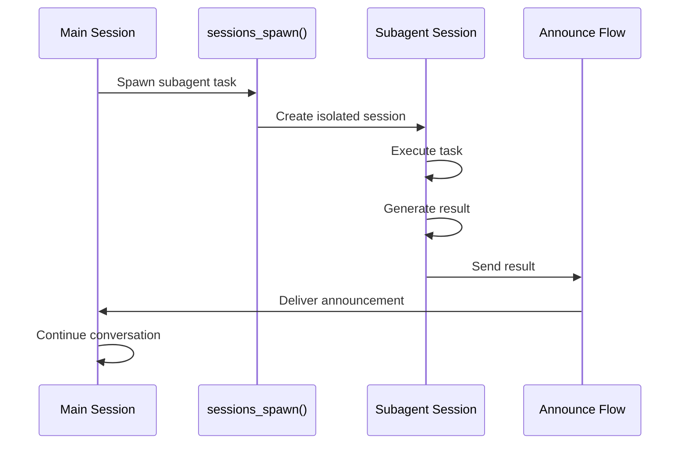
```mermaid
sequenceDiagram
    participant Main as Main Session
    participant Spawn as sessions_spawn()
    participant Sub as Subagent Session
    participant Announce as Announce Flow
    
    Main->>Spawn: Spawn subagent task
    Spawn->>Sub: Create isolated session
    Sub->>Sub: Execute task
    Sub->>Sub: Generate result
    Sub->>Announce: Send result
    Announce->>Main: Deliver announcement
    Main->>Main: Continue conversation
```

#### Scenario 2: Cron Isolated Session

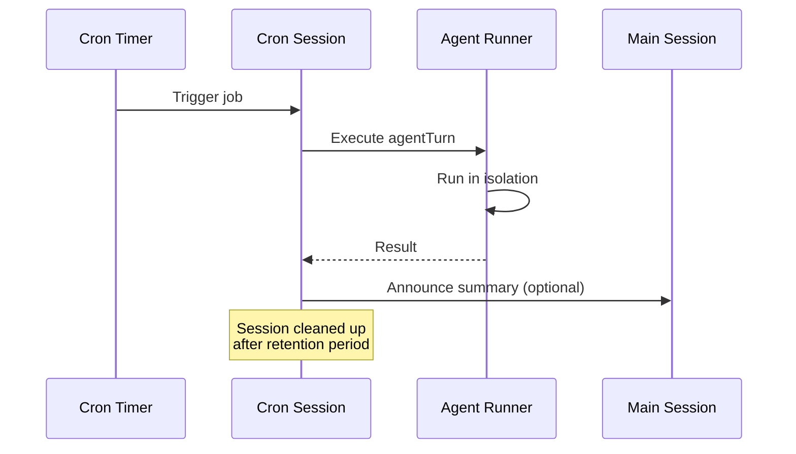
```mermaid
sequenceDiagram
    participant Timer as Cron Timer
    participant Cron as Cron Session
    participant Agent as Agent Runner
    participant Main as Main Session
    
    Timer->>Cron: Trigger job
    Cron->>Agent: Execute agentTurn
    Agent->>Agent: Run in isolation
    Agent-->>Cron: Result
    Cron->>Main: Announce summary (optional)
    Note over Cron: Session cleaned up<br/>after retention period
```

#### Scenario 3: Cross-Agent Communication

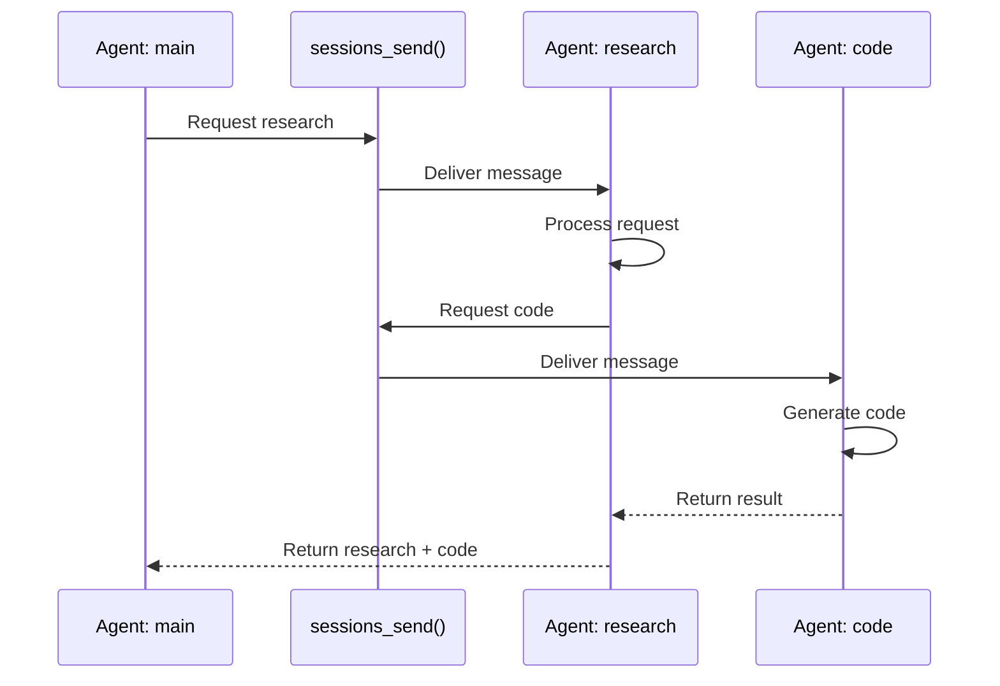
```mermaid
sequenceDiagram
    participant A as Agent: main
    participant Send as sessions_send()
    participant B as Agent: research
    participant C as Agent: code
    
    A->>Send: Request research
    Send->>B: Deliver message
    B->>B: Process request
    B->>Send: Request code
    Send->>C: Deliver message
    C->>C: Generate code
    C-->>B: Return result
    B-->>A: Return research + code
```

---

## Token Management

### Token Statistics Fields

```typescript
interface SessionEntry {
  inputTokens?: number;      // Cumulative input tokens
  outputTokens?: number;     // Cumulative output tokens
  totalTokens?: number;      // Current context tokens (estimated)
  totalTokensFresh?: boolean;// Whether it's up-to-date
  contextTokens?: number;    // Model context window size
}
```

### Token Calculation Flow

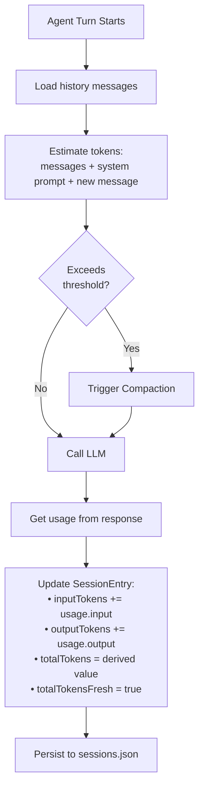
```mermaid
flowchart TB
    Start[Agent Turn Starts] --> Load[Load history messages]
    Load --> Estimate["Estimate tokens:<br/>messages + system prompt + new message"]
    Estimate --> Check{Exceeds<br/>threshold?}
    Check -->|Yes| Compact[Trigger Compaction]
    Check -->|No| Call[Call LLM]
    Compact --> Call
    Call --> Usage[Get usage from response]
    Usage --> Update["Update SessionEntry:<br/>• inputTokens += usage.input<br/>• outputTokens += usage.output<br/>• totalTokens = derived value<br/>• totalTokensFresh = true"]
    Update --> Save[Persist to sessions.json]
```

### Compaction (Context Compression)

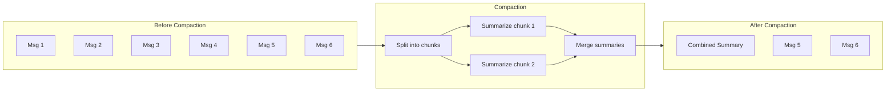
```mermaid
flowchart LR
    subgraph Before["Before Compaction"]
        M1[Msg 1]
        M2[Msg 2]
        M3[Msg 3]
        M4[Msg 4]
        M5[Msg 5]
        M6[Msg 6]
    end
    
    subgraph Process["Compaction"]
        Split[Split into chunks]
        Sum1[Summarize chunk 1]
        Sum2[Summarize chunk 2]
        Merge[Merge summaries]
    end
    
    subgraph After["After Compaction"]
        Summary[Combined Summary]
        M5b[Msg 5]
        M6b[Msg 6]
    end
    
    Before --> Split
    Split --> Sum1 & Sum2
    Sum1 & Sum2 --> Merge
    Merge --> After
```

**Compaction Strategies:**

| Strategy | Description | Configuration |
|----------|-------------|---------------|
| Auto | Automatically triggers when context approaches limit | Default |
| Manual | Manually trigger via /compact command | - |
| Disabled | Disable compression, error on overflow | `compaction.enabled: false` |

---

## Cache Management

OpenClaw supports multi-layer cache strategies to optimize token usage and response latency.

### 1. Provider-Level Prompt Caching

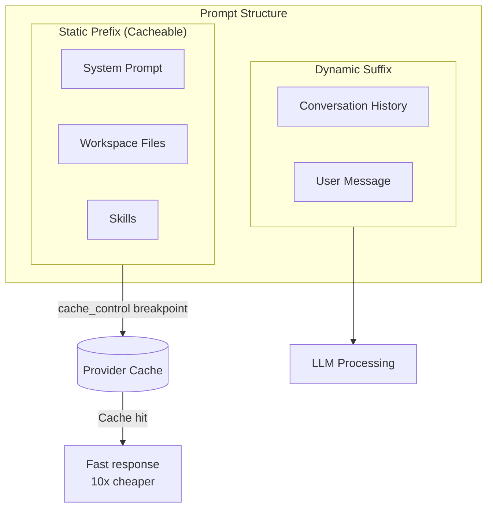
```mermaid
flowchart TB
    subgraph Prompt["Prompt Structure"]
        subgraph Static["Static Prefix (Cacheable)"]
            SP[System Prompt]
            WF[Workspace Files]
            SK[Skills]
        end
        
        subgraph Dynamic["Dynamic Suffix"]
            HI[Conversation History]
            UM[User Message]
        end
    end
    
    Static -->|cache_control breakpoint| Cache[(Provider Cache)]
    Cache -->|Cache hit| Fast[Fast response<br/>10x cheaper]
    Dynamic --> LLM[LLM Processing]
```

**Provider Cache Methods:**

| Provider | Cache Method | Configuration |
|----------|-------------|---------------|
| Anthropic Direct | `cacheRetention` parameter | `cacheRetention: "short"/"long"` |
| OpenRouter + Anthropic | `cache_control` blocks | Automatic |
| OpenAI | Automatic (no config needed) | - |
| DeepSeek | Automatic (no config needed) | - |
| Gemini 2.5+ | Automatic (no config needed) | - |

### 2. Session Store Cache

```mermaid
flowchart LR
    Request[Load Session] --> CacheCheck{Cache<br/>Valid?}
    CacheCheck -->|Yes| Return[Return from cache]
    CacheCheck -->|No| ReadFile[Read sessions.json]
    ReadFile --> UpdateCache[Update cache]
    UpdateCache --> Return
    
    Write[Write Session] --> AcquireLock[Acquire file lock]
    AcquireLock --> WriteFile[Write sessions.json]
    WriteFile --> Invalidate[Invalidate cache]
```

### Cache Optimization Configuration

```json
{
  "agents": {
    "defaults": {
      "contextPruning": {
        "mode": "cache-ttl",
        "ttl": "5m"
      },
      "models": {
        "anthropic/claude-sonnet-4-5": {
          "params": {
            "cacheRetention": "long"
          }
        }
      }
    }
  },
  "heartbeat": {
    "every": "55m"
  }
}
```

---

## Session Lifecycle

```mermaid
stateDiagram-v2
    [*] --> Created: New message arrives
    Created --> Active: Session initialized
    Active --> Active: Messages exchanged
    Active --> Compacted: Context limit reached
    Compacted --> Active: Continue conversation
    Active --> Reset: /new or /reset command
    Active --> Reset: Idle timeout
    Active --> Deleted: sessions.delete
    Reset --> Active: New conversation
    Deleted --> [*]
```

### Reset Triggers

| Trigger | Condition | Behavior |
|---------|-----------|----------|
| User command | `/new`, `/reset` | Immediate reset |
| Idle timeout | Exceeds `idleMinutes` without activity | Reset on next message |
| Manual delete | `sessions.delete` | Delete entry + archive transcript |
| Cron cleanup | `sessionRetention` expired | Clean up isolated cron sessions |

---

## Related Files

| Module | File Path | Description |
|--------|-----------|-------------|
| Session Types | `src/config/sessions/types.ts` | Type definitions |
| Session Store | `src/config/sessions/store.ts` | Storage management |
| Session Key | `src/routing/session-key.ts` | Key parsing and building |
| Transcript | `src/config/sessions/transcript.ts` | Conversation history management |
| Reset Logic | `src/config/sessions/reset.ts` | Reset logic |
| Compaction | `src/agents/compaction.ts` | Context compression |
| Context Pruning | `src/agents/pi-extensions/context-pruning.ts` | Context pruning |
| Cache TTL | `src/agents/pi-embedded-runner/cache-ttl.ts` | Cache tracking |
| Gateway Session Utils | `src/gateway/session-utils.ts` | Gateway layer utilities |

---

## References

- [OpenClaw Docs: Session Management](https://docs.openclaw.ai/concepts/session)
- [OpenClaw Docs: Compaction](https://docs.openclaw.ai/concepts/compaction)
- [OpenClaw Docs: Token Use](https://docs.openclaw.ai/token-use)
