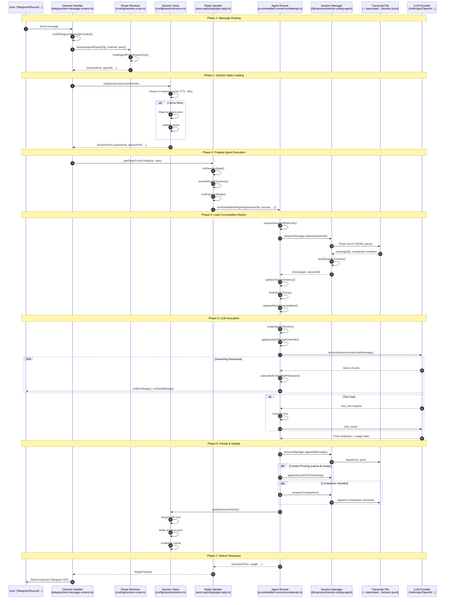
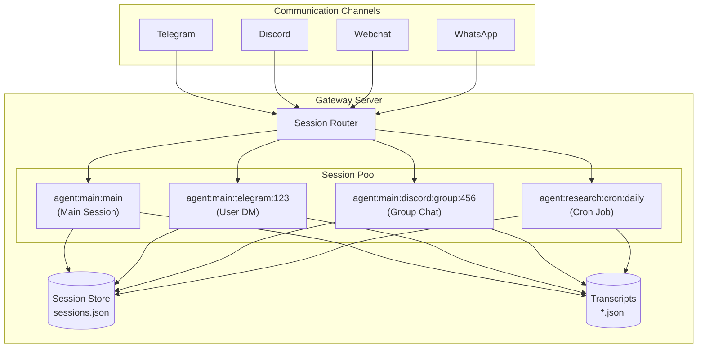
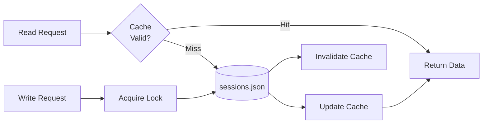
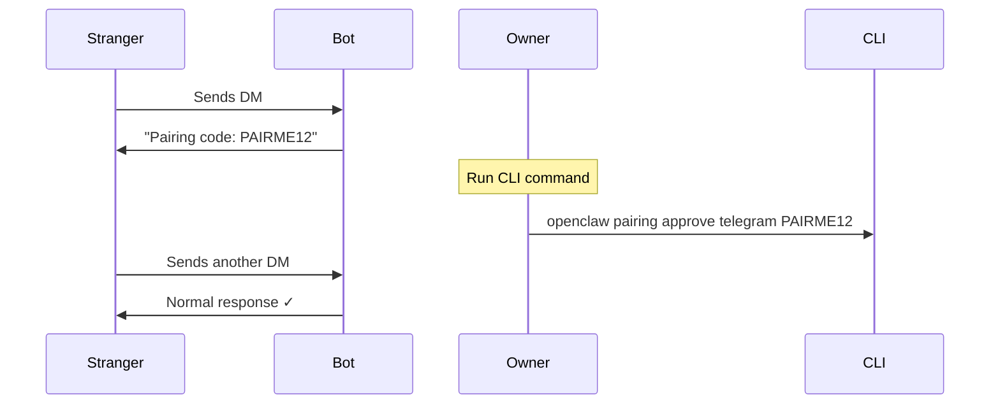
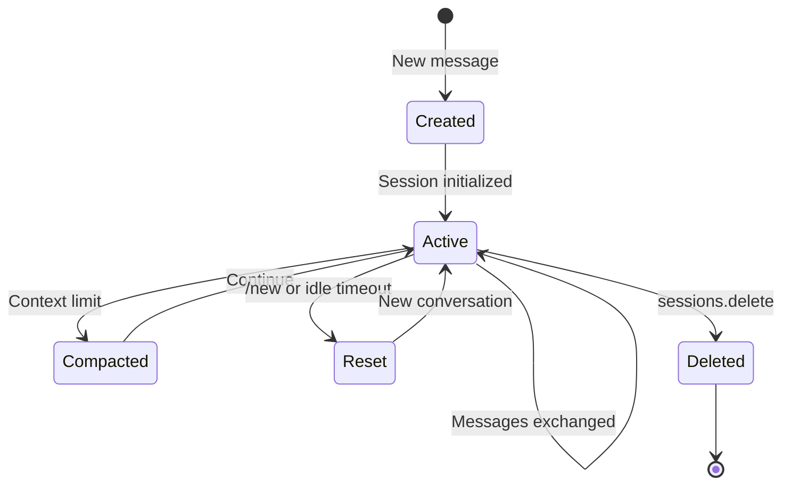

# Session Management

Session is the core concept of OpenClaw, responsible for managing conversation state, context, token usage, and cache optimization between users and agents.

## Table of Contents

**Part 1: Overview**
1. [What is a Session?](#1-what-is-a-session)
2. [Landscape: End-to-End Message Flow](#2-landscape-end-to-end-message-flow)

**Part 2: Architecture**
3. [System Architecture](#3-system-architecture)
4. [Storage Structure](#4-storage-structure)

**Part 3: Core Concepts**
5. [Session Key System](#5-session-key-system)
6. [Session Routing (Peer)](#6-session-routing-peer)

**Part 4: Core Modules**
7. [Session Store](#7-session-store)
8. [Transcript Manager](#8-transcript-manager)
9. [Session Reset](#9-session-reset)

**Part 5: Token & Cache**
10. [Token Management](#10-token-management)
11. [KV Cache Optimization](#11-kv-cache-optimization)

**Part 6: Security**
12. [Access Control](#12-access-control)
13. [DM Pairing](#13-dm-pairing)

**Part 7: Advanced Topics**
14. [Multi-Agent Configuration](#14-multi-agent-configuration)
15. [User Identification](#15-user-identification)
16. [Session Lifecycle](#16-session-lifecycle)

**Appendices**
- [Appendix A: Sequence Diagram Step-by-Step](#appendix-a-sequence-diagram-step-by-step)
- [Appendix B: Related Source Files](#appendix-b-related-source-files)
- [Appendix C: References](#appendix-c-references)

---

# Part 1: Overview

## 1. What is a Session?

A Session can be understood as a "conversation session" that contains:

```
┌─────────────────────────────────────────────────────────────┐
│                         Session                              │
├─────────────────────────────────────────────────────────────┤
│  • sessionId: UUID unique identifier                         │
│  • sessionKey: routing key (e.g., "agent:main:main")        │
│  • conversation history (transcript)                         │
│  • token usage statistics                                    │
│  • model/provider configuration                              │
│  • user preferences (thinking level, verbose mode...)       │
│  • delivery context (channel, to, accountId...)             │
└─────────────────────────────────────────────────────────────┘
```

### Key Concepts

#### SessionScope (Isolation Mode)

| Value | Description | Use Case |
|-------|-------------|----------|
| `per-sender` | Each user gets an independent session | **Default**. User A and B have separate histories |
| `global` | All users share the same session | Everyone sees the same conversation (rare) |

#### SessionChatType (Chat Type)

| Value | Description | Examples |
|-------|-------------|----------|
| `direct` | One-on-one private chat | Telegram DM, Discord DM |
| `group` | Group chat | Telegram Group, Discord Server |
| `channel` | Broadcast channel | Telegram Channel |

---

## 2. Landscape: End-to-End Message Flow

This sequence diagram shows the complete journey of a user message through OpenClaw. All module names and function names are based on actual source code.



### Key Modules Reference

| Phase | Module | Key Functions |
|-------|--------|---------------|
| **Routing** | `telegram/bot-message-context.ts` | `buildTelegramMessageContext()` |
| | `routing/resolve-route.ts` | `resolveAgentRoute()`, `buildAgentPeerSessionKey()` |
| **Session State** | `config/sessions/store.ts` | `loadSessionStore()`, `updateSessionStore()` |
| **Reply Logic** | `auto-reply/reply/get-reply.ts` | `getReplyFromConfig()`, `initSessionState()` |
| | `auto-reply/reply/get-reply-run.ts` | `runPreparedReply()` |
| **Agent Execution** | `agents/pi-embedded-runner/run.ts` | `runEmbeddedPiAgent()` |
| | `agents/pi-embedded-runner/run/attempt.ts` | `runEmbeddedAttempt()` |
| **Transcript** | `@mariozechner/pi-coding-agent` | `SessionManager.open()`, `appendMessage()` |
| **LLM Call** | `@mariozechner/pi-ai` | `streamSimple()`, `activeSession.prompt()` |

### Data Flow Summary

```
User Message
     │
     ▼
┌─────────────────┐    ┌─────────────────┐
│  sessions.json  │◄───│  Route/State    │
│  (metadata)     │    │  Loading        │
└─────────────────┘    └────────┬────────┘
                                │
                                ▼
                       ┌─────────────────┐
                       │  session.jsonl  │◄─── History Load
                       │  (transcript)   │
                       └────────┬────────┘
                                │
                                ▼
                       ┌─────────────────┐
                       │   LLM API       │
                       │   (streaming)   │
                       └────────┬────────┘
                                │
                                ▼
┌─────────────────┐    ┌─────────────────┐
│  session.jsonl  │◄───│  Persist        │──► User Response
│  (append)       │    │  & Reply        │
└─────────────────┘    └─────────────────┘
         │
         ▼
┌─────────────────┐
│  sessions.json  │◄─── Update metadata
│  (token stats)  │
└─────────────────┘
```

---

# Part 2: Architecture

## 3. System Architecture



## 4. Storage Structure

```
~/.openclaw/
├── sessions.json                   # Legacy/global session metadata
│
├── agents/
│   ├── main/                       # Default agent
│   │   └── sessions/
│   │       ├── sessions.json       # Session metadata (index)
│   │       ├── abc-123.jsonl       # Transcript for session abc-123
│   │       └── def-456.jsonl       # Transcript for session def-456
│   │
│   └── research/                   # Custom agent
│       └── sessions/
│           ├── sessions.json
│           └── *.jsonl
```

**Two types of files:**

| File | Content | Purpose |
|------|---------|---------|
| `sessions.json` | Metadata (sessionId, tokens, config) | Quick lookup, statistics |
| `*.jsonl` | Full conversation history | LLM context, audit trail |

---

# Part 3: Core Concepts

## 5. Session Key System

Session Key is the unique routing identifier for sessions.

### Format

```
agent:main:telegram:group:-100123456
  │    │       │      │        │
  │    │       │      │        └── Peer ID (chat/user ID)
  │    │       │      └── Peer Kind (direct/group/channel)
  │    │       └── Channel (telegram/discord/...)
  │    └── Agent ID (main/research/...)
  └── Prefix (literal "agent")
```

### Common Patterns

**Group/Channel Sessions:**

| Type | Example |
|------|---------|
| Telegram Group | `agent:main:telegram:group:-100123456` |
| Telegram Forum | `agent:main:telegram:group:-100123456:topic:42` |
| Discord Channel | `agent:main:discord:channel:123456789` |
| Cron Job | `agent:main:cron:daily-check` |

**DM Sessions** (depends on `dmScope`):

| dmScope | Format |
|---------|--------|
| `"main"` (default) | `agent:main:main` ← All DMs share this! |
| `"per-channel-peer"` | `agent:main:telegram:direct:123` |

> **Important:** Default `dmScope: "main"` means all DMs route to the same session!

---

## 6. Session Routing (Peer)

`peer` represents "who you're chatting with":

```typescript
type RoutePeer = {
  kind: "direct" | "group" | "channel";
  id: string;
};
```

| Scenario | peer.kind | peer.id |
|----------|-----------|---------|
| Telegram DM | `"direct"` | `"6813060849"` |
| Telegram Group | `"group"` | `"-100123456"` |
| Discord Channel | `"channel"` | `"123456789"` |

### Routing Flow

```
Telegram Message
     │
     ▼ buildTelegramMessageContext()
peer = { kind: "group", id: "-100123456" }
     │
     ▼ resolveAgentRoute({cfg, channel, peer})
     │
     ▼ buildAgentPeerSessionKey({peerKind, peerId, ...})
     │
     ▼ sessionKey = "agent:main:telegram:group:-100123456"
```

---

# Part 4: Core Modules

## 7. Session Store

**Location:** `src/config/sessions/store.ts`

Manages persistent storage of session metadata in `sessions.json`.

### Architecture



### Key Features

- **In-memory cache** (TTL: 45s)
- **File-based locking** (`proper-lockfile`)
- **Atomic read-modify-write**

### Why Locking?

Node.js async can cause race conditions:

```javascript
// These can interleave!
async function agentA() {
  const store = await readFile('sessions.json');  // ① read
  store['sessionA'] = { ... };                     // ② modify
  await writeFile('sessions.json', store);         // ⑤ write (overwrites B!)
}

async function agentB() {
  const store = await readFile('sessions.json');  // ③ read (stale!)
  store['sessionB'] = { ... };                     // ④ modify
  await writeFile('sessions.json', store);         // ⑥ write
}
```

**Solution:** `proper-lockfile` serializes all writes.

### Data Structure

```typescript
type SessionEntry = {
  sessionId: string;           // UUID
  sessionFile?: string;        // Path to transcript
  updatedAt: number;           // Timestamp
  
  // Token stats
  inputTokens?: number;
  outputTokens?: number;
  totalTokens?: number;
  
  // Config
  modelOverride?: string;
  thinkingLevel?: string;
  
  // Delivery
  lastChannel?: string;
  lastTo?: string;
};
```

---

## 8. Transcript Manager

**Location:** `src/config/sessions/transcript.ts`

Manages conversation history in JSONL format.

### Storage

```
~/.openclaw/agents/{agentId}/sessions/{sessionId}.jsonl
```

### JSONL Structure

```jsonl
{"type":"session","version":3,"id":"abc-123","timestamp":"..."}
{"type":"model_change","provider":"anthropic","modelId":"claude-opus-4-5"}
{"type":"user_message","content":[{"type":"text","text":"Hello"}]}
{"type":"assistant_message","content":[...],"usage":{...}}
{"type":"tool_use","name":"exec","input":{"command":"ls"}}
{"type":"tool_result","output":"file1.txt\nfile2.txt"}
{"type":"compaction","summary":"...","firstKeptEntryId":"xyz"}
```

### Key Properties

- **Append-only** — File never truncated
- **Compaction markers** — Old messages skipped, not deleted
- **Cache-friendly** — Stable prefix for KV cache

### Lifecycle

```
First Message → Create file + header
     │
     ▼ appendMessage()
Active conversation (append-only)
     │
     ▼ Context limit reached
Compaction (add summary, mark old messages)
     │
     ▼ /new or /reset
Archive (create new file, keep old)
     │
     ▼ sessionRetention expires
Delete (optional cleanup)
```

---

## 9. Session Reset

**Location:** `src/config/sessions/reset.ts`

### Triggers

| Trigger | Condition |
|---------|-----------|
| `/new`, `/reset` | User command |
| Idle timeout | No activity for `idleMinutes` |
| API | `sessions.reset` call |

### Behavior

**Preserved** (user preferences):
- thinkingLevel, verboseLevel
- modelOverride, providerOverride
- sendPolicy, deliveryContext

**Cleared** (conversation state):
- sessionId → new UUID
- sessionFile → new path
- token counters → reset

---

# Part 5: Token & Cache

## 10. Token Management

### Statistics Tracked

| Field | Description |
|-------|-------------|
| `inputTokens` | Total input tokens used |
| `outputTokens` | Total output tokens used |
| `totalTokens` | Sum of input + output |
| `contextTokens` | Current context window size |

### Compaction

When context approaches limit (~180k tokens):

```
Before:
[system] [msg1] [msg2] ... [msg50] [msg51]
         └────────────────────────────────┘
                   180k tokens (full!)

After:
[system] [summary: "User discussed X, Y, Z..."] [msg51]
         └──────────────────────────────────────────┘
                   ~20k tokens (fresh!)
```

---

## 11. KV Cache Optimization

### Why Transcript is Cache-Friendly

Transcript is **append-only**, so prefix stays stable:

```
Request 1: [system] [msg1] [msg2] [msg3]
                    └──────────────┘
                       cacheable

Request 2: [system] [msg1] [msg2] [msg3] [msg4]
                    └──────────────┘ cache hit!
                                     └──┘ compute only this
```

### Cache-Breaking Scenarios

| Scenario | What happens |
|----------|--------------|
| **Compaction** | History → summary, prefix changes |
| **Context pruning** | Old messages removed |
| **Workspace file edit** | System prompt changes |
| **Tool result truncation** | Old results shortened |

### Mitigation: `cache-ttl` Mode

```json
{
  "contextPruning": {
    "mode": "cache-ttl",
    "ttl": "5m"
  }
}
```

Keeps prefix stable within TTL, maximizes cache hits.

---

# Part 6: Security

## 12. Access Control

### Allowlist/Denylist

```json
{
  "telegram": {
    "allowlist": ["6813060849"],
    "denylist": ["987654321"]
  }
}
```

### DM/Group Policies

| Setting | Values |
|---------|--------|
| `dmPolicy` | `"pairing"`, `"allowlist"`, `"open"` |
| `groupPolicy` | `"allowlist"`, `"mention"`, `"off"` |

### Tool Security

```json
{
  "tools": {
    "exec": {
      "security": "allowlist",
      "allowlist": ["ls", "cat", "git"]
    }
  }
}
```

---

## 13. DM Pairing

When `dmPolicy: "pairing"`:



---

# Part 7: Advanced Topics

## 14. Multi-Agent Configuration

```json
{
  "agents": {
    "agents": [
      { "id": "research", "workspace": "~/research" },
      { "id": "code", "workspace": "~/code" }
    ]
  }
}
```

Each agent has its own:
- Workspace directory
- Session pool
- Model configuration

---

## 15. User Identification

| Channel | Identifier |
|---------|------------|
| Telegram | `msg.from.id` |
| Discord | `msg.author.id` |
| WhatsApp | Phone (E.164) |
| Signal | Phone |
| Slack | `user_id` |

---

## 16. Session Lifecycle



---

# Appendices

## Appendix A: Sequence Diagram Step-by-Step

### Phase 1: Message Routing (Steps 1-5)

| Step | Function | What it does |
|------|----------|--------------|
| 1 | User sends message | Raw message via webhook/polling |
| 2 | `buildTelegramMessageContext()` | Extract metadata |
| 3 | `resolveAgentRoute()` | Determine agent |
| 4 | `buildAgentPeerSessionKey()` | Construct session key |
| 5 | Return route | Ready for session loading |

### Phase 2: Session State Loading (Steps 6-10)

| Step | Function | What it does |
|------|----------|--------------|
| 6 | `loadSessionStore()` | Entry point |
| 7 | Check cache | 45s TTL |
| 8 | Read `sessions.json` | On cache miss |
| 9 | Update cache | Store in memory |
| 10 | Return `SessionEntry` | Metadata loaded |

### Phase 3: Prepare Agent (Steps 11-15)

| Step | Function | What it does |
|------|----------|--------------|
| 11 | `getReplyFromConfig()` | Main entry |
| 12 | `initSessionState()` | Initialize state |
| 13 | `resolveReplyDirectives()` | Parse `/think`, `/model` |
| 14 | `runPreparedReply()` | Prepare context |
| 15 | `runEmbeddedPiAgent()` | Call agent |

### Phase 4: Load History (Steps 16-24)

| Step | Function | What it does |
|------|----------|--------------|
| 16 | `acquireSessionWriteLock()` | Lock file |
| 17 | `SessionManager.open()` | Open transcript |
| 18 | Read `.jsonl` | Parse messages |
| 19-21 | `buildSessionContext()` | Filter by compaction |
| 22 | `sanitizeSessionHistory()` | Clean messages |
| 23 | `limitHistoryTurns()` | Truncate |
| 24 | `replaceMessages()` | Apply to agent |

### Phase 5: LLM Invocation (Steps 25-32)

| Step | Function | What it does |
|------|----------|--------------|
| 25 | `createAgentSession()` | Init LLM connection |
| 26 | `applySystemPromptOverride()` | Inject workspace files |
| 27 | `activeSession.prompt()` | Call LLM |
| 28 | Streaming loop | Process chunks |
| 29-31 | Tool use | Execute tools, return results |
| 32 | Final response | Get usage stats |

### Phase 6: Persist (Steps 33-40)

| Step | Function | What it does |
|------|----------|--------------|
| 33-34 | `appendMessage()` | Write to transcript |
| 35-36 | Compaction (optional) | If needed |
| 37-40 | `updateSessionStore()` | Update metadata |

### Phase 7: Deliver (Steps 41-43)

| Step | Function | What it does |
|------|----------|--------------|
| 41-42 | Return result | To reply handler |
| 43 | Send response | Via Telegram API |

---

## Appendix B: Related Source Files

| Module | Path |
|--------|------|
| Session Types | `src/config/sessions/types.ts` |
| Session Store | `src/config/sessions/store.ts` |
| Session Key | `src/routing/session-key.ts` |
| Transcript | `src/config/sessions/transcript.ts` |
| Reset | `src/config/sessions/reset.ts` |
| Compaction | `src/agents/compaction.ts` |
| Context Pruning | `src/agents/pi-extensions/context-pruning.ts` |
| Cache TTL | `src/agents/pi-embedded-runner/cache-ttl.ts` |

---

## Appendix C: References

- [OpenClaw Docs: Session Management](https://docs.openclaw.ai/concepts/session)
- [OpenClaw Docs: Compaction](https://docs.openclaw.ai/concepts/compaction)
- [OpenClaw Docs: Token Use](https://docs.openclaw.ai/token-use)
