# Session Management

Session is the core concept of OpenClaw, responsible for managing conversation state, context, token usage, and cache optimization between users and agents.

## Table of Contents

1. [Overview](#overview)
2. [Session Architecture](#session-architecture)
3. [Core Modules](#core-modules)
4. [Session Key System](#session-key-system)
5. [Multi-Agent Configuration](#multi-agent-configuration)
6. [Message Flow and Collaboration](#message-flow-and-collaboration)
7. [Token Management](#token-management)
8. [Cache Management](#cache-management)
9. [Session Lifecycle](#session-lifecycle)

---

## Overview

A Session can be understood as a "conversation session" that contains:

```
┌─────────────────────────────────────────────────────────────┐
│                         Session                              │
├─────────────────────────────────────────────────────────────┤
│  • sessionId: UUID unique identifier                         │
│  • sessionKey: routing key (e.g., "agent:main:main")        │
│  • conversation history (transcript)                         │
│  • token usage statistics                                    │
│  • model/provider configuration                              │
│  • user preferences (thinking level, verbose mode...)       │
│  • delivery context (channel, to, accountId...)             │
└─────────────────────────────────────────────────────────────┘
```

### Key Concepts

#### SessionScope (Session Isolation Mode)

Determines **how sessions are isolated between different users**:

| Value | Description | Use Case |
|-------|-------------|----------|
| `per-sender` | Each user gets an independent session | **Default**. User A and User B have separate conversation histories |
| `global` | All users share the same session | Everyone sees the same conversation history (rare) |

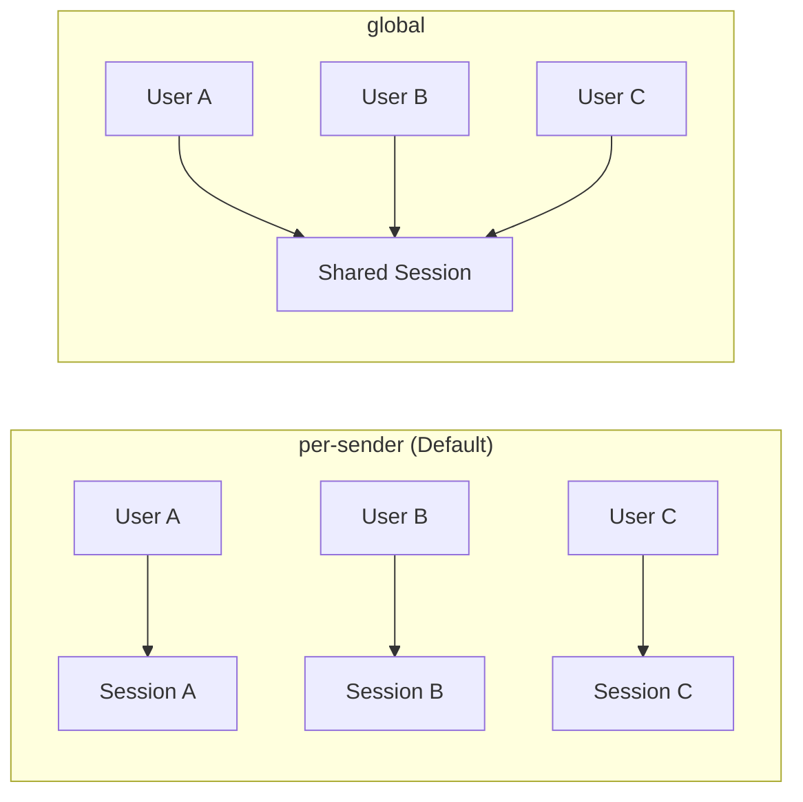

#### SessionChatType (Chat Type)

Describes **the type of chat the message originates from**:

| Value | Description | Examples |
|-------|-------------|----------|
| `direct` | One-on-one private chat | Telegram DM, Discord DM |
| `group` | Group chat | Telegram Group, Discord Server |
| `channel` | Broadcast channel | Telegram Channel, Discord Announcement |

**Impact on behavior:**
- Session Key generation pattern
- Whether @mention is required to respond (group activation)
- Message delivery target

---

## Session Architecture

### Overall Architecture Diagram

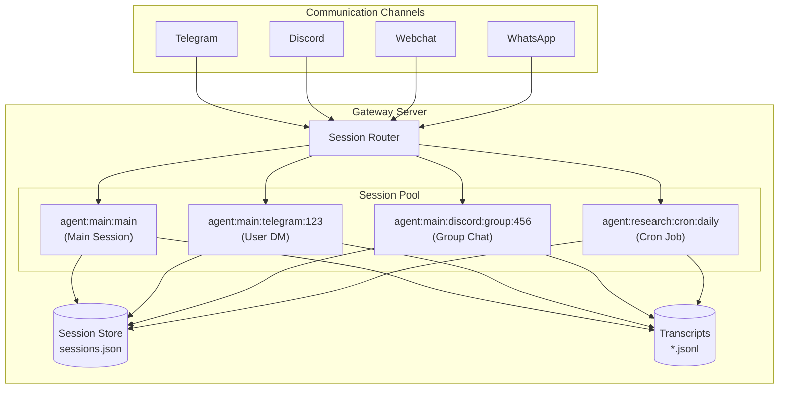

### Storage Structure

```
~/.openclaw/
├── sessions/
│   └── sessions.json              # Legacy/global session metadata
│
├── agents/
│   ├── main/                       # Default agent (always exists)
│   │   └── sessions/
│   │       ├── sessions.json       # Agent-specific session metadata
│   │       ├── abc-123.jsonl       # Transcript for session abc-123
│   │       └── def-456.jsonl       # Transcript for session def-456
│   │
│   ├── research/                   # Custom agent: "research"
│   │   └── sessions/
│   │       ├── sessions.json
│   │       └── *.jsonl
│   │
│   └── code/                       # Custom agent: "code"
│       └── sessions/
│           ├── sessions.json
│           └── *.jsonl
```

> **Note:** `{agent-id}` in the path refers to custom agents you configure in `openclaw.json`. The `main` agent always exists as the default.

---

## Core Modules

### 1. Session Store (`src/config/sessions/store.ts`)

Responsible for persistent storage of session metadata.

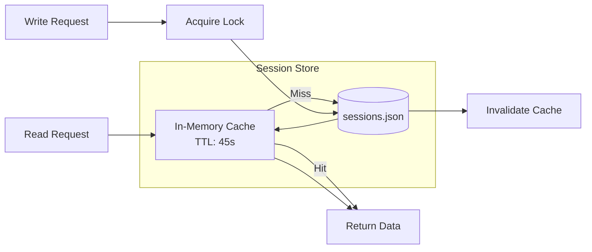

**Key Features:**
- **In-memory caching** with 45-second TTL for performance
- **File-based locking** to prevent concurrent write corruption
- **Atomic updates** via read-modify-write pattern

```typescript
// Core data structure
type SessionEntry = {
  sessionId: string;          // UUID
  updatedAt: number;          // Last update timestamp
  sessionFile?: string;       // Transcript file path
  
  // Token statistics
  inputTokens?: number;
  outputTokens?: number;
  totalTokens?: number;
  totalTokensFresh?: boolean; // Whether token data is fresh
  contextTokens?: number;     // Model context window size
  
  // Model configuration
  modelProvider?: string;
  model?: string;
  providerOverride?: string;
  modelOverride?: string;
  
  // User preferences
  thinkingLevel?: string;     // off/low/medium/high
  verboseLevel?: string;
  sendPolicy?: "allow" | "deny";
  
  // Delivery context
  lastChannel?: string;
  lastTo?: string;
  lastAccountId?: string;
  deliveryContext?: DeliveryContext;
};
```

### 2. Session Types (`src/config/sessions/types.ts`)

Defines session types and utility functions.

```typescript
// Session scope - how to isolate users
type SessionScope = "per-sender" | "global";

// Chat type - where the message comes from
type SessionChatType = "direct" | "group" | "channel";

// Session origin information - metadata about message source
type SessionOrigin = {
  label?: string;
  provider?: string;      // telegram, discord, etc.
  surface?: string;       // chat, voice, etc.
  chatType?: SessionChatType;
  from?: string;          // sender identifier
  to?: string;            // recipient identifier
  accountId?: string;     // bot account used
};
```

### 3. Session Router (`src/routing/session-key.ts`)

Routes messages to the correct session by building and parsing session keys.

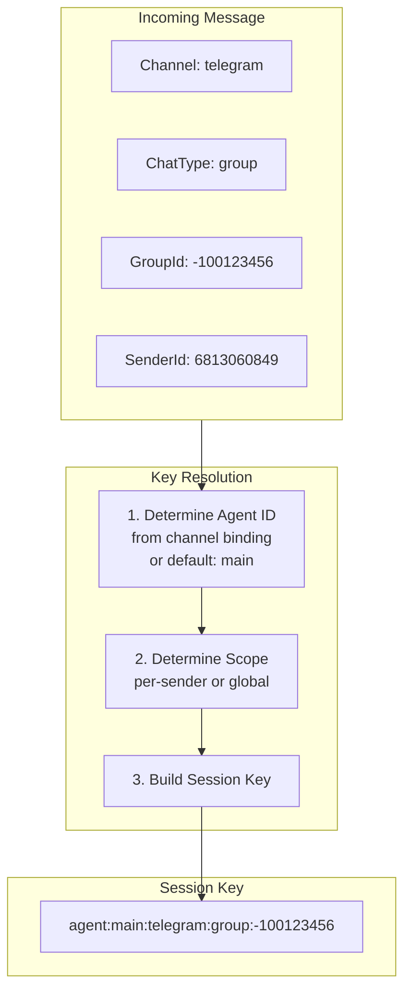

**Key Functions:**

```typescript
// Build session key for an agent's main session
buildAgentMainSessionKey({ agentId: "main", mainKey: "main" })
// → "agent:main:main"

// Build session key for a peer (user/group) session
buildAgentPeerSessionKey({
  agentId: "main",
  channel: "telegram",
  peerId: "6813060849",
  peerKind: "direct"
})
// → "agent:main:telegram:6813060849"

// Extract agent ID from session key
resolveAgentIdFromSessionKey("agent:research:cron:daily")
// → "research"
```

### 4. Transcript Manager (`src/config/sessions/transcript.ts`)

Manages reading and writing of conversation history stored in JSONL format.

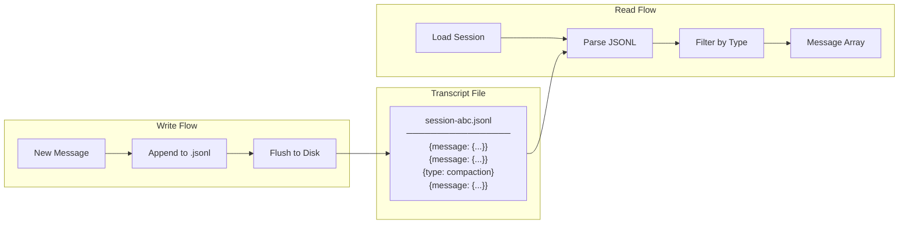

**JSONL Format:**

```jsonl
{"message":{"role":"user","content":"Hello"},"timestamp":1707800000000}
{"message":{"role":"assistant","content":"Hi!"},"timestamp":1707800001000}
{"type":"compaction","id":"abc-123","timestamp":"2024-02-13T10:00:00Z"}
{"message":{"role":"user","content":"What's next?"},"timestamp":1707800100000}
```

**Key Operations:**
- **Append-only writes** for durability
- **Streaming reads** for large transcripts
- **Compaction markers** to track context compression events

### 5. Session Reset (`src/config/sessions/reset.ts`)

Handles session reset logic triggered by commands or idle timeout.

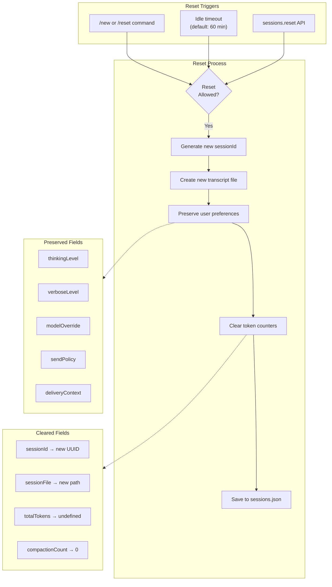

**Reset Behavior:**

```typescript
// Fields preserved on reset (user preferences stay)
const PRESERVED_FIELDS = [
  'thinkingLevel',
  'verboseLevel', 
  'sendPolicy',
  'modelOverride',
  'providerOverride',
  'label',
  'displayName',
  'deliveryContext',
  'lastChannel',
  'lastTo',
  'lastAccountId'
];

// Fields cleared on reset (conversation state resets)
const CLEARED_FIELDS = [
  'sessionId',        // Generate new UUID
  'sessionFile',      // Point to new transcript
  'totalTokens',
  'inputTokens', 
  'outputTokens',
  'compactionCount',
  'skillsSnapshot'
];
```

---

## Session Key System

Session Key is the routing identifier for sessions, using a hierarchical structure.

### Key Format Breakdown

```
agent:main:main
  │    │    │
  │    │    └── Session Identifier
  │    │        • "main" = main session
  │    │        • "telegram:123456" = Telegram user
  │    │        • "cron:job-1" = Cron job
  │    │        • "discord:group:789" = Discord group
  │    │
  │    └── Agent ID
  │        • "main" = default agent
  │        • "research" = custom research agent
  │        • "code" = custom code agent
  │
  └── Prefix (literal)
      Indicates this is an agent-scoped session
```

### Common Session Key Patterns

| Type | Format | Example |
|------|--------|---------|
| Main Session | `agent:{agentId}:main` | `agent:main:main` |
| Direct Chat | `agent:{agentId}:{channel}:{userId}` | `agent:main:telegram:6813060849` |
| Group Chat | `agent:{agentId}:{channel}:group:{groupId}` | `agent:main:discord:group:123456` |
| Channel | `agent:{agentId}:{channel}:channel:{channelId}` | `agent:main:telegram:channel:-100123` |
| Cron Job | `agent:{agentId}:cron:{jobId}` | `agent:main:cron:daily-check` |
| Cron Run | `agent:{agentId}:cron:{jobId}:run:{uuid}` | `agent:main:cron:daily-check:run:abc-123` |
| Subagent | `agent:{agentId}:subagent:{label}:{uuid}` | `agent:main:subagent:researcher:def-456` |

### Key Resolution Flow

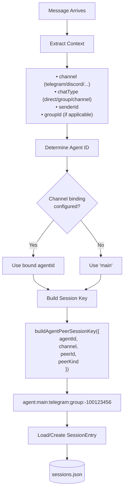

---

## Multi-Agent Configuration

OpenClaw supports multiple agents, each with its own workspace, model configuration, and sessions.

### Configuring Multiple Agents

In `openclaw.json`:

```json
{
  "agents": {
    "agents": [
      {
        "id": "research",
        "name": "Research Agent",
        "workspace": "~/.openclaw/workspace-research",
        "model": "anthropic/claude-sonnet-4-5"
      },
      {
        "id": "code",
        "name": "Code Agent", 
        "workspace": "~/.openclaw/workspace-code",
        "model": "anthropic/claude-sonnet-4-5"
      }
    ]
  }
}
```

### Invoking Different Agents

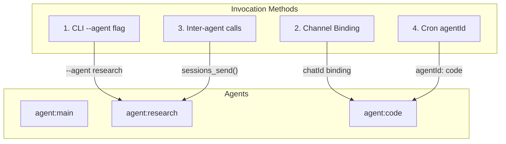

#### Method 1: CLI `--agent` Flag

```bash
# Invoke research agent directly
openclaw agent --agent research --message "Research topic X"

# Invoke code agent
openclaw agent --agent code --message "Write a function"

# Or use session-id
openclaw agent --session-id agent:research:main --message "..."
```

#### Method 2: Channel Binding

Route specific chats to specific agents:

```json
{
  "telegram": {
    "accounts": [{
      "id": "my-bot",
      "token": "...",
      "bindings": [
        { "chatId": "-100111111", "agentId": "research" },
        { "chatId": "-100222222", "agentId": "code" }
      ]
    }]
  }
}
```

#### Method 3: Inter-Agent Communication

Agents can communicate with each other:

```typescript
// Send message to another agent's session
sessions_send({
  sessionKey: "agent:research:main",
  message: "Please research this topic"
});

// Spawn a sub-agent task
sessions_spawn({
  agentId: "research",
  task: "Research and summarize topic X"
});
```

#### Method 4: Cron Job Agent Assignment

```json
{
  "cron": {
    "jobs": [{
      "id": "daily-research",
      "agentId": "research",
      "schedule": { "kind": "cron", "expr": "0 9 * * *" },
      "sessionTarget": "isolated",
      "payload": {
        "kind": "agentTurn",
        "message": "Generate daily research report"
      }
    }]
  }
}
```

---

## Message Flow and Collaboration

### Single Request Flow

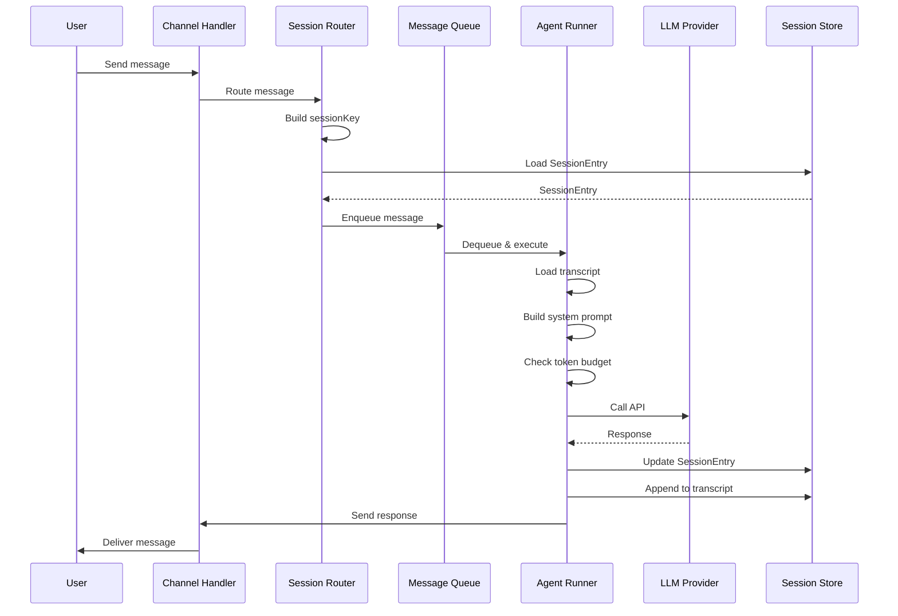

### Multi-Session Collaboration Scenarios

#### Scenario 1: Subagent Invocation

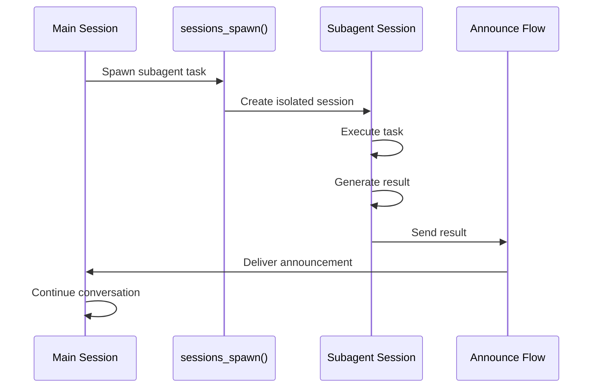

#### Scenario 2: Cron Isolated Session

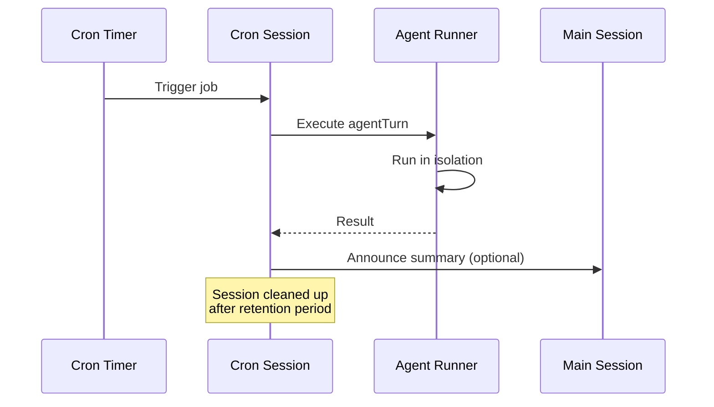

#### Scenario 3: Cross-Agent Communication

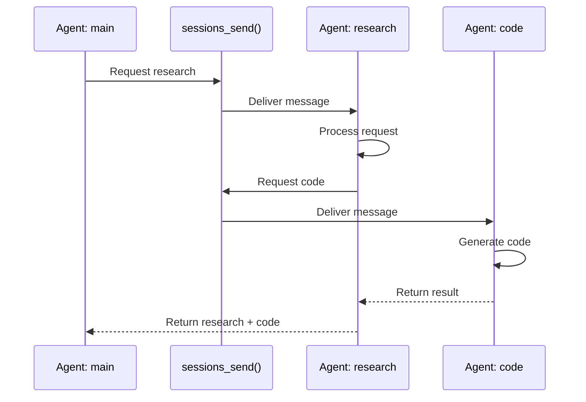

---

## Token Management

### Token Statistics Fields

```typescript
interface SessionEntry {
  inputTokens?: number;      // Cumulative input tokens
  outputTokens?: number;     // Cumulative output tokens
  totalTokens?: number;      // Current context tokens (estimated)
  totalTokensFresh?: boolean;// Whether it's up-to-date
  contextTokens?: number;    // Model context window size
}
```

### Token Calculation Flow

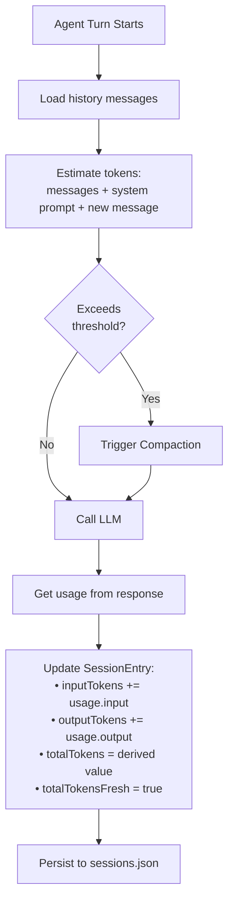

### Compaction (Context Compression)

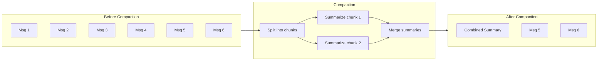

**Compaction Strategies:**

| Strategy | Description | Configuration |
|----------|-------------|---------------|
| Auto | Automatically triggers when context approaches limit | Default |
| Manual | Manually trigger via /compact command | - |
| Disabled | Disable compression, error on overflow | `compaction.enabled: false` |

---

## Cache Management

OpenClaw supports multi-layer cache strategies to optimize token usage and response latency.

### 1. Provider-Level Prompt Caching

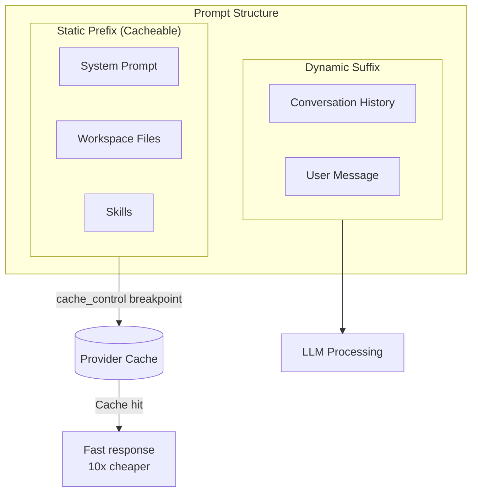

**Provider Cache Methods:**

| Provider | Cache Method | Configuration |
|----------|-------------|---------------|
| Anthropic Direct | `cacheRetention` parameter | `cacheRetention: "short"/"long"` |
| OpenRouter + Anthropic | `cache_control` blocks | Automatic |
| OpenAI | Automatic (no config needed) | - |
| DeepSeek | Automatic (no config needed) | - |
| Gemini 2.5+ | Automatic (no config needed) | - |

### 2. Session Store Cache

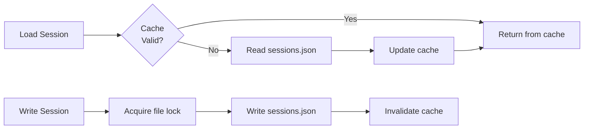

### Cache Optimization Configuration

```json
{
  "agents": {
    "defaults": {
      "contextPruning": {
        "mode": "cache-ttl",
        "ttl": "5m"
      },
      "models": {
        "anthropic/claude-sonnet-4-5": {
          "params": {
            "cacheRetention": "long"
          }
        }
      }
    }
  },
  "heartbeat": {
    "every": "55m"
  }
}
```

---

## Session Lifecycle

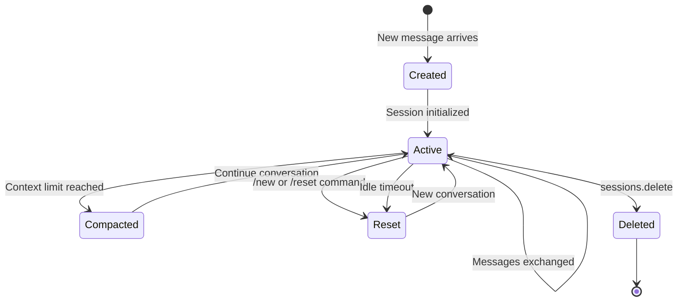

### Reset Triggers

| Trigger | Condition | Behavior |
|---------|-----------|----------|
| User command | `/new`, `/reset` | Immediate reset |
| Idle timeout | Exceeds `idleMinutes` without activity | Reset on next message |
| Manual delete | `sessions.delete` | Delete entry + archive transcript |
| Cron cleanup | `sessionRetention` expired | Clean up isolated cron sessions |

---

## Related Files

| Module | File Path | Description |
|--------|-----------|-------------|
| Session Types | `src/config/sessions/types.ts` | Type definitions |
| Session Store | `src/config/sessions/store.ts` | Storage management |
| Session Key | `src/routing/session-key.ts` | Key parsing and building |
| Transcript | `src/config/sessions/transcript.ts` | Conversation history management |
| Reset Logic | `src/config/sessions/reset.ts` | Reset logic |
| Compaction | `src/agents/compaction.ts` | Context compression |
| Context Pruning | `src/agents/pi-extensions/context-pruning.ts` | Context pruning |
| Cache TTL | `src/agents/pi-embedded-runner/cache-ttl.ts` | Cache tracking |
| Gateway Session Utils | `src/gateway/session-utils.ts` | Gateway layer utilities |

---

## References

- [OpenClaw Docs: Session Management](https://docs.openclaw.ai/concepts/session)
- [OpenClaw Docs: Compaction](https://docs.openclaw.ai/concepts/compaction)
- [OpenClaw Docs: Token Use](https://docs.openclaw.ai/token-use)
