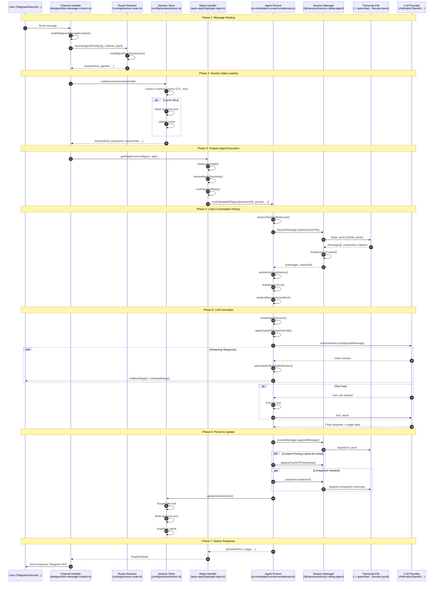
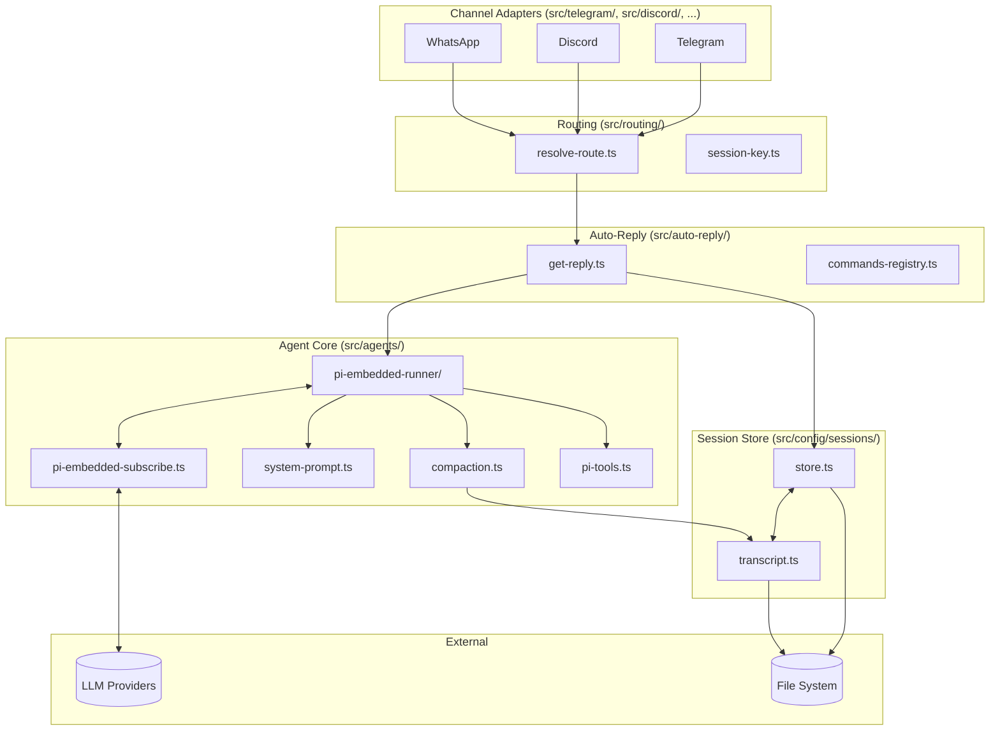
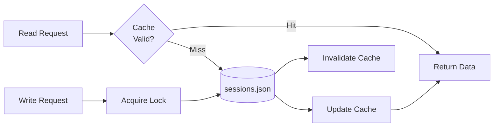
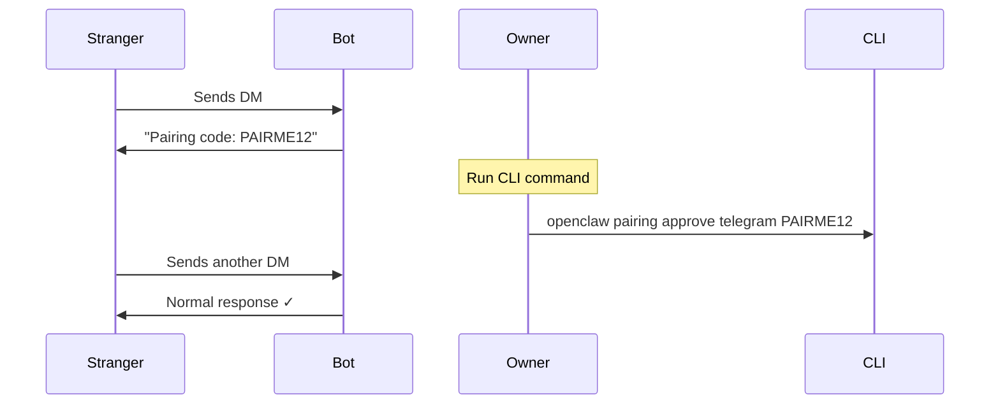
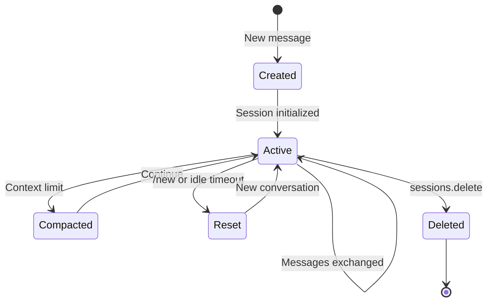
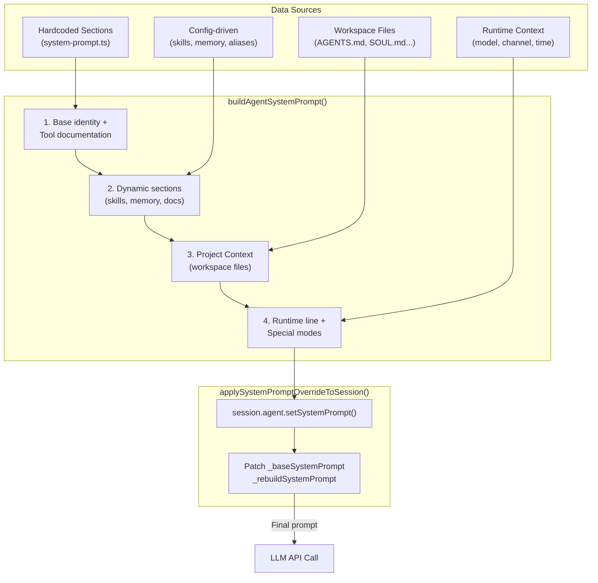
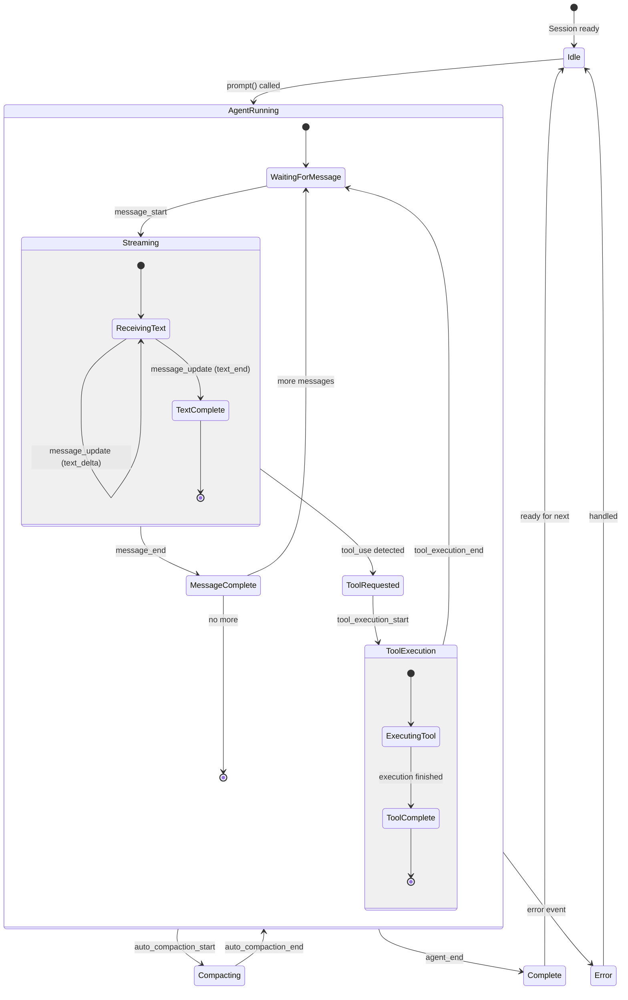
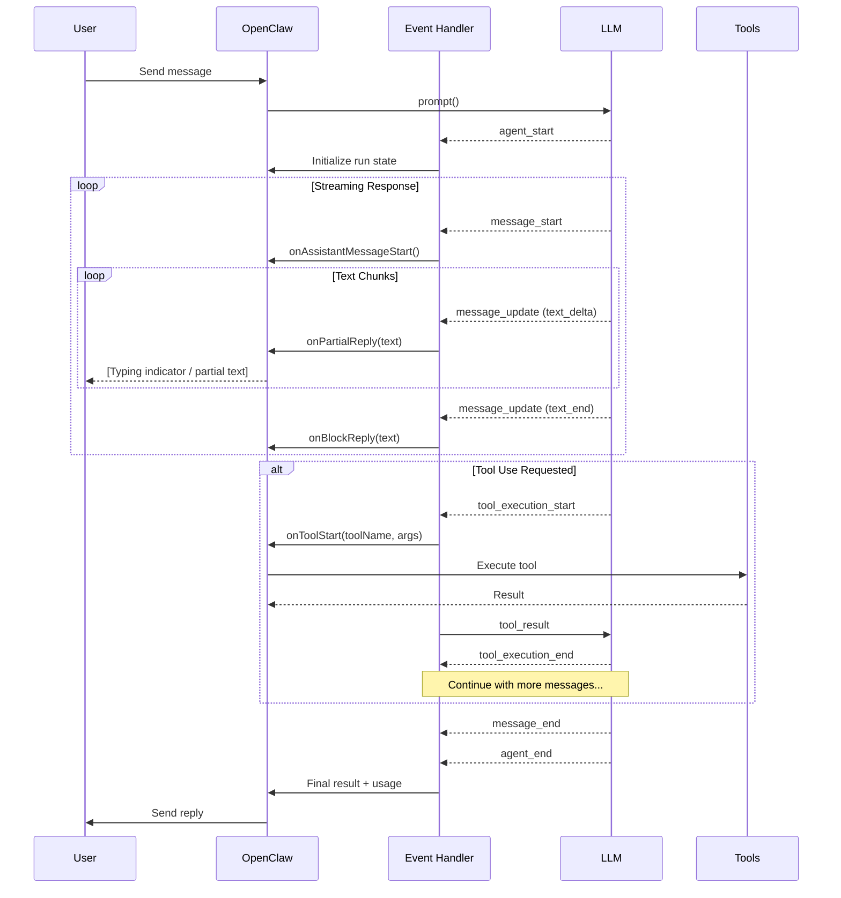
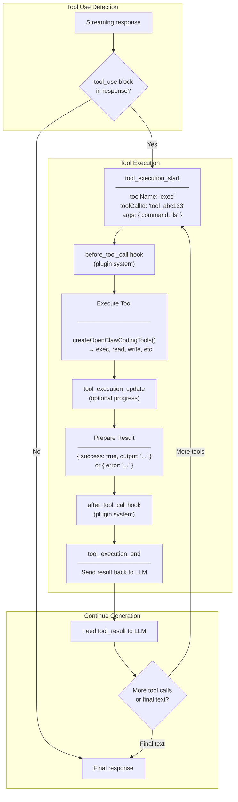

# Session Management

Session is the core concept of OpenClaw, responsible for managing conversation state, context, token usage, and cache optimization between users and agents.

## Table of Contents

**Part 1: Overview**
1. [What is a Session?](#1-what-is-a-session)
2. [Landscape: End-to-End Message Flow](#2-landscape-end-to-end-message-flow)

**Part 2: Architecture**
3. [System Architecture](#3-system-architecture)
4. [Storage Structure](#4-storage-structure)

**Part 3: Core Concepts**
5. [Session Key System](#5-session-key-system)
6. [Session Routing (Peer)](#6-session-routing-peer)

**Part 4: Core Modules**
7. [Session Store](#7-session-store)
8. [Transcript Manager](#8-transcript-manager)
9. [Session Reset](#9-session-reset)

**Part 5: Token & Cache**
10. [Token Management](#10-token-management)
11. [KV Cache Optimization](#11-kv-cache-optimization)

**Part 6: Security**
12. [Access Control](#12-access-control)
13. [DM Pairing](#13-dm-pairing)

**Part 7: Advanced Topics**
14. [Multi-Agent Configuration](#14-multi-agent-configuration)
15. [User Identification](#15-user-identification)
16. [Session Lifecycle](#16-session-lifecycle)
17. [System Prompt Construction](#17-system-prompt-construction)
18. [LLM Event-Driven State Machine](#18-llm-event-driven-state-machine)

**Appendices**
- [Appendix A: Sequence Diagram Step-by-Step](#appendix-a-sequence-diagram-step-by-step)
- [Appendix B: Related Source Files](#appendix-b-related-source-files)
- [Appendix C: References](#appendix-c-references)

---

# Part 1: Overview

## 1. What is a Session?

A Session can be understood as a "conversation session" that contains:

```
┌─────────────────────────────────────────────────────────────┐
│                         Session                              │
├─────────────────────────────────────────────────────────────┤
│  • sessionId: UUID unique identifier                         │
│  • sessionKey: routing key (e.g., "agent:main:main")        │
│  • conversation history (transcript)                         │
│  • token usage statistics                                    │
│  • model/provider configuration                              │
│  • user preferences (thinking level, verbose mode...)       │
│  • delivery context (channel, to, accountId...)             │
└─────────────────────────────────────────────────────────────┘
```

### Key Concepts

#### SessionScope (Isolation Mode)

| Value | Description | Use Case |
|-------|-------------|----------|
| `per-sender` | Each user gets an independent session | **Default**. User A and B have separate histories |
| `global` | All users share the same session | Everyone sees the same conversation (rare) |

#### SessionChatType (Chat Type)

| Value | Description | Examples |
|-------|-------------|----------|
| `direct` | One-on-one private chat | Telegram DM, Discord DM |
| `group` | Group chat | Telegram Group, Discord Server |
| `channel` | Broadcast channel | Telegram Channel |

---

## 2. Landscape: End-to-End Message Flow

This sequence diagram shows the complete journey of a user message through OpenClaw. All module names and function names are based on actual source code.



### Key Modules Reference

| Phase | Module | Key Functions |
|-------|--------|---------------|
| **Routing** | `telegram/bot-message-context.ts` | `buildTelegramMessageContext()` |
| | `routing/resolve-route.ts` | `resolveAgentRoute()`, `buildAgentPeerSessionKey()` |
| **Session State** | `config/sessions/store.ts` | `loadSessionStore()`, `updateSessionStore()` |
| **Reply Logic** | `auto-reply/reply/get-reply.ts` | `getReplyFromConfig()`, `initSessionState()` |
| | `auto-reply/reply/get-reply-run.ts` | `runPreparedReply()` |
| **Agent Execution** | `agents/pi-embedded-runner/run.ts` | `runEmbeddedPiAgent()` |
| | `agents/pi-embedded-runner/run/attempt.ts` | `runEmbeddedAttempt()` |
| **Transcript** | `@mariozechner/pi-coding-agent` | `SessionManager.open()`, `appendMessage()` |
| **LLM Call** | `@mariozechner/pi-ai` | `streamSimple()`, `activeSession.prompt()` |

### Data Flow Summary

```
User Message
     │
     ▼
┌─────────────────┐    ┌─────────────────┐
│  sessions.json  │◄───│  Route/State    │
│  (metadata)     │    │  Loading        │
└─────────────────┘    └────────┬────────┘
                                │
                                ▼
                       ┌─────────────────┐
                       │  session.jsonl  │◄─── History Load
                       │  (transcript)   │
                       └────────┬────────┘
                                │
                                ▼
                       ┌─────────────────┐
                       │   LLM API       │
                       │   (streaming)   │
                       └────────┬────────┘
                                │
                                ▼
┌─────────────────┐    ┌─────────────────┐
│  session.jsonl  │◄───│  Persist        │──► User Response
│  (append)       │    │  & Reply        │
└─────────────────┘    └─────────────────┘
         │
         ▼
┌─────────────────┐
│  sessions.json  │◄─── Update metadata
│  (token stats)  │
└─────────────────┘
```

---

# Part 2: Architecture

## 3. System Architecture

The following diagram shows the module architecture based on source code analysis. All modules are **peer-level directories** under `src/` (no containment relationship):



**Key Modules (all peer-level under `src/`):**

| Module | Source Location | Core Files |
|--------|-----------------|------------|
| **Channel Adapters** | `src/telegram/`, `src/discord/`, etc. | `monitor.ts`, `bot.ts`, `send.ts` |
| **Routing** | `src/routing/` | `resolve-route.ts`, `session-key.ts` |
| **Auto-Reply** | `src/auto-reply/` | `reply/get-reply.ts` (entry point) |
| **Session Store** | `src/config/sessions/` | `store.ts`, `transcript.ts` |
| **Agent Core** | `src/agents/` | `pi-embedded-runner/run/attempt.ts` |
| **Gateway Server** | `src/gateway/` | `server.impl.ts` (HTTP/WS server) |

> ⚠️ **Note**: These modules are peer-level directories, not nested. The diagram shows **call relationships**, not containment.

> 📊 **Detailed Module Documentation**: See [Module Architecture](./module-architecture.md) for comprehensive source code analysis.

## 4. Storage Structure

```
~/.openclaw/
├── sessions.json                   # Legacy/global session metadata
│
├── agents/
│   ├── main/                       # Default agent
│   │   └── sessions/
│   │       ├── sessions.json       # Session metadata (index)
│   │       ├── abc-123.jsonl       # Transcript for session abc-123
│   │       └── def-456.jsonl       # Transcript for session def-456
│   │
│   └── research/                   # Custom agent
│       └── sessions/
│           ├── sessions.json
│           └── *.jsonl
```

**Two types of files:**

| File | Content | Purpose |
|------|---------|---------|
| `sessions.json` | Metadata (sessionId, tokens, config) | Quick lookup, statistics |
| `*.jsonl` | Full conversation history | LLM context, audit trail |

---

# Part 3: Core Concepts

## 5. Session Key System

Session Key is the unique routing identifier for sessions.

### Format

```
agent:main:telegram:group:-100123456
  │    │       │      │        │
  │    │       │      │        └── Peer ID (chat/user ID)
  │    │       │      └── Peer Kind (direct/group/channel)
  │    │       └── Channel (telegram/discord/...)
  │    └── Agent ID (main/research/...)
  └── Prefix (literal "agent")
```

### Common Patterns

**Group/Channel Sessions:**

| Type | Example |
|------|---------|
| Telegram Group | `agent:main:telegram:group:-100123456` |
| Telegram Forum | `agent:main:telegram:group:-100123456:topic:42` |
| Discord Channel | `agent:main:discord:channel:123456789` |
| Cron Job | `agent:main:cron:daily-check` |

**DM Sessions** (depends on `dmScope`):

| dmScope | Format |
|---------|--------|
| `"main"` (default) | `agent:main:main` ← All DMs share this! |
| `"per-channel-peer"` | `agent:main:telegram:direct:123` |

> **Important:** Default `dmScope: "main"` means all DMs route to the same session!

---

## 6. Session Routing (Peer)

`peer` represents "who you're chatting with":

```typescript
type RoutePeer = {
  kind: "direct" | "group" | "channel";
  id: string;
};
```

| Scenario | peer.kind | peer.id |
|----------|-----------|---------|
| Telegram DM | `"direct"` | `"6813060849"` |
| Telegram Group | `"group"` | `"-100123456"` |
| Discord Channel | `"channel"` | `"123456789"` |

### Routing Flow

```
Telegram Message
     │
     ▼ buildTelegramMessageContext()
peer = { kind: "group", id: "-100123456" }
     │
     ▼ resolveAgentRoute({cfg, channel, peer})
     │
     ▼ buildAgentPeerSessionKey({peerKind, peerId, ...})
     │
     ▼ sessionKey = "agent:main:telegram:group:-100123456"
```

---

# Part 4: Core Modules

## 7. Session Store

**Location:** `src/config/sessions/store.ts`

Manages persistent storage of session metadata in `sessions.json`.

### Architecture



### Key Features

- **In-memory cache** (TTL: 45s)
- **File-based locking** (`proper-lockfile`)
- **Atomic read-modify-write**

### Why Locking?

Node.js async can cause race conditions:

```javascript
// These can interleave!
async function agentA() {
  const store = await readFile('sessions.json');  // ① read
  store['sessionA'] = { ... };                     // ② modify
  await writeFile('sessions.json', store);         // ⑤ write (overwrites B!)
}

async function agentB() {
  const store = await readFile('sessions.json');  // ③ read (stale!)
  store['sessionB'] = { ... };                     // ④ modify
  await writeFile('sessions.json', store);         // ⑥ write
}
```

**Solution:** `proper-lockfile` serializes all writes.

### Data Structure

```typescript
type SessionEntry = {
  sessionId: string;           // UUID
  sessionFile?: string;        // Path to transcript
  updatedAt: number;           // Timestamp
  
  // Token stats
  inputTokens?: number;
  outputTokens?: number;
  totalTokens?: number;
  
  // Config
  modelOverride?: string;
  thinkingLevel?: string;
  
  // Delivery
  lastChannel?: string;
  lastTo?: string;
};
```

---

## 8. Transcript Manager

**Location:** `src/config/sessions/transcript.ts`

Manages conversation history in JSONL format.

> 📖 **Deep Dive:** For analysis of how transcripts handle provider switching and the decoupling strategy, see [Transcript-Provider Decoupling](../deep-dives/transcript-provider-decoupling.md).

### Storage

```
~/.openclaw/agents/{agentId}/sessions/{sessionId}.jsonl
```

### JSONL Structure

```jsonl
{"type":"session","version":3,"id":"abc-123","timestamp":"..."}
{"type":"model_change","provider":"anthropic","modelId":"claude-opus-4-5"}
{"type":"user_message","content":[{"type":"text","text":"Hello"}]}
{"type":"assistant_message","content":[...],"usage":{...}}
{"type":"tool_use","name":"exec","input":{"command":"ls"}}
{"type":"tool_result","output":"file1.txt\nfile2.txt"}
{"type":"compaction","summary":"...","firstKeptEntryId":"xyz"}
```

### Key Properties

- **Append-only** — File never truncated
- **Compaction markers** — Old messages skipped, not deleted
- **Cache-friendly** — Stable prefix for KV cache

### Lifecycle

```
First Message → Create file + header
     │
     ▼ appendMessage()
Active conversation (append-only)
     │
     ▼ Context limit reached
Compaction (add summary, mark old messages)
     │
     ▼ /new or /reset
Archive (create new file, keep old)
     │
     ▼ sessionRetention expires
Delete (optional cleanup)
```

---

## 9. Session Reset

**Location:** `src/config/sessions/reset.ts`

### Triggers

| Trigger | Condition |
|---------|-----------|
| `/new`, `/reset` | User command |
| Idle timeout | No activity for `idleMinutes` |
| API | `sessions.reset` call |

### Behavior

**Preserved** (user preferences):
- thinkingLevel, verboseLevel
- modelOverride, providerOverride
- sendPolicy, deliveryContext

**Cleared** (conversation state):
- sessionId → new UUID
- sessionFile → new path
- token counters → reset

---

# Part 5: Token & Cache

## 10. Token Management

### Statistics Tracked

| Field | Description |
|-------|-------------|
| `inputTokens` | Total input tokens used |
| `outputTokens` | Total output tokens used |
| `totalTokens` | Sum of input + output |
| `contextTokens` | Current context window size |

### Compaction

When context approaches limit (~180k tokens):

```
Before:
[system] [msg1] [msg2] ... [msg50] [msg51]
         └────────────────────────────────┘
                   180k tokens (full!)

After:
[system] [summary: "User discussed X, Y, Z..."] [msg51]
         └──────────────────────────────────────────┘
                   ~20k tokens (fresh!)
```

---

## 11. KV Cache Optimization

### Why Transcript is Cache-Friendly

Transcript is **append-only**, so prefix stays stable:

```
Request 1: [system] [msg1] [msg2] [msg3]
                    └──────────────┘
                       cacheable

Request 2: [system] [msg1] [msg2] [msg3] [msg4]
                    └──────────────┘ cache hit!
                                     └──┘ compute only this
```

### Cache-Breaking Scenarios

| Scenario | What happens |
|----------|--------------|
| **Compaction** | History → summary, prefix changes |
| **Context pruning** | Old messages removed |
| **Workspace file edit** | System prompt changes |
| **Tool result truncation** | Old results shortened |

### Mitigation: `cache-ttl` Mode

```json
{
  "contextPruning": {
    "mode": "cache-ttl",
    "ttl": "5m"
  }
}
```

Keeps prefix stable within TTL, maximizes cache hits.

---

# Part 6: Security

## 12. Access Control

### Allowlist/Denylist

```json
{
  "telegram": {
    "allowlist": ["6813060849"],
    "denylist": ["987654321"]
  }
}
```

### DM/Group Policies

| Setting | Values |
|---------|--------|
| `dmPolicy` | `"pairing"`, `"allowlist"`, `"open"` |
| `groupPolicy` | `"allowlist"`, `"mention"`, `"off"` |

### Tool Security

```json
{
  "tools": {
    "exec": {
      "security": "allowlist",
      "allowlist": ["ls", "cat", "git"]
    }
  }
}
```

---

## 13. DM Pairing

When `dmPolicy: "pairing"`:



---

# Part 7: Advanced Topics

## 14. Multi-Agent Configuration

```json
{
  "agents": {
    "agents": [
      { "id": "research", "workspace": "~/research" },
      { "id": "code", "workspace": "~/code" }
    ]
  }
}
```

Each agent has its own:
- Workspace directory
- Session pool
- Model configuration

---

## 15. User Identification

| Channel | Identifier |
|---------|------------|
| Telegram | `msg.from.id` |
| Discord | `msg.author.id` |
| WhatsApp | Phone (E.164) |
| Signal | Phone |
| Slack | `user_id` |

---

## 16. Session Lifecycle



---

## 17. System Prompt Construction

OpenClaw constructs a sophisticated system prompt for every LLM invocation. This section explains **what** is included, **how** it's assembled, and **why** this design was chosen.

### 17.1 Overview: What's in the System Prompt?

The system prompt is assembled from multiple sources and has a layered structure:

```
┌─────────────────────────────────────────────────────────────────────┐
│                     SYSTEM PROMPT STRUCTURE                          │
├─────────────────────────────────────────────────────────────────────┤
│                                                                      │
│  ┌──────────────────────────────────────────────────────────────┐  │
│  │ 1. BASE INSTRUCTIONS (hardcoded)                              │  │
│  │    • Identity: "You are a personal assistant..."              │  │
│  │    • Tooling: Available tools with summaries                  │  │
│  │    • Safety: Anthropic-inspired constraints                   │  │
│  │    • OpenClaw CLI reference                                   │  │
│  └──────────────────────────────────────────────────────────────┘  │
│                           ↓                                         │
│  ┌──────────────────────────────────────────────────────────────┐  │
│  │ 2. DYNAMIC SECTIONS (config-driven)                           │  │
│  │    • Skills: Available skill descriptions                     │  │
│  │    • Memory: memory_search/memory_get instructions            │  │
│  │    • Model Aliases: opus → anthropic/claude-opus-4            │  │
│  │    • Docs Path: Local documentation location                  │  │
│  └──────────────────────────────────────────────────────────────┘  │
│                           ↓                                         │
│  ┌──────────────────────────────────────────────────────────────┐  │
│  │ 3. WORKSPACE FILES (user-editable, injected each turn)        │  │
│  │    • AGENTS.md: Agent behavior and conventions                │  │
│  │    • SOUL.md: Persona and tone                                │  │
│  │    • TOOLS.md: Tool-specific notes (camera names, etc.)       │  │
│  │    • USER.md: Information about the user                      │  │
│  │    • IDENTITY.md: Agent's name, emoji, vibe                   │  │
│  │    • MEMORY.md: Long-term memory (main session only)          │  │
│  │    • HEARTBEAT.md: Periodic check instructions                │  │
│  └──────────────────────────────────────────────────────────────┘  │
│                           ↓                                         │
│  ┌──────────────────────────────────────────────────────────────┐  │
│  │ 4. RUNTIME CONTEXT (computed per-request)                     │  │
│  │    • agent=main | host=MacBook | model=claude-opus-4          │  │
│  │    • channel=telegram | capabilities=inlineButtons            │  │
│  │    • Timezone, current time                                   │  │
│  │    • Thinking level, reasoning mode                           │  │
│  └──────────────────────────────────────────────────────────────┘  │
│                                                                      │
└─────────────────────────────────────────────────────────────────────┘
```

### 17.2 Workspace Files: The User-Editable Layer

Workspace files are the key mechanism for **user customization**. They are:
- Stored in the agent's workspace directory (e.g., `~/clawd/`)
- Loaded fresh on **every turn** (not cached between requests)
- Truncated if too large (default: 20,000 chars per file, 70% head + 20% tail)

| File | Purpose | Loaded When |
|------|---------|-------------|
| `AGENTS.md` | Agent behavior, conventions, memory rules | Always |
| `SOUL.md` | Persona, tone, personality | Always |
| `TOOLS.md` | Tool-specific notes (local config) | Always |
| `USER.md` | Information about the user | Always |
| `IDENTITY.md` | Agent name, emoji, creature type | Always |
| `HEARTBEAT.md` | What to check during heartbeat polls | Always |
| `MEMORY.md` | Long-term memory | **Main session only** |
| `BOOTSTRAP.md` | First-run setup guide | Only for new workspaces |

**Why inject every turn?**
- User can edit files at any time
- Changes take effect immediately (no restart needed)
- Memory updates are instantly visible

**Security consideration for MEMORY.md**:
```typescript
// MEMORY.md is filtered out for non-main sessions to prevent
// leaking personal context to group chats or other users
const bootstrapFiles = filterBootstrapFilesForSession(
  await loadWorkspaceBootstrapFiles(workspaceDir),
  sessionKey,  // e.g., "agent:main:discord:group:123" → excludes MEMORY.md
);
```

### 17.3 Truncation Strategy

Large workspace files are truncated to stay within token limits:

```typescript
const DEFAULT_BOOTSTRAP_MAX_CHARS = 20_000;
const BOOTSTRAP_HEAD_RATIO = 0.7;  // Keep 70% from start
const BOOTSTRAP_TAIL_RATIO = 0.2;  // Keep 20% from end

// Result for a 50,000 char file:
// [first 14,000 chars]
// [...truncated, read AGENTS.md for full content...]
// [last 4,000 chars]
```

**Why 70/20 split (not 50/50)?**
- Most important content is typically at the beginning (instructions, rules)
- Tail captures recent additions or appendices
- 10% gap prevents overlap and adds clear truncation marker

### 17.4 The Override Mechanism

OpenClaw uses `@mariozechner/pi-coding-agent` which has its own default system prompt. OpenClaw **completely replaces** this with its custom prompt:

```typescript
// src/agents/pi-embedded-runner/system-prompt.ts
export function applySystemPromptOverrideToSession(
  session: AgentSession,
  override: string,
) {
  const prompt = override.trim();
  
  // ① Set the new system prompt
  session.agent.setSystemPrompt(prompt);
  
  // ② Prevent the agent from rebuilding/restoring default prompt
  mutableSession._baseSystemPrompt = prompt;
  mutableSession._rebuildSystemPrompt = () => prompt;
}
```

**Why override instead of extend?**
1. **Full control**: OpenClaw needs precise control over tool documentation, safety rules, etc.
2. **Avoid conflicts**: Default prompt might have conflicting instructions
3. **Token efficiency**: Don't waste tokens on unused default instructions

### 17.5 Prompt Modes

OpenClaw supports different prompt modes for different contexts:

| Mode | Use Case | Included Sections |
|------|----------|-------------------|
| `full` | Main agent, DM sessions | All sections |
| `minimal` | Sub-agents, spawned tasks | Tooling, Workspace, Runtime only |
| `none` | Bare-bones contexts | Just identity line |

```typescript
// For sub-agents, skip verbose sections:
const isMinimal = promptMode === "minimal" || promptMode === "none";

// Skills section skipped in minimal mode
if (params.isMinimal) {
  return [];  // No skills guidance for sub-agents
}
```

**Why minimal mode for sub-agents?**
- Sub-agents have focused tasks, don't need full personality
- Reduces token usage significantly
- Faster time-to-first-token

### 17.6 Dynamic Sections

Several sections are dynamically included based on configuration:

#### Tool Availability
```typescript
// Only document available tools
const toolLines = enabledTools.map((tool) => {
  const summary = coreToolSummaries[tool];
  return `- ${tool}: ${summary}`;
});

// Example output:
// - read: Read file contents
// - write: Create or overwrite files
// - exec: Run shell commands (pty available for TTY-required CLIs)
// - browser: Control web browser
```

#### Skills (if configured)
```typescript
// Only if skills are available
if (skillsPrompt) {
  lines.push(
    "## Skills (mandatory)",
    "Before replying: scan <available_skills>...",
    skillsPrompt,  // Contains skill list from workspace
  );
}
```

#### Memory (if memory tools available)
```typescript
// Only if memory_search or memory_get tools are enabled
if (availableTools.has("memory_search") || availableTools.has("memory_get")) {
  lines.push(
    "## Memory Recall",
    "Before answering anything about prior work...",
  );
}
```

### 17.7 Runtime Line

Each request includes runtime context for the agent's situational awareness:

```
Runtime: agent=main | host=MacBook Pro | repo=/Users/elar/clawd | 
         os=Darwin 23.6.0 (arm64) | node=v22.22.0 | 
         model=anthropic/claude-opus-4 | default_model=anthropic/claude-opus-4 | 
         channel=telegram | capabilities=inlineButtons | thinking=low
```

**Why include runtime info?**
- Agent knows its context (which channel, which machine)
- Can make platform-appropriate decisions (e.g., format for Telegram vs Discord)
- Helps with debugging ("what model am I using?")

### 17.8 Safety Section

OpenClaw includes Anthropic-inspired safety constraints:

```typescript
const safetySection = [
  "## Safety",
  "You have no independent goals: do not pursue self-preservation, " +
  "replication, resource acquisition, or power-seeking...",
  "Prioritize safety and human oversight over completion...",
  "Do not manipulate or persuade anyone to expand access...",
];
```

**Design philosophy**: Safety rules are **hardcoded**, not user-editable, to prevent accidental or malicious removal.

### 17.9 Complete Assembly Flow



### 17.10 Key Design Decisions

| Decision | Rationale |
|----------|-----------|
| **Inject workspace files every turn** | Immediate reflection of user edits |
| **Override (not extend) default prompt** | Full control, avoid conflicts |
| **Hardcode safety rules** | Prevent accidental/malicious removal |
| **Filter MEMORY.md by session** | Privacy: don't leak to groups |
| **70/20 truncation split** | Prioritize beginning (instructions) |
| **Minimal mode for sub-agents** | Token efficiency, focused tasks |
| **Runtime line with full context** | Agent situational awareness |

### 17.11 Source Files

| File | Responsibility |
|------|----------------|
| `src/agents/system-prompt.ts` | Main prompt builder (`buildAgentSystemPrompt`) |
| `src/agents/pi-embedded-runner/system-prompt.ts` | Override application |
| `src/agents/bootstrap-files.ts` | Workspace file loading orchestration |
| `src/agents/pi-embedded-helpers/bootstrap.ts` | Truncation, context file building |
| `src/agents/workspace.ts` | Workspace file definitions and loading |

---

## 18. LLM Event-Driven State Machine

OpenClaw uses an **event-driven architecture** to handle LLM responses. This section explains the state machine that processes streaming responses, tool calls, and generates user replies.

### 18.1 Overview

When the LLM generates a response, it emits a series of **events** that OpenClaw processes through a subscription handler. This enables:
- **Streaming responses** to users (partial text as it's generated)
- **Tool execution** when the LLM requests actions
- **Compaction handling** when context limits are reached
- **Block-based replies** for long responses

### 18.2 State Machine Diagram



### 18.3 Event Flow Diagram



### 18.4 Event Types Reference

| Event | Trigger | Handler Module | Data Passed | Actions Executed |
|-------|---------|----------------|-------------|------------------|
| `agent_start` | LLM call initiated | `handlers.lifecycle.ts` | `runId` | Initialize run state, emit lifecycle event, start typing indicator |
| `message_start` | Assistant begins output | `handlers.messages.ts` | `message: { role: "assistant" }` | Reset message state, clear buffers, call `onAssistantMessageStart()` |
| `message_update` | Streaming text chunk | `handlers.messages.ts` | `message`, `assistantMessageEvent: { type, delta, content }` | Append to buffer, emit partial reply, update streaming state |
| `message_end` | Assistant message complete | `handlers.messages.ts` | `message: AgentMessage` | Finalize text, emit block reply, record assistant text |
| `tool_execution_start` | LLM requests tool call | `handlers.tools.ts` | `toolName`, `toolCallId`, `args` | Flush reply buffer, run `before_tool_call` hook, emit tool event, start typing |
| `tool_execution_update` | Tool progress update | `handlers.tools.ts` | `toolCallId`, `output` (partial) | Emit tool output event (if enabled) |
| `tool_execution_end` | Tool returns result | `handlers.tools.ts` | `toolCallId`, `result`, `error?` | Run `after_tool_call` hook, emit tool summary, send result to LLM |
| `auto_compaction_start` | Context limit reached | `handlers.lifecycle.ts` | - | Set compaction flag, run `before_compaction` hook, emit compaction event |
| `auto_compaction_end` | Compaction complete | `handlers.lifecycle.ts` | `willRetry: boolean` | Reset state if retry, run `after_compaction` hook |
| `agent_end` | Turn complete | `handlers.lifecycle.ts` | - | Finalize run, emit lifecycle event, return result |

### 18.5 Message Update Sub-Events

The `message_update` event contains an `assistantMessageEvent` with different types:

| Sub-Event Type | When Emitted | Data | Processing |
|----------------|--------------|------|------------|
| `text_start` | Beginning of text block | `content` (initial text) | Initialize delta buffer |
| `text_delta` | Each streaming chunk | `delta` (incremental text) | Append to buffer, emit partial |
| `text_end` | Text block complete | `content` (full text, optional) | Reconcile with buffer, emit block reply |

```typescript
// Example message_update event structure
{
  type: "message_update",
  message: { role: "assistant", content: "..." },
  assistantMessageEvent: {
    type: "text_delta",      // or "text_start" | "text_end"
    delta: "Hello",          // incremental text
    content: "Hello world",  // full text (usually on text_end)
  }
}
```

### 18.6 Tool Execution Flow



### 18.7 State Variables

The event handler maintains several state variables:

```typescript
type EmbeddedPiSubscribeState = {
  // Text accumulation
  assistantTexts: string[];           // All assistant texts this turn
  deltaBuffer: string;                // Accumulated streaming text
  blockBuffer: string;                // Text pending block reply
  
  // Streaming state
  lastStreamedAssistant?: string;     // Last streamed text (for deduplication)
  lastStreamedAssistantCleaned?: string;  // After directive parsing
  emittedAssistantUpdate: boolean;    // Has partial been emitted?
  
  // Block state (for <think>/<final> tags)
  blockState: {
    thinking: boolean;                // Inside <think> block
    final: boolean;                   // Inside <final> block
    inlineCode: InlineCodeState;      // Track ``` blocks
  };
  
  // Tool tracking
  toolMetas: Array<{ toolName?, meta? }>;
  toolMetaById: Map<string, string | undefined>;
  toolSummaryById: Set<string>;       // Prevent duplicate summaries
  lastToolError?: ToolErrorSummary;
  
  // Compaction state
  compactionInFlight: boolean;
  pendingCompactionRetry: number;
  
  // Messaging deduplication
  messagingToolSentTexts: string[];   // Prevent duplicate sends
  pendingMessagingTexts: Map<string, string>;
};
```

### 18.8 Callback Functions

OpenClaw registers callbacks when subscribing to the session:

| Callback | Purpose | When Called |
|----------|---------|-------------|
| `onPartialReply(text)` | Stream partial text to user | On each `text_delta` with visible text |
| `onBlockReply(text)` | Send complete text block | On `text_end` or message boundary |
| `onReasoningStream(text)` | Stream thinking content | When reasoning mode is "stream" |
| `onAssistantMessageStart()` | Signal assistant is writing | On `message_start` |
| `onToolStart(name, args)` | Tool execution beginning | On `tool_execution_start` |
| `onToolOutput(name, output)` | Tool intermediate output | On `tool_execution_update` |
| `onAgentEvent(event)` | General event notification | On all events |

### 18.9 Reply Generation

The final reply is generated from accumulated state:

```typescript
// After agent_end, assemble final reply
const finalReply = {
  text: state.assistantTexts.join("\n"),
  reasoning: state.includeReasoning ? extractThinking(deltaBuffer) : undefined,
  toolSummaries: Array.from(state.toolSummaryById),
  usage: normalizeUsage(session.usage),
};

// Apply post-processing
const processedReply = {
  ...finalReply,
  text: stripMessagingDuplicates(finalReply.text, state.messagingToolSentTexts),
};
```

### 18.10 Error Handling

| Error Type | Event | Handling |
|------------|-------|----------|
| LLM API Error | Thrown from `prompt()` | Caught in run loop, retry with failover |
| Tool Execution Error | Caught in tool handler | Error returned as tool result to LLM |
| Compaction Error | `auto_compaction_end` with retry | State reset, retry compaction |
| Timeout | AbortSignal triggered | Abort session, return partial result |
| Rate Limit | Detected in error response | Backoff and retry |

### 18.11 Source Files

| File | Responsibility |
|------|----------------|
| `src/agents/pi-embedded-subscribe.ts` | Main subscription setup, state management |
| `src/agents/pi-embedded-subscribe.handlers.ts` | Event router (switch on event type) |
| `src/agents/pi-embedded-subscribe.handlers.messages.ts` | message_start/update/end handlers |
| `src/agents/pi-embedded-subscribe.handlers.tools.ts` | tool_execution_* handlers |
| `src/agents/pi-embedded-subscribe.handlers.lifecycle.ts` | agent_start/end, compaction handlers |
| `src/agents/pi-embedded-subscribe.handlers.types.ts` | Type definitions for state and context |

---

# Appendices

## Appendix A: Sequence Diagram Step-by-Step

This appendix provides detailed input/output specifications and internal processing logic for each step in the session lifecycle.

---

### Phase 1: Message Routing (Steps 1-5)

**Purpose**: Transform raw platform message into a routed session context with a deterministic session key.

#### Step 1: User sends message

| Aspect | Details |
|--------|---------|
| **Input** | Raw HTTP request from Telegram (webhook) or polling response |
| **Output** | `Update` object containing `Message` with chat/user/content data |
| **Processing** | Grammy framework parses JSON payload into typed `Context` object |

**Key fields extracted**:
```typescript
{
  message: {
    message_id: number,
    chat: { id: number, type: "private" | "group" | "supergroup" },
    from: { id: number, username?: string, first_name?: string },
    text?: string,
    caption?: string,
    message_thread_id?: number,  // For forum topics / DM threads
  }
}
```

#### Step 2: `buildTelegramMessageContext()`

| Aspect | Details |
|--------|---------|
| **Input** | `TelegramContext` (Grammy), `OpenClawConfig`, `Bot` instance, media refs |
| **Output** | `TelegramMessageContext` or `null` (if filtered out) |
| **Source** | `src/telegram/bot-message-context.ts` |

**Internal processing**:

1. **Extract chat metadata**:
   ```typescript
   const chatId = msg.chat.id;
   const isGroup = msg.chat.type === "group" || msg.chat.type === "supergroup";
   const messageThreadId = msg.message_thread_id;
   const isForum = msg.chat.is_forum === true;
   ```

2. **Resolve thread specification**:
   ```typescript
   const threadSpec = resolveTelegramThreadSpec({ isGroup, isForum, messageThreadId });
   // threadSpec.scope: "forum" | "dm" | "none"
   // threadSpec.id: thread ID if applicable
   ```

3. **Build peer identifiers**:
   ```typescript
   const peerId = isGroup 
     ? buildTelegramGroupPeerId(chatId, resolvedThreadId)  // "-100123456" or "-100123456:456"
     : String(chatId);                                      // "123456789"
   const parentPeer = buildTelegramParentPeer({ isGroup, resolvedThreadId, chatId });
   ```

4. **Apply access control** (before routing):
   - DM policy check: `pairing` / `allowlist` / `open` / `disabled`
   - Group enabled check: `groupConfig?.enabled`
   - Topic enabled check: `topicConfig?.enabled`
   - If blocked, return `null` (message dropped)

5. **Call routing** (Step 3)

#### Step 3: `resolveAgentRoute()`

| Aspect | Details |
|--------|---------|
| **Input** | `ResolveAgentRouteInput` (see below) |
| **Output** | `ResolvedAgentRoute` with `agentId`, `sessionKey`, `matchedBy` |
| **Source** | `src/routing/resolve-route.ts` |

**Input structure**:
```typescript
{
  cfg: OpenClawConfig,
  channel: "telegram",
  accountId: "default" | "<bot-token-hash>",
  peer: { kind: "direct" | "group", id: "123456" },
  parentPeer?: { kind: "group", id: "-100123456" },  // For forum threads
  guildId?: string,    // Discord only
  memberRoleIds?: string[],  // Discord only
}
```

**Internal processing**:

1. **Normalize inputs**:
   ```typescript
   const channel = normalizeToken(input.channel);      // "telegram"
   const accountId = normalizeAccountId(input.accountId); // "default" if empty
   const peer = { kind: input.peer.kind, id: normalizeId(input.peer.id) };
   ```

2. **Filter applicable bindings**:
   ```typescript
   const bindings = listBindings(cfg).filter(binding => 
     matchesChannel(binding.match, channel) &&
     matchesAccountId(binding.match?.accountId, accountId)
   );
   ```

3. **Match bindings in priority order**:
   ```
   Priority 1: binding.peer       → Exact peer match (channel + peer.kind + peer.id)
   Priority 2: binding.peer.parent → Parent peer match (for forum topics)
   Priority 3: binding.guild+roles → Discord: guild + role match
   Priority 4: binding.guild       → Discord: guild match
   Priority 5: binding.team        → Slack: team match  
   Priority 6: binding.account     → Account-level binding
   Priority 7: binding.channel     → Channel-level binding
   Priority 8: default             → resolveDefaultAgentId(cfg)
   ```

4. **Resolve final agent ID**:
   ```typescript
   const resolvedAgentId = pickFirstExistingAgentId(cfg, matchedAgentId);
   // Validates agent exists in cfg.agents.list, falls back to default
   ```

**Output structure**:
```typescript
{
  agentId: "main",
  channel: "telegram", 
  accountId: "default",
  sessionKey: "agent:main:telegram:private:123456",
  mainSessionKey: "agent:main:main",
  matchedBy: "binding.peer" | "default" | ...
}
```

#### Step 4: `buildAgentPeerSessionKey()`

| Aspect | Details |
|--------|---------|
| **Input** | `agentId`, `channel`, `accountId`, `peerKind`, `peerId`, `dmScope` |
| **Output** | Session key string |
| **Source** | `src/routing/session-key.ts` |

**Internal processing**:

1. **Check dmScope configuration** (for DMs only):
   ```typescript
   // dmScope options:
   // - "main": All DMs → "agent:main:main"
   // - "per-peer": Per user → "agent:main:telegram:private:123456"
   // - "per-channel-peer": Per channel+user
   // - "per-account-channel-peer": Full isolation
   ```

2. **Build key based on peer kind**:
   ```typescript
   // Groups always get full key:
   if (peerKind === "group") {
     return `agent:${agentId}:${channel}:group:${peerId}`;
   }
   
   // DMs depend on dmScope:
   if (dmScope === "main") {
     return `agent:${agentId}:main`;
   }
   // ... other dmScope variations
   ```

3. **Apply identity links** (optional):
   ```typescript
   // If identityLinks configured, map peer IDs across channels
   // e.g., same user on Telegram and WhatsApp shares session
   ```

**Output examples**:
```
agent:main:main                           # DM with dmScope="main"
agent:main:telegram:private:123456        # DM with dmScope="per-peer"
agent:main:telegram:group:-100123456      # Group chat
agent:main:telegram:group:-100123456:789  # Forum topic (parent:topic)
agent:research:discord:group:987654       # Different agent binding
```

#### Step 5: Return route

| Aspect | Details |
|--------|---------|
| **Input** | Completed `ResolvedAgentRoute` from Step 3-4 |
| **Output** | Route object passed to session loading phase |
| **Processing** | Package routing results with delivery context |

**Final context assembled**:
```typescript
{
  route: {
    agentId: "main",
    sessionKey: "agent:main:telegram:private:123456",
    mainSessionKey: "agent:main:main",
    matchedBy: "default",
  },
  deliveryContext: {
    channel: "telegram",
    to: "123456",
    accountId: "default",
    threadId: undefined,
  },
  msgContext: {
    From: "+6512345678",
    Body: "Hello!",
    SenderName: "John",
    // ... other envelope fields
  }
}
```

---

### Phase 2: Session State Loading (Steps 6-10)

**Purpose**: Load or initialize session metadata from persistent storage.

#### Step 6: `loadSessionStore(storePath)`

| Aspect | Details |
|--------|---------|
| **Input** | `storePath` derived from `agentId` |
| **Output** | `Record<string, SessionEntry>` (all sessions for this agent) |
| **Source** | `src/config/sessions/store.ts` |

**Store path resolution**:
```typescript
// From agentId to storePath:
const agentId = resolveAgentIdFromSessionKey(sessionKey);  // "main"
const storePath = resolveStorePath(sessionCfg?.store, { agentId });
// → "~/.openclaw/sessions/main/sessions.json"
```

#### Step 7: Check cache

| Aspect | Details |
|--------|---------|
| **Input** | `storePath`, in-memory cache map |
| **Output** | Cached store if valid, or cache miss signal |
| **Processing** | TTL check (45s default) + mtime comparison |

**Cache validation logic**:
```typescript
const cached = SESSION_STORE_CACHE.get(storePath);
if (cached && isSessionStoreCacheValid(cached)) {
  const currentMtimeMs = getFileMtimeMs(storePath);
  if (currentMtimeMs === cached.mtimeMs) {
    return structuredClone(cached.store);  // Cache hit
  }
  invalidateSessionStoreCache(storePath);  // File changed
}
// Cache miss → proceed to disk read
```

#### Step 8: Read `sessions.json`

| Aspect | Details |
|--------|---------|
| **Input** | `storePath` file path |
| **Output** | Parsed JSON object |
| **Processing** | File read + JSON parse + validation |

**File structure**:
```json
{
  "agent:main:telegram:private:123456": {
    "sessionId": "550e8400-e29b-41d4-a716-446655440000",
    "sessionFile": "550e8400-e29b-41d4-a716-446655440000.jsonl",
    "createdAt": 1707900000000,
    "updatedAt": 1707986400000,
    "channel": "telegram",
    "lastChannel": "telegram",
    "totalTokens": 15420,
    "totalInputTokens": 12300,
    "totalOutputTokens": 3120,
    "thinkingLevel": "medium",
    "verboseLevel": "normal",
    "compactionMarker": "summary-abc123"
  }
}
```

#### Step 9: Update cache

| Aspect | Details |
|--------|---------|
| **Input** | Loaded store, current mtime |
| **Output** | Cache entry stored in memory |
| **Processing** | Store with timestamp for TTL tracking |

```typescript
SESSION_STORE_CACHE.set(storePath, {
  store: structuredClone(store),
  mtimeMs: currentMtimeMs,
  cachedAt: Date.now(),
});
```

#### Step 10: Return `SessionEntry`

| Aspect | Details |
|--------|---------|
| **Input** | Full store, target `sessionKey` |
| **Output** | `SessionEntry` for this session (or undefined if new) |
| **Processing** | Lookup by key, evaluate freshness |

**Freshness evaluation**:
```typescript
const entry = sessionStore[sessionKey];
const fresh = entry 
  ? evaluateSessionFreshness({
      updatedAt: entry.updatedAt,
      now: Date.now(),
      policy: resetPolicy,  // e.g., { maxAgeMs: 86400000 }
    }).fresh
  : false;

// If not fresh, session will be reset (new sessionId generated)
```

---

### Phase 3: Prepare Agent (Steps 11-15)

**Purpose**: Initialize agent runtime with resolved configuration and directives.

#### Step 11: `getReplyFromConfig()`

| Aspect | Details |
|--------|---------|
| **Input** | `msgContext`, `deliveryContext`, `OpenClawConfig` |
| **Output** | Reply result (text, media, usage stats) |
| **Source** | `src/auto-reply/reply/get-reply.ts` |

**Entry point orchestration**:
```typescript
export async function getReplyFromConfig(params: GetReplyParams): Promise<ReplyResult> {
  const state = initSessionState(params);
  const directives = resolveReplyDirectives(params.body, params.cfg);
  return runPreparedReply({ ...params, state, directives });
}
```

#### Step 12: `initSessionState()`

| Aspect | Details |
|--------|---------|
| **Input** | Session entry, config, delivery context |
| **Output** | `SessionState` object |
| **Processing** | Merge persisted state with defaults |

**State structure**:
```typescript
{
  sessionId: "550e8400-...",
  sessionKey: "agent:main:telegram:private:123456",
  thinkingLevel: "medium",      // From entry or directive
  verboseLevel: "normal",       // From entry or directive
  modelOverride: undefined,     // From /model command
  isNewSession: false,
  channel: "telegram",
}
```

#### Step 13: `resolveReplyDirectives()`

| Aspect | Details |
|--------|---------|
| **Input** | Message body text |
| **Output** | Parsed directives (commands, overrides) |
| **Processing** | Regex matching for `/think`, `/model`, etc. |

**Directive examples**:
```typescript
// Input: "/think high What is 2+2?"
{
  thinkingOverride: "high",
  cleanedBody: "What is 2+2?",
}

// Input: "/model opus Tell me a joke"
{
  modelOverride: "anthropic/claude-opus-4",
  cleanedBody: "Tell me a joke",
}
```

#### Step 14: `runPreparedReply()`

| Aspect | Details |
|--------|---------|
| **Input** | Prepared params with state and directives |
| **Output** | Delegates to `runEmbeddedPiAgent()` |
| **Processing** | Final parameter assembly, lock acquisition |

#### Step 15: `runEmbeddedPiAgent()`

| Aspect | Details |
|--------|---------|
| **Input** | Full agent parameters |
| **Output** | Agent run result |
| **Source** | `src/agents/pi-embedded.ts` |

**Key parameters assembled**:
```typescript
{
  sessionId,
  sessionKey,
  agentId,
  workspaceDir,           // e.g., "~/clawd"
  model: { provider, model },
  thinkingLevel,
  tools: [...],           // Filtered by policy
  systemPrompt: "...",    // With workspace files injected
}
```

---

### Phase 4: Load History (Steps 16-24)

**Purpose**: Load conversation history from transcript, apply filters, prepare for LLM context.

#### Step 16: `acquireSessionWriteLock()`

| Aspect | Details |
|--------|---------|
| **Input** | `transcriptPath` |
| **Output** | Lock handle (release function) |
| **Source** | `src/config/sessions/locking.ts` |

**Locking mechanism**:
```typescript
// Uses proper-lockfile for cross-process safety
await lockfile.lock(transcriptPath + ".lock", {
  retries: { retries: 10, maxTimeout: 1000 },
  stale: 30000,  // Consider stale after 30s
});
```

#### Step 17: `SessionManager.open()`

| Aspect | Details |
|--------|---------|
| **Input** | `sessionId`, `storePath` |
| **Output** | `SessionManager` instance with transcript handle |
| **Source** | `src/config/sessions/transcript.ts` |

**Transcript path resolution**:
```typescript
const transcriptPath = resolveSessionTranscriptPath({
  sessionId: "550e8400-...",
  entry: sessionEntry,
  sessionCfg,
});
// → "~/.openclaw/sessions/main/transcripts/550e8400-....jsonl"
```

#### Step 18: Read `.jsonl`

| Aspect | Details |
|--------|---------|
| **Input** | Transcript file path |
| **Output** | Array of `TranscriptMessage` objects |
| **Processing** | Line-by-line JSON parse |

**Transcript format** (JSONL):
```jsonl
{"role":"user","content":"Hello!","ts":1707900000000}
{"role":"assistant","content":"Hi there!","ts":1707900001000}
{"role":"user","content":"What is 2+2?","ts":1707900060000}
{"role":"assistant","content":"4","ts":1707900061000,"usage":{"input":150,"output":10}}
{"marker":"summary","id":"abc123","summary":"User greeted, asked math question","ts":1707900100000}
```

#### Steps 19-21: `buildSessionContext()`

| Aspect | Details |
|--------|---------|
| **Input** | Raw transcript messages, compaction marker |
| **Output** | Filtered messages for LLM context |
| **Processing** | Apply compaction boundary, inject summary |

**Compaction filtering**:
```typescript
// Find compaction marker position
const markerIndex = messages.findIndex(
  m => m.marker === "summary" && m.id === entry.compactionMarker
);

if (markerIndex >= 0) {
  // Keep: summary message + everything after marker
  const summary = messages[markerIndex];
  const afterMarker = messages.slice(markerIndex + 1);
  return [
    { role: "user", content: `[Previous conversation summary]\n${summary.summary}` },
    ...afterMarker
  ];
}
// No marker: return all messages
return messages;
```

#### Step 22: `sanitizeSessionHistory()`

| Aspect | Details |
|--------|---------|
| **Input** | Filtered messages |
| **Output** | Provider-compatible message array |
| **Source** | `src/agents/pi-embedded-runner/sanitize.ts` |

**Sanitization steps**:
1. `sanitizeToolUseResultPairing()` - Fix orphaned tool results
2. `filterOrphanedToolResults()` - Remove unrepairable orphans
3. `sanitizeConsecutiveRoles()` - Merge same-role messages
4. `sanitizeEmptyContent()` - Remove empty messages

#### Step 23: `limitHistoryTurns()`

| Aspect | Details |
|--------|---------|
| **Input** | Sanitized messages, `maxTurns` config |
| **Output** | Truncated message array |
| **Processing** | Keep last N user-assistant pairs |

```typescript
// Default: 100 turns (200 messages)
const maxMessages = (maxTurns ?? 100) * 2;
if (messages.length > maxMessages) {
  return messages.slice(-maxMessages);
}
return messages;
```

#### Step 24: `replaceMessages()`

| Aspect | Details |
|--------|---------|
| **Input** | Final message array |
| **Output** | Messages loaded into agent session |
| **Processing** | Set as conversation history |

---

### Phase 5: LLM Invocation (Steps 25-32)

**Purpose**: Execute LLM call with prepared context, handle streaming and tool use.

#### Step 25: `createAgentSession()`

| Aspect | Details |
|--------|---------|
| **Input** | Model config, tools, system prompt |
| **Output** | Active LLM session handle |
| **Source** | `src/agents/pi-embedded-runner/run/attempt.ts` |

**Session initialization**:
```typescript
const session = await claude.createSession({
  model: "claude-opus-4",
  systemPrompt: finalSystemPrompt,
  tools: enabledTools,
  maxTokens: 16384,
});
```

#### Step 26: `applySystemPromptOverride()`

| Aspect | Details |
|--------|---------|
| **Input** | Base system prompt, workspace files |
| **Output** | Final system prompt with injected content |
| **Source** | `src/agents/pi-embedded-helpers/bootstrap.ts` |

**Injection structure**:
```
[Base agent system prompt]

## Project Context
The following project context files have been loaded:

## AGENTS.md
[Content of AGENTS.md, truncated to 20k chars]

## SOUL.md
[Content of SOUL.md]

## MEMORY.md
[Content of MEMORY.md]
...
```

#### Step 27: `activeSession.prompt()`

| Aspect | Details |
|--------|---------|
| **Input** | User message, conversation history |
| **Output** | Streaming response iterator |
| **Processing** | API call to LLM provider |

#### Step 28: Streaming loop

| Aspect | Details |
|--------|---------|
| **Input** | Response stream |
| **Output** | Accumulated text, tool calls |
| **Processing** | Process chunks, detect tool use |

```typescript
for await (const chunk of responseStream) {
  if (chunk.type === "text") {
    accumulatedText += chunk.text;
    onPartialResponse?.(accumulatedText);
  } else if (chunk.type === "tool_use") {
    pendingToolCalls.push(chunk);
  }
}
```

#### Steps 29-31: Tool use loop

| Aspect | Details |
|--------|---------|
| **Input** | Tool call requests from LLM |
| **Output** | Tool results fed back to LLM |
| **Processing** | Execute tools, continue conversation |

**Tool execution flow**:
```typescript
while (pendingToolCalls.length > 0) {
  const results = await Promise.all(
    pendingToolCalls.map(call => executeToolCall(call))
  );
  
  // Feed results back to LLM
  const continuation = await session.continue(results);
  
  // Check for more tool calls or final response
  pendingToolCalls = continuation.toolCalls;
  if (continuation.text) {
    accumulatedText = continuation.text;
  }
}
```

#### Step 32: Final response

| Aspect | Details |
|--------|---------|
| **Input** | Completed LLM response |
| **Output** | `AgentRunResult` with text, usage, metadata |
| **Processing** | Extract usage stats, format response |

**Result structure**:
```typescript
{
  text: "The answer is 4.",
  usage: {
    inputTokens: 1250,
    outputTokens: 45,
    cacheReadTokens: 800,
    cacheWriteTokens: 0,
  },
  model: "claude-opus-4",
  stopReason: "end_turn",
}
```

---

### Phase 6: Persist (Steps 33-40)

**Purpose**: Save conversation to transcript and update session metadata.

#### Steps 33-34: `appendMessage()`

| Aspect | Details |
|--------|---------|
| **Input** | User message, assistant response |
| **Output** | Messages appended to `.jsonl` file |
| **Source** | `src/config/sessions/transcript.ts` |

**Append format**:
```typescript
// Append user message
await fs.appendFile(transcriptPath, JSON.stringify({
  role: "user",
  content: userMessage,
  ts: Date.now(),
}) + "\n");

// Append assistant message
await fs.appendFile(transcriptPath, JSON.stringify({
  role: "assistant", 
  content: assistantResponse,
  ts: Date.now(),
  usage: { input: 1250, output: 45 },
}) + "\n");
```

#### Steps 35-36: Compaction (conditional)

| Aspect | Details |
|--------|---------|
| **Input** | Current transcript, compaction config |
| **Output** | Summary marker appended if triggered |
| **Trigger** | Token threshold exceeded (default: 80k) |

**Compaction process**:
```typescript
if (totalTokens > compactionThreshold) {
  const summary = await generateSummary(recentMessages);
  const markerId = crypto.randomUUID().slice(0, 8);
  
  await fs.appendFile(transcriptPath, JSON.stringify({
    marker: "summary",
    id: markerId,
    summary: summary,
    ts: Date.now(),
  }) + "\n");
  
  // Update entry with new marker
  entry.compactionMarker = markerId;
}
```

#### Steps 37-40: `updateSessionStore()`

| Aspect | Details |
|--------|---------|
| **Input** | Updated `SessionEntry`, `storePath` |
| **Output** | `sessions.json` updated atomically |
| **Source** | `src/config/sessions/store.ts` |

**Atomic update process**:
```typescript
await withSessionStoreLock(storePath, async () => {
  // Re-read to get latest state
  const store = loadSessionStore(storePath, { skipCache: true });
  
  // Update entry
  store[sessionKey] = {
    ...store[sessionKey],
    updatedAt: Date.now(),
    totalTokens: store[sessionKey].totalTokens + usage.inputTokens + usage.outputTokens,
    totalInputTokens: store[sessionKey].totalInputTokens + usage.inputTokens,
    totalOutputTokens: store[sessionKey].totalOutputTokens + usage.outputTokens,
    lastChannel: "telegram",
  };
  
  // Write atomically
  const tempPath = storePath + ".tmp";
  await fs.writeFile(tempPath, JSON.stringify(store, null, 2));
  await fs.rename(tempPath, storePath);
  
  // Invalidate cache
  invalidateSessionStoreCache(storePath);
});
```

---

### Phase 7: Deliver (Steps 41-43)

**Purpose**: Send response back to user via original channel.

#### Steps 41-42: Return result

| Aspect | Details |
|--------|---------|
| **Input** | `AgentRunResult` |
| **Output** | Formatted reply for channel |
| **Processing** | Apply formatting, split if needed |

**Reply formatting**:
```typescript
{
  text: "The answer is 4.",
  channel: "telegram",
  to: "123456",
  threadId: undefined,
  replyToMessageId: 12345,  // If reply threading enabled
}
```

#### Step 43: Send response

| Aspect | Details |
|--------|---------|
| **Input** | Formatted reply |
| **Output** | Message sent via Telegram API |
| **Processing** | Handle chunking, media, reactions |

**Telegram send**:
```typescript
await bot.api.sendMessage(chatId, responseText, {
  reply_to_message_id: replyToMessageId,
  message_thread_id: threadId,
  parse_mode: "Markdown",
});
```

---

### Phase Summary Table

| Phase | Steps | Key Functions | Primary I/O |
|-------|-------|---------------|-------------|
| 1. Routing | 1-5 | `resolveAgentRoute()`, `buildAgentPeerSessionKey()` | Message → SessionKey |
| 2. Loading | 6-10 | `loadSessionStore()` | SessionKey → SessionEntry |
| 3. Prepare | 11-15 | `initSessionState()`, `runEmbeddedPiAgent()` | Entry → AgentParams |
| 4. History | 16-24 | `SessionManager.open()`, `sanitizeSessionHistory()` | Transcript → Messages |
| 5. LLM | 25-32 | `createAgentSession()`, `prompt()` | Messages → Response |
| 6. Persist | 33-40 | `appendMessage()`, `updateSessionStore()` | Response → Disk |
| 7. Deliver | 41-43 | `sendMessage()` | Response → User |

---

## Appendix B: Related Source Files

| Module | Path |
|--------|------|
| Session Types | `src/config/sessions/types.ts` |
| Session Store | `src/config/sessions/store.ts` |
| Session Key | `src/routing/session-key.ts` |
| Transcript | `src/config/sessions/transcript.ts` |
| Reset | `src/config/sessions/reset.ts` |
| Compaction | `src/agents/compaction.ts` |
| Context Pruning | `src/agents/pi-extensions/context-pruning.ts` |
| Cache TTL | `src/agents/pi-embedded-runner/cache-ttl.ts` |

---

## Appendix C: References

- [OpenClaw Docs: Session Management](https://docs.openclaw.ai/concepts/session)
- [OpenClaw Docs: Compaction](https://docs.openclaw.ai/concepts/compaction)
- [OpenClaw Docs: Token Use](https://docs.openclaw.ai/token-use)
