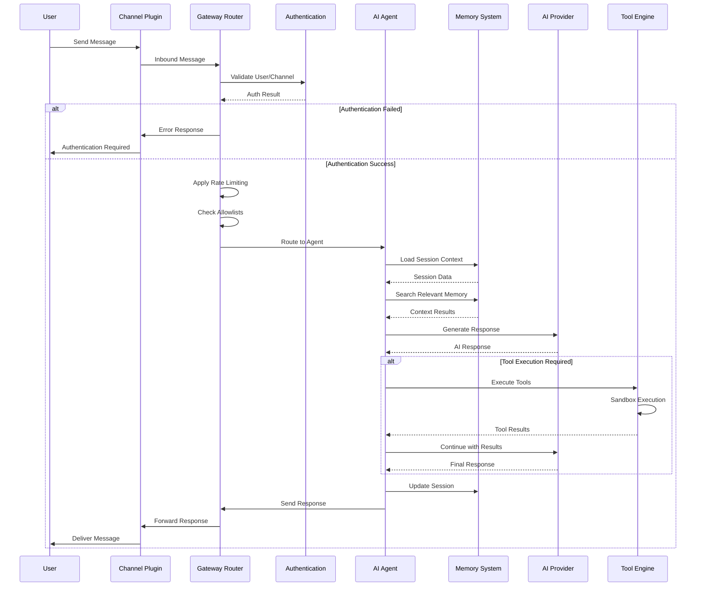

# Message Routing Data Flow

## Overview

This document describes how messages flow through the OpenClaw system from external channels to AI agents and back to users.

## Message Processing Pipeline



## Inbound Message Flow

### 1. Channel Input Processing
```
Raw Platform Message → Channel Normalization → Common Format
```

**Steps:**
1. **Platform-Specific Reception**: Each channel plugin receives messages in native format
2. **Format Normalization**: Convert to OpenClaw's common message format
3. **Validation**: Ensure message meets basic requirements
4. **Media Processing**: Download and stage media attachments

### 2. Gateway Routing
```
Normalized Message → Authentication → Rate Limiting → Allowlist Check → Agent Selection
```

**Routing Criteria:**
- Channel-specific routing rules
- User/group allowlists and blocklists
- Rate limiting per user/channel
- Agent availability and load
- Message content patterns

### 3. Agent Processing
```
Agent Request → Session Loading → Memory Retrieval → AI Processing → Tool Execution → Response Generation
```

**Processing Steps:**
- Load conversation session and context
- Query memory system for relevant information
- Prepare prompt with context and memory
- Call AI provider with failover support
- Execute any requested tools in sandbox
- Generate final response

## Outbound Message Flow

### 1. Response Formatting
```
Agent Response → Platform Formatting → Constraint Application → Media Processing
```

**Formatting Steps:**
- Adapt content for target platform (message length, formatting)
- Apply platform-specific constraints
- Process media attachments
- Add platform-specific metadata

### 2. Delivery Tracking
```
Formatted Message → Channel Delivery → Delivery Confirmation → Status Tracking
```

## Error Handling Flow

### Authentication Errors
```
Auth Failure → Error Response → User Notification → Retry/Recovery
```

### Rate Limiting
```
Rate Exceeded → Delay/Queue → Retry Logic → Success/Failure
```

### Agent Failures
```
Agent Error → Fallback Agent → Error Recovery → User Notification
```

### Tool Execution Errors
```
Tool Failure → Sandbox Cleanup → Error Report → Graceful Degradation
```

## Message Types and Routing

### Direct Messages
- Route to user's default agent
- Apply user-specific preferences
- Full context and memory access

### Group Messages
- Check mention patterns
- Apply group-specific rules
- Limited context sharing

### Command Messages
- Parse command syntax
- Route to appropriate handlers
- Execute privileged operations

### Media Messages
- Stage media files securely
- Extract metadata and content
- Process through appropriate handlers

## Performance Optimizations

### Caching
- Session data caching
- Memory query caching
- AI response caching for common queries

### Batching
- Embedding generation batching
- Database operation batching
- AI API request batching

### Streaming
- Real-time response streaming
- Progressive message delivery
- Incremental tool output

This data flow ensures efficient, secure, and reliable message processing across all supported communication channels.