# Session Lifecycle Architecture Diagram

## Complete System Architecture (Phase-Based View)

```mermaid
flowchart TB
    subgraph Phase1["📨 Phase 1: Message Routing"]
        direction TB
        User([User])
        subgraph Channels["Communication Channels"]
            TG[Telegram]
            DC[Discord]
            WA[WhatsApp]
            WC[Webchat]
        end
        
        BMC["buildTelegramMessageContext()
        ─────────────────
        Extract: chatId, peerId,
        isGroup, threadId"]
        
        RAR["resolveAgentRoute()
        ─────────────────
        Match bindings
        Determine agentId"]
        
        BASK["buildAgentPeerSessionKey()
        ─────────────────
        Apply dmScope
        Build session key"]
        
        User --> Channels
        Channels -->|"Raw Update"| BMC
        BMC -->|"peer, channel, accountId"| RAR
        RAR -->|"agentId"| BASK
    end
    
    subgraph Phase2["💾 Phase 2: Session State Loading"]
        direction TB
        RSP["resolveStorePath()
        ─────────────────
        agentId → storePath"]
        
        LSS["loadSessionStore()
        ─────────────────
        Check cache (45s TTL)
        Read sessions.json"]
        
        CACHE[(Session Cache
        In-Memory)]
        
        STORE[(sessions.json
        Per-Agent Store)]
        
        RSP -->|"storePath"| LSS
        LSS <-->|"cache hit/miss"| CACHE
        LSS <-->|"read/write"| STORE
    end
    
    subgraph Phase3["⚙️ Phase 3: Prepare Agent"]
        direction TB
        GRC["getReplyFromConfig()
        ─────────────────
        Entry point"]
        
        ISS["initSessionState()
        ─────────────────
        Merge persisted +
        directive overrides"]
        
        RRD["resolveReplyDirectives()
        ─────────────────
        Parse /think, /model,
        /reset, /compact"]
        
        REPA["runEmbeddedPiAgent()
        ─────────────────
        Assemble params:
        model, tools, workspace"]
        
        GRC --> ISS
        ISS --> RRD
        RRD -->|"SessionState"| REPA
    end
    
    subgraph Phase4["📜 Phase 4: Load History"]
        direction TB
        ASWL["acquireSessionWriteLock()
        ─────────────────
        proper-lockfile
        Cross-process safe"]
        
        SMO["SessionManager.open()
        ─────────────────
        Open transcript file"]
        
        TRANS[(Transcript
        *.jsonl)]
        
        BSC["buildSessionContext()
        ─────────────────
        Apply compaction marker
        Inject summary"]
        
        SSH["sanitizeSessionHistory()
        ─────────────────
        Repair tool pairing
        Filter orphans
        Validate turns"]
        
        LHT["limitHistoryTurns()
        ─────────────────
        Truncate to maxTurns"]
        
        ASWL --> SMO
        SMO <-->|"read JSONL"| TRANS
        SMO --> BSC
        BSC --> SSH
        SSH --> LHT
    end
    
    subgraph Phase5["🤖 Phase 5: LLM Invocation"]
        direction TB
        CAS["createAgentSession()
        ─────────────────
        Init pi-coding-agent
        Register tools"]
        
        ASPO["applySystemPromptOverride()
        ─────────────────
        Inject workspace files:
        AGENTS.md, SOUL.md..."]
        
        SEPS["subscribeEmbeddedPiSession()
        ─────────────────
        Register event handlers"]
        
        PROMPT["session.agent.prompt()
        ─────────────────
        Stream LLM response"]
        
        LLM[("LLM Provider
        ─────────────
        Claude/GPT/Gemini")]
        
        subgraph ToolLoop["Tool Use Loop"]
            TE_START["tool_execution_start
            ─────────────────
            toolName, args"]
            
            EXEC["Execute Tool
            ─────────────────
            exec, read, write,
            browser, web_search..."]
            
            TE_END["tool_execution_end
            ─────────────────
            result → LLM"]
            
            TE_START --> EXEC
            EXEC --> TE_END
        end
        
        CAS --> ASPO
        ASPO --> SEPS
        SEPS --> PROMPT
        PROMPT <-->|"stream"| LLM
        PROMPT -->|"tool_use event"| ToolLoop
        ToolLoop -->|"tool_result"| PROMPT
    end
    
    subgraph Phase6["💽 Phase 6: Persist"]
        direction TB
        AM["appendMessage()
        ─────────────────
        User msg + Assistant msg
        → transcript.jsonl"]
        
        COMP{"Compaction
        Needed?
        ─────────
        tokens > 80k"}
        
        GS["generateSummary()
        ─────────────────
        Summarize older msgs
        Add marker"]
        
        USS["updateSessionStore()
        ─────────────────
        Atomic write:
        temp → rename"]
        
        AM --> COMP
        COMP -->|"Yes"| GS
        COMP -->|"No"| USS
        GS --> USS
    end
    
    subgraph Phase7["📤 Phase 7: Deliver"]
        direction TB
        FR["Format Response
        ─────────────────
        Apply markdown
        Split if needed"]
        
        SEND["Send via Channel API
        ─────────────────
        bot.api.sendMessage()"]
        
        FR --> SEND
    end
    
    %% Phase Connections
    BASK -->|"sessionKey, agentId,
    deliveryContext"| RSP
    
    LSS -->|"SessionEntry or
    undefined (new)"| GRC
    
    REPA -->|"RunParams"| ASWL
    
    LHT -->|"messages[]"| CAS
    
    PROMPT -->|"AgentRunResult:
    text, usage"| AM
    
    USS -->|"updated entry"| STORE
    USS --> FR
    
    SEND -->|"Response"| Channels
    Channels -->|"Delivered"| User

    %% Styling
    classDef phase fill:#e1f5fe,stroke:#01579b
    classDef storage fill:#fff3e0,stroke:#e65100
    classDef external fill:#f3e5f5,stroke:#7b1fa2
    
    class Phase1,Phase2,Phase3,Phase4,Phase5,Phase6,Phase7 phase
    class CACHE,STORE,TRANS storage
    class LLM,User external
```



## Data Flow Summary

```
┌─────────────────────────────────────────────────────────────────────────────┐
│                           SESSION LIFECYCLE                                  │
├─────────────────────────────────────────────────────────────────────────────┤
│                                                                             │
│  ┌──────────┐    ┌──────────┐    ┌──────────┐    ┌──────────┐             │
│  │ Phase 1  │───▶│ Phase 2  │───▶│ Phase 3  │───▶│ Phase 4  │             │
│  │ Routing  │    │ Loading  │    │ Prepare  │    │ History  │             │
│  └──────────┘    └──────────┘    └──────────┘    └──────────┘             │
│       │               │               │               │                    │
│       ▼               ▼               ▼               ▼                    │
│  sessionKey      SessionEntry    SessionState     messages[]               │
│  agentId         (or new)        directives       (sanitized)              │
│  deliveryCtx                                                               │
│                                                                             │
│                  ┌──────────┐    ┌──────────┐    ┌──────────┐             │
│                  │ Phase 5  │───▶│ Phase 6  │───▶│ Phase 7  │             │
│                  │   LLM    │    │ Persist  │    │ Deliver  │             │
│                  └──────────┘    └──────────┘    └──────────┘             │
│                       │               │               │                    │
│                       ▼               ▼               ▼                    │
│                  AgentRunResult   Updated store   Response                 │
│                  (text, usage)    + transcript    to user                  │
│                                                                             │
└─────────────────────────────────────────────────────────────────────────────┘
```

## Module Interaction Matrix

| From → To | Key Data Passed |
|-----------|-----------------|
| Channels → Routing | Raw Update (message, chat, user) |
| Routing → Loading | sessionKey, agentId, accountId |
| Loading → Prepare | SessionEntry (or undefined for new) |
| Prepare → History | RunParams (model, tools, workspace) |
| History → LLM | messages[] (sanitized, limited) |
| LLM → Persist | AgentRunResult (text, usage, toolCalls) |
| Persist → Deliver | Formatted response text |
| Deliver → Channels | API call (sendMessage) |

## Storage Touchpoints

```
~/.openclaw/sessions/
├── {agentId}/
│   ├── sessions.json          ← Phase 2 (read), Phase 6 (write)
│   │   └── { sessionKey: SessionEntry }
│   │
│   └── transcripts/
│       └── {sessionId}.jsonl  ← Phase 4 (read), Phase 6 (append)
│           ├── {"role":"user","content":"...","ts":...}
│           ├── {"role":"assistant","content":"...","usage":{...}}
│           └── {"marker":"summary","id":"...","summary":"..."}
```

## Event Flow (Phase 5 Detail)

```
┌─────────────────────────────────────────────────────────────────┐
│                    LLM Invocation Events                         │
├─────────────────────────────────────────────────────────────────┤
│                                                                  │
│   prompt() ──▶ message_start                                    │
│                    │                                             │
│                    ▼                                             │
│               message_update (streaming text)                    │
│                    │                                             │
│                    ▼                                             │
│            ┌──── tool_use detected? ────┐                       │
│            │                            │                        │
│           Yes                          No                        │
│            │                            │                        │
│            ▼                            │                        │
│   tool_execution_start                  │                        │
│            │                            │                        │
│            ▼                            │                        │
│     Execute Tool                        │                        │
│            │                            │                        │
│            ▼                            │                        │
│   tool_execution_end                    │                        │
│            │                            │                        │
│            ▼                            │                        │
│   Continue prompt() ◀──────────────────┘                        │
│            │                                                     │
│            ▼                                                     │
│       message_end                                                │
│            │                                                     │
│            ▼                                                     │
│        agent_end                                                 │
│                                                                  │
└─────────────────────────────────────────────────────────────────┘
```
