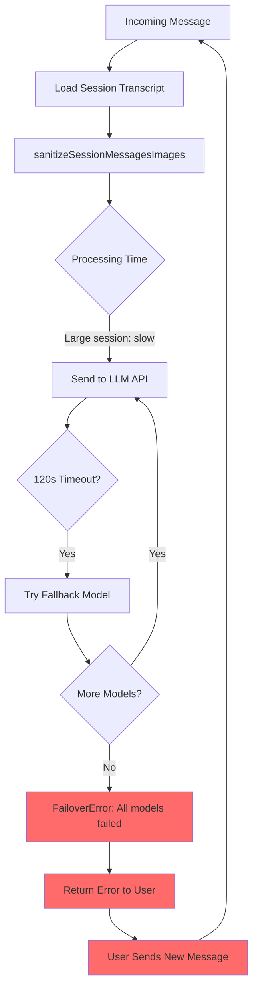

# Issue #20910: Model Timeout Death Spiral

**Issue**: [#20910 - Auto-reset session when all models time out](https://github.com/openclaw/openclaw/issues/20910)

**Severity**: 🔴 Critical — Bot becomes completely unresponsive

**Status**: ✅ PR [#20911](https://github.com/openclaw/openclaw/pull/20911) submitted (pending review)

---

## Problem Summary

When a session accumulates a very large transcript, the gateway enters an unrecoverable death spiral where every incoming message triggers timeouts across all fallback models, indefinitely.

---

## Reproduction Steps

1. Run OpenClaw with an active session over weeks/months
2. Let the session grow large (e.g., 7,000+ messages, 170k tokens, 20MB on disk)
3. Send a new message to the bloated session
4. **Expected**: Response within normal timeout, or graceful degradation
5. **Actual**: All 3 fallback models time out → error returned → next message triggers same cycle

**Observed in production**: 217 consecutive timeout retries over several hours before manual intervention.

---

## Root Cause Analysis

### Code Flow

The timeout occurs in the embedded agent run pipeline:

```
src/auto-reply/reply/agent-runner-execution.ts
  └── runAgentTurnWithFallback()
        └── runWithModelFallback() [src/agents/model-fallback.ts]
              └── runEmbeddedPiAgent() [src/agents/pi-embedded.ts]
                    └── sanitizeSessionMessagesImages() [preprocessing]
                    └── API call [times out]
```

### The Death Spiral Mechanism



### Why Auto-Recovery Doesn't Trigger

The error `"LLM request timed out"` doesn't match existing recovery checks in `agent-runner-execution.ts`:

| Recovery Check | Function | Matches Timeout? |
|----------------|----------|------------------|
| Context overflow | `isLikelyContextOverflowError()` | ❌ No — timeout ≠ overflow |
| Compaction failure | `isCompactionFailureError()` | ❌ No |
| Transient HTTP | `isTransientHttpError()` | ❌ No — timeout ≠ 5xx |
| Role ordering | Pattern check | ❌ No |

**Key Code** (`src/agents/pi-embedded-helpers/errors.ts`):

```typescript
// These patterns don't match "timed out" or "timeout"
export function isLikelyContextOverflowError(errorMessage?: string): boolean {
  // Checks for "context window", "context length", etc.
  // NOT for "timeout"
}

export function isTransientHttpError(errorMessage?: string): boolean {
  // Checks for HTTP 500, 502, 503, etc.
  // NOT for client-side timeouts
}
```

### Session Preprocessing Bottleneck

For large sessions, `sanitizeSessionMessagesImages()` iterates ALL messages and resizes images via Sharp. This can consume significant time before the API request even starts:

```
Session: 7,069 messages, 205 images
├── Image resize: ~30-60s
├── Serialization: ~10-20s  
├── Network: ~varies
└── Total: Often exceeds 120s timeout
```

---

## Impact

| Metric | Value |
|--------|-------|
| Affected users | Any with large/long-running sessions |
| Recovery | Manual only (clear session, restart gateway) |
| Detection | None — silent failure loop |
| Resource waste | 3× API calls per message × 217+ retries |

---

## Fix Proposals

### Option A: Detect All-Timeout and Auto-Reset Session

**Location**: `src/auto-reply/reply/agent-runner-execution.ts`

**Approach**: After `runWithModelFallback()` throws `FailoverError`, check if ALL attempts were timeouts. If so, auto-reset the session (similar to existing compaction failure recovery).

```typescript
// After catch block for FailoverError
if (isFailoverError(err)) {
  const allTimedOut = err.attempts.every(a => 
    isTimeoutErrorMessage(a.error) && !isRateLimitErrorMessage(a.error)
  );
  
  if (allTimedOut) {
    const didReset = await params.resetSessionAfterAllTimeouts(
      "All models timed out — session may be too large"
    );
    if (didReset) {
      // Retry with fresh session
      continue;
    }
  }
}
```

**Pros**:
- Minimal code change (~20 lines)
- Uses existing reset infrastructure
- Immediate recovery

**Cons**:
- User loses session history (but they already can't use it)
- Doesn't address root cause (preprocessing bottleneck)

---

### Option B: Add Timeout to Recovery Error Patterns

**Location**: `src/agents/pi-embedded-helpers/errors.ts`

**Approach**: Create a new detection function and add it to the recovery check chain.

```typescript
export function isAllModelsTimeoutError(errorMessage?: string): boolean {
  if (!errorMessage) return false;
  const lower = errorMessage.toLowerCase();
  return (
    (lower.includes("timed out") || lower.includes("timeout")) &&
    lower.includes("all models failed")
  );
}
```

Then in `agent-runner-execution.ts`:
```typescript
if (isAllModelsTimeoutError(err.message)) {
  await resetSession();
}
```

**Pros**:
- Follows existing pattern for error classification
- Easy to test in isolation
- Clear semantic meaning

**Cons**:
- String matching is fragile
- Still loses session history
- Doesn't prevent the timeout

---

### Option C: Preemptive Session Size Check + Compaction

**Location**: `src/auto-reply/reply/agent-runner-execution.ts` (entry point)

**Approach**: Before running the agent, check session size. If too large, trigger compaction first.

```typescript
const sessionStats = await getSessionStats(sessionKey);
if (sessionStats.messageCount > 5000 || sessionStats.sizeBytes > 10_000_000) {
  log.warn("Session too large, triggering preemptive compaction", sessionStats);
  await triggerCompaction(sessionKey, { 
    reason: "preemptive-size-limit",
    maxMessages: 1000 
  });
}
```

**Pros**:
- Prevents timeout from occurring
- Preserves context via compaction summary
- Proactive rather than reactive

**Cons**:
- More complex implementation
- Compaction itself can timeout (see #18194)
- Adds latency to every message

---

## Comparison Matrix

| Criteria | Option A | Option B | Option C |
|----------|----------|----------|----------|
| Implementation complexity | 🟢 Low | 🟢 Low | 🟡 Medium |
| Preserves context | ❌ No | ❌ No | ✅ Yes |
| Prevents timeout | ❌ No | ❌ No | ✅ Yes |
| Risk of regression | 🟢 Low | 🟢 Low | 🟡 Medium |
| User experience | 🟡 Acceptable | 🟡 Acceptable | 🟢 Good |
| Solves root cause | ❌ No | ❌ No | ✅ Yes |

---

## Recommendation

**Start with Option A**, then follow up with Option C.

**Rationale**:
1. Option A provides immediate relief with minimal risk
2. It matches the existing recovery pattern for compaction failures
3. Option C is the proper long-term fix but requires more design work
4. Users in a death spiral already can't use their session, so reset is acceptable

**Suggested Implementation Order**:
1. PR #1: Option A (immediate fix)
2. PR #2: Option C (proper fix, can take longer)

---

## Related Issues

- #18194 — Compaction timeout causes session loss
- #22506 — Session GC causes gateway crash
- #15404 — Compaction deletes active transcripts

---

## References

- `src/auto-reply/reply/agent-runner-execution.ts` — Main execution loop
- `src/agents/model-fallback.ts` — Fallback logic
- `src/agents/pi-embedded-helpers/errors.ts` — Error classification
- `src/agents/pi-embedded-helpers/images.ts` — Image sanitization
