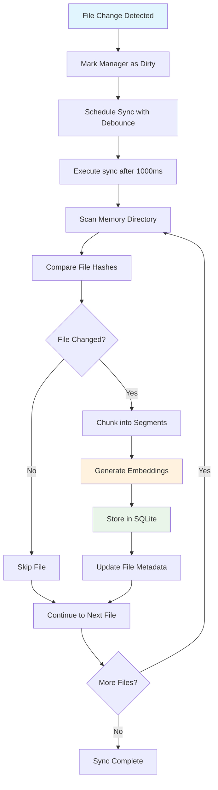

## Overview

OpenClaw uses a dual-layer memory system where human-readable markdown files in the workspace get automatically indexed into a searchable SQLite database. This document explains **when** and **how** this indexing happens.

## Memory Architecture Recap

```
Workspace Files (source)          →    SQLite Index (searchable)
~/.openclaw/workspace/            →    ~/.openclaw/memory/{agentId}.sqlite
├── MEMORY.md                     →    ├── Vector embeddings
├── memory/YYYY-MM-DD.md          →    ├── Full-text search  
├── SOUL.md                       →    └── File metadata
└── USER.md
```

## Indexing Triggers

### 1. **Agent Tool Usage** (Primary Trigger)

When AI agents use memory-related tools, the indexing system automatically starts:

```typescript
// In src/agents/tools/memory-tool.ts
const { manager } = await getMemorySearchManager({ cfg, agentId });
```

**What happens:**
- Agent invokes `memory_search` tool during conversation
- `MemoryIndexManager.get()` creates/retrieves manager instance
- Manager automatically starts file watching and syncing
- Memory files get indexed on-demand

### 2. **CLI Commands** (Manual Trigger)

Users can manually trigger indexing:

```bash
openclaw memory status --deep     # Forces sync check
openclaw memory reindex           # Full reindex
openclaw memory search "query"    # Search triggers sync if needed
```

### 3. **File System Changes** (Automatic Watching)

Once a manager is active, it watches for file changes:

```typescript
// Watched paths
const watchPaths = new Set<string>([
  path.join(this.workspaceDir, "MEMORY.md"),
  path.join(this.workspaceDir, "memory.md"), 
  path.join(this.workspaceDir, "memory"),    // Directory with daily files
  ...additionalPaths,
]);

this.watcher = chokidar.watch(Array.from(watchPaths), {
  ignoreInitial: true,
  awaitWriteFinish: {
    stabilityThreshold: this.settings.sync.watchDebounceMs, // Default: 1000ms
    pollInterval: 100,
  },
});
```

**Triggers:**
- File created (`add`)
- File modified (`change`)
- File deleted (`unlink`)

**Debouncing:** Changes are batched with 1-second delay to avoid thrashing.

## Indexing Process Flow



## Memory Manager Lifecycle

### 1. **Lazy Initialization**

Managers are created only when needed:

```typescript
// Cached instances to avoid duplication
const INDEX_CACHE = new Map<string, MemoryIndexManager>();

static async get(params: { cfg: OpenClawConfig; agentId: string }) {
  const key = `${agentId}:${workspaceDir}:${JSON.stringify(settings)}`;
  const existing = INDEX_CACHE.get(key);
  if (existing) {
    return existing;  // Return cached manager
  }
  
  // Create new manager and start watching
  const manager = new MemoryIndexManager({ ... });
  INDEX_CACHE.set(key, manager);
  return manager;
}
```

### 2. **Automatic Sync on Start**

When a manager is first created, it checks if sync is needed:

```typescript
private shouldSyncMemoryFiles(needsFullReindex = false) {
  return (
    this.sources.has("memory") && 
    (params?.force || needsFullReindex || this.dirty)
  );
}
```

### 3. **Watch Setup**

The manager automatically sets up file watching:

```typescript
private ensureWatcher() {
  // Watch key memory paths
  this.watcher = chokidar.watch(watchPaths, { ... });
  
  const markDirty = () => {
    this.dirty = true;
    this.scheduleWatchSync();  // Debounced sync
  };
  
  this.watcher.on("add", markDirty);
  this.watcher.on("change", markDirty);
  this.watcher.on("unlink", markDirty);
}
```

## File Processing Details

### 1. **File Discovery**

```typescript
// Scans workspace for memory files
const memoryFiles = await listMemoryFiles(this.workspaceDir);
```

**Discovery logic:**
- `MEMORY.md` or `memory.md` in workspace root
- All `.md` files in `memory/` subdirectory
- Additional paths from config (`extraPaths`)

### 2. **Change Detection**

```typescript
// Hash-based change detection
const currentHash = await hashFile(filePath);
const storedHash = db.prepare("SELECT hash FROM files WHERE path = ?").get(filePath);

if (currentHash !== storedHash) {
  // File changed, needs reindexing
}
```

### 3. **Text Chunking**

```typescript
// Split large files into searchable chunks
const chunks = chunkMarkdown(fileContent, {
  maxChars: 2000,        // Max chunk size
  overlapChars: 200,     // Overlap between chunks
});
```

### 4. **Vector Embedding Generation**

```typescript
// Generate embeddings for semantic search
const embedding = await this.provider.embed(chunk.text);

// Store in SQLite with sqlite-vec extension
this.db
  .prepare(`INSERT INTO vectors (id, embedding) VALUES (?, ?)`)
  .run(chunkId, vectorToBlob(embedding));
```

### 5. **Full-Text Search Indexing**

```typescript
// Store for keyword search
this.db
  .prepare(`INSERT INTO fts_index (text, id, path) VALUES (?, ?, ?)`)
  .run(chunk.text, chunkId, filePath);
```

## Configuration Control

### Memory Sync Settings

```json5
{
  "agents": {
    "defaults": {
      "memorySearch": {
        "sync": {
          "watch": true,                    // Enable file watching
          "watchDebounceMs": 1000,         // Debounce delay
        }
      }
    }
  }
}
```

### Manual Control

Users can disable automatic syncing:

```json5
{
  "memorySearch": {
    "sync": { "watch": false }
  }
}
```

Then manually sync when needed:

```bash
openclaw memory reindex --agent=myagent
```

## Performance Characteristics

### **Efficient Operations:**
- Hash-based change detection (only reindex modified files)
- Debounced file watching (batches rapid changes)
- Incremental updates (not full rebuilds)
- Cached manager instances (one per agent)

### **Resource Usage:**
- File watcher uses `chokidar` (efficient native events)
- SQLite with `sqlite-vec` extension for vector storage
- Embedding generation only for changed content
- Memory usage scales with workspace size

## Summary

**Memory indexing is triggered by:**

1. **Agent tool usage** - When AI uses `memory_search` during conversation
2. **Manual CLI commands** - User-initiated reindexing or search
3. **File system changes** - Automatic watching of workspace files

**The process is:**
- **Lazy** - Only starts when memory tools are actually used
- **Efficient** - Hash-based change detection and incremental updates  
- **Automatic** - File watching maintains sync without user intervention
- **Debounced** - Batches rapid changes to avoid performance issues

This design ensures that the SQLite search index stays synchronized with workspace memory files while minimizing resource usage and only activating when memory search functionality is actually needed.