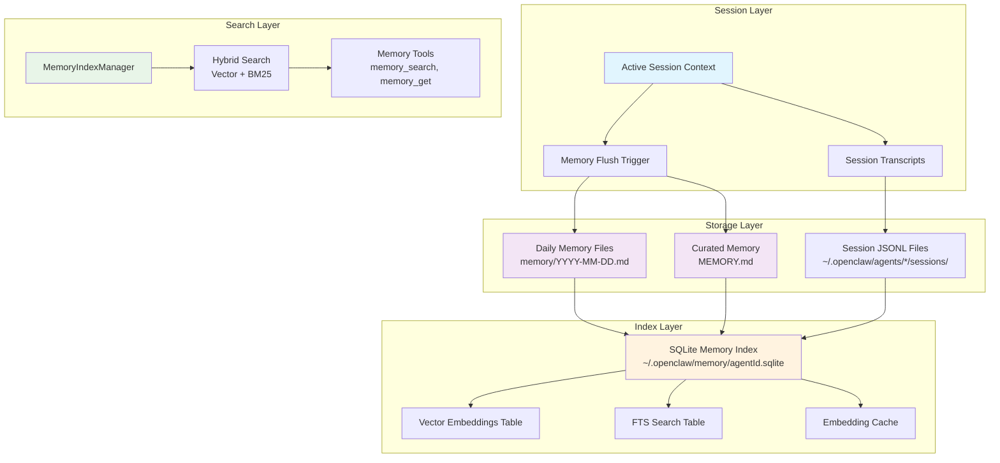
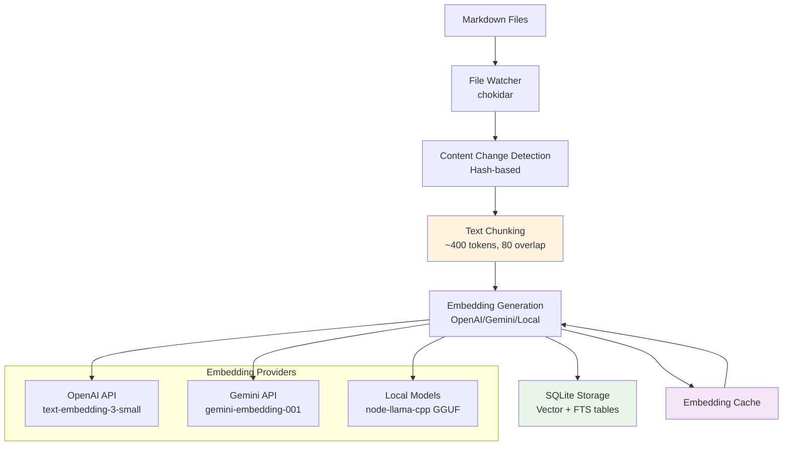
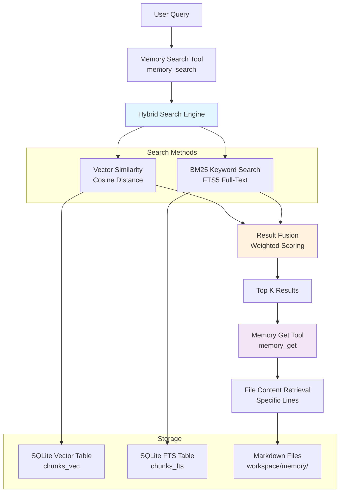
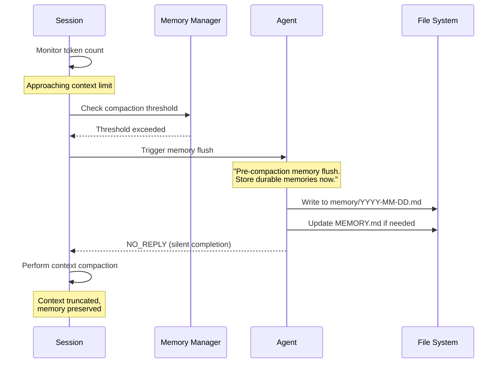
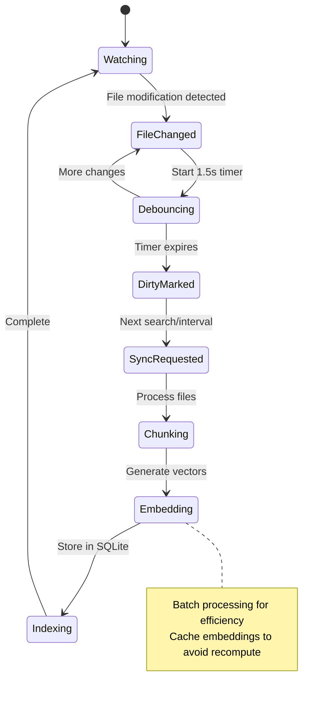

## Introduction

OpenClaw implements a sophisticated multi-layered memory system designed to bridge the gap between ephemeral session context and persistent knowledge storage. Unlike traditional chatbot systems that rely solely on context windows, OpenClaw treats memory as **plain Markdown files on disk**, making the memory system transparent, debuggable, and user-controllable.

The core philosophy is simple: *"the files are the source of truth; the model only 'remembers' what gets written to disk."* This approach enables:

- **Transparent Storage**: Memory is stored as human-readable Markdown files
- **Persistent Knowledge**: Information survives beyond session boundaries
- **Semantic Search**: Vector-based retrieval with hybrid keyword search
- **Automatic Management**: Background indexing and compaction triggers
- **Multi-Agent Sharing**: Workspace-based memory isolation per agent

## Architecture Overview

OpenClaw's memory system consists of several interconnected components:



## Memory Types & Storage Layers

### 1. Short-Term Memory (Session Context)

**Active Session Context** represents the immediate working memory - the current conversation context within the model's context window. This includes:

- Current user messages and AI responses
- Tool calls and their results
- Temporary variables and state

**Characteristics:**
- Volatile (lost when session ends or context is compacted)
- Fast access (directly in model context)
- Limited capacity (bounded by context window)
- No persistence between sessions

### 2. Long-Term Memory (Persistent Files)

OpenClaw maintains two types of persistent memory files:

#### Daily Memory Logs (`memory/YYYY-MM-DD.md`)
- **Purpose**: Append-only daily logs for running context
- **Content**: Day-to-day notes, decisions, observations
- **Auto-loading**: Today + yesterday files loaded at session start
- **Format**: Chronological Markdown entries

#### Curated Memory (`MEMORY.md`)
- **Purpose**: Hand-curated long-term knowledge
- **Content**: Important decisions, preferences, durable facts
- **Scope**: Only loaded in private sessions (not group contexts)
- **Format**: Structured Markdown with topics and sections

### 3. Session Transcripts (Experimental)

**Session JSONL Files** store complete conversation transcripts:

- **Location**: `~/.openclaw/agents/{agentId}/sessions/*.jsonl`
- **Format**: Newline-delimited JSON logs
- **Content**: Full session history including tool calls
- **Indexing**: Optional (controlled by `sources: ["memory", "sessions"]`)

## Data Flow Architecture

### Memory Ingestion Pipeline



### Search & Retrieval Flow



## Storage Organization & File System Layout

### Workspace Structure

```
~/.openclaw/
├── workspace/                    # Default agent workspace
│   ├── MEMORY.md                # Curated long-term memory
│   └── memory/                  # Daily memory logs
│       ├── 2024-01-15.md
│       ├── 2024-01-16.md
│       └── ...
├── workspace-{agentId}/         # Per-agent workspaces
│   ├── MEMORY.md
│   └── memory/
├── agents/
│   └── {agentId}/
│       ├── sessions/            # Session transcripts
│       │   ├── sessions.json    # Session metadata
│       │   ├── abc123.jsonl     # Session transcript
│       │   └── ...
│       └── agent/               # Agent-specific config
└── memory/                      # Search indices
    ├── main.sqlite              # Default agent index
    ├── {agentId}.sqlite         # Per-agent indices
    └── ...
```

### SQLite Schema

```sql
-- Memory index metadata
CREATE TABLE metadata (
  key TEXT PRIMARY KEY,
  value TEXT
);

-- Text chunks with embeddings
CREATE TABLE chunks_vec (
  id TEXT PRIMARY KEY,
  path TEXT NOT NULL,
  start_line INTEGER NOT NULL,
  end_line INTEGER NOT NULL,
  text TEXT NOT NULL,
  hash TEXT NOT NULL,
  source TEXT NOT NULL,  -- 'memory' or 'sessions'
  embedding BLOB,        -- Float32Array as blob
  updated_at REAL
);

-- Full-text search index
CREATE VIRTUAL TABLE chunks_fts USING fts5(
  id, path, text,
  content='chunks_vec',
  content_rowid='rowid'
);

-- Embedding cache
CREATE TABLE embedding_cache (
  hash TEXT PRIMARY KEY,
  provider TEXT NOT NULL,
  model TEXT NOT NULL,
  embedding BLOB NOT NULL,
  created_at REAL NOT NULL
);
```

## Memory Lifecycle & Compaction Process

### Pre-Compaction Memory Flush

OpenClaw implements an intelligent memory preservation system that triggers automatically before context compaction:



### Memory Flush Configuration

```typescript
// Default configuration
{
  agents: {
    defaults: {
      compaction: {
        reserveTokensFloor: 20000,      // Reserve space for compaction
        memoryFlush: {
          enabled: true,
          softThresholdTokens: 4000,    // Trigger 4K tokens before limit
          systemPrompt: "Pre-compaction memory flush turn.",
          prompt: "Store durable memories now; reply with NO_REPLY if nothing to store."
        }
      }
    }
  }
}
```

### Background Indexing Process



## Search & Retrieval Mechanisms

### Hybrid Search Engine

OpenClaw combines two complementary search methods:

#### 1. Vector Similarity Search
- **Method**: Cosine similarity on dense embeddings
- **Strengths**: Semantic understanding, paraphrasing
- **Example**: "Mac Studio gateway host" matches "machine running the gateway"

#### 2. BM25 Keyword Search  
- **Method**: Full-text search with term frequency scoring
- **Strengths**: Exact tokens, IDs, code symbols
- **Example**: Finds exact strings like `memorySearch.query.hybrid` or error codes

#### Result Fusion Algorithm

```typescript
// Simplified fusion logic
function mergeHybridResults(vectorResults, bm25Results, weights) {
  const { vectorWeight = 0.7, textWeight = 0.3 } = weights;
  
  for (const result of candidates) {
    const vectorScore = result.vectorScore || 0;
    const textScore = 1 / (1 + Math.max(0, result.bm25Rank || 0));
    
    result.finalScore = vectorWeight * vectorScore + textWeight * textScore;
  }
  
  return candidates.sort((a, b) => b.finalScore - a.finalScore);
}
```

### Memory Tools Interface

#### `memory_search` Tool
```typescript
// Search across indexed memory
{
  query: string;           // Natural language or keyword query
  maxResults?: number;     // Limit results (default varies)
  minScore?: number;       // Minimum relevance threshold
}

// Returns structured results
{
  results: Array<{
    path: string;          // Relative file path
    startLine: number;     // Chunk start line
    endLine: number;       // Chunk end line  
    score: number;         // Relevance score (0-1)
    snippet: string;       // Truncated content (~700 chars)
    source: "memory" | "sessions";
  }>;
  provider: string;        // Embedding provider used
  model: string;           // Model name
  fallback?: string;       // If fallback was used
}
```

#### `memory_get` Tool
```typescript
// Retrieve specific file content
{
  path: string;           // Workspace-relative path
  from?: number;          // Starting line number
  lines?: number;         // Number of lines to read
}

// Returns file content with line numbers
```

## Technical Implementation Details

### MemoryIndexManager Class

The core `MemoryIndexManager` class orchestrates all memory operations:

```typescript
class MemoryIndexManager {
  // Configuration and providers
  private readonly settings: ResolvedMemorySearchConfig;
  private provider: EmbeddingProvider;
  private db: DatabaseSync;  // SQLite database
  
  // State tracking
  private readonly sources: Set<"memory" | "sessions">;
  private dirty = false;           // Index needs rebuild
  private sessionsDirty = false;   // Session updates pending
  
  // File watching
  private watcher: FSWatcher | null;
  private sessionDeltas: Map<string, DeltaInfo>;
  
  // Core methods
  async search(query: string, options?: SearchOptions): Promise<MemorySearchResult[]>
  async sync(params?: SyncParams): Promise<void>
  private async buildIndex(): Promise<void>
  private async watchFiles(): Promise<void>
}
```

### Embedding Provider Abstraction

```typescript
interface EmbeddingProvider {
  embed(texts: string[]): Promise<EmbeddingProviderResult>;
  readonly provider: "openai" | "gemini" | "local";
  readonly model: string;
}

// Automatic provider selection
async function createEmbeddingProvider(config) {
  if (config.provider === "auto") {
    // Try local if model exists
    if (config.local?.modelPath && fileExists(config.local.modelPath)) {
      return createLocalProvider(config.local);
    }
    // Fallback to remote (OpenAI → Gemini → disabled)
    if (hasOpenAiKey(config)) return createOpenAiProvider(config);
    if (hasGeminiKey(config)) return createGeminiProvider(config);
  }
  // ... explicit provider creation
}
```

### Performance Optimizations

#### SQLite-vec Acceleration
- Uses sqlite-vec extension for fast vector operations
- Stores embeddings as `Float32Array` blobs
- Performs cosine similarity in SQLite rather than JavaScript

#### Embedding Cache
- SHA-256 hash-based cache for text chunks
- Avoids recomputing embeddings for unchanged content
- Configurable size limits (default: 50,000 entries)

#### Batch Processing
- Groups embedding requests for API efficiency
- Supports OpenAI and Gemini batch APIs
- Concurrent processing with configurable limits

#### Delta-Based Updates
- Tracks file modification times and sizes
- Only reprocesses changed content
- Debounced file watching (1.5s delay)

## Configuration Examples

### Basic Memory Search Setup

```json5
{
  agents: {
    defaults: {
      memorySearch: {
        enabled: true,
        provider: "openai",
        model: "text-embedding-3-small",
        sources: ["memory"],           // memory files only
        query: {
          hybrid: {
            enabled: true,
            vectorWeight: 0.7,
            textWeight: 0.3
          }
        }
      }
    }
  }
}
```

### Advanced Configuration with Sessions

```json5
{
  agents: {
    defaults: {
      memorySearch: {
        enabled: true,
        provider: "gemini",
        model: "gemini-embedding-001", 
        sources: ["memory", "sessions"], // Include session transcripts
        extraPaths: ["../team-docs"],    // Additional directories
        
        remote: {
          batch: { enabled: true },      // Use batch API
          apiKey: "YOUR_GEMINI_KEY"
        },
        
        cache: {
          enabled: true,
          maxEntries: 100000
        },
        
        sync: {
          watch: true,                   // File watching
          sessions: {
            deltaBytes: 100000,          // ~100KB threshold
            deltaMessages: 50            // 50 message threshold
          }
        }
      }
    }
  }
}
```

### Local Embedding Model

```json5
{
  agents: {
    defaults: {
      memorySearch: {
        enabled: true,
        provider: "local",
        fallback: "openai",              // Fallback if local fails
        
        local: {
          modelPath: "hf:ggml-org/embeddinggemma-300M-GGUF/embeddinggemma-300M-Q8_0.gguf",
          modelCacheDir: "~/.openclaw/models"
        },
        
        store: {
          vector: {
            enabled: true,               // Use sqlite-vec
            extensionPath: "/path/to/sqlite-vec.so"
          }
        }
      }
    }
  }
}
```

## Summary

OpenClaw's memory system represents a sophisticated approach to AI memory management that bridges the gap between ephemeral context and persistent knowledge. By treating memory as transparent Markdown files combined with advanced indexing and search capabilities, it provides:

1. **Transparency**: All memory is human-readable and editable
2. **Persistence**: Knowledge survives across sessions and restarts
3. **Intelligence**: Semantic search with hybrid retrieval methods
4. **Automation**: Background indexing and compaction-triggered preservation
5. **Flexibility**: Configurable providers, sources, and storage locations

This architecture enables AI agents to maintain coherent long-term memory while remaining grounded in accessible, version-controllable text files that users can inspect and modify directly.