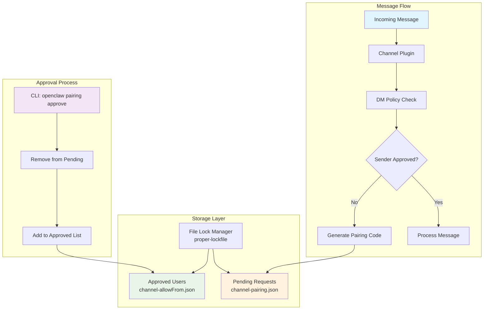
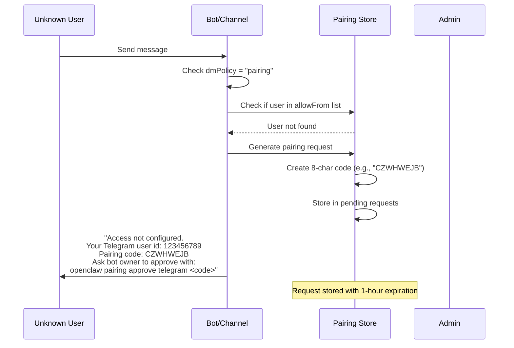
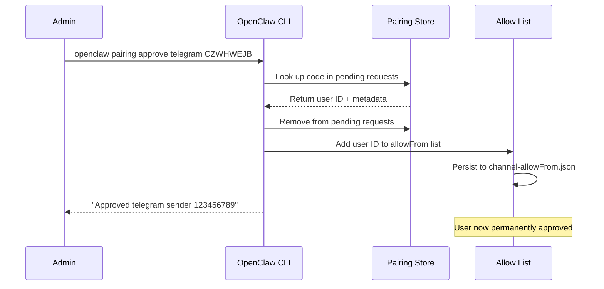
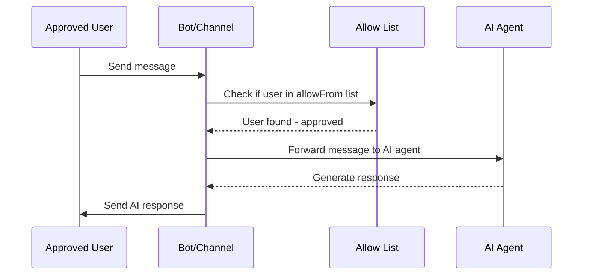
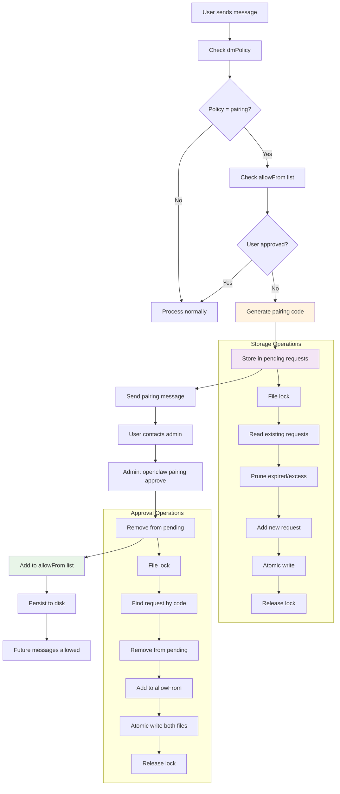

## Introduction

OpenClaw implements a sophisticated pairing mechanism as its primary security control for messaging channels. This system enforces **explicit owner approval** before unknown senders can interact with the AI assistant, preventing unauthorized access and potential prompt injection attacks.

The pairing mechanism operates on the principle of **"secure by default"** - when a channel is configured with `dmPolicy: "pairing"`, all messages from unknown senders are blocked until the bot owner manually approves them through a secure pairing process.

## Architecture Overview

OpenClaw's pairing system consists of several interconnected components:



## Pairing Flow Process

### 1. Initial Message Reception

When a new user sends a message to an OpenClaw bot:



### 2. Admin Approval Process

The bot owner approves the pairing request:



### 3. Future Message Processing

Once approved, the user can interact normally:



## Persistent Storage System

### File Structure

OpenClaw stores pairing data in the credentials directory (`~/.openclaw/credentials/`) using a two-file system:

```
~/.openclaw/credentials/
├── telegram-pairing.json       # Pending pairing requests
├── telegram-allowFrom.json     # Approved users allowlist
├── discord-pairing.json        # Per-channel storage
├── discord-allowFrom.json
└── ...
```

### Storage Schema

#### Pending Requests (`<channel>-pairing.json`)

```typescript
type PairingStore = {
  version: 1;
  requests: Array<{
    id: string;              // User ID (e.g., Telegram user ID)
    code: string;            // 8-character pairing code
    createdAt: string;       // ISO timestamp
    lastSeenAt: string;      // Last interaction timestamp
    meta?: {                 // Channel-specific metadata
      username?: string;     // Telegram username
      firstName?: string;    // User's first name
      lastName?: string;     // User's last name
    };
  }>;
};
```

#### Approved Users (`<channel>-allowFrom.json`)

```typescript
type AllowFromStore = {
  version: 1;
  allowFrom: string[];       // Array of approved user IDs
};
```

### File Operations & Security

#### Atomic File Operations

OpenClaw ensures data integrity through atomic file operations:

```typescript
async function writeJsonFile(filePath: string, value: unknown): Promise<void> {
  const dir = path.dirname(filePath);
  await fs.promises.mkdir(dir, { recursive: true, mode: 0o700 });
  
  // Write to temporary file first
  const tmp = path.join(dir, `${path.basename(filePath)}.${crypto.randomUUID()}.tmp`);
  await fs.promises.writeFile(tmp, JSON.stringify(value, null, 2), { encoding: "utf-8" });
  await fs.promises.chmod(tmp, 0o600);  // Secure permissions
  
  // Atomic rename
  await fs.promises.rename(tmp, filePath);
}
```

#### File Locking

Concurrent access protection using `proper-lockfile`:

```typescript
const PAIRING_STORE_LOCK_OPTIONS = {
  retries: {
    retries: 10,
    factor: 2,
    minTimeout: 100,
    maxTimeout: 10_000,
    randomize: true,
  },
  stale: 30_000,
};

async function withFileLock<T>(filePath: string, fn: () => Promise<T>): Promise<T> {
  const release = await lockfile.lock(filePath, PAIRING_STORE_LOCK_OPTIONS);
  try {
    return await fn();
  } finally {
    await release();
  }
}
```

#### Security Permissions

- **Directory**: `0o700` (owner read/write/execute only)
- **Files**: `0o600` (owner read/write only)
- **Location**: `~/.openclaw/credentials/` (private credentials directory)

## Code Generation & Management

### Pairing Code Format

OpenClaw generates human-friendly pairing codes with specific characteristics:

```typescript
const PAIRING_CODE_LENGTH = 8;
const PAIRING_CODE_ALPHABET = "ABCDEFGHJKLMNPQRSTUVWXYZ23456789";
//                             ^-- No ambiguous chars: 0, O, 1, I removed

function randomCode(): string {
  let out = "";
  for (let i = 0; i < PAIRING_CODE_LENGTH; i++) {
    const idx = crypto.randomInt(0, PAIRING_CODE_ALPHABET.length);
    out += PAIRING_CODE_ALPHABET[idx];
  }
  return out;  // e.g., "CZWHWEJB"
}
```

**Design decisions:**
- **8 characters**: Balance between security and usability
- **Uppercase only**: Consistent, easy to communicate
- **No ambiguous characters**: Removes 0/O and 1/I to prevent confusion
- **Cryptographically secure**: Uses `crypto.randomInt()`

### Request Lifecycle Management

#### Automatic Expiration

```typescript
const PAIRING_PENDING_TTL_MS = 60 * 60 * 1000; // 1 hour

function isExpired(entry: PairingRequest, nowMs: number): boolean {
  const createdAt = Date.parse(entry.createdAt);
  return nowMs - createdAt > PAIRING_PENDING_TTL_MS;
}

// Automatic cleanup during operations
function pruneExpiredRequests(reqs: PairingRequest[], nowMs: number) {
  return reqs.filter(req => !isExpired(req, nowMs));
}
```

#### Request Limits

```typescript
const PAIRING_PENDING_MAX = 3; // Maximum pending requests per channel

function pruneExcessRequests(reqs: PairingRequest[], maxPending: number) {
  if (reqs.length <= maxPending) return reqs;
  
  // Keep most recent requests (by lastSeenAt)
  const sorted = reqs.toSorted((a, b) => 
    parseTimestamp(a.lastSeenAt) - parseTimestamp(b.lastSeenAt)
  );
  return sorted.slice(-maxPending);
}
```

## Channel Integration Architecture

### Plugin-Based Design

OpenClaw uses a channel-agnostic plugin system for pairing:

```typescript
interface ChannelPairingAdapter {
  normalizeAllowEntry?(entry: string): string;
  notifyApproval?(params: {
    cfg: OpenClawConfig;
    id: string;
    runtime?: RuntimeEnv;
  }): Promise<void>;
}

// Channel registration
function getPairingAdapter(channelId: ChannelId): ChannelPairingAdapter | null {
  const plugin = getChannelPlugin(channelId);
  return plugin?.pairing ?? null;
}
```

### Channel-Specific Implementations

#### Telegram Integration

Located in `src/telegram/pairing-store.ts`:

```typescript
export async function upsertTelegramPairingRequest(params: {
  chatId: string | number;
  username?: string;
  firstName?: string;
  lastName?: string;
}): Promise<{ code: string; created: boolean }> {
  return upsertChannelPairingRequest({
    channel: "telegram",
    id: String(params.chatId),
    meta: {
      username: params.username,
      firstName: params.firstName, 
      lastName: params.lastName,
    },
  });
}
```

#### Message Validation Flow

In `src/telegram/bot-message-context.ts`:

```typescript
// Check if user is approved
const allowed = effectiveDmAllow.hasWildcard || 
                (effectiveDmAllow.hasEntries && allowMatch.allowed);

if (!allowed) {
  if (dmPolicy === "pairing") {
    // Generate pairing request
    const { code, created } = await upsertTelegramPairingRequest({
      chatId: candidate,
      username: from?.username,
      firstName: from?.first_name,
      lastName: from?.last_name,
    });
    
    // Send pairing message to user
    return await sendPairingMessage(code, candidate);
  }
}
```

## Data Flow Architecture

### Complete Pairing Lifecycle



### Request Deduplication Logic

OpenClaw handles duplicate requests intelligently:

```typescript
// If user already has pending request
if (existingIdx >= 0) {
  const existing = reqs[existingIdx];
  const code = existing.code || generateUniqueCode(existingCodes);
  
  // Update lastSeenAt, preserve original createdAt
  const next: PairingRequest = {
    id,
    code,
    createdAt: existing.createdAt, // Keep original timestamp
    lastSeenAt: new Date().toISOString(), // Update activity
    meta: meta ?? existing.meta,
  };
  
  return { code, created: false }; // Same code, not newly created
}
```

## CLI Interface

### Available Commands

```bash
# List pending requests for a channel
openclaw pairing list telegram
openclaw pairing list discord
openclaw pairing list --json  # Machine-readable output

# Approve a pairing request
openclaw pairing approve telegram CZWHWEJB
openclaw pairing approve --channel telegram CZWHWEJB
openclaw pairing approve telegram CZWHWEJB --notify  # Send confirmation to user
```

### Command Implementation

Located in `src/cli/pairing-cli.ts`:

```typescript
// Approval command handler
pairing.command("approve")
  .argument("<codeOrChannel>", "Pairing code (or channel when using 2 args)")
  .argument("[code]", "Pairing code (when channel is passed as 1st arg)")
  .option("--notify", "Notify the requester on the same channel", false)
  .action(async (codeOrChannel, code, opts) => {
    const channel = parseChannel(channelRaw, channels);
    const approved = await approveChannelPairingCode({
      channel,
      code: String(resolvedCode),
    });
    
    if (!approved) {
      throw new Error(`No pending pairing request found for code: ${resolvedCode}`);
    }
    
    console.log(`Approved ${channel} sender ${approved.id}`);
    
    if (opts.notify) {
      await notifyApproved(channel, approved.id);
    }
  });
```

## Security Considerations

### Threat Model

The pairing mechanism defends against:

1. **Unauthorized Access**: Unknown users cannot interact with the bot
2. **Prompt Injection**: Malicious messages are blocked before reaching the AI
3. **Spam/DoS**: Request limits prevent abuse
4. **Data Corruption**: Atomic operations ensure consistency

### Security Features

#### Request Rate Limiting
- **Maximum 3 pending requests** per channel
- **1-hour expiration** for unused codes
- **Automatic pruning** of old/excess requests

#### Access Control
- **File permissions**: `0o600` (owner-only read/write)
- **Directory isolation**: Private credentials directory
- **Explicit approval**: No automatic or wildcard approvals

#### Code Security
- **Cryptographically secure** random generation
- **Unique codes**: Collision detection and regeneration
- **Human-friendly**: No ambiguous characters

### Operational Security

#### Monitoring & Auditing
```bash
# Review pending requests
openclaw pairing list telegram

# Check approved users
cat ~/.openclaw/credentials/telegram-allowFrom.json

# Security audit
openclaw security audit --deep
```

#### Best Practices
1. **Regular review** of approved users
2. **Monitor pairing logs** for unusual activity
3. **Backup credentials** directory securely
4. **Use `--notify` flag** to confirm approvals to users

## Integration Examples

### Custom Channel Implementation

For new channel plugins:

```typescript
// In your channel plugin
export const channelPlugin = {
  id: "mychannel",
  pairing: {
    // Optional: normalize allowlist entries
    normalizeAllowEntry: (entry: string) => entry.toLowerCase(),
    
    // Optional: notify user on approval
    notifyApproval: async ({ cfg, id }) => {
      await sendMessage(id, "You've been approved! Send me a message to get started.");
    },
  },
};

// Usage in message handler
if (dmPolicy === "pairing") {
  const { code } = await upsertChannelPairingRequest({
    channel: "mychannel",
    id: userId,
    meta: { /* channel-specific data */ },
  });
  
  await sendPairingMessage(userId, code);
}
```

### Configuration Integration

The pairing system respects channel configuration:

```json5
{
  "channels": {
    "telegram": {
      "enabled": true,
      "dmPolicy": "pairing",        // Enable pairing for DMs
      "groupPolicy": "allowlist",   // Different policy for groups
      "allowFrom": ["123456789"],   // Pre-approved users
      "groupAllowFrom": ["@mygroup"] // Pre-approved groups
    }
  }
}
```

## Summary

OpenClaw's pairing mechanism provides a robust, secure foundation for access control in messaging channels. Key strengths include:

1. **Security-First Design**: Explicit approval required, no bypasses
2. **Persistent Storage**: Reliable file-based storage with atomic operations
3. **User-Friendly**: Human-readable codes and clear approval process
4. **Scalable Architecture**: Plugin-based system supports multiple channels
5. **Operational Clarity**: Simple CLI interface for management
6. **Automatic Maintenance**: Self-cleaning expired and excess requests

This system ensures that OpenClaw bots remain secure while providing a smooth approval experience for legitimate users. The combination of temporary pairing codes and permanent allowlists creates an effective balance between security and usability.