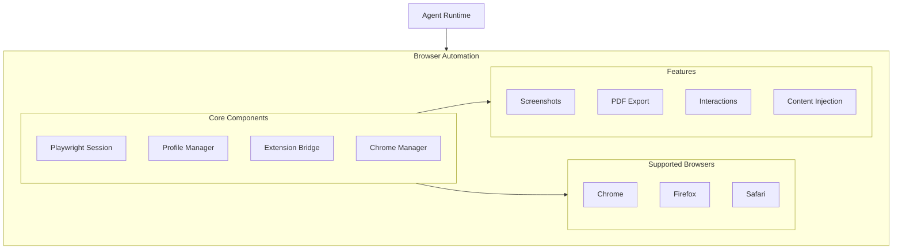
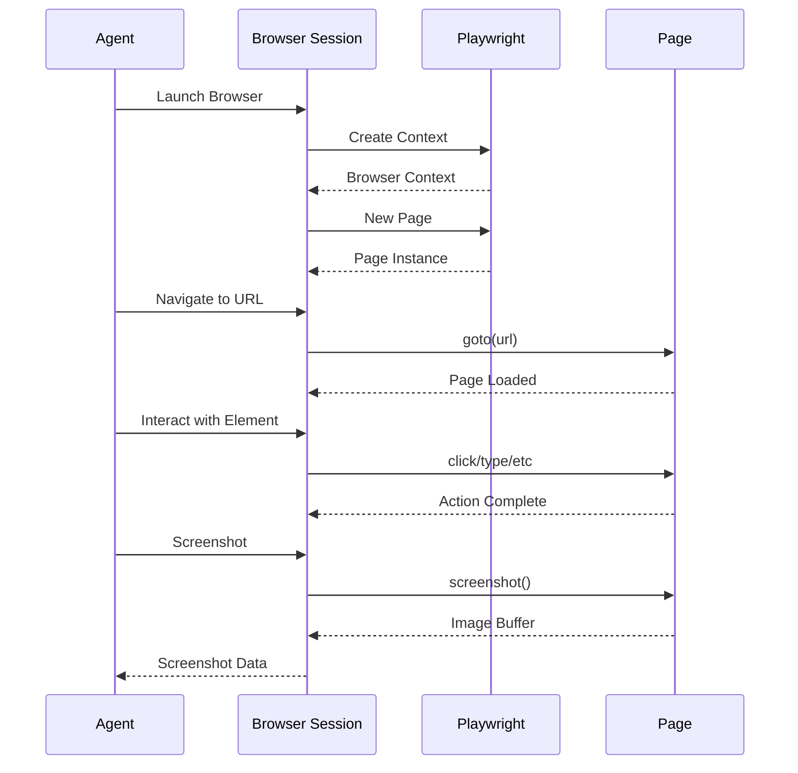
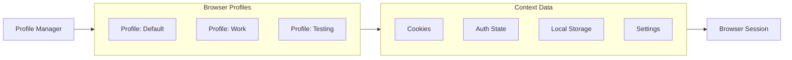
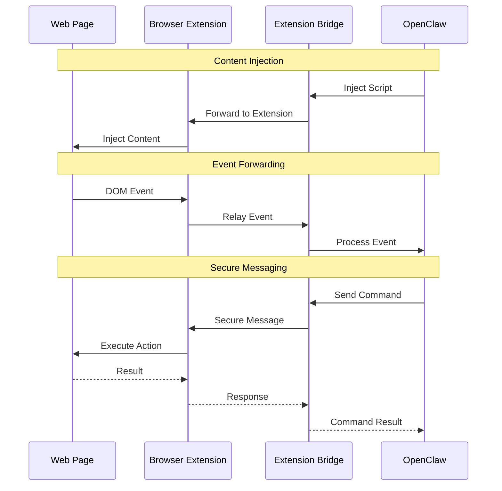
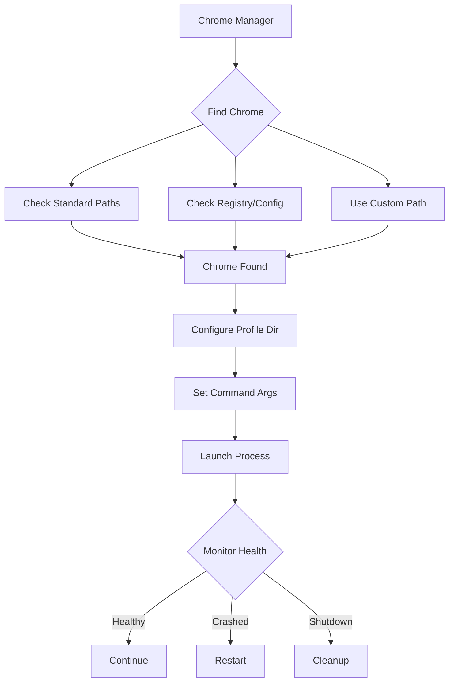
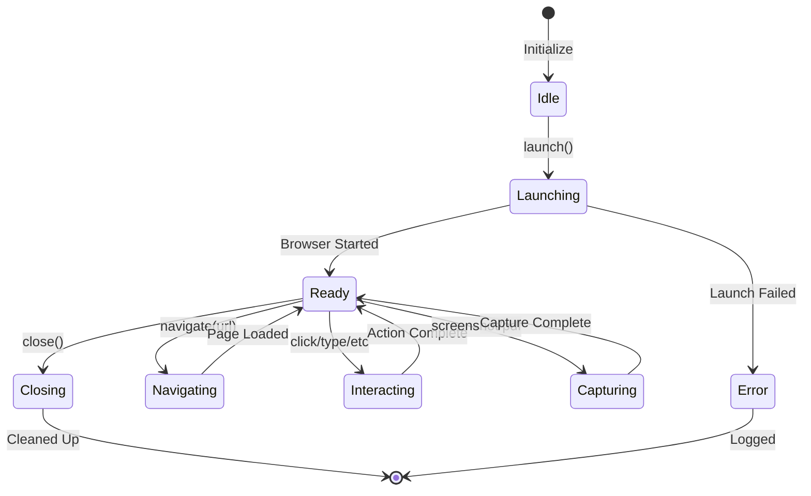

## Overview

The Browser Automation component provides web automation capabilities using Playwright, enabling AI agents to interact with web pages, manage browser profiles, and bridge web content with OpenClaw functionality.

**Location:** `src/browser/`

## Architecture



## Core Features

### 1. Playwright Integration (`src/browser/pw-session.ts`)



- Cross-browser support (Chrome, Firefox, Safari)
- Headless and headed operation modes
- Page interaction and element manipulation
- Screenshot and PDF generation

### 2. Profile Management (`src/browser/profiles.ts`)



- Isolated browser contexts
- Session persistence across runs
- Cookie and authentication management
- Profile-specific configurations

### 3. Extension Bridge (`src/browser/extension-relay.ts`)



- Communication with browser extensions
- Web page content injection
- Real-time event forwarding
- Secure message passing

### 4. Chrome Management (`src/browser/chrome.ts`)



- Chrome executable detection
- Profile directory management
- Command-line argument configuration
- Process lifecycle management

## Browser Session Lifecycle



## Implementation

```typescript
interface BrowserConfig {
  headless: boolean;
  viewport: { width: number; height: number; };
  timeout: number;
  userAgent?: string;
  proxy?: ProxyConfig;
  extensions?: string[];
}

class BrowserSession {
  async launch(config: BrowserConfig): Promise<Browser>
  async createPage(): Promise<Page>
  async navigate(url: string): Promise<void>
  async screenshot(options?: ScreenshotOptions): Promise<Buffer>
  async close(): Promise<void>
}
```

This component enables sophisticated web automation tasks, from simple page interactions to complex workflow automation.