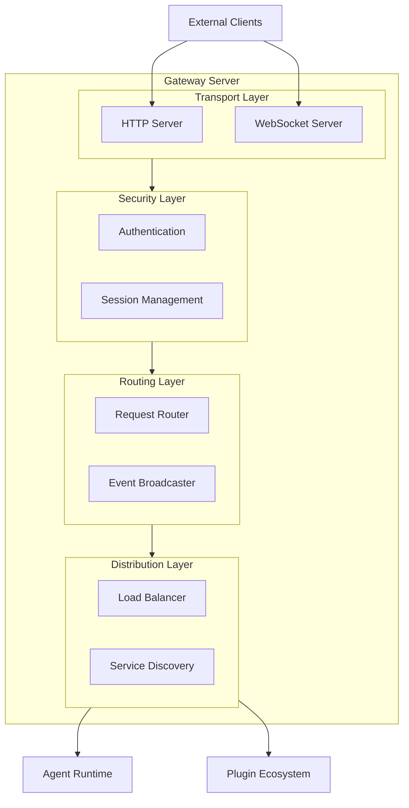
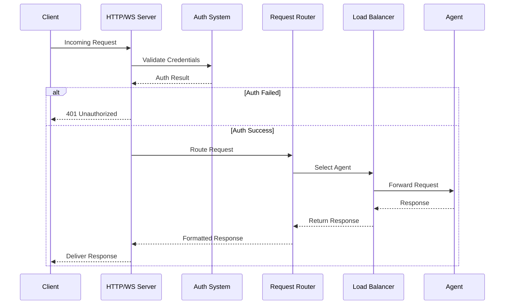
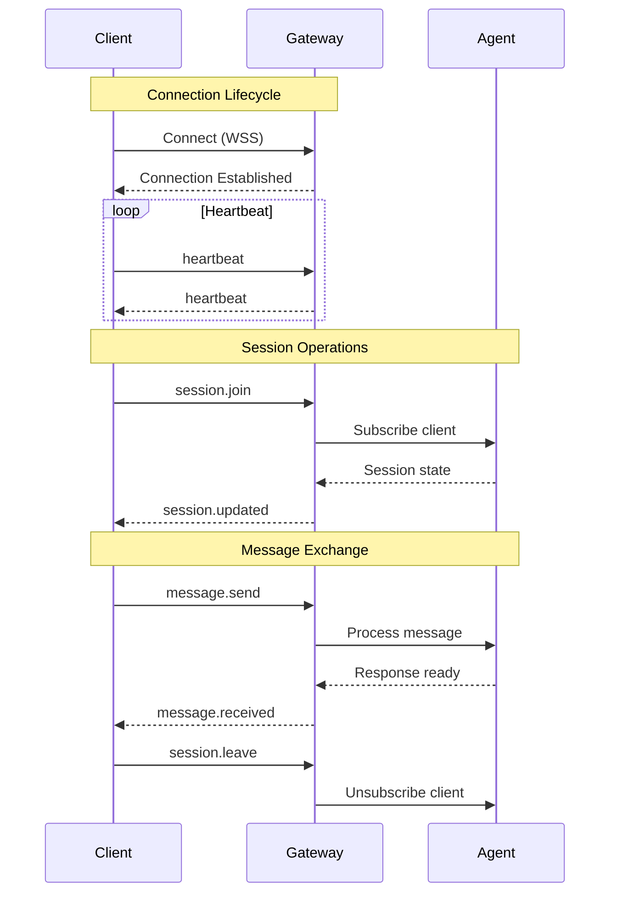

## Overview

The Gateway Server is the central hub of the OpenClaw platform, serving as the primary entry point for all client interactions and orchestrating communication between various system components.

**Location:** `src/gateway/`

## Core Responsibilities

1. **HTTP/WebSocket API Server**: Provides RESTful endpoints and real-time communication
2. **Authentication & Authorization**: Manages device pairing and access control
3. **Request Routing**: Routes messages to appropriate agents and services
4. **Load Balancing**: Distributes load across multiple agent instances
5. **Service Discovery**: Coordinates with distributed nodes and services
6. **Event Broadcasting**: Real-time event distribution to connected clients

## Architecture



### Request Processing Flow



## Key Components

### 1. HTTP/WebSocket Server (`src/gateway/server.ts`)

```typescript
// Core server implementation
interface GatewayServerOptions {
  port: number;
  host: string;
  auth: AuthConfig;
  cors: CorsConfig;
  rateLimit: RateLimitConfig;
}

class GatewayServer {
  async start(options: GatewayServerOptions): Promise<void>
  async stop(): Promise<void>
  handleRequest(req: Request): Promise<Response>
  handleWebSocket(ws: WebSocket): void
}
```

**Features:**
- RESTful API endpoints for all OpenClaw operations
- WebSocket support for real-time communication
- CORS handling for web client support
- Rate limiting and DDoS protection
- Graceful shutdown with connection draining

### 2. Authentication System (`src/gateway/auth.ts`)

```typescript
interface AuthenticationResult {
  success: boolean;
  deviceId?: string;
  permissions: Permission[];
  session: Session;
}

class AuthManager {
  authenticateRequest(request: Request): Promise<AuthenticationResult>
  validateSession(sessionToken: string): Promise<boolean>
  createDeviceSession(deviceInfo: DeviceInfo): Promise<Session>
  revokeSession(sessionId: string): Promise<void>
}
```

**Authentication Methods:**
- Device-based authentication with unique device IDs
- Session token validation with expiration
- OAuth integration for third-party services
- API key authentication for programmatic access

### 3. Request Router (`src/gateway/server-chat.ts`)

```typescript
interface RoutingRule {
  pattern: string;
  destination: string;
  permissions: Permission[];
  priority: number;
}

class MessageRouter {
  routeMessage(message: InboundMessage): Promise<RouteDestination>
  addRoute(rule: RoutingRule): void
  removeRoute(ruleId: string): void
  evaluateRules(message: InboundMessage): RouteDestination[]
}
```

**Routing Features:**
- Pattern-based message routing
- Priority-based rule evaluation
- Dynamic route configuration
- Failover destination support

### 4. Load Balancer (`src/gateway/server-lanes.ts`)

```typescript
interface LoadBalancerConfig {
  strategy: 'round-robin' | 'least-connections' | 'resource-based';
  healthCheck: HealthCheckConfig;
  failover: FailoverConfig;
}

class LoadBalancer {
  selectAgent(request: AgentRequest): Promise<AgentInstance>
  updateAgentHealth(agentId: string, health: HealthStatus): void
  rebalanceLoad(): void
  handleAgentFailure(agentId: string): void
}
```

**Load Balancing Strategies:**
- Round-robin distribution
- Least connections algorithm
- Resource-based selection (CPU, memory)
- Health-aware routing

### 5. Service Discovery (`src/gateway/server-discovery.ts`)

```typescript
interface ServiceNode {
  id: string;
  type: 'gateway' | 'agent' | 'plugin';
  address: string;
  port: number;
  capabilities: string[];
  health: HealthStatus;
}

class ServiceDiscovery {
  registerNode(node: ServiceNode): Promise<void>
  unregisterNode(nodeId: string): Promise<void>
  discoverNodes(nodeType?: string): Promise<ServiceNode[]>
  monitorNodeHealth(): void
}
```

**Discovery Features:**
- Automatic node registration
- Health monitoring and heartbeats
- Service capability advertisement
- Distributed node coordination

## API Endpoints

### Core Gateway Endpoints

```
GET  /api/v1/status           - Gateway health and status
POST /api/v1/auth/device      - Device registration/pairing
GET  /api/v1/auth/session     - Session validation
POST /api/v1/agents/message   - Send message to agent
GET  /api/v1/agents/sessions  - List active sessions
WS   /api/v1/events           - Real-time event stream
```

### Agent Management

```
GET    /api/v1/agents         - List available agents
POST   /api/v1/agents         - Create new agent instance
GET    /api/v1/agents/{id}    - Get agent details
DELETE /api/v1/agents/{id}    - Stop agent instance
POST   /api/v1/agents/{id}/message - Send direct message
```

### Configuration & Control

```
GET  /api/v1/config           - Get gateway configuration
POST /api/v1/config           - Update configuration
GET  /api/v1/nodes            - List discovered nodes
POST /api/v1/reload           - Reload configuration
```

## WebSocket Events



### Client → Gateway

```typescript
interface ClientEvents {
  'message.send': { agentId: string; content: string; };
  'session.join': { sessionId: string; };
  'session.leave': { sessionId: string; };
  'agent.subscribe': { agentId: string; };
  'heartbeat': { timestamp: number; };
}
```

### Gateway → Client

```typescript
interface GatewayEvents {
  'message.received': { sessionId: string; message: Message; };
  'agent.status': { agentId: string; status: AgentStatus; };
  'session.updated': { sessionId: string; updates: SessionUpdate; };
  'error': { code: string; message: string; };
  'heartbeat': { timestamp: number; };
}
```

## Security Features

```mermaid
flowchart LR
    subgraph Network["Network Security"]
        TLS["TLS 1.3"]
        HTTPS["HTTPS Only"]
        WSS["WSS"]
    end
    
    subgraph Auth["Authentication"]
        Device["Device Auth"]
        OAuth["OAuth 2.0"]
        APIKey["API Keys"]
    end
    
    subgraph Access["Access Control"]
        RBAC["Role-Based"]
        Perms["Permissions"]
        Session["Sessions"]
    end
    
    subgraph Protection["Protection"]
        Rate["Rate Limiting"]
        DDoS["DDoS Protection"]
        Valid["Validation"]
    end
    
    Client --> Network --> Auth --> Access --> Protection --> Server["Gateway Core"]
```



### 1. Authentication & Authorization

```typescript
interface SecurityConfig {
  authentication: {
    required: boolean;
    methods: ['device', 'oauth', 'apikey'];
    sessionTimeout: number;
  };
  authorization: {
    rbac: boolean;
    permissions: Permission[];
    defaultRole: string;
  };
}
```

### 2. Rate Limiting

```typescript
interface RateLimitConfig {
  requests: {
    perMinute: number;
    perHour: number;
    burst: number;
  };
  websocket: {
    connectionsPerIP: number;
    messagesPerMinute: number;
  };
}
```

### 3. Network Security

- TLS 1.3 encryption for all connections
- HTTPS-only API endpoints
- WebSocket Secure (WSS) for real-time communication
- Request/response validation and sanitization

## Performance Characteristics

### Throughput
- **HTTP Requests**: 10,000+ requests/second
- **WebSocket Messages**: 50,000+ messages/second
- **Concurrent Connections**: 10,000+ simultaneous connections

### Latency
- **API Response Time**: < 50ms median
- **WebSocket Message Latency**: < 10ms
- **Agent Routing Time**: < 5ms

### Resource Usage
- **Memory**: 100-500MB base usage
- **CPU**: 2-10% at moderate load
- **Network**: Minimal bandwidth overhead

## Monitoring & Observability

### Health Checks

```typescript
interface GatewayHealth {
  status: 'healthy' | 'degraded' | 'unhealthy';
  uptime: number;
  connections: {
    http: number;
    websocket: number;
  };
  agents: {
    total: number;
    healthy: number;
  };
  resources: {
    memory: ResourceMetrics;
    cpu: ResourceMetrics;
  };
}
```

### Metrics Collection

- Request/response metrics
- WebSocket connection metrics
- Agent performance metrics
- Resource utilization tracking
- Error rate monitoring

### Logging

```typescript
interface GatewayLog {
  level: 'debug' | 'info' | 'warn' | 'error';
  timestamp: string;
  component: string;
  message: string;
  metadata?: Record<string, any>;
  traceId?: string;
}
```

## Configuration

### Example Gateway Configuration

```yaml
gateway:
  server:
    port: 8080
    host: "0.0.0.0"
    tls:
      enabled: true
      cert: "/path/to/cert.pem"
      key: "/path/to/key.pem"
  
  authentication:
    required: true
    methods: ["device", "oauth"]
    sessionTimeout: 86400 # 24 hours
  
  rateLimit:
    requests:
      perMinute: 1000
      perHour: 10000
      burst: 100
    websocket:
      connectionsPerIP: 10
      messagesPerMinute: 100
  
  loadBalancer:
    strategy: "resource-based"
    healthCheck:
      interval: 30
      timeout: 5
      retries: 3
  
  discovery:
    enabled: true
    announceInterval: 60
    nodeTimeout: 180
```

## Error Handling

### Error Response Format

```typescript
interface ErrorResponse {
  error: {
    code: string;
    message: string;
    details?: Record<string, any>;
    timestamp: string;
    requestId: string;
  };
}
```

### Common Error Codes

- `AUTH_REQUIRED`: Authentication required
- `AUTH_INVALID`: Invalid authentication credentials
- `RATE_LIMITED`: Request rate limit exceeded
- `AGENT_UNAVAILABLE`: No available agent instances
- `INVALID_REQUEST`: Malformed request payload
- `INTERNAL_ERROR`: Internal server error

## Integration Points

### With Agent Runtime
- Direct function calls for local agents
- HTTP/gRPC for remote agents
- Shared session state management
- Event-driven communication

### With Plugin System
- Plugin registration and discovery
- Hot-reload notification
- Plugin health monitoring
- Capability advertisement

### With Storage Layer
- Session persistence
- Configuration storage
- Audit log storage
- Cache integration

## Deployment Considerations

### Development
- Single instance with hot-reload
- SQLite for local storage
- File-based configuration

### Production
- Multiple gateway instances behind load balancer
- Distributed session storage (Redis)
- External configuration management
- Comprehensive monitoring and alerting

This component serves as the foundation for all OpenClaw operations, ensuring reliable, secure, and performant communication between users and AI agents.