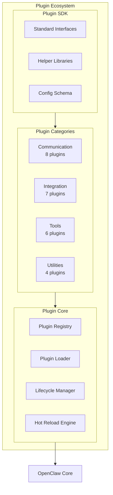
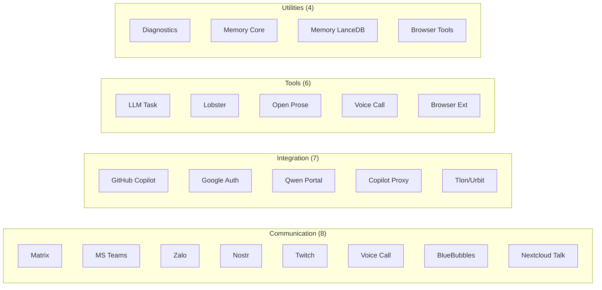
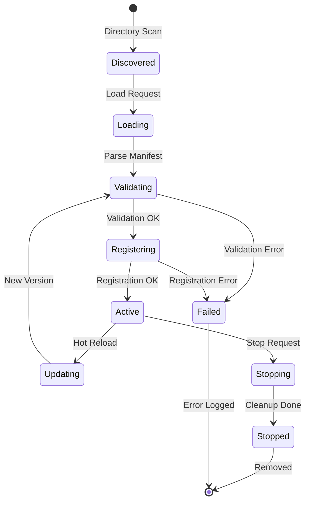
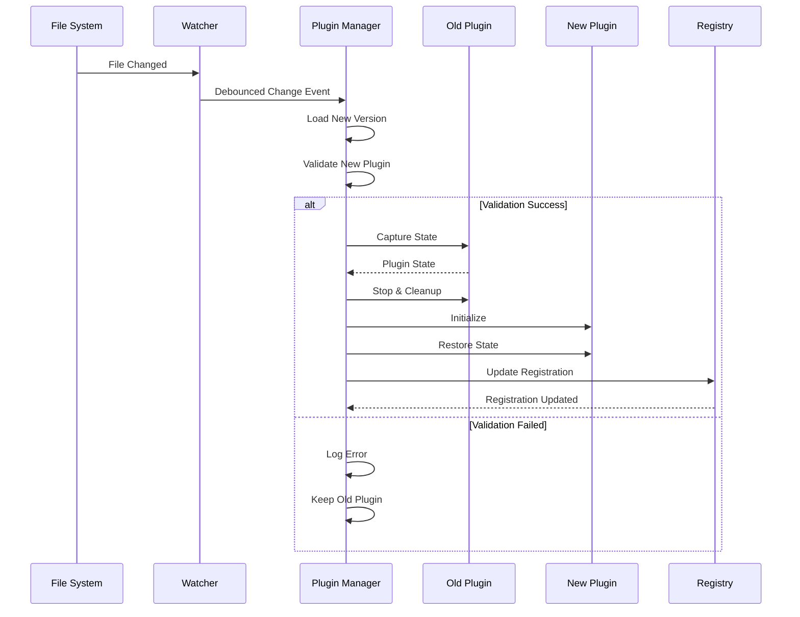
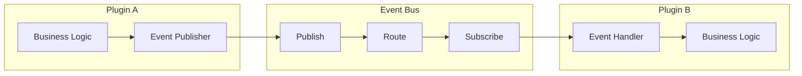

## Overview

OpenClaw's Plugin Ecosystem provides a comprehensive framework for extending functionality through hot-reloadable plugins, skills, and third-party integrations.

**Locations:** `extensions/*/`, `skills/*/`, plugin SDK

## Plugin Architecture Overview



## Plugin Categories



### 1. Communication Plugins (8)
- Matrix, MS Teams, Zalo/ZaloUser, Nostr, Twitch, Voice Call, BlueBubbles, Nextcloud Talk

### 2. Integration Plugins (7)
- GitHub Copilot, Google Auth, Qwen Portal, Copilot Proxy, Tlon/Urbit

### 3. Tool Plugins (6)
- LLM Task, Lobster, Open Prose, Voice Call, Browser Extensions

### 4. Utility Plugins (4)
- Diagnostics, Memory Core, Memory LanceDB, Browser Tools

## Plugin Lifecycle



## Plugin Architecture

```typescript
interface PluginManifest {
  id: string;
  name: string;
  version: string;
  description: string;
  author: string;
  dependencies: Record<string, string>;
  capabilities: PluginCapability[];
  entrypoint: string;
}

interface PluginCapability {
  type: 'channel' | 'tool' | 'provider' | 'skill';
  name: string;
  metadata: Record<string, any>;
}
```

## Hot Reload System



The plugin system supports runtime loading and unloading without service interruption:

```typescript
class PluginManager {
  async loadPlugin(pluginPath: string): Promise<Plugin>
  async unloadPlugin(pluginId: string): Promise<void>
  async reloadPlugin(pluginId: string): Promise<void>
  async hotSwapPlugin(oldId: string, newId: string): Promise<void>
}
```

## Inter-Plugin Communication



This ecosystem enables rapid development and deployment of new features while maintaining system stability.