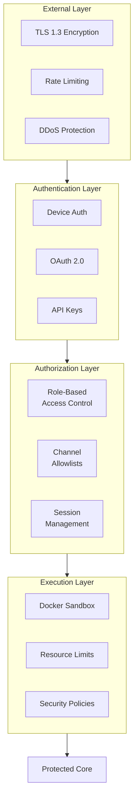
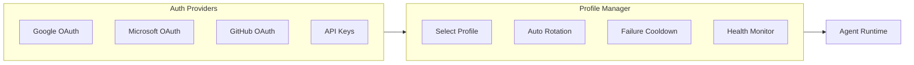
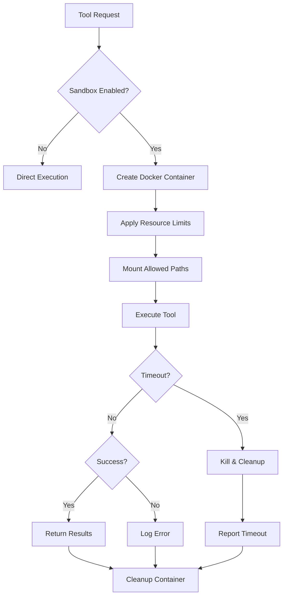
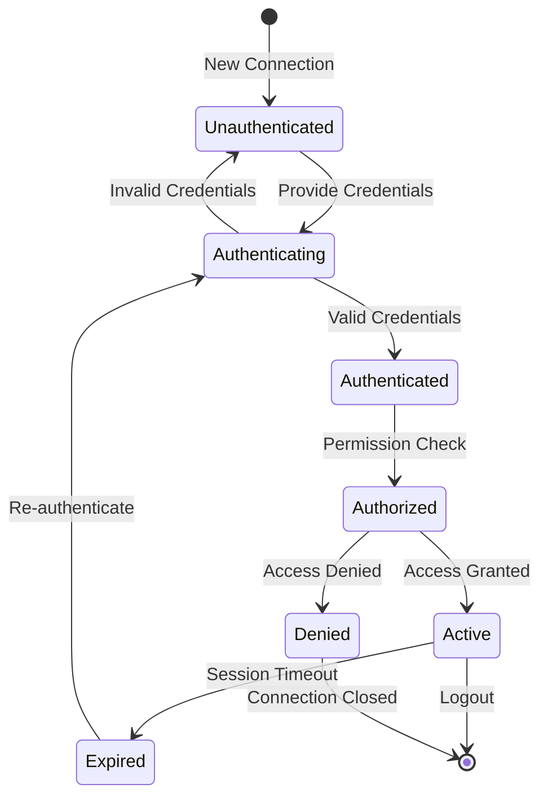
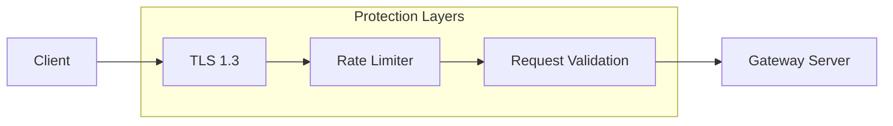
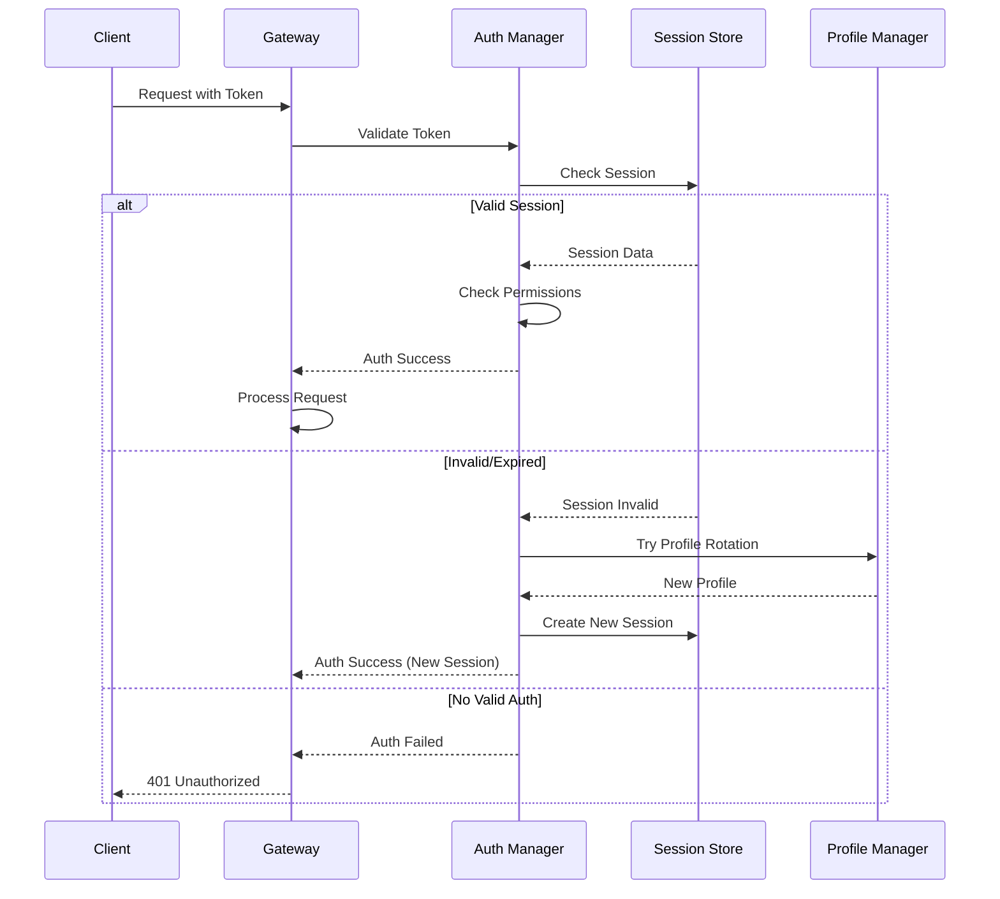

## Overview

OpenClaw's Security & Authentication system provides multi-layered protection with OAuth integration, API key management, sandboxed execution, and comprehensive access control mechanisms.

**Locations:** `src/agents/auth-profiles.ts`, `src/gateway/auth.ts`, `src/agents/sandbox.ts`

## Security Architecture



## Core Security Features

### 1. Authentication Profiles (`src/agents/auth-profiles.ts`)



- Multi-provider OAuth 2.0 flows (Google, Microsoft, GitHub)
- API key rotation and validation
- Authentication failure handling with cooldowns
- Profile health monitoring and metrics

### 2. Sandboxed Execution (`src/agents/sandbox.ts`)



- Docker-based isolation for tool execution
- Resource limits (CPU, memory, network, disk)
- Security policy enforcement
- Execution timeout and cleanup

### 3. Access Control (`src/gateway/auth.ts`)



- Role-based access control (RBAC)
- Channel-specific allowlisting
- Device authentication and pairing
- Session management with expiration

### 4. Network Security



- TLS 1.3 encryption for all connections
- HTTPS-only API endpoints
- WebSocket Secure (WSS) communication
- Rate limiting and DDoS protection

## Implementation Details

```typescript
interface SecurityConfig {
  authentication: {
    required: boolean;
    methods: ['device', 'oauth', 'apikey'];
    sessionTimeout: number;
  };
  authorization: {
    rbac: boolean;
    permissions: Permission[];
    defaultRole: string;
  };
  sandbox: {
    enabled: boolean;
    runtime: 'docker' | 'node';
    limits: ResourceLimits;
  };
}
```

## Request Authentication Flow



This component ensures OpenClaw operates securely across all deployment scenarios while maintaining usability and performance.