## Overview

This document describes how plugins are loaded, registered, executed, and managed within the OpenClaw system, including hot-reload capabilities and inter-plugin communication.

## Plugin Lifecycle

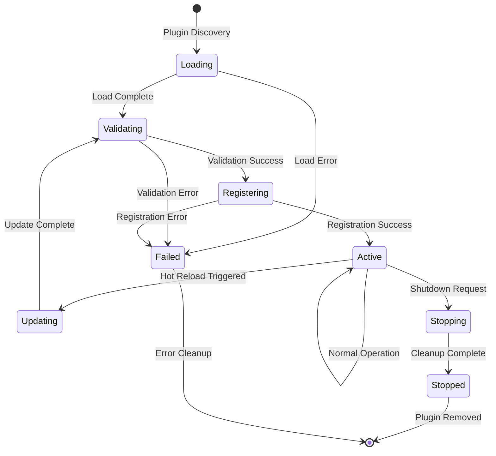

## Plugin Discovery and Loading

### 1. Discovery Process

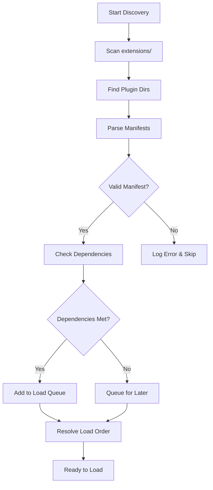

**Discovery Steps:**
1. **Directory Scanning**: Search `extensions/` for plugin directories
2. **Manifest Reading**: Parse `openclaw.plugin.json` files
3. **Dependency Validation**: Check plugin dependencies and compatibility
4. **Load Ordering**: Resolve dependency graph and determine load order

### 2. Plugin Manifest Structure
```typescript
interface PluginManifest {
  id: string;
  name: string;
  version: string;
  description: string;
  author: string;
  license: string;
  
  // Dependencies and requirements
  dependencies: {
    openclaw: string; // Semver range
    node: string;
    [packageName: string]: string;
  };
  
  // Plugin capabilities
  capabilities: {
    channels?: ChannelCapability[];
    tools?: ToolCapability[];
    providers?: ProviderCapability[];
    skills?: SkillCapability[];
  };
  
  // Entry points
  entrypoint: string;
  configSchema?: JSONSchema;
  
  // Metadata
  tags: string[];
  keywords: string[];
  homepage?: string;
  repository?: string;
}
```

## Plugin Registration Flow

### 1. Registration Process

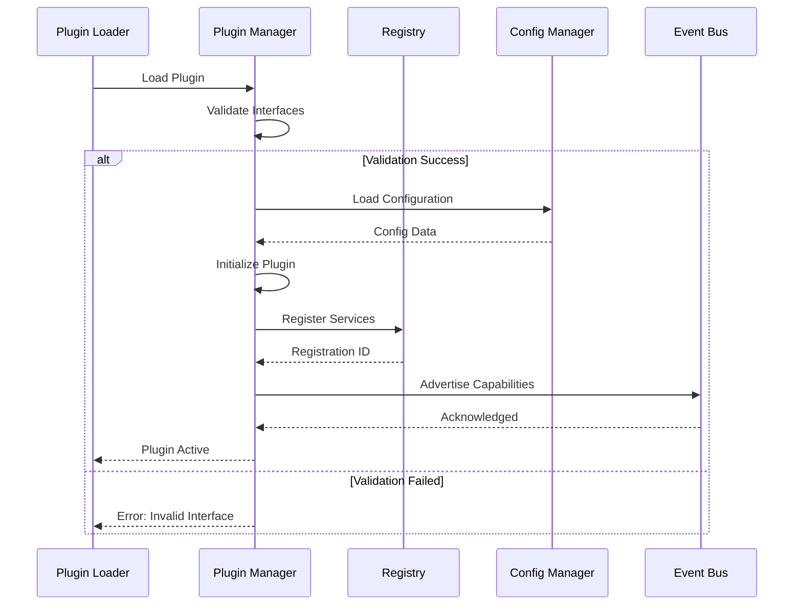

**Registration Steps:**
1. **Interface Validation**: Ensure plugin implements required interfaces
2. **Service Registration**: Register plugin services with the system
3. **Configuration Loading**: Load plugin-specific configuration
4. **Capability Advertisement**: Announce plugin capabilities to other components

### 2. Service Registration
```typescript
interface PluginServices {
  channels?: ChannelPlugin[];
  tools?: ToolPlugin[];
  providers?: ProviderPlugin[];
  hooks?: HookPlugin[];
  middleware?: MiddlewarePlugin[];
}

class PluginRegistry {
  async registerPlugin(plugin: Plugin): Promise<RegistrationResult>
  async unregisterPlugin(pluginId: string): Promise<void>
  async getPlugin(pluginId: string): Promise<Plugin | null>
  async listPlugins(): Promise<PluginInfo[]>
  async queryCapabilities(capability: string): Promise<Plugin[]>
}
```

## Hot Reload Mechanism

### 1. Hot Reload Trigger

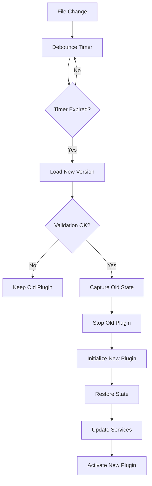

**Hot Reload Process:**
1. **Change Detection**: File system watcher detects plugin changes
2. **Debouncing**: Prevent rapid successive reloads
3. **Pre-validation**: Validate new plugin before swapping
4. **Graceful Handover**: Transfer state from old to new plugin instance
5. **Service Updates**: Update all service registrations

### 2. State Migration
```typescript
interface HotReloadContext {
  oldPlugin: Plugin;
  newPlugin: Plugin;
  preserveState: boolean;
  migrationData?: Record<string, any>;
}

interface PluginStateManager {
  captureState(plugin: Plugin): Promise<PluginState>
  restoreState(plugin: Plugin, state: PluginState): Promise<void>
  migrateState(context: HotReloadContext): Promise<MigrationResult>
}
```

## Inter-Plugin Communication

### 1. Event System

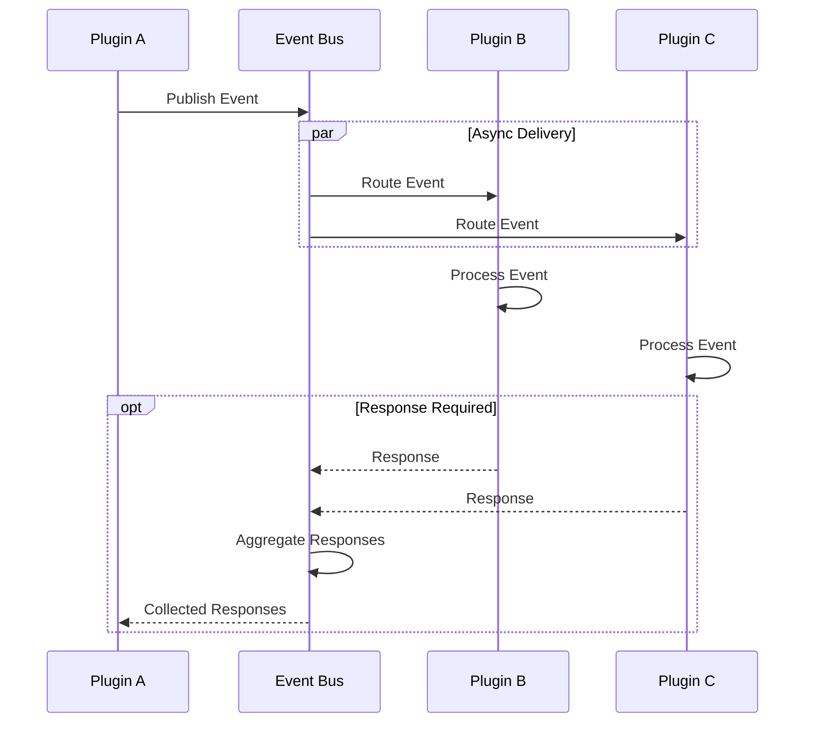

**Event Flow:**
1. **Event Publication**: Plugin publishes event to system bus
2. **Event Routing**: System routes event to subscribed plugins
3. **Event Handling**: Receiving plugins process events asynchronously
4. **Response Collection**: Optional response aggregation for coordination

### 2. Event Types
```typescript
interface PluginEvent {
  type: string;
  source: string;
  target?: string | string[];
  data: Record<string, any>;
  timestamp: Date;
  correlationId?: string;
}

interface EventBus {
  publish(event: PluginEvent): Promise<void>
  subscribe(eventType: string, handler: EventHandler): Promise<string>
  unsubscribe(subscriptionId: string): Promise<void>
  listSubscriptions(): Promise<Subscription[]>
}
```

### 3. Service Dependencies

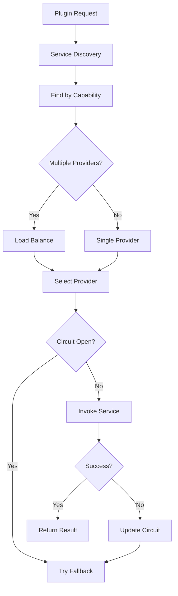

**Service Resolution:**
- Dynamic service discovery by capability
- Load balancing across multiple providers
- Failover to alternative implementations
- Circuit breaker for failing services

## Channel Plugin Integration

### 1. Channel Registration

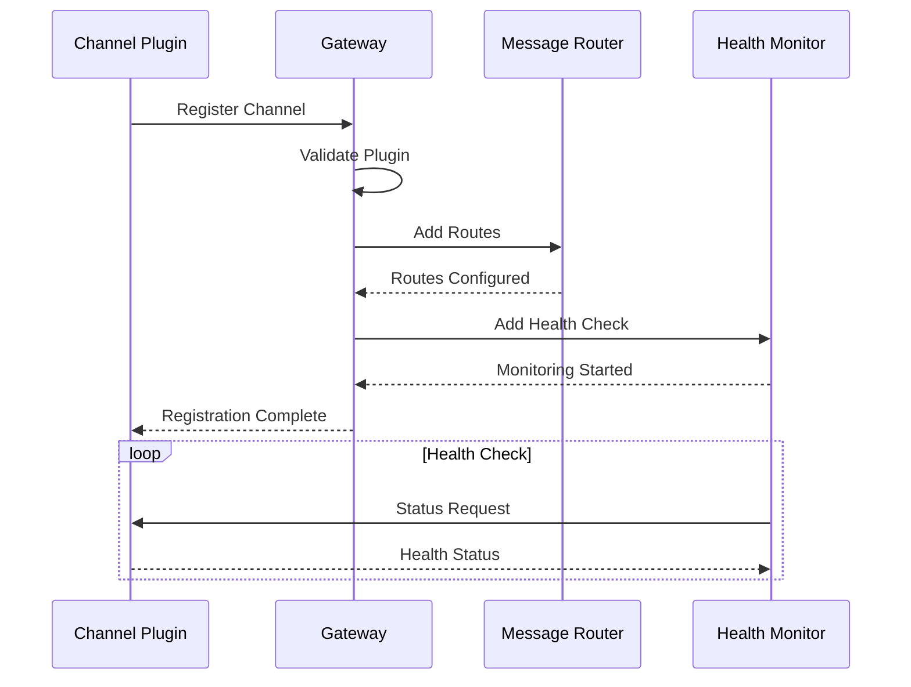

**Integration Steps:**
1. **Gateway Registration**: Register with message gateway
2. **Route Configuration**: Set up message routing rules
3. **Monitor Setup**: Start message monitoring
4. **Status Reporting**: Report channel health to system

### 2. Message Flow
```typescript
interface ChannelPlugin {
  id: string;
  meta: ChannelMeta;
  
  // Core functionality
  startMonitoring(): Promise<void>
  stopMonitoring(): Promise<void>
  sendMessage(target: MessageTarget, message: OutboundMessage): Promise<SendResult>
  
  // Event handlers
  onMessage(handler: MessageHandler): void
  onStatus(handler: StatusHandler): void
  onError(handler: ErrorHandler): void
}
```

## Tool Plugin Integration

### 1. Tool Registration

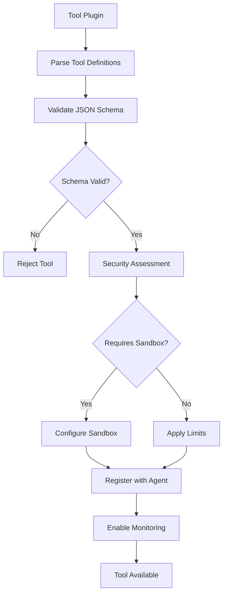

**Tool Integration:**
1. **Schema Validation**: Validate tool parameter schemas
2. **Security Assessment**: Apply security policies and sandboxing
3. **Agent Registration**: Make tools available to AI agents
4. **Execution Monitoring**: Track tool usage and performance

### 2. Tool Execution Flow
```typescript
interface ToolPlugin {
  id: string;
  tools: ToolDefinition[];
  
  // Execution
  executeTool(name: string, parameters: any, context: ToolContext): Promise<ToolResult>
  validateParameters(name: string, parameters: any): Promise<ValidationResult>
  
  // Lifecycle
  initialize(config: ToolConfig): Promise<void>
  cleanup(): Promise<void>
}
```

## Provider Plugin Integration

### 1. AI Provider Registration

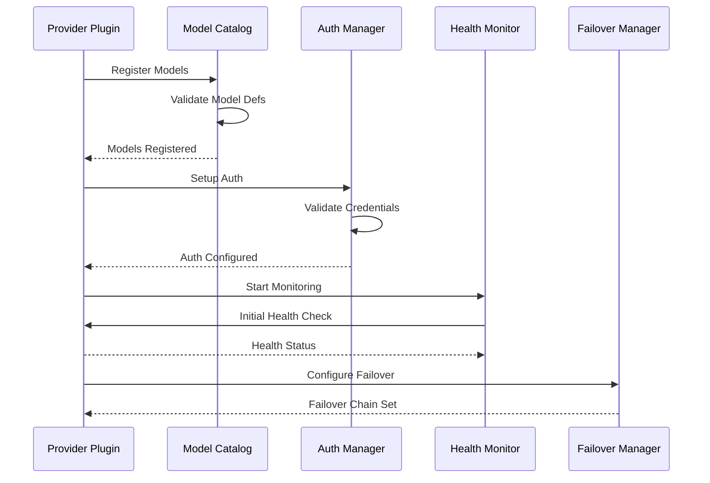

**Provider Integration:**
1. **Model Registration**: Register available models with catalog
2. **Authentication Setup**: Configure API keys and OAuth flows
3. **Health Monitoring**: Monitor provider availability and performance
4. **Failover Configuration**: Set up failover chains

### 2. Provider Interface
```typescript
interface ProviderPlugin {
  id: string;
  models: ModelDefinition[];
  
  // Core functionality
  generateResponse(request: GenerationRequest): Promise<GenerationResponse>
  streamResponse(request: GenerationRequest): AsyncGenerator<ResponseChunk>
  generateEmbeddings(texts: string[]): Promise<number[][]>
  
  // Management
  validateCredentials(): Promise<boolean>
  getUsage(): Promise<UsageMetrics>
  getHealth(): Promise<HealthStatus>
}
```

## Plugin Security and Isolation

### 1. Security Boundaries

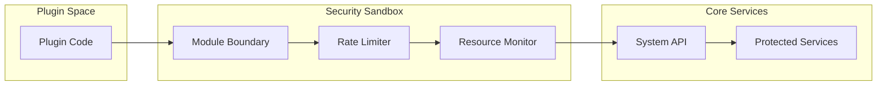

**Security Measures:**
- Code isolation through module boundaries
- API access control and rate limiting
- Resource usage monitoring and limits
- Capability-based permissions

### 2. Resource Management
```typescript
interface PluginResourceLimits {
  memory: {
    heapLimit: number;
    instanceLimit: number;
  };
  cpu: {
    timeSlice: number;
    throttleThreshold: number;
  };
  io: {
    fileAccess: string[];
    networkAccess: boolean;
    rateLimits: RateLimitConfig;
  };
}
```

## Plugin Configuration Management

### 1. Configuration Flow
```
Plugin Config → Schema Validation → Environment Integration → Runtime Application
```

**Configuration Sources:**
- Plugin-specific configuration files
- Environment variable overrides
- System-wide plugin settings
- User-specific preferences

### 2. Dynamic Configuration
```typescript
interface PluginConfigManager {
  loadConfig(pluginId: string): Promise<PluginConfig>
  updateConfig(pluginId: string, updates: Partial<PluginConfig>): Promise<void>
  validateConfig(pluginId: string, config: any): Promise<ValidationResult>
  watchConfig(pluginId: string, handler: ConfigChangeHandler): Promise<string>
}
```

## Plugin Monitoring and Analytics

### 1. Performance Metrics
```typescript
interface PluginMetrics {
  runtime: {
    uptime: number;
    restarts: number;
    errorRate: number;
    memoryUsage: number;
    cpuUsage: number;
  };
  functionality: {
    requestsHandled: number;
    averageResponseTime: number;
    successRate: number;
    cacheHitRate?: number;
  };
  integration: {
    eventsSent: number;
    eventsReceived: number;
    serviceCalls: number;
    dependencyHealth: HealthStatus[];
  };
}
```

### 2. Health Monitoring
```typescript
interface PluginHealthCheck {
  status: 'healthy' | 'degraded' | 'unhealthy';
  checks: {
    startup: boolean;
    connectivity: boolean;
    dependencies: boolean;
    resources: boolean;
  };
  metrics: PluginMetrics;
  lastCheck: Date;
  nextCheck: Date;
}
```

## Error Handling and Recovery

### 1. Plugin Failure Recovery

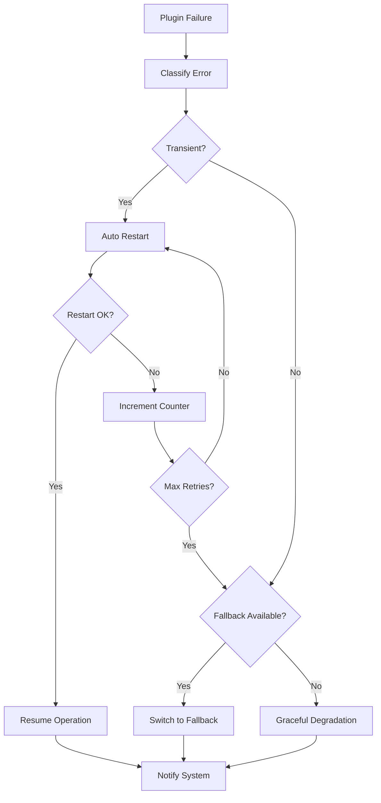

**Recovery Strategies:**
- Automatic restart for transient failures
- Fallback to alternative plugins
- Graceful degradation of functionality
- User notification for critical failures

### 2. System Resilience

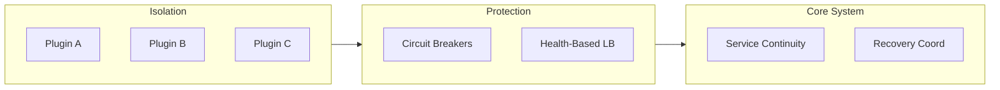

**Resilience Features:**
- Plugin failures don't affect system core
- Automatic failover to backup plugins
- Circuit breakers for failing plugins
- Health-based load balancing

This plugin integration system enables OpenClaw's extensibility while maintaining system stability, security, and performance through sophisticated lifecycle management and isolation mechanisms.