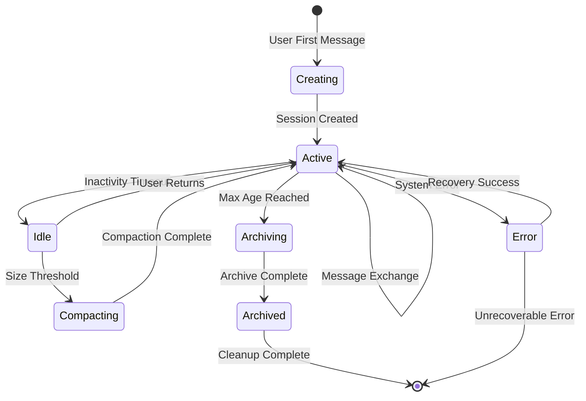
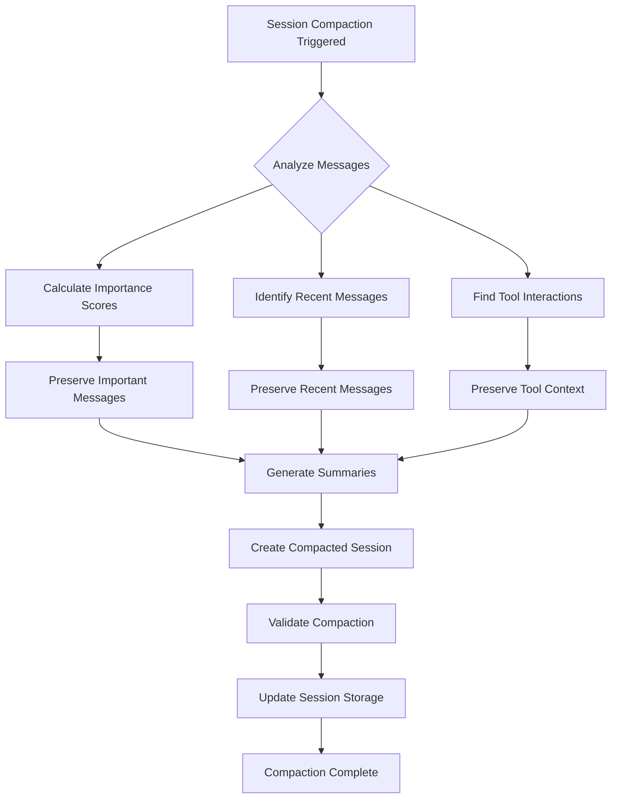

## Overview

This document describes the complete lifecycle of conversation sessions in OpenClaw, from creation to archival.

## Session Lifecycle Stages



## Session Creation Flow

### 1. Initial Message Processing
```
User Message → Channel Validation → User Identification → Agent Assignment → Session Creation
```

**Creation Steps:**
1. **User Identification**: Extract user ID from channel-specific identifier
2. **Agent Selection**: Determine appropriate agent based on channel and user preferences
3. **Session Initialization**: Create new session with unique ID and metadata
4. **Context Setup**: Initialize conversation context and user preferences
5. **Storage**: Persist session to database with initial state

### 2. Session Metadata
```typescript
interface NewSession {
  id: string;
  agentId: string;
  userId: string;
  channelId: string;
  created: Date;
  context: {
    userPreferences: UserPreferences;
    channelMetadata: ChannelMetadata;
    initialMessage: string;
  };
  state: 'active';
}
```

## Active Session Management

### Message Processing Within Session
```
Inbound Message → Session Loading → Context Assembly → AI Processing → Response Generation → Session Update
```

**Context Assembly:**
1. Load conversation history
2. Apply memory search for relevant context
3. Integrate user preferences and settings
4. Prepare comprehensive prompt context

### Memory Integration
```
Session History + External Memory + User Context → Contextualized Prompt
```

**Memory Sources:**
- Previous conversation turns
- Vector search results from knowledge base
- User-specific information and preferences
- Channel-specific context and metadata

## Session State Management

### Active State Operations
- Message append with deduplication
- Context window management
- Real-time metadata updates
- Performance metrics tracking

### Idle State Transition
```
Inactivity Detected → Idle State → Resource Cleanup → Periodic Health Checks
```

**Idle State Features:**
- Reduced memory footprint
- Periodic compaction eligibility checks
- Background optimization processes
- Quick reactivation on user return

## Session Compaction Process

### Trigger Conditions
```
Size Check → Message Count → Token Estimate → Compaction Decision
```

**Compaction Triggers:**
- Session exceeds token limit (e.g., 8000 tokens)
- Message count exceeds threshold (e.g., 100 messages)
- User-configured compaction intervals
- Manual compaction requests

### Compaction Algorithm


### Importance Scoring
```typescript
interface MessageImportance {
  score: number;
  factors: {
    userEngagement: number;
    toolUsage: number;
    errorCorrection: number;
    informationDensity: number;
    recency: number;
  };
}
```

## Memory Persistence

### Session Storage Strategy
```
Active Messages → Incremental Storage → Batch Optimization → Persistent Storage
```

**Storage Layers:**
1. **Memory Cache**: Hot session data for active conversations
2. **Local Database**: SQLite storage for session persistence
3. **Archive Storage**: Long-term storage for historical sessions
4. **Memory Index**: Vector embeddings for context retrieval

### Data Retention Policies
```typescript
interface RetentionPolicy {
  activeSessions: {
    maxAge: '7d';
    maxCount: 100;
  };
  archivedSessions: {
    maxAge: '90d';
    compressionEnabled: true;
  };
  deletedSessions: {
    gracePeriod: '30d';
    purgeSchedule: 'weekly';
  };
}
```

## Session Recovery and Error Handling

### Corruption Recovery
```
Session Corruption Detected → Backup Validation → Recovery Attempt → Manual Intervention
```

**Recovery Strategies:**
- Automatic backup restoration
- Partial session reconstruction from logs
- User notification with recovery options
- Graceful degradation with new session creation

### Failover Scenarios
```
Primary Storage Failure → Backup Storage → Read-Only Mode → Full Recovery
```

## Performance Optimization

### Session Caching
```typescript
interface SessionCache {
  activeCache: LRUCache<string, Session>; // Hot sessions
  metadataCache: Map<string, SessionMetadata>; // Lightweight metadata
  compactionQueue: Queue<string>; // Sessions awaiting compaction
}
```

### Batch Operations
- Bulk session updates
- Batched compaction processing
- Aggregated metrics collection
- Scheduled maintenance operations

### Memory Management
- Lazy loading of session history
- Streaming for large sessions
- Efficient serialization formats
- Garbage collection optimization

## Session Analytics and Monitoring

### Lifecycle Metrics
```typescript
interface SessionMetrics {
  creation: {
    rate: number;
    successRate: number;
    averageSetupTime: number;
  };
  activity: {
    averageMessageCount: number;
    averageSessionDuration: number;
    idleTime: number;
  };
  compaction: {
    frequency: number;
    compressionRatio: number;
    performanceImpact: number;
  };
  archival: {
    archivalRate: number;
    storageEfficiency: number;
    retrievalPerformance: number;
  };
}
```

### Health Monitoring
- Session creation success rates
- Compaction performance metrics
- Memory usage and optimization
- Error rates and recovery statistics

This session lifecycle management ensures efficient resource utilization while maintaining conversation quality and user experience across long-term interactions.