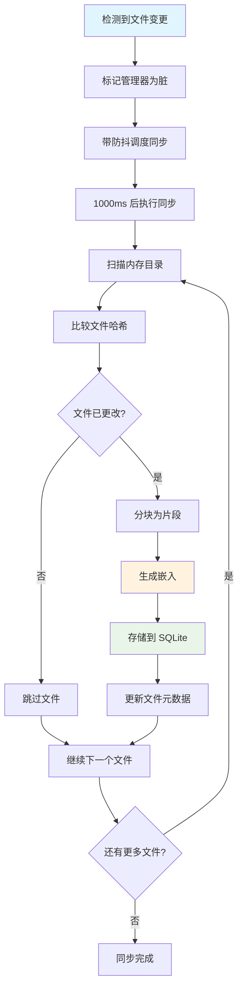

## 概述

OpenClaw 使用双层内存系统，工作区中人类可读的 Markdown 文件会自动索引到可搜索的 SQLite 数据库中。本文档解释这种索引**何时**以及**如何**发生。

## 内存架构回顾

```
工作区文件（来源）                →    SQLite 索引（可搜索）
~/.openclaw/workspace/            →    ~/.openclaw/memory/{agentId}.sqlite
├── MEMORY.md                     →    ├── 向量嵌入
├── memory/YYYY-MM-DD.md          →    ├── 全文搜索
├── SOUL.md                       →    └── 文件元数据
└── USER.md
```

## 索引触发器

### 1. **代理工具使用**（主要触发器）

当 AI 代理使用与内存相关的工具时，索引系统自动启动：

```typescript
// 在 src/agents/tools/memory-tool.ts 中
const { manager } = await getMemorySearchManager({ cfg, agentId });
```

**发生了什么：**
- 代理在对话期间调用 `memory_search` 工具
- `MemoryIndexManager.get()` 创建/检索管理器实例
- 管理器自动开始文件监视和同步
- 内存文件按需索引

### 2. **CLI 命令**（手动触发器）

用户可以手动触发索引：

```bash
openclaw memory status --deep     # 强制同步检查
openclaw memory reindex           # 完全重新索引
openclaw memory search "query"    # 搜索在需要时触发同步
```

### 3. **文件系统变更**（自动监视）

一旦管理器处于活跃状态，它就会监视文件变更：

```typescript
// 监视路径
const watchPaths = new Set<string>([
  path.join(this.workspaceDir, "MEMORY.md"),
  path.join(this.workspaceDir, "memory.md"), 
  path.join(this.workspaceDir, "memory"),    // 包含每日文件的目录
  ...additionalPaths,
]);

this.watcher = chokidar.watch(Array.from(watchPaths), {
  ignoreInitial: true,
  awaitWriteFinish: {
    stabilityThreshold: this.settings.sync.watchDebounceMs, // 默认：1000ms
    pollInterval: 100,
  },
});
```

**触发器：**
- 文件创建（`add`）
- 文件修改（`change`）
- 文件删除（`unlink`）

**防抖：** 变更以 1 秒延迟批处理，以避免抖动。

## 索引流程



## 内存管理器生命周期

### 1. **延迟初始化**

管理器仅在需要时创建：

```typescript
// 缓存实例以避免重复
const INDEX_CACHE = new Map<string, MemoryIndexManager>();

static async get(params: { cfg: OpenClawConfig; agentId: string }) {
  const key = `${agentId}:${workspaceDir}:${JSON.stringify(settings)}`;
  const existing = INDEX_CACHE.get(key);
  if (existing) {
    return existing;  // 返回缓存的管理器
  }
  
  // 创建新管理器并开始监视
  const manager = new MemoryIndexManager({ ... });
  INDEX_CACHE.set(key, manager);
  return manager;
}
```

### 2. **启动时自动同步**

当管理器首次创建时，它检查是否需要同步：

```typescript
private shouldSyncMemoryFiles(needsFullReindex = false) {
  return (
    this.sources.has("memory") && 
    (params?.force || needsFullReindex || this.dirty)
  );
}
```

### 3. **监视设置**

管理器自动设置文件监视：

```typescript
private ensureWatcher() {
  // 监视关键内存路径
  this.watcher = chokidar.watch(watchPaths, { ... });
  
  const markDirty = () => {
    this.dirty = true;
    this.scheduleWatchSync();  // 防抖同步
  };
  
  this.watcher.on("add", markDirty);
  this.watcher.on("change", markDirty);
  this.watcher.on("unlink", markDirty);
}
```

## 文件处理详情

### 1. **文件发现**

```typescript
// 扫描工作区中的内存文件
const memoryFiles = await listMemoryFiles(this.workspaceDir);
```

**发现逻辑：**
- 工作区根目录中的 `MEMORY.md` 或 `memory.md`
- `memory/` 子目录中的所有 `.md` 文件
- 来自配置的额外路径（`extraPaths`）

### 2. **变更检测**

```typescript
// 基于哈希的变更检测
const currentHash = await hashFile(filePath);
const storedHash = db.prepare("SELECT hash FROM files WHERE path = ?").get(filePath);

if (currentHash !== storedHash) {
  // 文件已更改，需要重新索引
}
```

### 3. **文本分块**

```typescript
// 将大文件分割为可搜索的块
const chunks = chunkMarkdown(fileContent, {
  maxChars: 2000,        // 最大块大小
  overlapChars: 200,     // 块之间的重叠
});
```

### 4. **向量嵌入生成**

```typescript
// 为语义搜索生成嵌入
const embedding = await this.provider.embed(chunk.text);

// 使用 sqlite-vec 扩展存储到 SQLite
this.db
  .prepare(`INSERT INTO vectors (id, embedding) VALUES (?, ?)`)
  .run(chunkId, vectorToBlob(embedding));
```

### 5. **全文搜索索引**

```typescript
// 存储用于关键词搜索
this.db
  .prepare(`INSERT INTO fts_index (text, id, path) VALUES (?, ?, ?)`)
  .run(chunk.text, chunkId, filePath);
```

## 配置控制

### 内存同步设置

```json5
{
  "agents": {
    "defaults": {
      "memorySearch": {
        "sync": {
          "watch": true,                    // 启用文件监视
          "watchDebounceMs": 1000,         // 防抖延迟
        }
      }
    }
  }
}
```

### 手动控制

用户可以禁用自动同步：

```json5
{
  "memorySearch": {
    "sync": { "watch": false }
  }
}
```

然后在需要时手动同步：

```bash
openclaw memory reindex --agent=myagent
```

## 性能特性

### **高效操作：**
- 基于哈希的变更检测（仅重新索引修改的文件）
- 防抖文件监视（批处理快速变更）
- 增量更新（不是完全重建）
- 缓存管理器实例（每个代理一个）

### **资源使用：**
- 文件监视器使用 `chokidar`（高效的原生事件）
- 带 `sqlite-vec` 扩展的 SQLite 用于向量存储
- 仅为已更改的内容生成嵌入
- 内存使用随工作区大小扩展

## 总结

**内存索引由以下触发：**

1. **代理工具使用** - 当 AI 在对话期间使用 `memory_search` 时
2. **手动 CLI 命令** - 用户发起的重新索引或搜索
3. **文件系统变更** - 工作区文件的自动监视

**该流程是：**
- **延迟的** - 仅在实际使用内存工具时才启动
- **高效的** - 基于哈希的变更检测和增量更新
- **自动的** - 文件监视无需用户干预即可保持同步
- **防抖的** - 批处理快速变更以避免性能问题

这种设计确保 SQLite 搜索索引与工作区内存文件保持同步，同时最小化资源使用，并且仅在实际需要内存搜索功能时才激活。
