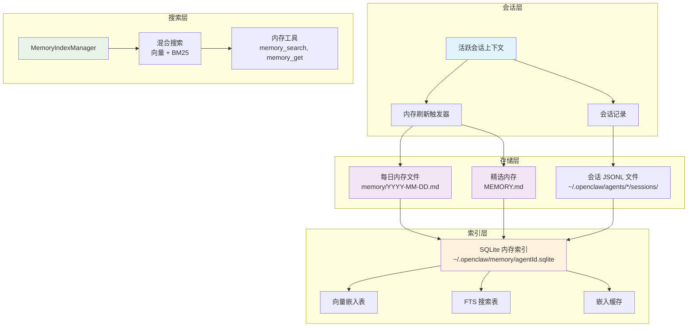
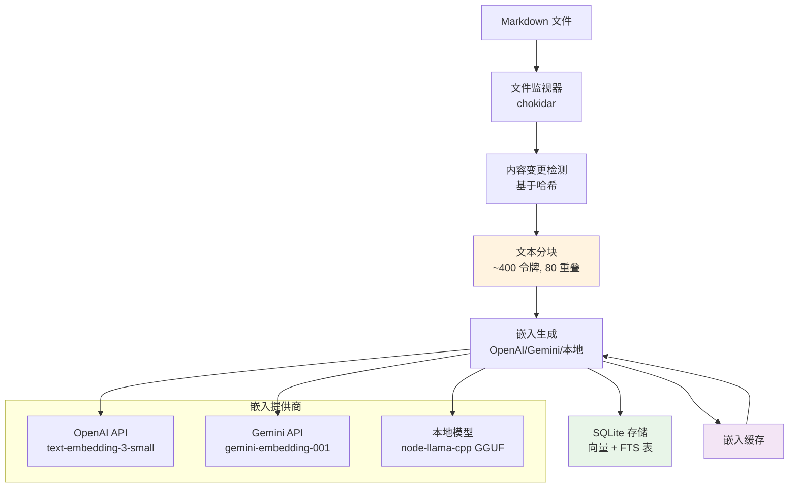
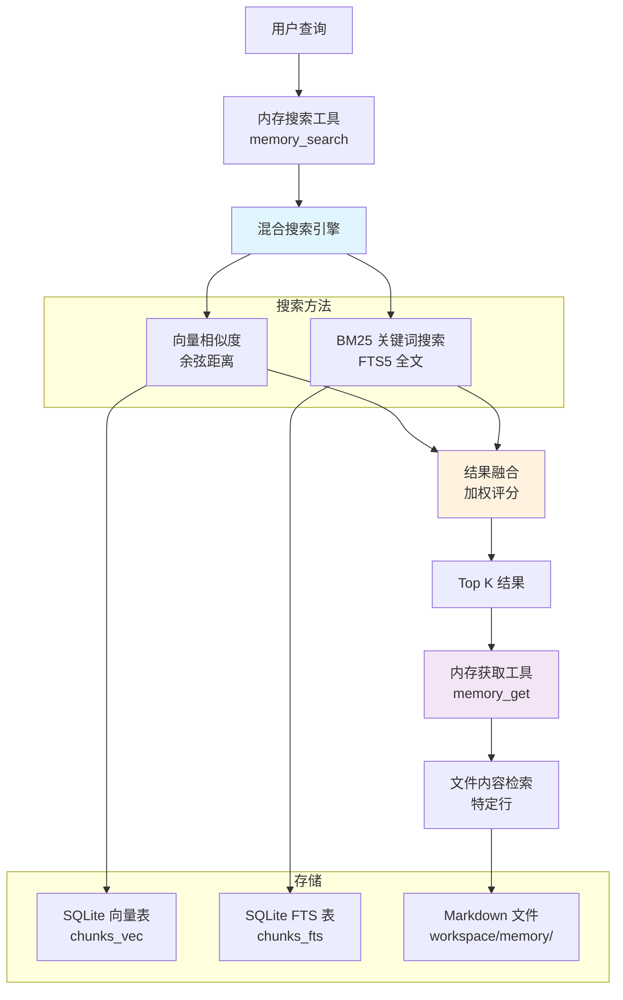
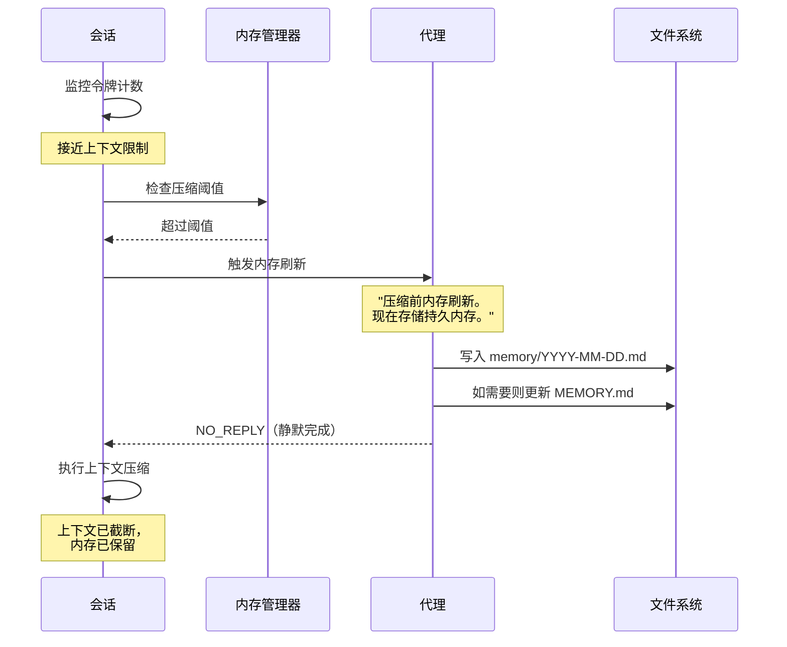
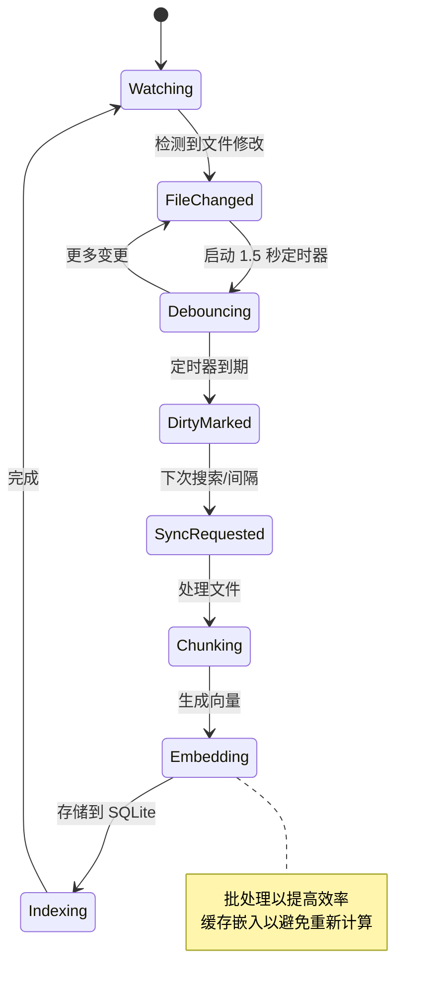

## 介绍

OpenClaw 实现了一个复杂的多层内存系统，旨在弥合临时会话上下文和持久知识存储之间的差距。与仅依赖上下文窗口的传统聊天机器人系统不同，OpenClaw 将内存视为**磁盘上的纯 Markdown 文件**，使内存系统透明、可调试且用户可控。

核心理念很简单：*"文件是真实来源；模型只'记住'写入磁盘的内容。"* 这种方法实现了：

- **透明存储**：内存以人类可读的 Markdown 文件存储
- **持久知识**：信息在会话边界之外存活
- **语义搜索**：基于向量的检索与混合关键词搜索
- **自动管理**：后台索引和压缩触发器
- **多代理共享**：每个代理基于工作区的内存隔离

## 架构概述

OpenClaw 的内存系统由几个相互连接的组件组成：



## 内存类型与存储层

### 1. 短期内存（会话上下文）

**活跃会话上下文**代表即时工作内存 - 模型上下文窗口内的当前对话上下文。这包括：

- 当前用户消息和 AI 响应
- 工具调用及其结果
- 临时变量和状态

**特性：**
- 易失性（会话结束或上下文压缩时丢失）
- 快速访问（直接在模型上下文中）
- 有限容量（受上下文窗口限制）
- 会话之间不持久

### 2. 长期内存（持久文件）

OpenClaw 维护两种类型的持久内存文件：

#### 每日内存日志 (`memory/YYYY-MM-DD.md`)
- **用途**：追加式每日日志用于运行上下文
- **内容**：日常笔记、决策、观察
- **自动加载**：会话开始时加载今天 + 昨天的文件
- **格式**：按时间顺序的 Markdown 条目

#### 精选内存 (`MEMORY.md`)
- **用途**：手动精选的长期知识
- **内容**：重要决策、偏好、持久事实
- **范围**：仅在私人会话中加载（不在群组上下文中）
- **格式**：带主题和章节的结构化 Markdown

### 3. 会话记录（实验性）

**会话 JSONL 文件**存储完整的对话记录：

- **位置**：`~/.openclaw/agents/{agentId}/sessions/*.jsonl`
- **格式**：换行分隔的 JSON 日志
- **内容**：包括工具调用的完整会话历史
- **索引**：可选（由 `sources: ["memory", "sessions"]` 控制）

## 数据流架构

### 内存摄取管道



### 搜索与检索流程



## 存储组织与文件系统布局

### 工作区结构

```
~/.openclaw/
├── workspace/                    # 默认代理工作区
│   ├── MEMORY.md                # 精选长期内存
│   └── memory/                  # 每日内存日志
│       ├── 2024-01-15.md
│       ├── 2024-01-16.md
│       └── ...
├── workspace-{agentId}/         # 每个代理的工作区
│   ├── MEMORY.md
│   └── memory/
├── agents/
│   └── {agentId}/
│       ├── sessions/            # 会话记录
│       │   ├── sessions.json    # 会话元数据
│       │   ├── abc123.jsonl     # 会话记录
│       │   └── ...
│       └── agent/               # 代理特定配置
└── memory/                      # 搜索索引
    ├── main.sqlite              # 默认代理索引
    ├── {agentId}.sqlite         # 每个代理的索引
    └── ...
```

### SQLite 表结构

```sql
-- 内存索引元数据
CREATE TABLE metadata (
  key TEXT PRIMARY KEY,
  value TEXT
);

-- 带嵌入的文本块
CREATE TABLE chunks_vec (
  id TEXT PRIMARY KEY,
  path TEXT NOT NULL,
  start_line INTEGER NOT NULL,
  end_line INTEGER NOT NULL,
  text TEXT NOT NULL,
  hash TEXT NOT NULL,
  source TEXT NOT NULL,  -- 'memory' 或 'sessions'
  embedding BLOB,        -- Float32Array 作为 blob
  updated_at REAL
);

-- 全文搜索索引
CREATE VIRTUAL TABLE chunks_fts USING fts5(
  id, path, text,
  content='chunks_vec',
  content_rowid='rowid'
);

-- 嵌入缓存
CREATE TABLE embedding_cache (
  hash TEXT PRIMARY KEY,
  provider TEXT NOT NULL,
  model TEXT NOT NULL,
  embedding BLOB NOT NULL,
  created_at REAL NOT NULL
);
```

## 内存生命周期与压缩流程

### 压缩前内存刷新

OpenClaw 实现了一个智能内存保存系统，在上下文压缩前自动触发：



### 内存刷新配置

```typescript
// 默认配置
{
  agents: {
    defaults: {
      compaction: {
        reserveTokensFloor: 20000,      // 为压缩预留空间
        memoryFlush: {
          enabled: true,
          softThresholdTokens: 4000,    // 限制前 4K 令牌触发
          systemPrompt: "Pre-compaction memory flush turn.",
          prompt: "Store durable memories now; reply with NO_REPLY if nothing to store."
        }
      }
    }
  }
}
```

### 后台索引流程



## 搜索与检索机制

### 混合搜索引擎

OpenClaw 结合了两种互补的搜索方法：

#### 1. 向量相似度搜索
- **方法**：稠密嵌入的余弦相似度
- **优势**：语义理解、释义
- **示例**："Mac Studio 网关主机"匹配"运行网关的机器"

#### 2. BM25 关键词搜索
- **方法**：带词频评分的全文搜索
- **优势**：精确令牌、ID、代码符号
- **示例**：找到精确字符串如 `memorySearch.query.hybrid` 或错误代码

#### 结果融合算法

```typescript
// 简化的融合逻辑
function mergeHybridResults(vectorResults, bm25Results, weights) {
  const { vectorWeight = 0.7, textWeight = 0.3 } = weights;
  
  for (const result of candidates) {
    const vectorScore = result.vectorScore || 0;
    const textScore = 1 / (1 + Math.max(0, result.bm25Rank || 0));
    
    result.finalScore = vectorWeight * vectorScore + textWeight * textScore;
  }
  
  return candidates.sort((a, b) => b.finalScore - a.finalScore);
}
```

### 内存工具接口

#### `memory_search` 工具
```typescript
// 搜索已索引的内存
{
  query: string;           // 自然语言或关键词查询
  maxResults?: number;     // 限制结果（默认值不同）
  minScore?: number;       // 最低相关性阈值
}

// 返回结构化结果
{
  results: Array<{
    path: string;          // 相对文件路径
    startLine: number;     // 块起始行
    endLine: number;       // 块结束行
    score: number;         // 相关性分数（0-1）
    snippet: string;       // 截断内容（~700 字符）
    source: "memory" | "sessions";
  }>;
  provider: string;        // 使用的嵌入提供商
  model: string;           // 模型名称
  fallback?: string;       // 如果使用了备用
}
```

#### `memory_get` 工具
```typescript
// 检索特定文件内容
{
  path: string;           // 工作区相对路径
  from?: number;          // 起始行号
  lines?: number;         // 要读取的行数
}

// 返回带行号的文件内容
```

## 技术实现细节

### MemoryIndexManager 类

核心 `MemoryIndexManager` 类协调所有内存操作：

```typescript
class MemoryIndexManager {
  // 配置和提供商
  private readonly settings: ResolvedMemorySearchConfig;
  private provider: EmbeddingProvider;
  private db: DatabaseSync;  // SQLite 数据库
  
  // 状态跟踪
  private readonly sources: Set<"memory" | "sessions">;
  private dirty = false;           // 索引需要重建
  private sessionsDirty = false;   // 会话更新待处理
  
  // 文件监视
  private watcher: FSWatcher | null;
  private sessionDeltas: Map<string, DeltaInfo>;
  
  // 核心方法
  async search(query: string, options?: SearchOptions): Promise<MemorySearchResult[]>
  async sync(params?: SyncParams): Promise<void>
  private async buildIndex(): Promise<void>
  private async watchFiles(): Promise<void>
}
```

### 嵌入提供商抽象

```typescript
interface EmbeddingProvider {
  embed(texts: string[]): Promise<EmbeddingProviderResult>;
  readonly provider: "openai" | "gemini" | "local";
  readonly model: string;
}

// 自动提供商选择
async function createEmbeddingProvider(config) {
  if (config.provider === "auto") {
    // 如果模型存在则尝试本地
    if (config.local?.modelPath && fileExists(config.local.modelPath)) {
      return createLocalProvider(config.local);
    }
    // 回退到远程（OpenAI → Gemini → 禁用）
    if (hasOpenAiKey(config)) return createOpenAiProvider(config);
    if (hasGeminiKey(config)) return createGeminiProvider(config);
  }
  // ... 显式提供商创建
}
```

### 性能优化

#### SQLite-vec 加速
- 使用 sqlite-vec 扩展进行快速向量操作
- 将嵌入存储为 `Float32Array` blob
- 在 SQLite 中而非 JavaScript 中执行余弦相似度

#### 嵌入缓存
- 基于 SHA-256 哈希的文本块缓存
- 避免为未更改的内容重新计算嵌入
- 可配置的大小限制（默认：50,000 条目）

#### 批处理
- 为 API 效率分组嵌入请求
- 支持 OpenAI 和 Gemini 批处理 API
- 可配置限制的并发处理

#### 基于增量的更新
- 跟踪文件修改时间和大小
- 仅重新处理已更改的内容
- 防抖文件监视（1.5 秒延迟）

## 配置示例

### 基本内存搜索设置

```json5
{
  agents: {
    defaults: {
      memorySearch: {
        enabled: true,
        provider: "openai",
        model: "text-embedding-3-small",
        sources: ["memory"],           // 仅内存文件
        query: {
          hybrid: {
            enabled: true,
            vectorWeight: 0.7,
            textWeight: 0.3
          }
        }
      }
    }
  }
}
```

### 带会话的高级配置

```json5
{
  agents: {
    defaults: {
      memorySearch: {
        enabled: true,
        provider: "gemini",
        model: "gemini-embedding-001", 
        sources: ["memory", "sessions"], // 包含会话记录
        extraPaths: ["../team-docs"],    // 额外目录
        
        remote: {
          batch: { enabled: true },      // 使用批处理 API
          apiKey: "YOUR_GEMINI_KEY"
        },
        
        cache: {
          enabled: true,
          maxEntries: 100000
        },
        
        sync: {
          watch: true,                   // 文件监视
          sessions: {
            deltaBytes: 100000,          // ~100KB 阈值
            deltaMessages: 50            // 50 消息阈值
          }
        }
      }
    }
  }
}
```

### 本地嵌入模型

```json5
{
  agents: {
    defaults: {
      memorySearch: {
        enabled: true,
        provider: "local",
        fallback: "openai",              // 本地失败时的备用
        
        local: {
          modelPath: "hf:ggml-org/embeddinggemma-300M-GGUF/embeddinggemma-300M-Q8_0.gguf",
          modelCacheDir: "~/.openclaw/models"
        },
        
        store: {
          vector: {
            enabled: true,               // 使用 sqlite-vec
            extensionPath: "/path/to/sqlite-vec.so"
          }
        }
      }
    }
  }
}
```

## 总结

OpenClaw 的内存系统代表了一种复杂的 AI 内存管理方法，弥合了临时上下文和持久知识之间的差距。通过将内存视为透明的 Markdown 文件，结合高级索引和搜索能力，它提供：

1. **透明性**：所有内存都是人类可读和可编辑的
2. **持久性**：知识在会话和重启之间存活
3. **智能性**：带混合检索方法的语义搜索
4. **自动化**：后台索引和压缩触发的保存
5. **灵活性**：可配置的提供商、来源和存储位置

这种架构使 AI 代理能够维护连贯的长期内存，同时保持基于用户可以直接检查和修改的可访问、可版本控制的文本文件。
