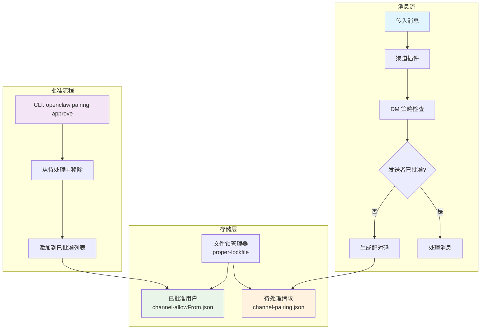
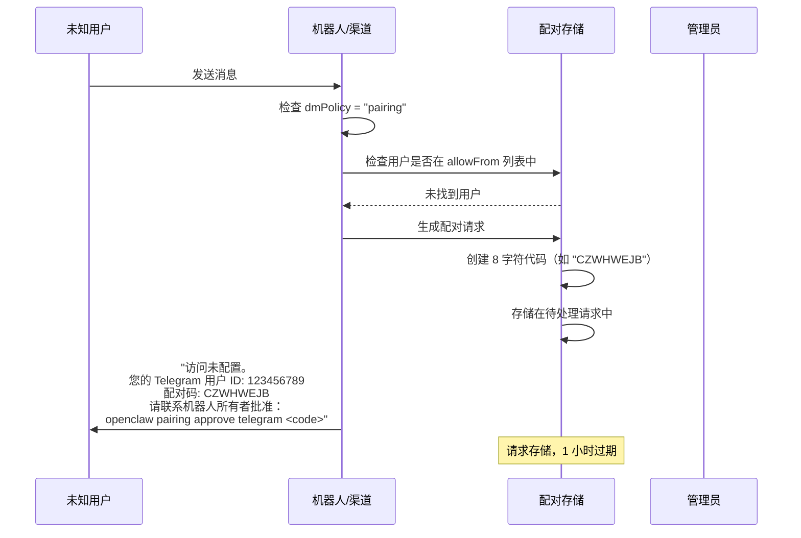
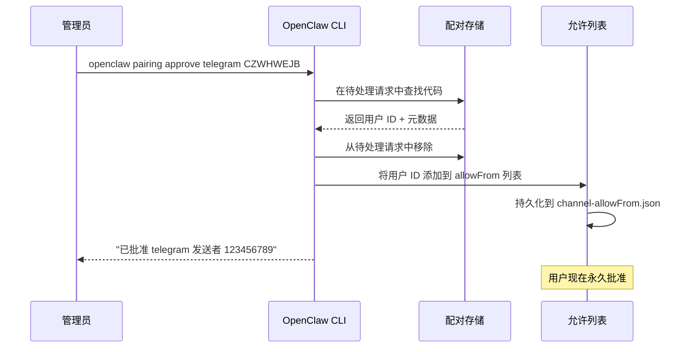
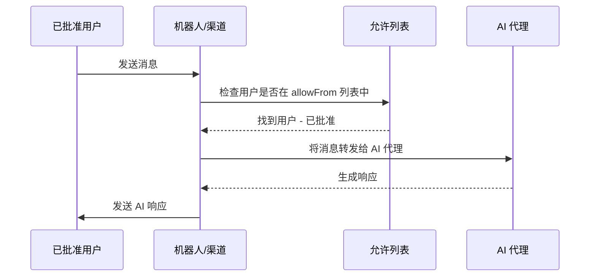
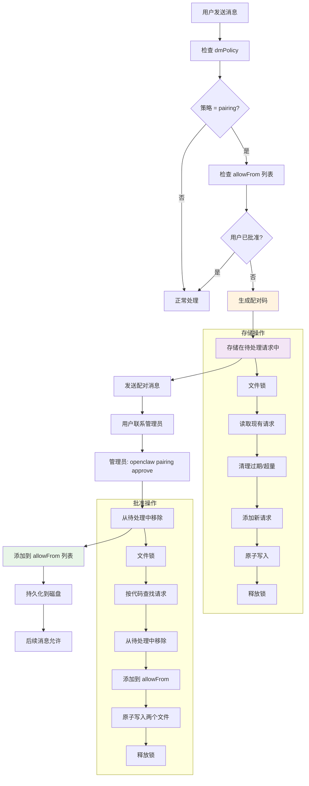

## 介绍

OpenClaw 实现了一个复杂的配对机制作为消息渠道的主要安全控制。该系统在未知发送者与 AI 助手交互之前强制执行**所有者显式批准**，防止未经授权的访问和潜在的提示注入攻击。

配对机制基于**"默认安全"**原则运作 - 当渠道配置为 `dmPolicy: "pairing"` 时，来自未知发送者的所有消息都会被阻止，直到机器人所有者通过安全的配对流程手动批准他们。

## 架构概述

OpenClaw 的配对系统由几个相互连接的组件组成：



## 配对流程

### 1. 初始消息接收

当新用户向 OpenClaw 机器人发送消息时：



### 2. 管理员批准流程

机器人所有者批准配对请求：



### 3. 后续消息处理

一旦批准，用户可以正常交互：



## 持久存储系统

### 文件结构

OpenClaw 使用双文件系统在凭证目录（`~/.openclaw/credentials/`）中存储配对数据：

```
~/.openclaw/credentials/
├── telegram-pairing.json       # 待处理配对请求
├── telegram-allowFrom.json     # 已批准用户允许列表
├── discord-pairing.json        # 每渠道存储
├── discord-allowFrom.json
└── ...
```

### 存储模式

#### 待处理请求 (`<channel>-pairing.json`)

```typescript
type PairingStore = {
  version: 1;
  requests: Array<{
    id: string;              // 用户 ID（如 Telegram 用户 ID）
    code: string;            // 8 字符配对码
    createdAt: string;       // ISO 时间戳
    lastSeenAt: string;      // 最后交互时间戳
    meta?: {                 // 渠道特定元数据
      username?: string;     // Telegram 用户名
      firstName?: string;    // 用户名字
      lastName?: string;     // 用户姓氏
    };
  }>;
};
```

#### 已批准用户 (`<channel>-allowFrom.json`)

```typescript
type AllowFromStore = {
  version: 1;
  allowFrom: string[];       // 已批准用户 ID 数组
};
```

### 文件操作与安全

#### 原子文件操作

OpenClaw 通过原子文件操作确保数据完整性：

```typescript
async function writeJsonFile(filePath: string, value: unknown): Promise<void> {
  const dir = path.dirname(filePath);
  await fs.promises.mkdir(dir, { recursive: true, mode: 0o700 });
  
  // 先写入临时文件
  const tmp = path.join(dir, `${path.basename(filePath)}.${crypto.randomUUID()}.tmp`);
  await fs.promises.writeFile(tmp, JSON.stringify(value, null, 2), { encoding: "utf-8" });
  await fs.promises.chmod(tmp, 0o600);  // 安全权限
  
  // 原子重命名
  await fs.promises.rename(tmp, filePath);
}
```

#### 文件锁

使用 `proper-lockfile` 进行并发访问保护：

```typescript
const PAIRING_STORE_LOCK_OPTIONS = {
  retries: {
    retries: 10,
    factor: 2,
    minTimeout: 100,
    maxTimeout: 10_000,
    randomize: true,
  },
  stale: 30_000,
};

async function withFileLock<T>(filePath: string, fn: () => Promise<T>): Promise<T> {
  const release = await lockfile.lock(filePath, PAIRING_STORE_LOCK_OPTIONS);
  try {
    return await fn();
  } finally {
    await release();
  }
}
```

#### 安全权限

- **目录**：`0o700`（仅所有者读/写/执行）
- **文件**：`0o600`（仅所有者读/写）
- **位置**：`~/.openclaw/credentials/`（私有凭证目录）

## 代码生成与管理

### 配对码格式

OpenClaw 生成具有特定特性的人类友好配对码：

```typescript
const PAIRING_CODE_LENGTH = 8;
const PAIRING_CODE_ALPHABET = "ABCDEFGHJKLMNPQRSTUVWXYZ23456789";
//                             ^-- 无歧义字符：移除了 0, O, 1, I

function randomCode(): string {
  let out = "";
  for (let i = 0; i < PAIRING_CODE_LENGTH; i++) {
    const idx = crypto.randomInt(0, PAIRING_CODE_ALPHABET.length);
    out += PAIRING_CODE_ALPHABET[idx];
  }
  return out;  // 如 "CZWHWEJB"
}
```

**设计决策：**
- **8 个字符**：安全性和可用性之间的平衡
- **仅大写**：一致，易于沟通
- **无歧义字符**：移除 0/O 和 1/I 以防止混淆
- **加密安全**：使用 `crypto.randomInt()`

### 请求生命周期管理

#### 自动过期

```typescript
const PAIRING_PENDING_TTL_MS = 60 * 60 * 1000; // 1 小时

function isExpired(entry: PairingRequest, nowMs: number): boolean {
  const createdAt = Date.parse(entry.createdAt);
  return nowMs - createdAt > PAIRING_PENDING_TTL_MS;
}

// 操作期间自动清理
function pruneExpiredRequests(reqs: PairingRequest[], nowMs: number) {
  return reqs.filter(req => !isExpired(req, nowMs));
}
```

#### 请求限制

```typescript
const PAIRING_PENDING_MAX = 3; // 每渠道最大待处理请求数

function pruneExcessRequests(reqs: PairingRequest[], maxPending: number) {
  if (reqs.length <= maxPending) return reqs;
  
  // 保留最近的请求（按 lastSeenAt）
  const sorted = reqs.toSorted((a, b) => 
    parseTimestamp(a.lastSeenAt) - parseTimestamp(b.lastSeenAt)
  );
  return sorted.slice(-maxPending);
}
```

## 渠道集成架构

### 基于插件的设计

OpenClaw 使用渠道无关的插件系统进行配对：

```typescript
interface ChannelPairingAdapter {
  normalizeAllowEntry?(entry: string): string;
  notifyApproval?(params: {
    cfg: OpenClawConfig;
    id: string;
    runtime?: RuntimeEnv;
  }): Promise<void>;
}

// 渠道注册
function getPairingAdapter(channelId: ChannelId): ChannelPairingAdapter | null {
  const plugin = getChannelPlugin(channelId);
  return plugin?.pairing ?? null;
}
```

### 渠道特定实现

#### Telegram 集成

位于 `src/telegram/pairing-store.ts`：

```typescript
export async function upsertTelegramPairingRequest(params: {
  chatId: string | number;
  username?: string;
  firstName?: string;
  lastName?: string;
}): Promise<{ code: string; created: boolean }> {
  return upsertChannelPairingRequest({
    channel: "telegram",
    id: String(params.chatId),
    meta: {
      username: params.username,
      firstName: params.firstName, 
      lastName: params.lastName,
    },
  });
}
```

#### 消息验证流程

在 `src/telegram/bot-message-context.ts` 中：

```typescript
// 检查用户是否已批准
const allowed = effectiveDmAllow.hasWildcard || 
                (effectiveDmAllow.hasEntries && allowMatch.allowed);

if (!allowed) {
  if (dmPolicy === "pairing") {
    // 生成配对请求
    const { code, created } = await upsertTelegramPairingRequest({
      chatId: candidate,
      username: from?.username,
      firstName: from?.first_name,
      lastName: from?.last_name,
    });
    
    // 向用户发送配对消息
    return await sendPairingMessage(code, candidate);
  }
}
```

## 数据流架构

### 完整配对生命周期



### 请求去重逻辑

OpenClaw 智能处理重复请求：

```typescript
// 如果用户已有待处理请求
if (existingIdx >= 0) {
  const existing = reqs[existingIdx];
  const code = existing.code || generateUniqueCode(existingCodes);
  
  // 更新 lastSeenAt，保留原始 createdAt
  const next: PairingRequest = {
    id,
    code,
    createdAt: existing.createdAt, // 保留原始时间戳
    lastSeenAt: new Date().toISOString(), // 更新活动时间
    meta: meta ?? existing.meta,
  };
  
  return { code, created: false }; // 相同代码，非新创建
}
```

## CLI 接口

### 可用命令

```bash
# 列出渠道的待处理请求
openclaw pairing list telegram
openclaw pairing list discord
openclaw pairing list --json  # 机器可读输出

# 批准配对请求
openclaw pairing approve telegram CZWHWEJB
openclaw pairing approve --channel telegram CZWHWEJB
openclaw pairing approve telegram CZWHWEJB --notify  # 向用户发送确认
```

### 命令实现

位于 `src/cli/pairing-cli.ts`：

```typescript
// 批准命令处理器
pairing.command("approve")
  .argument("<codeOrChannel>", "配对码（或使用 2 个参数时的渠道）")
  .argument("[code]", "配对码（当渠道作为第 1 个参数传递时）")
  .option("--notify", "在同一渠道通知请求者", false)
  .action(async (codeOrChannel, code, opts) => {
    const channel = parseChannel(channelRaw, channels);
    const approved = await approveChannelPairingCode({
      channel,
      code: String(resolvedCode),
    });
    
    if (!approved) {
      throw new Error(`未找到代码的待处理配对请求: ${resolvedCode}`);
    }
    
    console.log(`已批准 ${channel} 发送者 ${approved.id}`);
    
    if (opts.notify) {
      await notifyApproved(channel, approved.id);
    }
  });
```

## 安全考虑

### 威胁模型

配对机制防御：

1. **未经授权的访问**：未知用户无法与机器人交互
2. **提示注入**：恶意消息在到达 AI 之前被阻止
3. **垃圾邮件/DoS**：请求限制防止滥用
4. **数据损坏**：原子操作确保一致性

### 安全功能

#### 请求速率限制
- **每渠道最多 3 个待处理请求**
- **未使用代码 1 小时过期**
- **自动清理**旧/超量请求

#### 访问控制
- **文件权限**：`0o600`（仅所有者读/写）
- **目录隔离**：私有凭证目录
- **显式批准**：无自动或通配符批准

#### 代码安全
- **加密安全**的随机生成
- **唯一代码**：冲突检测和重新生成
- **人类友好**：无歧义字符

### 运营安全

#### 监控与审计
```bash
# 查看待处理请求
openclaw pairing list telegram

# 检查已批准用户
cat ~/.openclaw/credentials/telegram-allowFrom.json

# 安全审计
openclaw security audit --deep
```

#### 最佳实践
1. **定期审查**已批准用户
2. **监控配对日志**以发现异常活动
3. **安全备份**凭证目录
4. **使用 `--notify` 标志**向用户确认批准

## 集成示例

### 自定义渠道实现

对于新的渠道插件：

```typescript
// 在您的渠道插件中
export const channelPlugin = {
  id: "mychannel",
  pairing: {
    // 可选：规范化允许列表条目
    normalizeAllowEntry: (entry: string) => entry.toLowerCase(),
    
    // 可选：批准时通知用户
    notifyApproval: async ({ cfg, id }) => {
      await sendMessage(id, "您已被批准！发送消息开始使用。");
    },
  },
};

// 在消息处理器中使用
if (dmPolicy === "pairing") {
  const { code } = await upsertChannelPairingRequest({
    channel: "mychannel",
    id: userId,
    meta: { /* 渠道特定数据 */ },
  });
  
  await sendPairingMessage(userId, code);
}
```

### 配置集成

配对系统遵循渠道配置：

```json5
{
  "channels": {
    "telegram": {
      "enabled": true,
      "dmPolicy": "pairing",        // 为私信启用配对
      "groupPolicy": "allowlist",   // 群组使用不同策略
      "allowFrom": ["123456789"],   // 预先批准的用户
      "groupAllowFrom": ["@mygroup"] // 预先批准的群组
    }
  }
}
```

## 总结

OpenClaw 的配对机制为消息渠道中的访问控制提供了强大、安全的基础。主要优势包括：

1. **安全优先设计**：需要显式批准，无绕过方式
2. **持久存储**：可靠的基于文件的存储，带原子操作
3. **用户友好**：人类可读的代码和清晰的批准流程
4. **可扩展架构**：基于插件的系统支持多个渠道
5. **运营清晰**：简单的 CLI 接口进行管理
6. **自动维护**：自清理过期和超量请求

该系统确保 OpenClaw 机器人保持安全，同时为合法用户提供流畅的批准体验。临时配对码和永久允许列表的组合在安全性和可用性之间创造了有效的平衡。
