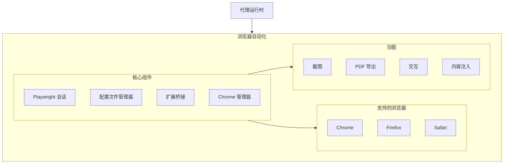
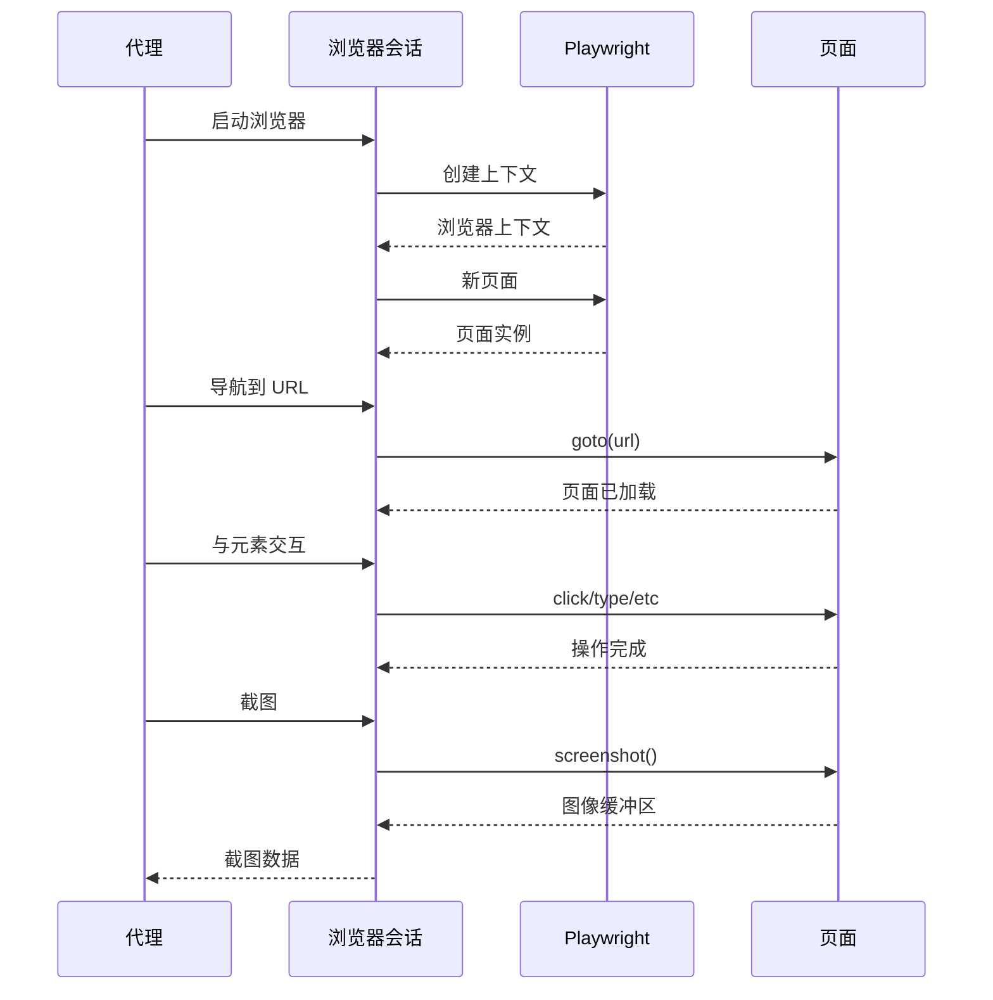
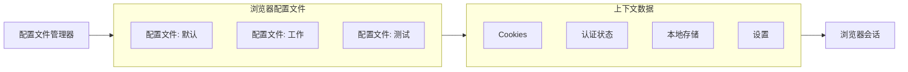
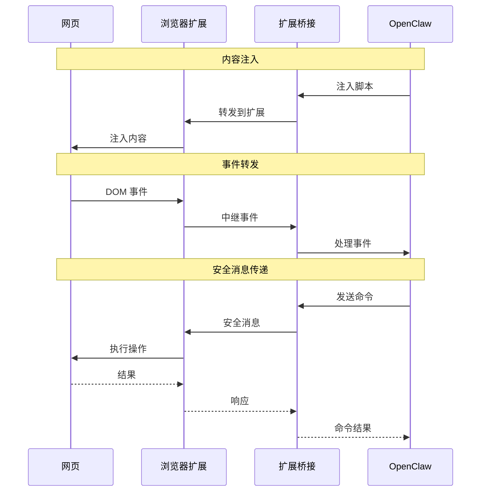
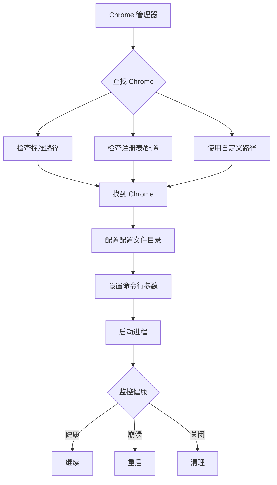
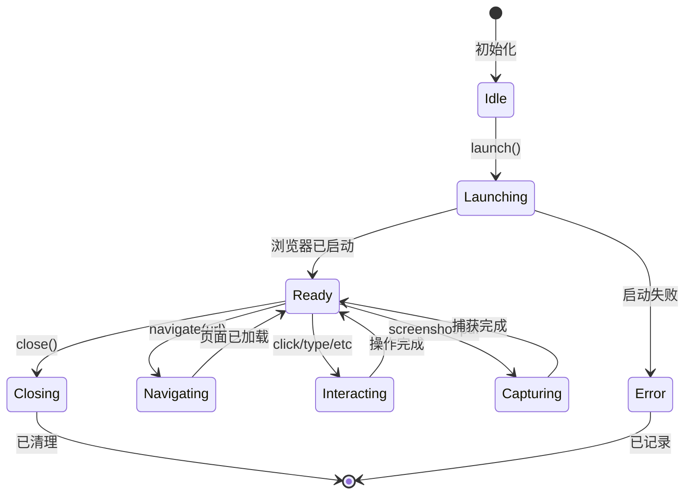

## 概述

浏览器自动化组件使用 Playwright 提供 Web 自动化能力，使 AI 代理能够与网页交互、管理浏览器配置文件，并将 Web 内容与 OpenClaw 功能桥接。

**代码位置：** `src/browser/`

## 架构



## 核心功能

### 1. Playwright 集成 (`src/browser/pw-session.ts`)



- 跨浏览器支持（Chrome、Firefox、Safari）
- 无头和有头操作模式
- 页面交互和元素操作
- 截图和 PDF 生成

### 2. 配置文件管理 (`src/browser/profiles.ts`)



- 隔离的浏览器上下文
- 跨运行的会话持久化
- Cookie 和认证管理
- 配置文件特定配置

### 3. 扩展桥接 (`src/browser/extension-relay.ts`)



- 与浏览器扩展通信
- 网页内容注入
- 实时事件转发
- 安全消息传递

### 4. Chrome 管理 (`src/browser/chrome.ts`)



- Chrome 可执行文件检测
- 配置文件目录管理
- 命令行参数配置
- 进程生命周期管理

## 浏览器会话生命周期



## 实现

```typescript
interface BrowserConfig {
  headless: boolean;
  viewport: { width: number; height: number; };
  timeout: number;
  userAgent?: string;
  proxy?: ProxyConfig;
  extensions?: string[];
}

class BrowserSession {
  async launch(config: BrowserConfig): Promise<Browser>
  async createPage(): Promise<Page>
  async navigate(url: string): Promise<void>
  async screenshot(options?: ScreenshotOptions): Promise<Buffer>
  async close(): Promise<void>
}
```

此组件支持复杂的 Web 自动化任务，从简单的页面交互到复杂的工作流自动化。
