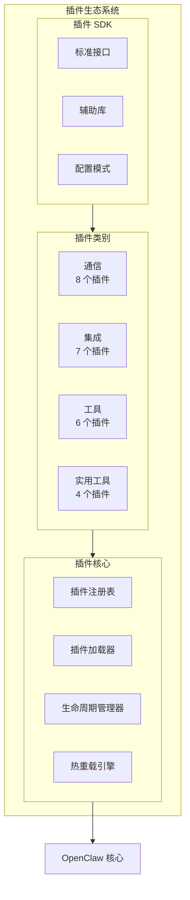
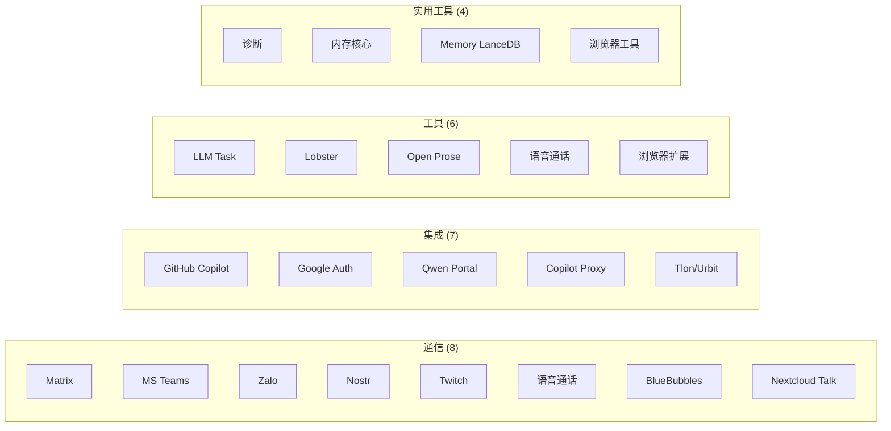
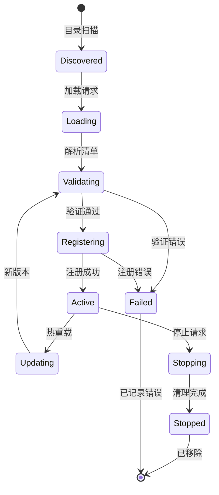
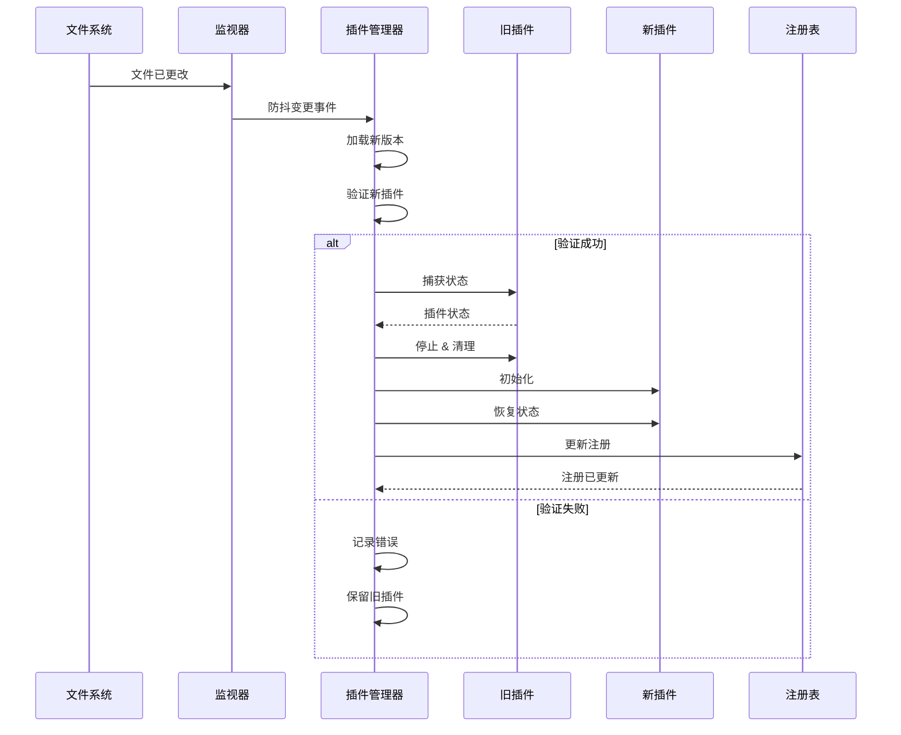
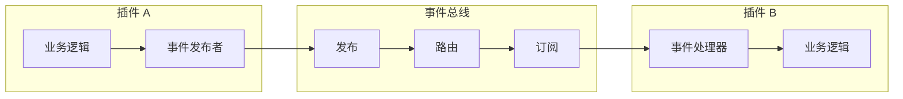

## 概述

OpenClaw 的插件生态系统提供一个全面的框架，通过热重载插件、技能和第三方集成来扩展功能。

**代码位置：** `extensions/*/`、`skills/*/`、插件 SDK

## 插件架构概览



## 插件类别



### 1. 通信插件 (8)
- Matrix、MS Teams、Zalo/ZaloUser、Nostr、Twitch、语音通话、BlueBubbles、Nextcloud Talk

### 2. 集成插件 (7)
- GitHub Copilot、Google Auth、Qwen Portal、Copilot Proxy、Tlon/Urbit

### 3. 工具插件 (6)
- LLM Task、Lobster、Open Prose、语音通话、浏览器扩展

### 4. 实用工具插件 (4)
- 诊断、内存核心、Memory LanceDB、浏览器工具

## 插件生命周期



## 插件架构

```typescript
interface PluginManifest {
  id: string;
  name: string;
  version: string;
  description: string;
  author: string;
  dependencies: Record<string, string>;
  capabilities: PluginCapability[];
  entrypoint: string;
}

interface PluginCapability {
  type: 'channel' | 'tool' | 'provider' | 'skill';
  name: string;
  metadata: Record<string, any>;
}
```

## 热重载系统



插件系统支持运行时加载和卸载，无需服务中断：

```typescript
class PluginManager {
  async loadPlugin(pluginPath: string): Promise<Plugin>
  async unloadPlugin(pluginId: string): Promise<void>
  async reloadPlugin(pluginId: string): Promise<void>
  async hotSwapPlugin(oldId: string, newId: string): Promise<void>
}
```

## 插件间通信



此生态系统能够快速开发和部署新功能，同时保持系统稳定性。
