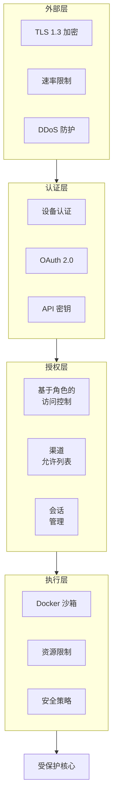
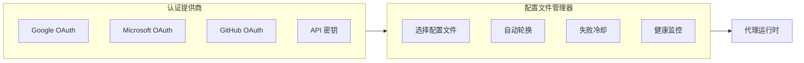
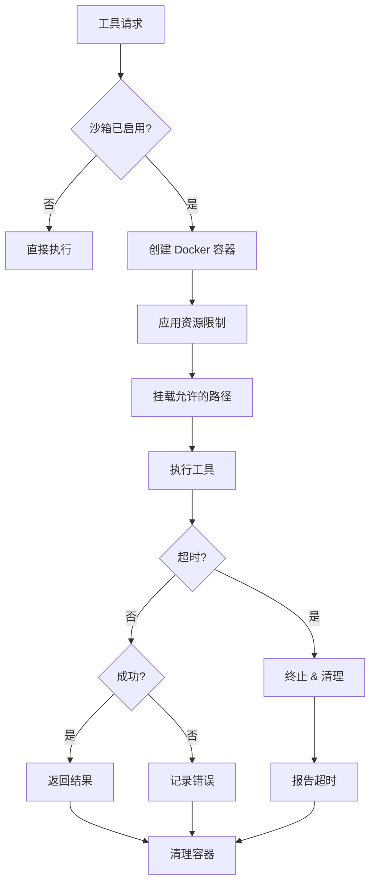
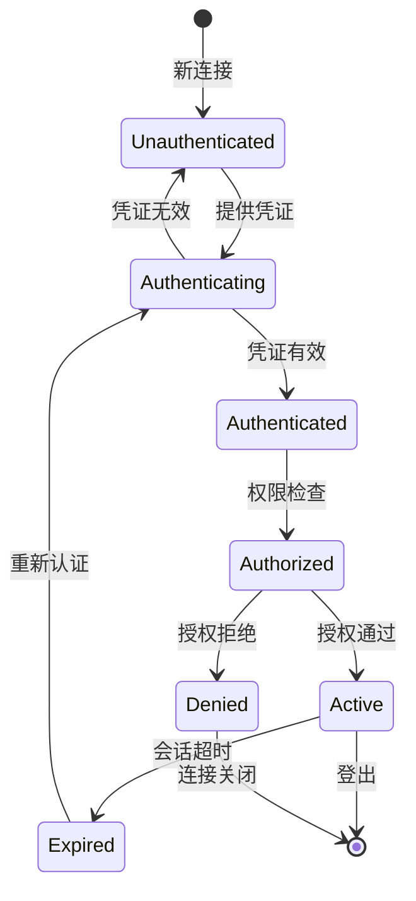
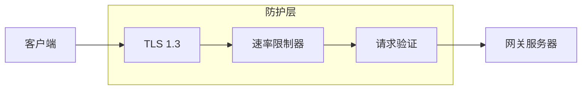
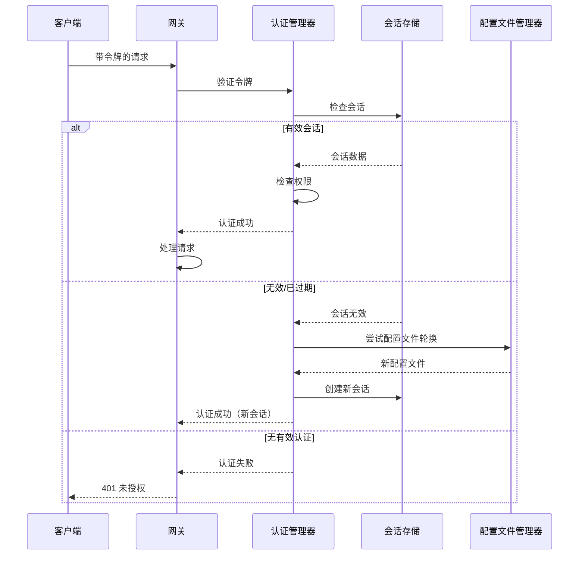

## 概述

OpenClaw 的安全与认证系统提供多层防护，包括 OAuth 集成、API 密钥管理、沙箱执行和全面的访问控制机制。

**代码位置：** `src/agents/auth-profiles.ts`、`src/gateway/auth.ts`、`src/agents/sandbox.ts`

## 安全架构



## 核心安全功能

### 1. 认证配置文件 (`src/agents/auth-profiles.ts`)



- 多提供商 OAuth 2.0 流程（Google、Microsoft、GitHub）
- API 密钥轮换和验证
- 带冷却机制的认证失败处理
- 配置文件健康监控和指标

### 2. 沙箱执行 (`src/agents/sandbox.ts`)



- 基于 Docker 的工具执行隔离
- 资源限制（CPU、内存、网络、磁盘）
- 安全策略执行
- 执行超时和清理

### 3. 访问控制 (`src/gateway/auth.ts`)



- 基于角色的访问控制（RBAC）
- 渠道特定的允许列表
- 设备认证和配对
- 带过期机制的会话管理

### 4. 网络安全



- 所有连接使用 TLS 1.3 加密
- 仅限 HTTPS 的 API 端点
- WebSocket Secure (WSS) 通信
- 速率限制和 DDoS 防护

## 实现细节

```typescript
interface SecurityConfig {
  authentication: {
    required: boolean;
    methods: ['device', 'oauth', 'apikey'];
    sessionTimeout: number;
  };
  authorization: {
    rbac: boolean;
    permissions: Permission[];
    defaultRole: string;
  };
  sandbox: {
    enabled: boolean;
    runtime: 'docker' | 'node';
    limits: ResourceLimits;
  };
}
```

## 请求认证流程



此组件确保 OpenClaw 在所有部署场景中安全运行，同时保持可用性和性能。
