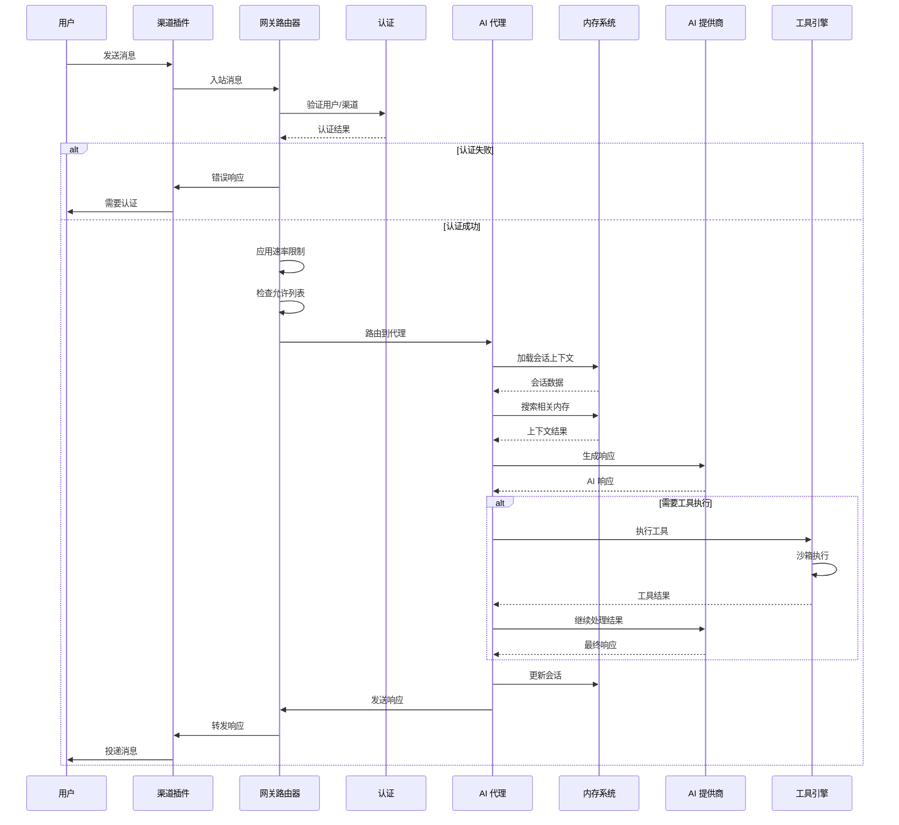
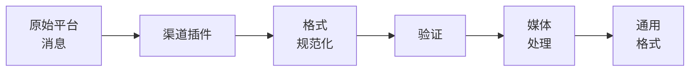
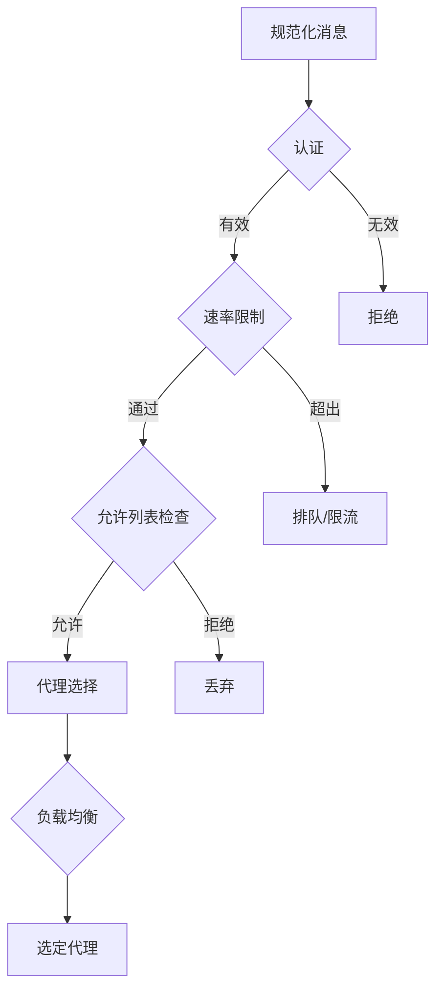
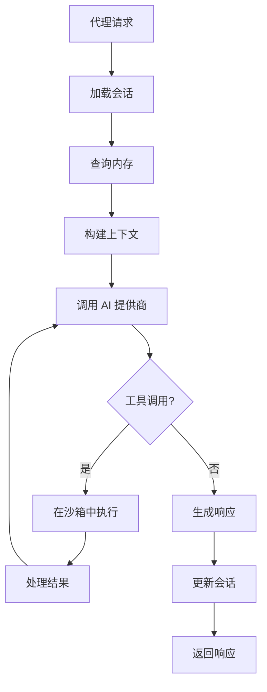
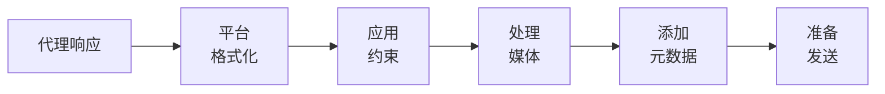
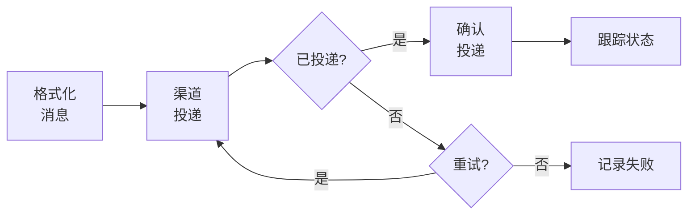

## 概述

本文档描述消息如何在 OpenClaw 系统中从外部渠道流向 AI 代理，再返回给用户。

## 消息处理管道

## 入站消息流

### 1. 渠道输入处理

**步骤：**
1. **平台特定接收**：每个渠道插件以原生格式接收消息
2. **格式规范化**：转换为 OpenClaw 的通用消息格式
3. **验证**：确保消息满足基本要求
4. **媒体处理**：下载和暂存媒体附件

### 2. 网关路由

**路由标准：**
- 渠道特定路由规则
- 用户/群组允许列表和阻止列表
- 每用户/渠道速率限制
- 代理可用性和负载
- 消息内容模式

### 3. 代理处理

**处理步骤：**
- 加载对话会话和上下文
- 查询内存系统获取相关信息
- 准备带上下文和内存的提示词
- 调用 AI 提供商，支持故障转移
- 在沙箱中执行任何请求的工具
- 生成最终响应

## 出站消息流

### 1. 响应格式化

**格式化步骤：**
- 为目标平台适配内容（消息长度、格式）
- 应用平台特定约束
- 处理媒体附件
- 添加平台特定元数据

### 2. 投递跟踪

## 错误处理流程

```mermaid
flowchart TD
    subgraph AuthErr["认证错误"]
        A1[认证失败] --> A2[错误响应]
        A2 --> A3[用户通知]
        A3 --> A4[重试/恢复]
    end
    
    subgraph RateErr["速率限制"]
        R1[超出速率] --> R2[延迟/排队]
        R2 --> R3[重试逻辑]
        R3 --> R4[成功/失败]
    end
    
    subgraph AgentErr["代理故障"]
        G1[代理错误] --> G2[备用代理]
        G2 --> G3[错误恢复]
        G3 --> G4[用户通知]
    end
    
    subgraph ToolErr["工具错误"]
        T1[工具失败] --> T2[沙箱清理]
        T2 --> T3[错误报告]
        T3 --> T4[优雅降级]
    end
```

### 认证错误
认证失败 → 错误响应 → 用户通知 → 重试/恢复

### 速率限制
超出速率 → 延迟/排队 → 重试逻辑 → 成功/失败

### 代理故障
代理错误 → 备用代理 → 错误恢复 → 用户通知

### 工具执行错误
工具失败 → 沙箱清理 → 错误报告 → 优雅降级

## 消息类型和路由

### 私聊消息
- 路由到用户的默认代理
- 应用用户特定偏好
- 完整的上下文和内存访问

### 群组消息
- 检查提及模式
- 应用群组特定规则
- 有限的上下文共享

### 命令消息
- 解析命令语法
- 路由到适当的处理器
- 执行特权操作

### 媒体消息
- 安全地暂存媒体文件
- 提取元数据和内容
- 通过适当的处理器处理

## 性能优化

### 缓存
- 会话数据缓存
- 内存查询缓存
- 常见查询的 AI 响应缓存

### 批处理
- 嵌入生成批处理
- 数据库操作批处理
- AI API 请求批处理

### 流式传输
- 实时响应流式传输
- 渐进式消息投递
- 增量工具输出

此数据流确保在所有支持的通信渠道上实现高效、安全且可靠的消息处理。
