## 概述

本文档描述插件如何在 OpenClaw 系统中加载、注册、执行和管理，包括热重载能力和插件间通信。

## 插件生命周期

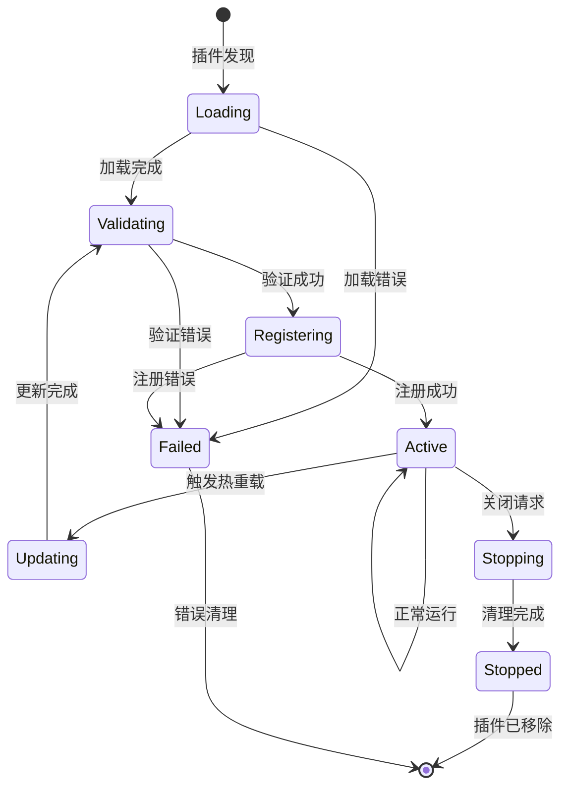

## 插件发现和加载

### 1. 发现流程

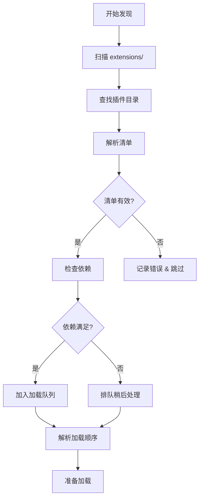

**发现步骤：**
1. **目录扫描**：搜索 `extensions/` 中的插件目录
2. **清单读取**：解析 `openclaw.plugin.json` 文件
3. **依赖验证**：检查插件依赖和兼容性
4. **加载排序**：解析依赖图并确定加载顺序

### 2. 插件清单结构
```typescript
interface PluginManifest {
  id: string;
  name: string;
  version: string;
  description: string;
  author: string;
  license: string;
  
  // 依赖和要求
  dependencies: {
    openclaw: string; // 语义化版本范围
    node: string;
    [packageName: string]: string;
  };
  
  // 插件能力
  capabilities: {
    channels?: ChannelCapability[];
    tools?: ToolCapability[];
    providers?: ProviderCapability[];
    skills?: SkillCapability[];
  };
  
  // 入口点
  entrypoint: string;
  configSchema?: JSONSchema;
  
  // 元数据
  tags: string[];
  keywords: string[];
  homepage?: string;
  repository?: string;
}
```

## 插件注册流程

### 1. 注册过程

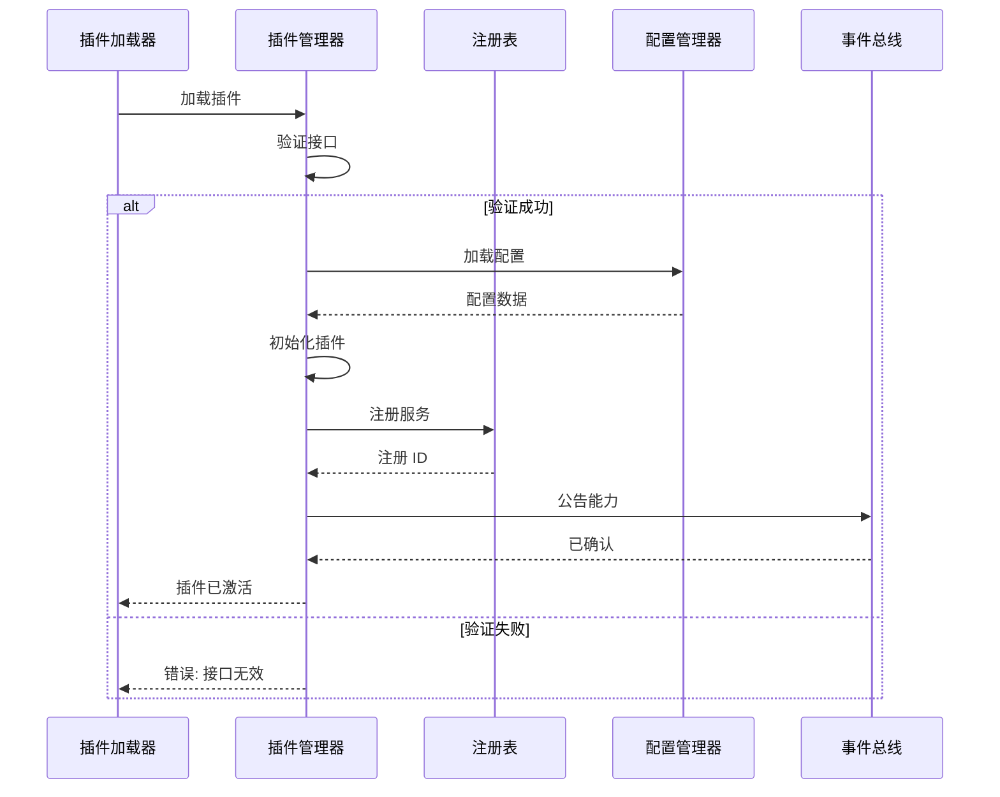

**注册步骤：**
1. **接口验证**：确保插件实现所需接口
2. **服务注册**：向系统注册插件服务
3. **配置加载**：加载插件特定配置
4. **能力公告**：向其他组件公布插件能力

### 2. 服务注册
```typescript
interface PluginServices {
  channels?: ChannelPlugin[];
  tools?: ToolPlugin[];
  providers?: ProviderPlugin[];
  hooks?: HookPlugin[];
  middleware?: MiddlewarePlugin[];
}

class PluginRegistry {
  async registerPlugin(plugin: Plugin): Promise<RegistrationResult>
  async unregisterPlugin(pluginId: string): Promise<void>
  async getPlugin(pluginId: string): Promise<Plugin | null>
  async listPlugins(): Promise<PluginInfo[]>
  async queryCapabilities(capability: string): Promise<Plugin[]>
}
```

## 热重载机制

### 1. 热重载触发

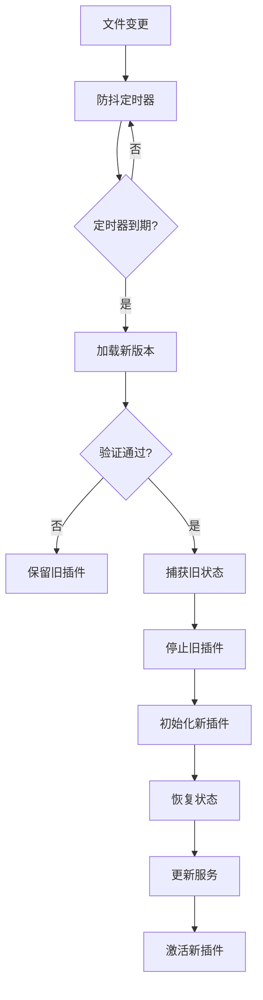

**热重载流程：**
1. **变更检测**：文件系统监视器检测插件变更
2. **防抖**：防止快速连续重载
3. **预验证**：交换前验证新插件
4. **优雅移交**：从旧插件实例转移状态到新实例
5. **服务更新**：更新所有服务注册

### 2. 状态迁移
```typescript
interface HotReloadContext {
  oldPlugin: Plugin;
  newPlugin: Plugin;
  preserveState: boolean;
  migrationData?: Record<string, any>;
}

interface PluginStateManager {
  captureState(plugin: Plugin): Promise<PluginState>
  restoreState(plugin: Plugin, state: PluginState): Promise<void>
  migrateState(context: HotReloadContext): Promise<MigrationResult>
}
```

## 插件间通信

### 1. 事件系统

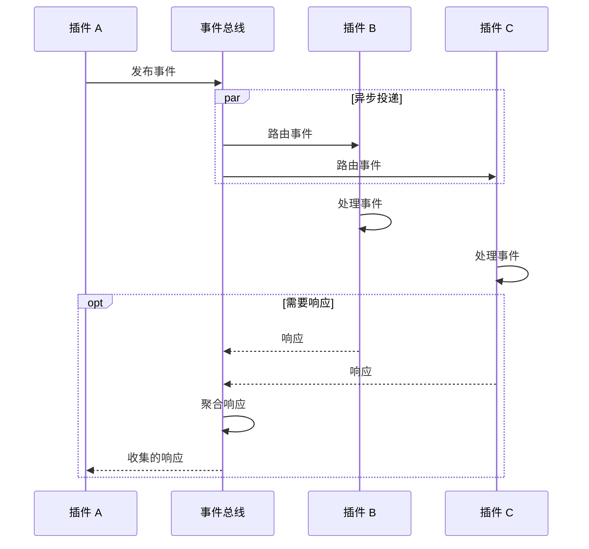

**事件流：**
1. **事件发布**：插件向系统总线发布事件
2. **事件路由**：系统将事件路由到已订阅的插件
3. **事件处理**：接收插件异步处理事件
4. **响应收集**：可选的响应聚合用于协调

### 2. 事件类型
```typescript
interface PluginEvent {
  type: string;
  source: string;
  target?: string | string[];
  data: Record<string, any>;
  timestamp: Date;
  correlationId?: string;
}

interface EventBus {
  publish(event: PluginEvent): Promise<void>
  subscribe(eventType: string, handler: EventHandler): Promise<string>
  unsubscribe(subscriptionId: string): Promise<void>
  listSubscriptions(): Promise<Subscription[]>
}
```

### 3. 服务依赖

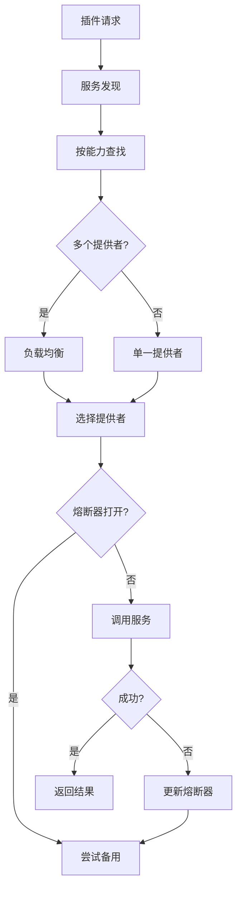

**服务解析：**
- 按能力动态服务发现
- 跨多个提供者的负载均衡
- 故障转移到替代实现
- 失败服务的熔断器

## 渠道插件集成

### 1. 渠道注册

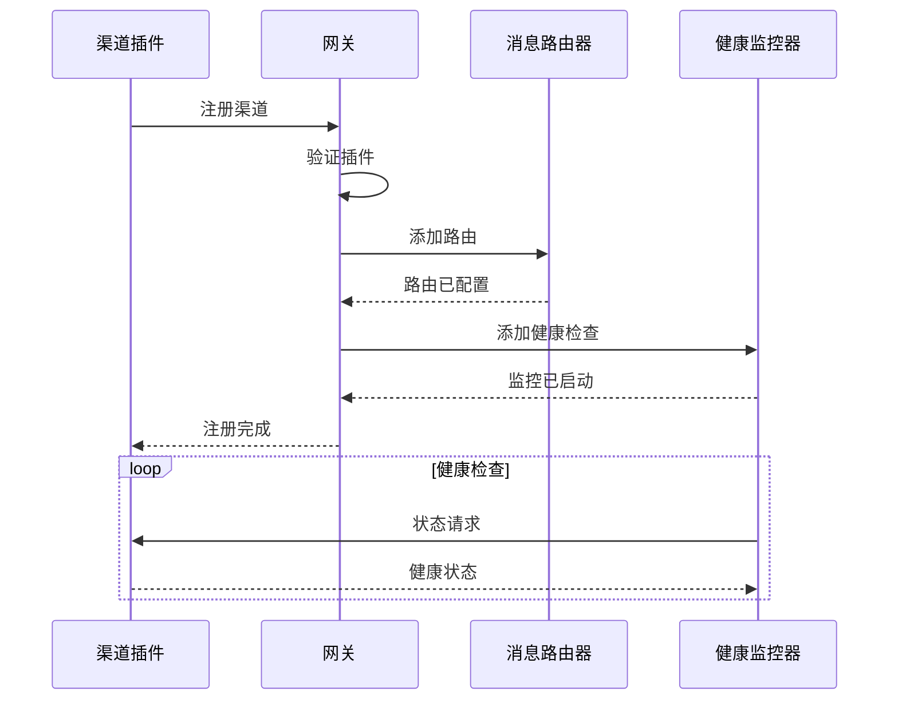

**集成步骤：**
1. **网关注册**：向消息网关注册
2. **路由配置**：设置消息路由规则
3. **监控设置**：启动消息监控
4. **状态报告**：向系统报告渠道健康状态

### 2. 消息流
```typescript
interface ChannelPlugin {
  id: string;
  meta: ChannelMeta;
  
  // 核心功能
  startMonitoring(): Promise<void>
  stopMonitoring(): Promise<void>
  sendMessage(target: MessageTarget, message: OutboundMessage): Promise<SendResult>
  
  // 事件处理器
  onMessage(handler: MessageHandler): void
  onStatus(handler: StatusHandler): void
  onError(handler: ErrorHandler): void
}
```

## 工具插件集成

### 1. 工具注册

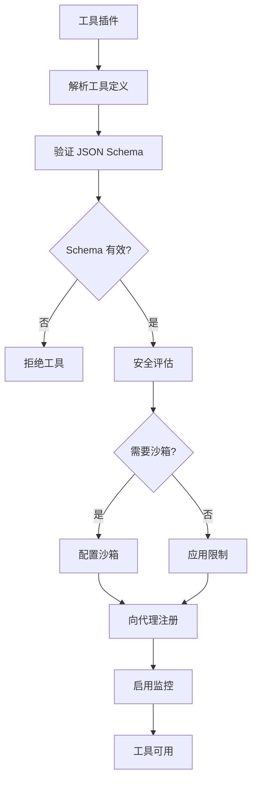

**工具集成：**
1. **Schema 验证**：验证工具参数 Schema
2. **安全评估**：应用安全策略和沙箱
3. **代理注册**：使工具对 AI 代理可用
4. **执行监控**：跟踪工具使用和性能

### 2. 工具执行流程
```typescript
interface ToolPlugin {
  id: string;
  tools: ToolDefinition[];
  
  // 执行
  executeTool(name: string, parameters: any, context: ToolContext): Promise<ToolResult>
  validateParameters(name: string, parameters: any): Promise<ValidationResult>
  
  // 生命周期
  initialize(config: ToolConfig): Promise<void>
  cleanup(): Promise<void>
}
```

## 提供商插件集成

### 1. AI 提供商注册

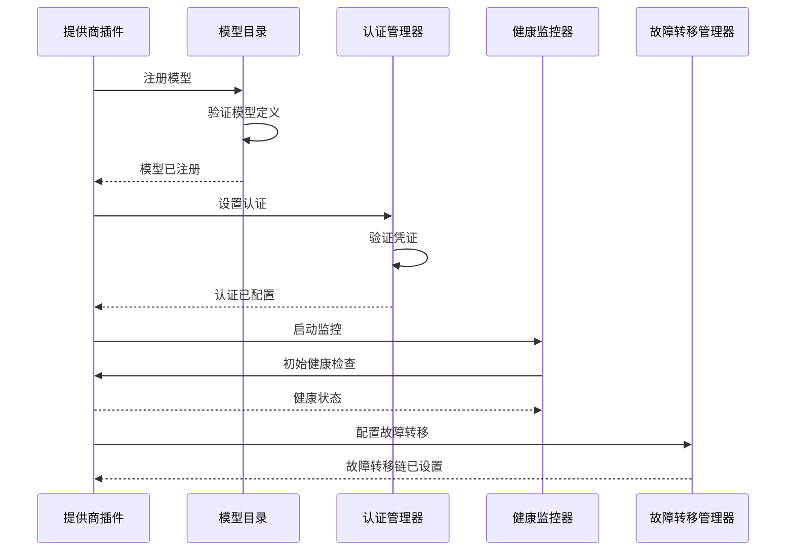

**提供商集成：**
1. **模型注册**：向目录注册可用模型
2. **认证设置**：配置 API 密钥和 OAuth 流程
3. **健康监控**：监控提供商可用性和性能
4. **故障转移配置**：设置故障转移链

### 2. 提供商接口
```typescript
interface ProviderPlugin {
  id: string;
  models: ModelDefinition[];
  
  // 核心功能
  generateResponse(request: GenerationRequest): Promise<GenerationResponse>
  streamResponse(request: GenerationRequest): AsyncGenerator<ResponseChunk>
  generateEmbeddings(texts: string[]): Promise<number[][]>
  
  // 管理
  validateCredentials(): Promise<boolean>
  getUsage(): Promise<UsageMetrics>
  getHealth(): Promise<HealthStatus>
}
```

## 插件安全和隔离

### 1. 安全边界


**安全措施：**
- 通过模块边界进行代码隔离
- API 访问控制和速率限制
- 资源使用监控和限制
- 基于能力的权限

### 2. 资源管理
```typescript
interface PluginResourceLimits {
  memory: {
    heapLimit: number;
    instanceLimit: number;
  };
  cpu: {
    timeSlice: number;
    throttleThreshold: number;
  };
  io: {
    fileAccess: string[];
    networkAccess: boolean;
    rateLimits: RateLimitConfig;
  };
}
```

## 插件配置管理

### 1. 配置流程
```
插件配置 → Schema 验证 → 环境集成 → 运行时应用
```

**配置来源：**
- 插件特定配置文件
- 环境变量覆盖
- 系统范围的插件设置
- 用户特定偏好

### 2. 动态配置
```typescript
interface PluginConfigManager {
  loadConfig(pluginId: string): Promise<PluginConfig>
  updateConfig(pluginId: string, updates: Partial<PluginConfig>): Promise<void>
  validateConfig(pluginId: string, config: any): Promise<ValidationResult>
  watchConfig(pluginId: string, handler: ConfigChangeHandler): Promise<string>
}
```

## 插件监控和分析

### 1. 性能指标
```typescript
interface PluginMetrics {
  runtime: {
    uptime: number;
    restarts: number;
    errorRate: number;
    memoryUsage: number;
    cpuUsage: number;
  };
  functionality: {
    requestsHandled: number;
    averageResponseTime: number;
    successRate: number;
    cacheHitRate?: number;
  };
  integration: {
    eventsSent: number;
    eventsReceived: number;
    serviceCalls: number;
    dependencyHealth: HealthStatus[];
  };
}
```

### 2. 健康监控
```typescript
interface PluginHealthCheck {
  status: 'healthy' | 'degraded' | 'unhealthy';
  checks: {
    startup: boolean;
    connectivity: boolean;
    dependencies: boolean;
    resources: boolean;
  };
  metrics: PluginMetrics;
  lastCheck: Date;
  nextCheck: Date;
}
```

## 错误处理和恢复

### 1. 插件故障恢复

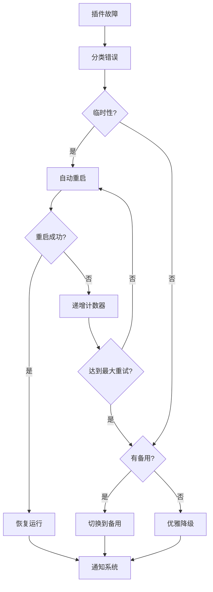

**恢复策略：**
- 临时故障自动重启
- 故障转移到替代插件
- 功能优雅降级
- 关键故障的用户通知

### 2. 系统弹性

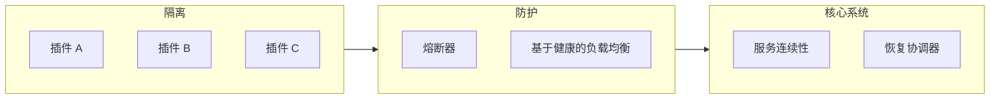

**弹性功能：**
- 插件故障不影响系统核心
- 自动故障转移到备用插件
- 失败插件的熔断器
- 基于健康的负载均衡

此插件集成系统通过复杂的生命周期管理和隔离机制，在保持系统稳定性、安全性和性能的同时，实现 OpenClaw 的可扩展性。
