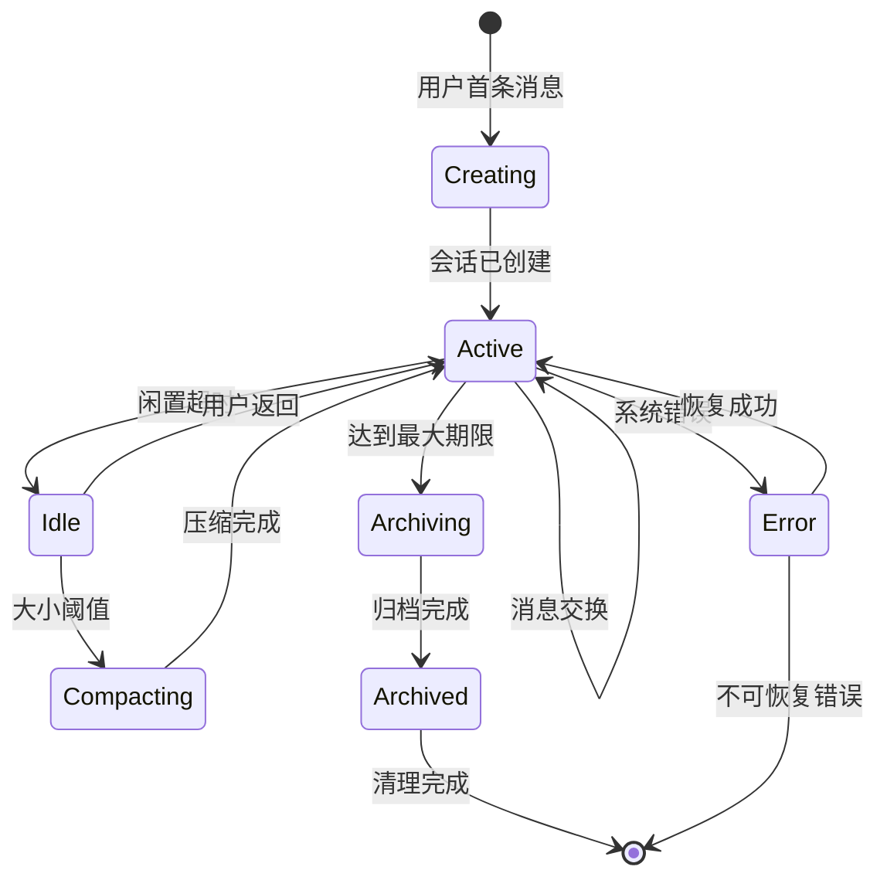
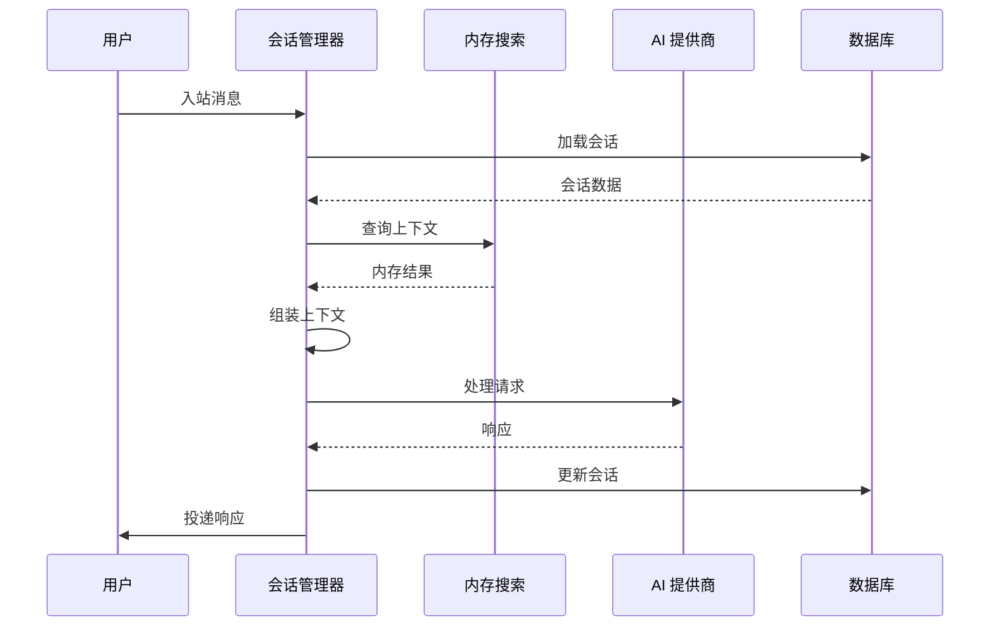
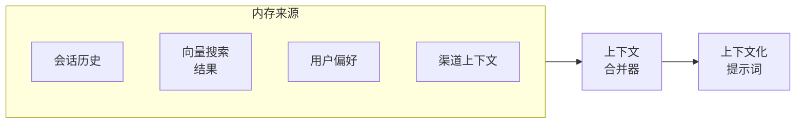
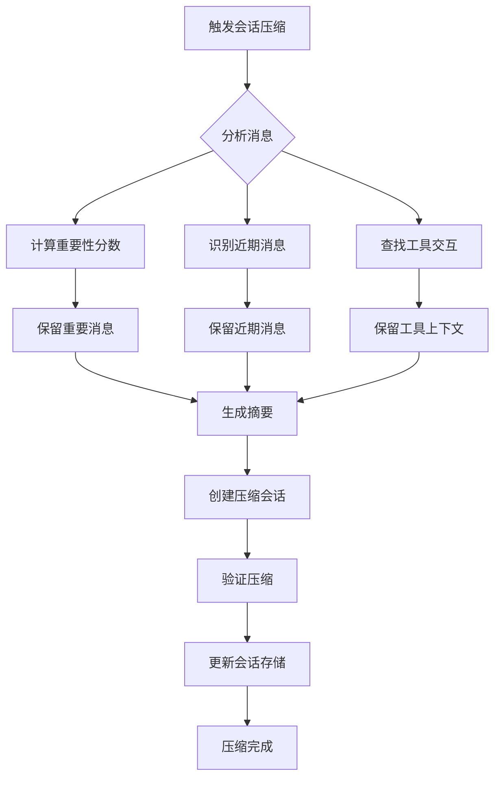
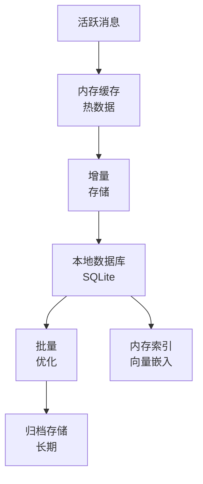
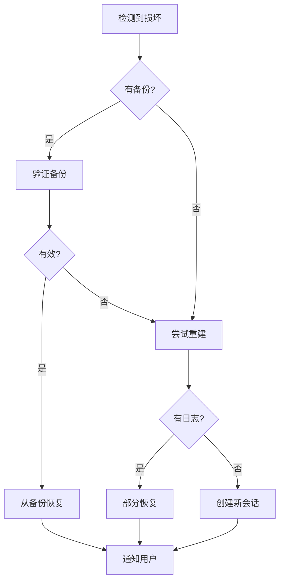

## 概述

本文档描述 OpenClaw 中对话会话的完整生命周期，从创建到归档。

## 会话生命周期阶段



## 会话创建流程

### 1. 初始消息处理


**创建步骤：**
1. **用户识别**：从渠道特定标识符提取用户 ID
2. **代理选择**：根据渠道和用户偏好确定适当的代理
3. **会话初始化**：使用唯一 ID 和元数据创建新会话
4. **上下文设置**：初始化对话上下文和用户偏好
5. **存储**：使用初始状态将会话持久化到数据库

### 2. 会话元数据
```typescript
interface NewSession {
  id: string;
  agentId: string;
  userId: string;
  channelId: string;
  created: Date;
  context: {
    userPreferences: UserPreferences;
    channelMetadata: ChannelMetadata;
    initialMessage: string;
  };
  state: 'active';
}
```

## 活跃会话管理

### 会话内消息处理



**上下文组装：**
1. 加载对话历史
2. 应用内存搜索获取相关上下文
3. 集成用户偏好和设置
4. 准备全面的提示词上下文

### 内存集成



**内存来源：**
- 之前的对话轮次
- 知识库的向量搜索结果
- 用户特定信息和偏好
- 渠道特定上下文和元数据

## 会话状态管理

### 活跃状态操作
- 带去重的消息追加
- 上下文窗口管理
- 实时元数据更新
- 性能指标跟踪

### 闲置状态转换
```
检测到不活跃 → 闲置状态 → 资源清理 → 定期健康检查
```

**闲置状态功能：**
- 减少内存占用
- 定期压缩资格检查
- 后台优化进程
- 用户返回时快速重新激活

## 会话压缩流程

### 触发条件
```
大小检查 → 消息计数 → 令牌估算 → 压缩决策
```

**压缩触发器：**
- 会话超过令牌限制（例如 8000 令牌）
- 消息数超过阈值（例如 100 条消息）
- 用户配置的压缩间隔
- 手动压缩请求

### 压缩算法


### 重要性评分
```typescript
interface MessageImportance {
  score: number;
  factors: {
    userEngagement: number;
    toolUsage: number;
    errorCorrection: number;
    informationDensity: number;
    recency: number;
  };
}
```

## 内存持久化

### 会话存储策略



**存储层：**
1. **内存缓存**：活跃对话的热会话数据
2. **本地数据库**：用于会话持久化的 SQLite 存储
3. **归档存储**：历史会话的长期存储
4. **内存索引**：用于上下文检索的向量嵌入

### 数据保留策略
```typescript
interface RetentionPolicy {
  activeSessions: {
    maxAge: '7d';
    maxCount: 100;
  };
  archivedSessions: {
    maxAge: '90d';
    compressionEnabled: true;
  };
  deletedSessions: {
    gracePeriod: '30d';
    purgeSchedule: 'weekly';
  };
}
```

## 会话恢复和错误处理

### 损坏恢复



**恢复策略：**
- 自动备份恢复
- 从日志部分重建会话
- 带恢复选项的用户通知
- 创建新会话的优雅降级

### 故障转移场景


## 性能优化

### 会话缓存
```typescript
interface SessionCache {
  activeCache: LRUCache<string, Session>; // 热会话
  metadataCache: Map<string, SessionMetadata>; // 轻量级元数据
  compactionQueue: Queue<string>; // 等待压缩的会话
}
```

### 批量操作
- 批量会话更新
- 批量压缩处理
- 聚合指标收集
- 计划维护操作

### 内存管理
- 会话历史的延迟加载
- 大型会话的流式传输
- 高效的序列化格式
- 垃圾回收优化

## 会话分析和监控

### 生命周期指标
```typescript
interface SessionMetrics {
  creation: {
    rate: number;
    successRate: number;
    averageSetupTime: number;
  };
  activity: {
    averageMessageCount: number;
    averageSessionDuration: number;
    idleTime: number;
  };
  compaction: {
    frequency: number;
    compressionRatio: number;
    performanceImpact: number;
  };
  archival: {
    archivalRate: number;
    storageEfficiency: number;
    retrievalPerformance: number;
  };
}
```

### 健康监控
- 会话创建成功率
- 压缩性能指标
- 内存使用和优化
- 错误率和恢复统计

此会话生命周期管理确保高效的资源利用，同时在长期交互中保持对话质量和用户体验。
